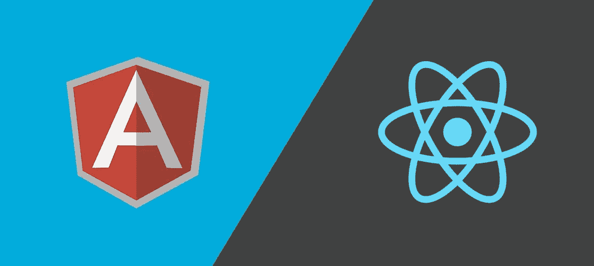

# 从反应切换到角度

> 原文：<https://javascript.plainenglish.io/react-to-angular-some-helpful-tips-for-making-the-transition-c8463619e374?source=collection_archive---------1----------------------->

在这篇文章中，我将讲述我从 React ( <=16) to Angular (7) in the hope it will help and inspire others, and make that transition easier.

I have used React for about 3–4 years and while I am no expert, I feel I have a firm grasp on the basics. The shift to using the Angular framework has came about in recent months due to a career move.

**)转型的一些经历，这篇文章并不是要将两者相提并论来决定哪一个更伟大** ( *马的课程和所有这些*)，而是强调两个 web 开发大国之间的一些显著差异。

**我能给的最好的建议…**

在我开始学习 Angular 之前，我非常清楚不要试图让它像 React 一样工作。这两者在他们的方法和方法论上有很大的不同，这影响了你解决问题的方式。这可能是我能给即将踏上征途的人的最好建议:

> **不要尝试，要做出有棱角的作品才像有反应！两者差别很大！**

**React 是库，Angular 是框架！**

使用 React 时，你会沉浸在一个由扩展和插件组成的**巨大的**生态系统中，这个生态系统有很多很多不同的做事方式。React 实际上只是其他所有东西之上的富 UI 层——一个用于构建用户界面的 javascript 库。

React 给了开发人员选择的自由，使他们能够在解决问题时找到表达自己的技术。知道无论你需要做什么，在 React 社区中几乎肯定有人已经解决了，这是一种解放。

Angular 有更多的限制，它似乎有做大多数事情的“方法”,这不会使你冒险远离 Angular 文档来解决问题。

我的意思是，选择并不总是一件好事...有几次，由于流氓、不受支持的插件不再活跃，因此不支持最新版本的库，项目被阻止从 React 升级。留给你的是令人生畏的任务，要么自己重写，要么痛苦地试图找到一个替代方案。这对于较小的项目来说可能没问题，但是扩展到企业，您会发现您的项目有很大的不同。

**行话**

在深入研究这篇文章之前，我想我应该分享一些 Angular 使用的常用术语——大多数都是不言自明的。

*这里有一个* [*的综合列表*](https://angular.io/guide/glossary) *在 Angular docs 中但是让我按照对我有意义的顺序拼出一些流行的:*

*   TypeScript — *TypeScript 是 Angular 开发的首选语言。不过不要害怕，因为它是 JavaScript 的衍生物。*
*   工作区— *这是您的应用程序项目文件夹，包含您的应用程序、库等。*
*   NgModule — *很像一个 JavaScript 模块，这个模块可以导入/导出模块来与项目中的其他模块交互。每个应用程序都有一个根 NgModule，通常名为 app.module.ts.*
*   模块— *与 JS 模块类似，这是一个封装的功能块，通常服务于单一目的。*
*   组件/模板— *组件和模板的组合代表一个视图。组件文件负责为模板提供它需要的东西，以便向用户表示某些东西。*
*   依赖注入— *Angular 可以使用依赖注入设计模式，在需要的时候插入服务、函数、字符串等东西。*
*   CLI — *“命令行界面”是您获得 Angular 所有优点的捷径。使用它来创建组件、服务等，并与开发生命周期的所有阶段进行交互。*
*   Observable — *Angular 在订阅数据源时使用 observables 来触发数据更改时的回调。想象一下来自 api 的异步数据调用。一旦数据发生变化，可观察值就会触发订阅者的变化。*
*   服务— *服务是在整个应用程序中共享代码的好方法。任何与 UI 的特定部分不直接相关的、可以共享的东西都应该作为服务来开发。当结合依赖注入时，它们非常有用。*

**Angular — CLI 还是 DIY？**

我与 Angular 最初的斗争之一是我不愿意使用 CLI。我习惯于在 React 中手动创建每个小的 JSX 文件，并且很享受我能控制这一切。当然，我可以使用“创建反应应用程序”或类似的东西，但我从来没有真正这样做，我是国王！

在遵循棱角分明的英雄教程(*很好地介绍了基础知识*)时，我不情愿地抨击了 ng 命令，实际上发现它相当不错……事实上它真的很好！从那以后，我开始欣赏 CLI 的强大功能。我有棱角的朋友告诉我，它并不总是这么好，所以也许我只是在正确的时间跳上了船。

Typescript: boolean =？？；

我在 javascript 中使用静态类型的想法已经有一段时间了……我尝试了 [Flow](https://flow.org/) 但是发现它很麻烦，对小项目没什么好处。当我接手 Angular 时，我承诺给 Typescript 一个适当的机会，我必须承认，我很高兴我做到了。

它真的能帮助你写出更好的代码，当你在 [VSCode](https://code.visualstudio.com/) ( *无耻地为我最喜欢的 IDE* 插上一脚)中结合 ts 扩展时，你能立即感受到它的好处。学习曲线可能有点令人生畏，但给自己几天时间，你会爱上它！

**模板化表情— JS - > NG！**

我最初对 Angular (HTML)中的模板感到失望的一个原因是，它们让人感觉很专有。在 React 的大部分时间里，你仍然在编写 ES6，但是使用 Angular，表达式与框架的耦合程度更高了……本质上，你是在学习 Angular，而不是 JavaScript。

然而，一旦你开始使用它们，看到它们背后的力量，你似乎就不会那么在乎了。

**构建、编译和捆绑**

使用 React 时，我非常熟悉 web pack……我也有迁移到最新版本时失去的情感创伤——为什么他们必须做出所有这些突破性的改变？！

在 Angular，他们确实在引擎盖下使用 webpack，但你几乎不会注意到或在意。整个 webpack 配置隐藏在 **angular.json** 之后，它是您项目所有配置选项的*一站式商店*或 angular 所指的*工作区*。它告诉 angular 如何构建、服务、测试和 lint 您的项目——您甚至可以在这里进行多种配置*,例如将您的项目构建为库或构建为应用程序。*

现在，我不再受 webpack 开发团队的摆布了——我希望 Angular 团队能节省升级版本的时间，这样我就可以专注于构建闪亮漂亮的东西了！

还有一点要注意的是，我已经意识到构建过程是多么聪明。我最初认为 CLI 非常冗长，因为有许多小文件，其中一些可能是多余的，我担心它会对最终的包产生影响。但事实似乎并非如此，显然随着常春藤的引入，情况会变得更好。

> 感谢您花时间阅读我的文章。