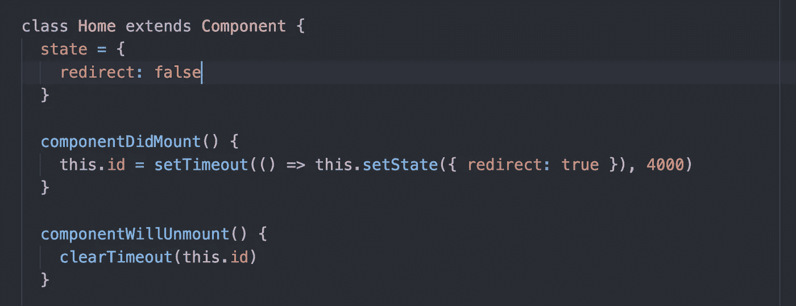
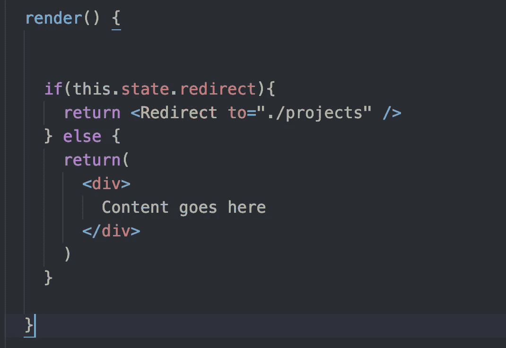
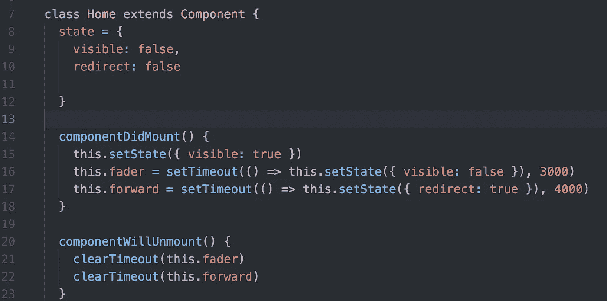
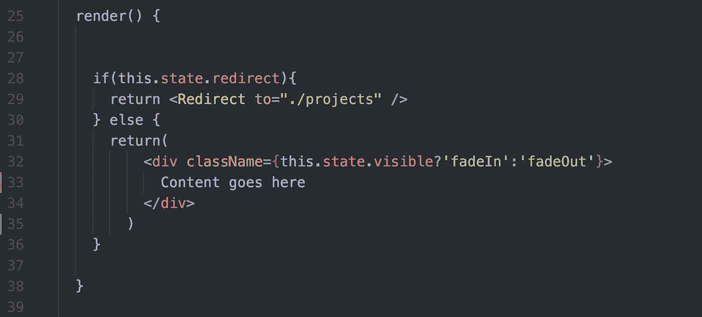
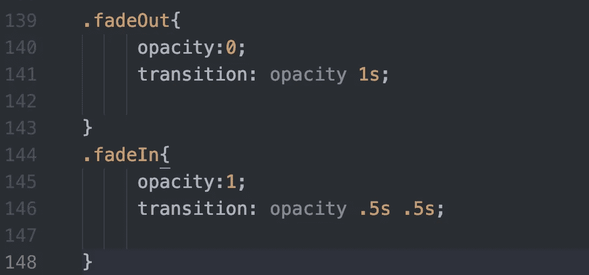
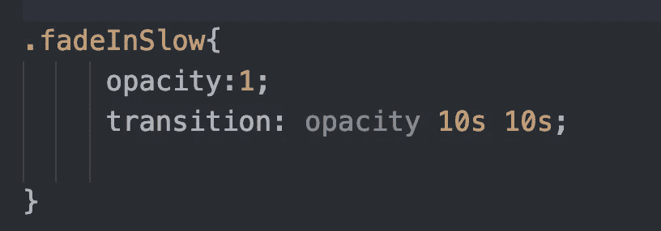

# 反应:尝试淡入+重定向=酷过渡

> 原文：<https://javascript.plainenglish.io/react-try-fadein-redirect-for-a-cool-transition-between-views-963c4ae1004b?source=collection_archive---------2----------------------->

## 另外:如何将有趣的东西隐藏在缓慢的淡入背后…

my son at Glacier National Park. It’s now the cover photo of my portfolio.

几个月前，我创建了一个 React 应用程序组合网站。我给了它几页:

*   主页
*   项目
*   简历
*   博客帖子
*   关于

在主页上，我添加了一些基本的欢迎文本、一张大照片和一个到我的作品集页面的链接。然后我开始疑惑:为什么要强迫访问者通过主页进入，而我真正想让他们看到的页面是作品集页面？

我考虑过完全抛弃主页，但是有个起点也不错。

那么，如何才能拥有一个可爱的主页，而不使访问者觉得它是通向更受欢迎的页面的一个不必要的中途站呢？

# 再直接的

一种解决方案是:让它们从主页开始，然后使用 setTimeout()自动将它们重定向到另一个页面。

为此，您给组件一个初始本地状态`redirect:false.`

然后添加生命周期方法`componentDidMount()`。正如您所猜测的，当您的组件被安装到 DOM 上时，就会触发这个事件。

(*DOM 是什么？*网站是用 HTML 和 CSS 编写的。网络浏览器将代码转换成我们在网上看到的内容。浏览器还会创建一个称为文档对象模型的页面模型，它允许 JavaScript 将页面上的元素作为对象来访问。当我们编写 JavaScript 时，我们并没有直接改变网站的 HTML/CSS。相反，我们改变了 DOM。浏览器然后使用更新的 DOM 来更新站点的 HTML/ CSS)

在上面的代码中，我们使用了 JavaScript 的 [Window setTimeout()方法](https://www.w3schools.com/jsref/met_win_settimeout.asp)，它采用了一个回调函数。在 4000 毫秒(4 秒)的等待时间后，我们的回调将状态更改为`redirect: true`。

然后，当我们的组件卸载时，我们移除计时器。

在我们的 render 方法中，我们返回的内容基于`this.state.redirect`。如果为真，我们使用 react-dom 的重定向将用户重定向到另一个页面；否则，我们呈现当前页面的内容:

这很酷，但是重定向有点…突然。如果我不知道的话，我会以为网站坏了。*(下面为糟糕的视频嵌入质量道歉；由于某种原因，织布机不能很好地播放媒体)。*

# 淡出…

一旦我得到了这个工作，我想它会看起来更好，如果我可以在重定向之前淡化主页。为了更好地衡量，我想我也(很快)淡入主页。

所以我将`visible`添加到 state 中，初始值为 false。然后，在 componentDidMount()上，我将 visible 更改为 true *并且*设置一个计时器，以便 visible 在 3 秒钟后将`visible`重置为`false`:

在 render 中，我们在返回中添加了一个新行，如下所示:

我们的新行 32 改变了 div 的类名。如果 div 应该是可见的，那么 className 将是`fadeIn`——否则，它将是`fadeOut.`。我们可以在这里使用我们想要的任何名称，但是选择与想要的效果直接相关的名称是一个好的实践。

## 添加 CSS …

现在，在我们的 App.css 文件中，我们只需添加如何使用新的类名呈现组件的指令:

在第 139 行，我们说，当你看到类名`.fadeOut`，设置不透明度为 0，并使过渡发生在 1 秒内。

在第 144 行，我们反过来做同样的事情，除了我们让转换在半秒内发生。(如果我们让它变得更长，我们的访问者可能会认为我们的网站坏了，因为它看起来是空白的，即使只有一秒钟。

*注:我不知道为什么时间. 5s 必须包含两次？如果你这样做了，请留下评论！*

瞧啊。我们的过渡现在看起来很酷。你可以在这里看到它的工作原理。

## 现在，为了有趣的事情

当你在找工作，在你的投资组合网站上工作太多的时候，你需要幽默感。因此，我决定用一段视频来展示我的管理技能，这段视频是我试图指导我当时蹒跚学步的孩子们，让他们一起在田野上滚一个巨大的雪球。(说真的！我必须激励、委派等)。

当然，我应该把这个放在最前面。我真的应该。但我也努力表现得专业些。如何平衡我自娱自乐的需求和做专业网站的需求？啊哈！关于……

## 非常缓慢的淡入

我把视频添加到了我的“关于”页面的底部。我没有用类名`fadeIn`来设计它，而是创建了一个新的类名`fadeInSlow`，我这样设计它:

因此，除了隐藏在页面底部之外，该元素在最初的 10 秒内是不可见的。这意味着大多数人永远不会注意到它。

如果你想看它(和我惊人的管理技能)的实际应用，这里是页面(向下滚动)。

现在你知道我的秘密了…嘘！

琼·印第安纳·莱内斯 2019

万一你错过了:*算法 101:在 JavaScript 中计算素数 Erathosthenes 的筛子*