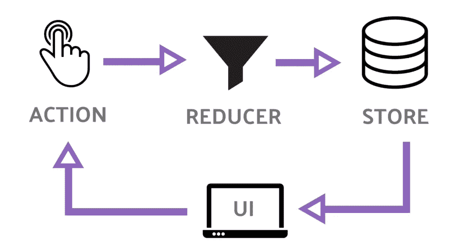

# 反应、Vue 和业务逻辑

> 原文：<https://javascript.plainenglish.io/react-vue-and-business-logic-19df105698a2?source=collection_archive---------1----------------------->

## 我的前端世界清洁建筑之路


Photo by [William Bout](https://unsplash.com/@williambout?utm_source=medium&utm_medium=referral) on [Unsplash](https://unsplash.com?utm_source=medium&utm_medium=referral)

我们热爱 UI，不是吗？我是说 UI 开发。毕竟，我们中许多必须处理 JavaScript 和 React.js 和 Vue.js 等库的人都是 UI 开发人员。漂亮的、经过深思熟虑的 UI 提供了出色的用户体验，这让我们为自己的工作感到自豪。

我推测这是许多前端开发人员陷入 React 或 Vue 等标准库陷阱的主要原因之一。很容易陷入 UI 占优势的*误区。*

很多年前，在组件库在前端世界占据主导地位之前，使用[“数据-”属性](https://developer.mozilla.org/en-US/docs/Learn/HTML/Howto/Use_data_attributes)在 DOM 元素中存储重要的业务数据是一个常见的错误。沿着这条滑坡很容易。毕竟，元素中就有一个属性，放入(以及稍后访问)产品的 id 甚至(上帝禁止！)用户的密码，只需调用:$()。数据()。简单错误。

数据集属性从来不是用来存储业务数据的。它们是 DOM API 的一部分。而 DOM 一直在应用尺度上的那一部分，叫做“视图”、“展现”、“UI”。它与您的应用程序的业务逻辑无关。它的存在只是为了向用户展示这个逻辑的结果，并从他们那里收集反馈。


[wikipedia.org](https://et.wikipedia.org/wiki/Fail:React_Native_Logo.png)

React 和 Vue 没什么区别。它们的存在是为了帮助你构建 *UI* (或者相反，让它变得更困难——取决于你的前端宗教)。不多不少。**但是 UI 不重要**。

是的，可能是审美上的愉悦；它可能会大量销售你的产品。但是糟糕的 UI 会很快毁掉你的整个公司。这些从营销、美学、销售角度来看都是真的。

但是从软件架构的角度来看，UI 是次要的。**数据和逻辑，**另一方面**，是必不可少的**。它们决定了软件的实用唯一性，是软件最有价值的部分。

我想，作为一个理性的专业人士，你会尽可能地保护程序中最有价值的部分。有许多方法可以做到这一点。首先，你可以保护它免受*你的*bug。当然，最好的方法之一就是测试。没有什么比 100%的测试覆盖率更能给我们带来美好明天的希望了。

其次，您可以保护应用程序的核心免受其他人的错误。作为一名专业开发人员，在允许一个来自未知发行商的库 v0.0.1 触及您神圣的业务规则之前，您可能会三思而行。毕竟，如果我们想要健康，我们就要远离垃圾食品。出于同样的原因，我们应该远离我们不确定的外部库。

第三，我会让你的注意力暂时集中在这一点上，我们应该保护我们有价值的应用核心免受不合理的改变。多年来，鲍勃大叔在书籍、文章、会议和聚会上一直在说这个简单却至关重要的真理。然而，我们仍然无视他的伟大建议。不相信我？试着回忆一下您在源代码中见过多少次这样的事情:

```
componentDidMount() { axios.get(‘/articles/’)}
```

或者

```
methods: { calculateDiscount(){ // actual code that 
    // makes business-critical calculations 
    // for the price of the product }}
```

我见过很多。其中很多是我自己写的。这很容易落入这个陷阱，因为我们被告知我们的组件应该是*智能*。当然，不是所有的都是，还有“哑的”、“功能的”、“无状态的”、“表象的”成分。他们是不同的。它们仅用于 UI 目的。它们不包含任何业务逻辑。

但是有一群“智能的”、“有状态的”组件。为了在精神上将它们与“UI 组件”分开，我们有时甚至称它们为“容器”。很容易得出结论，“哦，那么这意味着我们应该将我们的业务逻辑放在这些“智能”组件中！”。但是现在你至少有两个问题。

首先，您的业务逻辑现在是*加上 UI* 。我们可以随意称呼智能组件(甚至是“容器”或“高阶函数”)，但它们仍然是 UI 的一部分。

原因很简单，因为这些组件要么直接呈现 DOM(例如 React/Vue 组件)，要么与这样做的组件紧密耦合(例如 Redux 容器)。

并且将业务逻辑与 UI 耦合是对单一责任原则的严重违反。每当您更改这些 UI 元素时，您都有潜在的业务逻辑更改的风险。换句话说，你的逻辑依赖于 UI。

Bob Marting 写了一整本书(“干净的代码”)解释为什么这是一个问题，如果你还没有读过，我强烈推荐你去读一读。但在这一点上，我想我们都知道。

第二个问题是你的应用程序的业务逻辑，软件中最有价值和最关键的部分，依赖于第三方的解决方案。用 Bob 叔叔的术语来说，你的应用程序已经“结合”了这个第三方库/框架。

不要误解我的意思，我对框架和库本身并没有什么意见。它们可以在许多方面提供帮助:呈现一个坚实的结构，为来自不同团队的开发人员提供一种公共语言，帮助新团队成员入职，当然，还可以让您摆脱繁琐、重复的工作。但我投票支持合理使用如此强大的工具，因为它是有代价的。

假设我们做足了功课，没有挑最新鲜的，超辣的还没经过别人测试的(几年的生产使用！)框架。我们还非常仔细地进行了考虑，选择了对我们来说最好的解决方案，而不仅仅是最受欢迎的方案，仔细地比较了利弊。

即便如此，我们现在“致力于”这个框架。这有什么不好？想象一下，新版本发布了。你知道，我们真的真的应该迁移到它，因为它修复了来自这个框架使用的 npm 依赖关系的 25 个以上的关键漏洞。或者更糟的是，团队/公司/CTO/PM/你决定从一个框架切换到另一个框架，因为…嗯，你知道… *原因*。

现在，我们面临着*改变应用程序业务逻辑的风险，尽管业务的实际逻辑根本没有改变*。我们没有收到任何来自营销或商业分析团队的新备忘录。我们用和以前一样的方法计算折扣。我们获取相同的 API。我们这边什么都没变，但我们必须做出改变。因此，我们再次违反单一责任原则，并为此付出代价。



[wikimedia.org](https://commons.wikimedia.org/wiki/File:Ngrx-redux-pattern-diagram.png)

好吧，但是我们很多人都经历过这个阶段。我们确实意识到 UI 必须与业务规则相分离。也许我们甚至开始欣赏 MV-*模式(又来了？).而且我们早就听说过*州管理*和*T7*全局的好处，于是决定*集中起来“啊！现在我知道该怎么做了！”。*

我们学习动作和突变/减少因子。我们知道全能的商店是真理的源泉。我们决定将我们的折扣计算，我们的 API 请求转移到动作和变化上。我们勇敢地回答面试问题，比如“我们应该从哪里获取请求:组件加载还是动作？”挑选最新的。这很有道理:Store 不是 UI，对吗？我们通过分离关注点来完成我们的工作！

当我们意识到显而易见但不知何故隐藏在真相之前时，问题就开始出现了。商店只有一个责任:*存储数据*。与商业逻辑无关。它不关心如何、从哪里以及为什么获取数据。它只负责存储并明确地提供给 UI。这仅仅是数据库的一个特例。因此，通过混合逻辑和存储，我们违反了关注点分离原则，不符合它。

还有另一个问题。和我们之前面对的一样。我们*将我们亲爱的业务逻辑与 Flux/Redux/Vuex* 或任何其他第三方解决方案结合起来。我们之前讨论的所有问题又潜伏在黑暗中。停下来，回答自己这个问题:“如果明天我必须更改 Store solution(例如，将 Redux 改为 Vuex)，我的应用程序的业务逻辑会受到多大的影响？我有多少宝贵的业务规则需要重写，而业务却一点也没有改变？”


Photo by [Olav Ahrens Røtne](https://unsplash.com/@olav_ahrens?utm_source=medium&utm_medium=referral) on [Unsplash](https://unsplash.com?utm_source=medium&utm_medium=referral)

有什么解决办法？再一次，鲍伯·马丁[在很久以前回答了](https://blog.cleancoder.com/uncle-bob/2012/08/13/the-clean-architecture.html):*保持你的业务逻辑无依赖性*。将*很少甚至没有第三方库用于你的关键任务代码片段*。确保*除了业务规则*的改变之外，没有其他原因让他们改变。就这么简单。

哦，顺便说一句，无依赖代码更容易测试。我们确实希望我们的重要代码得到尽可能多的测试，对吗？