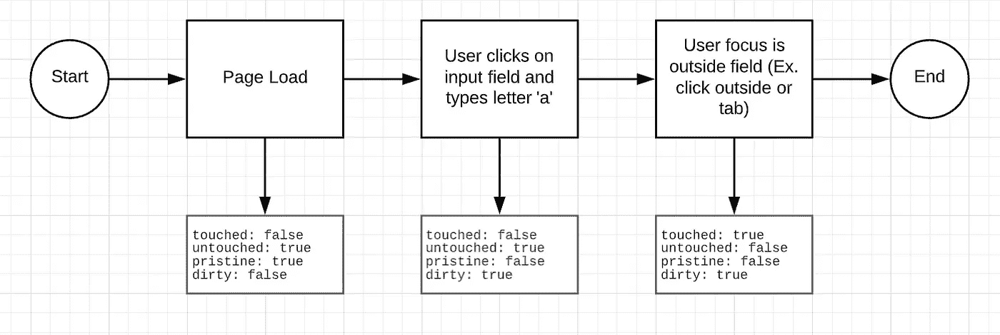
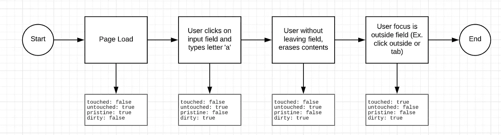
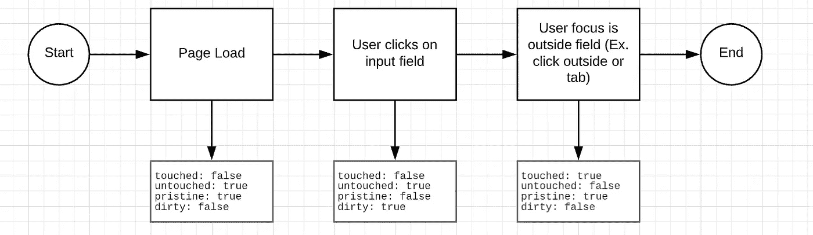

# Angular 10 中的反应式表单—如何使用反应式表单创建登录表单

> 原文：<https://javascript.plainenglish.io/reactive-forms-in-angular-10-how-to-create-a-login-form-using-reactive-forms-c979e2b86135?source=collection_archive---------0----------------------->


Photo by [Micah Williams](https://unsplash.com/@mr_williams_photography?utm_source=unsplash&utm_medium=referral&utm_content=creditCopyText) on [Unsplash](https://unsplash.com/s/photos/login?utm_source=unsplash&utm_medium=referral&utm_content=creditCopyText)

***反应式表单*** 是在 Angular 中创建表单的替代方法。创建反应式表单的大部分繁重工作发生在组件类而不是模板(HTML 文件)中。

使用反应式表单的一个很大的好处是它使得测试更容易。这是因为所有与表单相关的代码都存在于组件类中。鉴于此，您不需要访问测试中的模板来测试您的表单。相反，您可以简单地编写一个单元测试。

**模块设置**

实现反应式表单的第一步是将`ReactiveFormsModule`导入到应用程序的模块中。这个模块可以从`@angular/forms`导入。

为了简单起见，作为这个例子的一部分，我将在`AppComponent`中编写所有与表单相关的代码。下面的代码片段展示了如何包含`ReactiveFormsModule`来开始创建您的第一个反应式表单。

## 创建反应式表单

在我们开始之前，有两个重要的概念我们需要复习一下: ***表单组*** 和 ***表单控件*** 。

表单中的每个控件都是`FormControl`类型。表单控件可以表示用户的名字、出生日期或出生国家。从用户的角度来看，这些可以是输入字段、文本区域或下拉列表。表单控件跟踪控件中的值、验证和事件。一个`FormGroup`包含一组表单控件。

为了向表单添加控件，首先要实例化一个类型为`FormGroup`的对象。当构建反应式表单时，对于你要创建的表单，第一步是创建一个`FormGroup`。

让我们从创建表单组开始。完成后，您需要将一个对象作为参数传入，其中:

*   这些键定义了控件的名称
*   这些值将是类型为`FormControl`的对象

在这个例子中，如果我们有一个用户名和密码，您将创建一个带有关键字`username`和`password`的对象。作为值，您将暂时提供新的表单控件。

随着您的表单变得越来越复杂，有一种更简单的方法可以通过使用`FormBuilder`类来构建它们。为此，您可以从注入`FormBuilder`类并调用`group`方法开始。

作为`group`方法的参数，您将传入一个对象，其中

*   这些键定义了控件的名称
*   目前，这些值是空数组

到目前为止，我们已经完成了组件类。让我们来看看模板中需要完成的内容。

从您的模板中，您可以将表示表单控件的输入字段包装在一个`form`标签中。下一步应该是将`formGroup`指令添加到表单标签中。作为`formGroup`指令的值，传入刚刚在组件类上实例化的表单组。

最后，为你的每一个控件添加一个`formControlName`指令。作为值，您将传入一个字符串，该字符串的名称是您在 component 类中使用的表单控件的名称。

## 表单控件默认值

如果出于某种原因，您需要为表单控件提供默认值，您可以将这些值作为第一个值传递给表单控件上的空数组。如果你想在你的控件中设置`helloworld`为默认用户名，你需要做以下事情。

## 为表单控件设置默认值

有时候你需要为你的表单设置默认值。这可能是因为您有一个编辑表单，用户将在其中编辑某种类型的信息。“setValue”和“patchValue”方法将允许您更新表单中的值。作为参数，您需要传入一个对象。该对象的键将是表单控件名称。这些值将是每个表单控件的值。

如果你只想设置一个特定的表单控件，你可以调用`patchValue`。`patchValue`方法允许您更新表单中的一个或多个字段。以包含一个`username`和`password`表单控件的表单为例。在这种情况下，如果您只想为`username`设置一个默认值，您可以执行以下操作。

```
this.form.patchValue({ username: 'username' });
```

另一方面，`setValue`方法将需要您传入一个包含表单所有控件的对象。换句话说，如果您试图只设置`username`表单控件，这将导致类似这样的运行时错误:*必须为名为:“password”*的表单控件提供一个值。

这是该表单正确使用`setValue`方法的一个例子。

```
this.form.setValue({ 
  username: 'username',
  password: 'password'
});
```

## 表单提交

到目前为止，我们已经创建了一个表单，但在您提交之前，我们无法对其执行太多操作。下一步是添加一个提交按钮，并检索每个控件的值。

要添加提交按钮，在模板中添加一个类型为`submit`的`button`元素。完成这些之后，您将需要在您的`form`标签上添加一个`ngSubmit`处理程序。作为该处理程序的一个参数，您将调用一个将在组件中创建的`submitForm`函数。

在您的组件类中，您现在将实现`submitForm`函数。值得一提的是，您可以给这个函数取任何名称。

在这个函数中，您将通过调用`this.form.getRawValue()`来检索表单控件的值。

方法调用将返回一个对象，其中键是控件的名称，值是表单控件的值。例如，如果用户为用户名输入了`helloworld`和`password`作为密码，则该对象将如下所示:

```
{
  username: "helloworld",
  password: "password"
}
```

## 验证表单控件

验证器是允许你在每个表单控件中添加验证的函数。这些验证可能很简单，比如在表单上创建一个必填字段，或者验证用户输入的电子邮件地址是否有效。

虽然您可以创建自己的验证器，但是 Angular 提供了一些现成的验证器。以下是 Angular 提供的一些验证器:

*   `RequiredValidator` -验证表单控件是否有值，并根据需要标记它
*   `EmailValidator` -验证表单控件是否具有有效的电子邮件地址
*   `MinLengthValidator` -验证表单控件中文本的长度是否大于或等于值
*   `MaxLengthValidator` -验证表单控件中文本的长度小于或等于值
*   `MaxValidator` -验证表单控件中的数字小于或等于值
*   `MinValidator` -验证表单控件中的数字是否大于最小值或等于值
*   `PatternValidator` -验证表单控件中的文本是否匹配特定的正则表达式

要添加验证程序，您需要将其作为表单控件初始化的一部分进行添加。Angular 提供的所有验证器都可以从`@angular/forms`中的`Validators`类导入。

假设我们将使`username`和`password`字段成为必填字段。为此，我们将使用`RequiredValidator`，并将`Validators.required`作为表单控件数组的第二个值添加到两个控件中。

如果您想在表单控件中添加多个验证器，您需要将它们作为表单控件值的第二个值传递到一个数组中。

## 自定义验证程序

正如您所看到的，Angular 为您的表单提供了一组非常好的默认验证器。最大的问题是，如果您需要自己的验证器呢？好消息是，这很容易做到。

假设您想要一个验证器来验证密码不是单词`password`。为了创建您的自定义验证器，您必须创建一个验证它的函数。作为一个参数，您将接受一个类型为`FormControl`的对象。接下来，您将从表单控件中获取值，如果存在错误，则返回一个错误。

下一步是在表单控件上使用这个自定义验证器。要做到这一点，您只需在构建`FormGroup`时将其添加到验证器列表中。

## 验证表单是否有效

到目前为止，您已经有了一个表单控件，并向其中添加了一个验证器。下一步是在用户单击提交按钮时验证表单是否有效。

做到这一点非常简单，您只需要从表单组中的`valid`属性获取值。在这种情况下，在您的`submitForm`方法中，您可以执行一个条件语句来验证`this.form.valid`是否为真，然后您继续前进，对这些数据执行一些其他类型的操作。

## 禁用提交按钮

根据应用程序的要求，在某些情况下，您可能希望禁用表单的“提交”按钮。

这种情况的一个典型用例是，当表单不处于有效状态时，您希望禁用提交按钮。为此，您可以向提交按钮添加`disabled`属性。作为一个值，您将传入`!form.valid`以仅在表单无效时禁用它。

## 显示错误

为了在模板上显示错误，您需要首先从表单中获取表单控件。为此，您需要在模板上调用`form.get('formControlName')`，其中`formControlName`是您的控件的名称。

在这种情况下，我们将为`username`控件添加验证。这样做之后，您可以调用`hasError`方法，在这里您将传入错误的名称。每当你使用`Validators.required`时，错误名称将会是`required`。`hasError`方法将返回一个布尔值。

考虑到这一点，您可以在模板中使用`*ngIf`结构指令来决定是否要显示错误消息。

## 表单状态

有角度的窗体及其控件可以有不同的状态，例如:
- ***原始的*** :用户没有改变窗体控件的值
- ***脏的*** :与原始的相反
- ***已触摸*** :用户已经访问了窗体控件并将其退出
- ***未触摸*** :与已触摸相反

这些状态帮助您增强表单的行为方式。例如，如果用户没有输入用户名，您不希望显示错误消息。

一种选择是，当用户没有对表单做任何操作就点击提交按钮时，您可以考虑显示一个错误。另外，如果用户 ***触摸了*** 表单控件，你可能只想显示错误信息。

这样做的原因是，让用户看到一个错误百出的表单可能会很烦。默认情况下，当表单加载时，它可能没有用户名。一种更友好的方法是只有当用户与表单控件交互时才显示错误。

为了检索表单控件的状态，您需要首先使用`form.get('formControlName')`获取表单控件。完成此操作后，您可以在表单控件上调用下列任何布尔属性。

*   `dirty`
*   `pristine`
*   `touched`
*   `untouched`

让我们来看几个场景，以便更好地理解窗体状态在 Angular 中是如何工作的。



Form States Scenario #1 — User enters a value on form control



Form States Scenario #2 — User enters a value and erases it from form control



Form States Scenario #3 — User visits form control without entering a value

正如您在下面的例子中看到的，我们添加了一个`*ngIf`，在这里我们有条件地显示错误消息。如果错误存在，并且表单控件是脏的，那么我们向用户显示一条错误消息。

我希望这篇文章能帮助你更好地了解如何开始使用角反应式。尽情享受吧！

## 简单英语的 JavaScript

喜欢这篇文章吗？如果是这样，通过 [**订阅解码获得更多类似内容，我们的 YouTube 频道**](https://www.youtube.com/channel/UCtipWUghju290NWcn8jhyAw) **！**