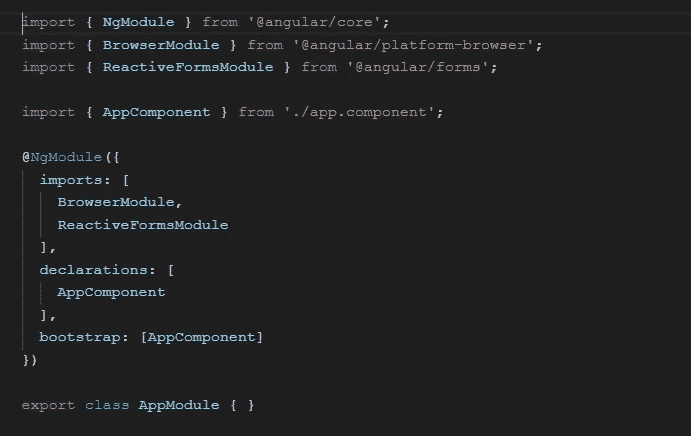
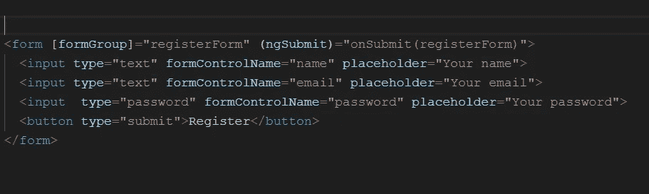
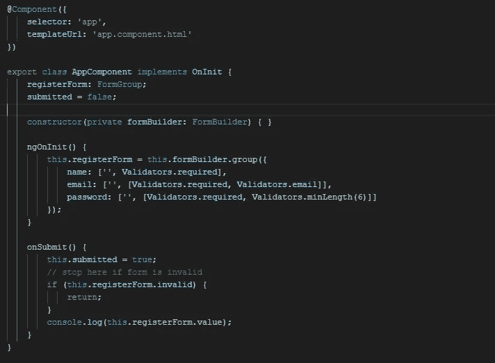

# 角形反应形式

> 原文：<https://javascript.plainenglish.io/reactive-forms-in-angular-6d9680e567f2?source=collection_archive---------2----------------------->

角度提供了两种形式:

模板驱动的表单:模板指令用于构建表单的内部表示。这里真理的来源在于模板。

在模板驱动的表单中，每个表单元素都链接到一个在内部管理表单模型的指令。

**反应式表单**:提供了一种模型驱动的方法来处理表单输入，表单输入的值会随着时间而变化。反应式表单是围绕可观察的流构建的，其中表单输入和值作为输入值流提供，可以同步访问。

有了反应形式，一个人就有能力在组件类中建立他的形式表现。

在反应式表单中，事实的来源在于组件类，即表单模型(如 FormGroup 或 FormControl 实例)。从模型到视图以及从视图到模型的更新是同步的。

***类棱角分明的形体:***

1.  **abstract control:**form control、FormGroup 和 FormArray 的基类。它提供所有控件和组都具有的共享属性和行为。
2.  **FormControl:** 跟踪单个表单控件的值和验证状态。它映射到模板中的单个表单元素。
3.  **FormGroup** :跟踪一组 FormControl 实例的值和有效性状态。它将每个子 FormControl 的值聚合到一个对象中，并将每个控件名称作为键。
4.  **for array**:跟踪 FormControl、FormGroup 或 for array 实例数组的值和有效性状态。将每个子 FormControl 的值聚合到一个数组中。
5.  **FormBuilder:** 用于从用户指定的配置创建 AbstractControl 的实用程序类。它用于创建 FromControl、FormGroup 或 FormArray 的实例。

现在让我们从角形反应式开始。

# **导入反应式模块**

为了处理反应式表单，我们需要在模块中导入**反应式表单模块**。

ReactiveFormsModule added to imports array of AppModule

# **包含表单的模板:**

app.component.html

表单组:这个指令允许我们给表单命名。该窗体将被映射到 component 类中 FormGroup 的一个实例。

ngSubmit :表单提交时触发的事件。在我们的代码中，当表单提交时，组件的 Submit 方法被调用。

**formControlName** :该指令接受一个值，该值是组件类中 FormControl 的名称。

# **组件类:**

在这个组件中，我们使用 FormBuilder 服务来创建 FromGroup 实例。表单名称 **registerForm** 与传递给表单模板中 formGroup 属性的值相匹配。

表单模板中的每个 formControlName 属性值都与 **registerForm** 组中的 FormControl 实例进行映射。FormControl 实例还可以接受一个验证器数组，该数组可用于向表单添加验证。

这是实现反应式表单所需的所有基础知识..