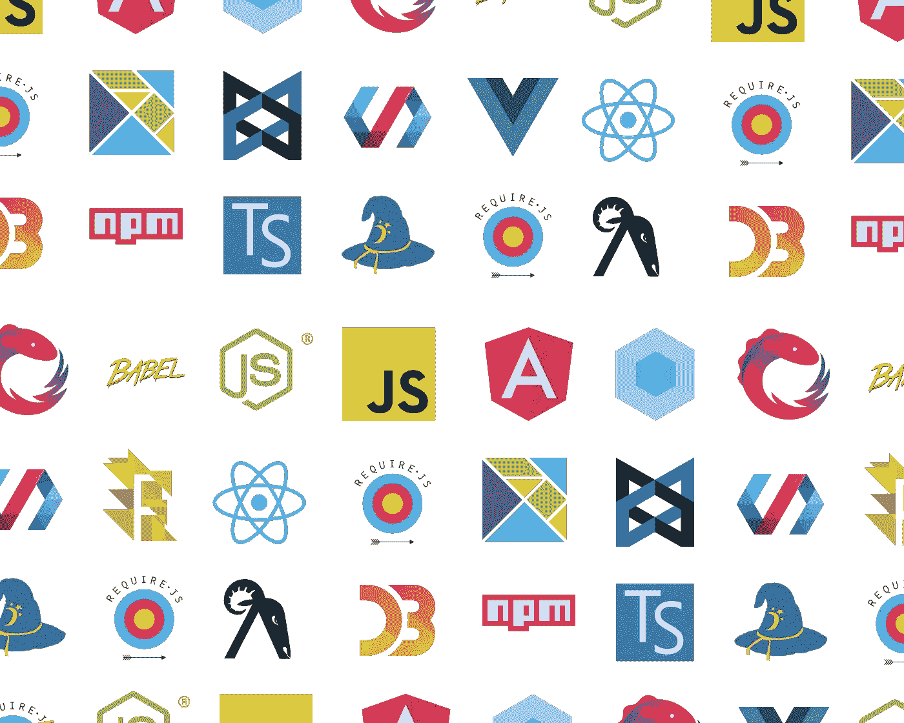

# Web 框架中的反应性(第 1 部分)

> 原文：<https://javascript.plainenglish.io/reactivity-in-web-frameworks-part-1-ef1f7bde9c02?source=collection_archive---------3----------------------->

# 什么是反应性

反应性是 web 框架在应用程序状态改变时更新视图的能力。

它是任何现代 web 框架的核心。

为了理解什么是反应性，让我们看一个计数器应用程序的例子。

这就是用普通 JavaScript 编写的方式:

在 Vue 中，您可以这样做:

…这在反应中:

请注意，使用 web 框架，您的代码更关注于根据业务需求更新应用程序状态的*和使用模板语言或 JSX 表达式描述视图外观的*。该框架将在应用程序状态和视图之间架起一座桥梁，每当应用程序状态改变时就更新视图。**

*不再有烦人的 DOM 操作语句(`span.innerText = counter`)伴随着状态更新语句(`counter ++;`)。当一个人在更新应用程序状态时忘记更新视图时，不再有难以捉摸的视图和应用程序状态不同步的错误。*

*所有这些问题现在都是过去式了，因为 web 框架现在默认以反应方式发布，总是确保视图是应用程序状态变化的最新版本。*

*所以我们接下来要讨论的主要观点是，*

> *web 框架如何实现反应性？*

# *时间和内容*

*为了实现反应性，该框架必须回答两个问题*

*   *应用程序状态何时改变？*
*   *应用程序状态发生了什么变化？*

***WHEN**回答框架何时需要开始更新视图。知道**是什么**，允许框架优化它的工作，只更新视图中已经改变的部分。*

*我们将讨论不同的策略来确定**何时**和**什么**，以及每个策略的代码片段。你可以组合不同的策略来决定什么时候和什么时候**，但是某些组合可能会让你想起一些流行的 web 框架。***

# ***什么时候***

***WHEN 通知框架应用程序状态已经更改，因此框架知道它需要完成更新视图的工作。***

***不同的框架采用不同的策略来检测应用程序状态何时改变，但本质上，通常归结为在框架中调用一个`scheduleUpdate()`。`scheduleUpdate`通常是框架的一个去抖`update`功能。因为应用程序状态的改变可能导致派生状态的改变，或者框架用户可能连续改变应用程序状态的不同部分。如果框架在每次状态改变时更新视图，它可能会过于频繁地改变视图，这可能是低效的，或者它可能会有不一致的视图([可能会导致撕裂](https://techterms.com/definition/screen_tearing))。***

***想象一下这个做作的 React 例子:***

***如果框架同步更新视图中的 todos，然后更新 todos 总数，可能会有一瞬间 todos 和总数不同步。*(虽然在这个做作的例子中，这似乎是不可能的，但你明白了。)****

> ****对了，你不应该设置* `*totalTodos*` *这种方式，你应该从* `*todos.length*` *中派生出来，参见* [*【不同步状态】。衍生出来！”肯特·c·多兹。*](https://kentcdodds.com/blog/dont-sync-state-derive-it)***

***那么，您如何知道应用程序状态何时发生了变化呢？***

# ***突变跟踪***

***所以我们想知道应用程序状态什么时候改变了？让我们追踪它！***

***首先，为什么叫变异追踪？那是因为我们只能追踪突变。***

***通过单词 mutation，它推断出我们的应用程序状态必须是一个对象，因为您不能改变一个原语。***

***像数字、字符串、布尔这样的原语是通过值传递给函数的。因此，如果您将原语重新赋值给另一个值，则在函数中永远无法观察到这种重新赋值:***

***另一方面，对象是通过引用传递的。因此，可以从内部观察到同一对象的任何变化:***

***这也是为什么大多数框架的应用程序状态是通过`this`来访问的，因为`this`是一个对象，对`this.appState`的改变可以被框架观察/跟踪。***

***现在我们明白了为什么叫变异跟踪，让我们来看看变异跟踪是如何实现的。***

***我们将看看 JavaScript 中两种常见的对象类型，普通对象和数组。***

****(虽然如果你* `*typeof*` *对于两个对象或者数组，它们都是* `*"object"*` *)* 。***

***随着 ES6 代理的引入，变异跟踪方法变得更加简单。但是，让我们看看如何在有/没有 ES6 代理的情况下实现突变跟踪。***

# ***先前代理***

***为了在没有代理的情况下跟踪变异，我们可以为对象的所有属性定义一个自定义的 getters 和 setters。因此，每当框架用户更改属性的值时，都会调用自定义 setter，我们会知道有些事情发生了变化:***

***Inspired by [Vue.js 2.0’s observer](https://paper.dropbox.com/doc/Reactivity-in-Web-Frameworks--Aroey0wh9iZRE8dm9lC4Ulo0AQ-D6CkkTTpH1AqGvBlKcQ85).***

***但是，您可能会注意到，如果我们在对象的现有属性上定义 getters 和 setters，我们可能会错过通过添加或删除对象属性所做的更改。***

***如果没有更好的 JavaScript API，这是无法解决的问题，因此对此警告的一个可能的解决方法是提供一个助手函数。比如在 Vue 中，你需要使用辅助函数`[Vue.set(object, propertyName, value)](https://vuejs.org/v2/guide/reactivity.html#Change-Detection-Caveats)`而不是`object[propertyName] = value`。***

***跟踪数组的突变类似于跟踪对象的突变。但是除了可以通过赋值改变数组项之外，还可以通过数组的变异方法对数组进行变异，例如:`push`、`pop`、`splice`、`unshift`、`shift`、`sort`、`reverse`。***

***要跟踪这些方法所做的更改，您必须修补它们:***

***Inspired by [Vue.js 2.0’s array observer](https://github.com/vuejs/vue/blob/22790b250cd5239a8379b4ec8cc3a9b570dac4bc/src/core/observer/array.js).***

> ****CodeSandbox 用于* [*对象的变异跟踪和*](https://codesandbox.io/s/mutation-tracking-getterssetters-44ono)***

***总之，要在没有代理的情况下跟踪对象或数组的变化，您需要为所有属性定义定制的 getter/setter，以便您可以在设置属性时进行捕获。除此之外，您还需要修补所有的变异方法，因为这将在不触发自定义 setter 的情况下变异您的对象。***

***然而，仍然有一些边缘情况无法涵盖，比如添加新的属性或删除属性。***

***这就是 [ES6 代理](https://developer.mozilla.org/en-US/docs/Web/JavaScript/Reference/Global_Objects/Proxy)来帮忙的地方。***

# ***使用代理***

***代理允许我们在目标对象的基本操作上定义自定义行为。这对于变异跟踪非常有用，因为代理允许我们拦截属性设置和删除，而不管我们是使用索引赋值、`obj[key] = value`还是变异方法、`obj.push(value)`:***

*****那么我们如何使用突变追踪呢？*****

***变异跟踪的好处是，如果你在上面的例子中注意到了，框架用户并不知道跟踪，并把`appState`当作一个正常的对象:***

***我们可以在组件初始化期间设置跟踪，或者:***

*   ***跟踪组件的属性，***
*   ***跟踪组件实例本身，***
*   ***或者介于两者之间***

***一旦您能够跟踪应用程序状态的变化，接下来要做的事情就是调用`scheduleUpdate`而不是`console.log`。***

***你可能会担心所有这些复杂性是否值得努力。或者你可能担心旧浏览器不支持[代理。](https://caniuse.com/#feat=proxy)***

***你的担心并非完全没有根据。不是所有的框架都使用变异跟踪。***

# ***就叫`scheduleUpdate`***

***一些框架设计他们的 API 的方式使得它“欺骗”框架用户告诉框架应用程序状态已经改变。***

***每当您更改应用程序状态时，框架会强迫您使用它们的 API 来更改应用程序状态，而不是记住调用`scheduleUpdate`:***

***这使我们的设计更简单，处理的边缘情况更少:***

***Inspired by [React’s](https://github.com/facebook/react/blob/0cf22a56a18790ef34c71bef14f64695c0498619/packages/react/src/ReactBaseClasses.js#L57) `[setState](https://github.com/facebook/react/blob/0cf22a56a18790ef34c71bef14f64695c0498619/packages/react/src/ReactBaseClasses.js#L57)`***

***然而，这可能会让新开发人员陷入框架:***

***…在阵列中添加/删除项目时可能有点笨拙:***

***一种可能两全其美的不同方法是在您认为最有可能发生变化的场景中插入`scheduleUpdate`:***

*   ***事件处理程序***
*   ***超时(例如:`setTimeout`，`setInterval`，...)***
*   ***API 处理、承诺处理***
*   ***…***

***因此，框架用户应该使用定制的超时、api 处理程序，...：***

***Inspired by [AngularJS’s $timeout](https://github.com/angular/angular.js/blob/master/src/ng/timeout.js#L13)***

***您的框架用户现在可以自由地以他想要的方式更改应用程序状态，只要这些更改是在您的定制处理程序中完成的。因为在处理程序的最后，你会调用`scheduleUpdate()`。***

***同样，这也可能让新开发人员陷入框架之中！尝试搜索[“angular js＄time out vs window . settimeout”](https://www.google.com/search?q=angularjs%20%24timeout%20vs%20window.setTimeout)***

***您可能会想，如果处理函数中没有状态变化，调用额外的`scheduleUpdate()`不是效率很低吗？到目前为止，我们还没有讨论`scheduleUpdate()`中发生了什么，我们可以检查**发生了什么变化**(这将在下一节中介绍)**、**，如果没有变化，我们可以跳过后续步骤。***

***如果你看看我们迄今为止尝试过的策略，你可能会注意到一个共同的问题:***

*   ***允许框架用户以他想要的任何方式改变应用程序状态***
*   ***在没有太多运行时复杂性的情况下实现反应。***

***在这一点上，你必须同意，强制框架开发人员在他们想要改变应用程序状态的时候调用`setAppState`，对框架来说需要**更少的运行时复杂性**，并且不太可能有任何需要处理的极限情况或警告。***

***如果开发人员的表达能力和运行时的复杂性之间存在矛盾，或许我们可以通过将复杂性从运行时转移到构建时来达到两全其美？***

# ***静态分析***

***如果我们有一个编译器允许框架用户编写:***

***并将其编译为:***

***这样，我们就真的两全其美了！😎***

***让我们看看框架用户将编写的不同场景，看看我们是否知道何时插入`scheduleUpdate()`:***

***请允许我总结一下上面例子中面临的一些复杂情况:***

*   ***跟踪应用程序状态的直接变化很容易，但是跟踪间接的变化却非常困难，例如:`foo.one`、`doSomethingMutable(this.appState)`或者`this.appState.obj.increment()`***
*   ***通过赋值语句跟踪变更很容易，但是通过变异方法跟踪变更却非常困难，例如:`this.appState.list.push('1')`，我的意思是你如何知道方法正在变异？***

***所以对于 [Svelte](http://github.com/sveltejs/svelte) 这种使用静态分析来实现反应性的框架之一，它只通过赋值操作符来保证反应性(例如:`=`，`+=`，...)和一元算术运算符(例如:`++`和`--`)。***

***我相信在这个领域还有待探索的空间，特别是在 TypeScript 的[兴起的时候，我们也许能够通过静态类型更好地理解我们的应用程序状态。](https://2019.stateofjs.com/javascript-flavors/typescript/)***

# ***摘要***

***我们已经经历了了解应用程序状态何时改变的不同策略:***

*   ***突变跟踪***
*   ***就叫`scheduleUpdate`***
*   ***静态分析***

***不同的策略体现在框架的 API 方面:***

***知道应用程序状态何时改变，允许框架知道何时更新我们的视图。然而，为了优化更新，框架需要知道应用程序状态发生了什么变化。***

***我们要删除并重新创建视图中的每个 DOM 元素吗？根据应用程序状态的变化，我们知道视图的哪一部分将会改变吗？***

***也就是说，如果我们知道**这个什么**。***

***我要感谢 [Rich Harris](https://twitter.com/Rich_Harris) 指出了本文前一版本中的一些不准确之处，并提供了宝贵的反馈。所有剩下的错误都是我的..***

****原载于****