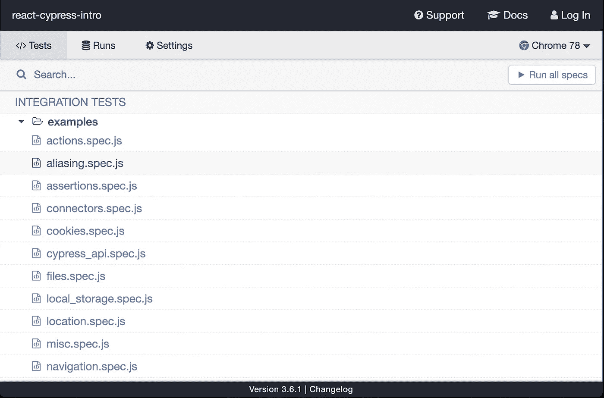
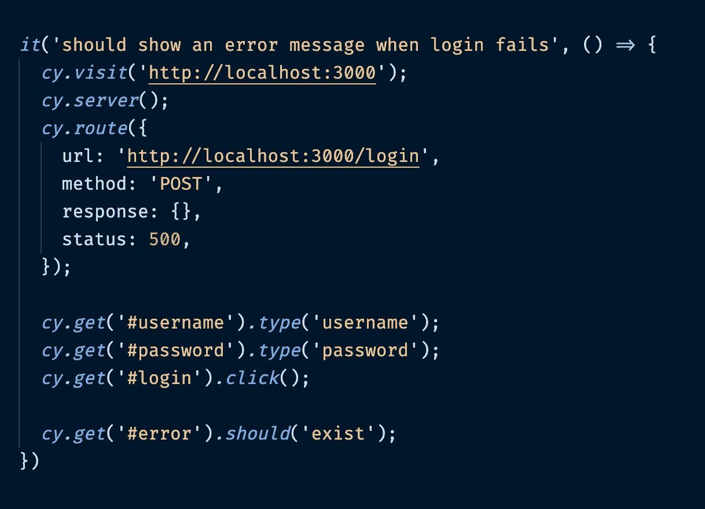

# React —用 Cypress 进行现代测试

> 原文：<https://javascript.plainenglish.io/reactjs-modern-testing-with-cypress-cb7b27286bad?source=collection_archive---------4----------------------->

## 你有一个很棒的应用。你写了很棒的测试。你想给你的客户看，所以你给他一部手机。

大银行家鲍勃跑过来。

“你给我准备了什么*、*小程序员？有用吗？我赚钱了吗？”

“当然，鲍勃。我可以通过向您展示我编写的这些令人敬畏的测试来快速证明这一点！”

你打开文本编辑器，加载`makemoney.test.js`，脸上带着灿烂的笑容，向鲍勃展示它的辉煌。

他一拳打在你的鼻子上。

你到底在干吗你认为鲍勃会对你糟糕的单元测试毫不在乎吗？不要！他只是想知道，如果他的用户可以申请他们多汁的 3000%年利率贷款！

但是…

如果你能通过 UI 展示它的工作，而不必手动运行数百个不同的场景，这不是很好吗？他就不会伤害你了。哦，不。他可能会给你一大笔银行家的钱💰💰💰。

好吧，也许不是。但是它*会*很酷，对吗？

这就是赛普拉斯的用武之地。

**Cy-who？**

Cypress 是一个工具，它允许你对你的 web 应用程序执行类似用户的操作，有一个漂亮的 UI 和干净的 API 来引导。

**对……所以呢？**

您是否发现自己在 React 组件中测试内部状态字段？

*如果我点击这个按钮，* `*dropdownOpen*` *是否等于真？*

我知道我有。但是这到底说明了什么呢？它告诉你如果:—

*   下拉菜单实际上在屏幕上
*   在你点击按钮之前它并不存在
*   下拉列表的内容

没有。事实上，它几乎什么也没告诉你。

用户不关心应用程序的内部状态，他们只关心屏幕上发生了什么；他们能看到该死的下拉菜单。

这就是赛普拉斯的意义所在。

您将用户动作自动化为一系列命令，并让 Cypress 来执行它们。它会在屏幕上呈现你的应用程序，你可以看到每个任务的执行(这是非常酷的)。它甚至理解加载和异步进程是实际的事情，所以当它不能马上找到一个元素时，它不会抱怨。

不再有`wait`或`sleep`。不再有`simulate`。所有真实的动作，就像是由真实的用户执行的一样。只会更快。

如果你想了解更多，请继续阅读。

**我如何开始？**

*如果你想跟随下一部分，可以从* [*这里*](https://gitlab.com/sk3pt1cc/react-cypress-intro) *克隆基础 app。*

*下载完成后，运行资源库根目录下的* `*npm install*` *，然后* `*npm run start*` *在浏览器中加载 app。您应该看到一个简单的表单，有两个输入框和一个登录按钮。*

— —

好的，那我该怎么做呢？

在项目根目录下，运行:-

`npm i cypress --save`

然后:-

`$(npm bin)/cypress open`

会有奇迹发生，然后你就完了。太棒了。

对了，这些是什么东西？

Cypress UI

您应该会在屏幕上看到类似上面的内容。这是一个很好的小 UI，Cypress 给你管理不同的测试。你在屏幕上看到的列表包含了 Cypress 默认为你创建的不同的`spec`文件。我们不需要他们。

在你的应用程序中，进入新创建的`cypress/`文件夹，删除`integration/`中的所有内容。

如果你现在回头看你的柏树窗户，什么也没有。

是的，是的，我该怎么做测试？！

在`integration/`文件夹中，创建一个名为`login.spec.js`的文件。Cypress 会自动从那里获取文件，并通过用户界面访问它们。如果你现在向后滑动，你会在列表上看到它。

现在，我们可以写一个测试。在`login.spec.js`中:-

Cypress test for error notification

Cypress 的一个优点是 API 非常直观。我可能不需要解释这些线的大部分，但我还是会这样做，因为他妈的规则。

— — — — — — — — — — — — — — — — — — — — — — —

`it()` - >包含单一测试。

`cy.visit()` - >告诉 Cypress 要访问哪个页面。在这里，我们只是去根。

`cy.server()` - >告诉 Cypress 我们想要为我们的应用程序建立一个模拟后端。

`cy.route()` - >告诉 Cypress 创建一个模拟路由，定义 url、方法、响应和状态代码。更多关于这个[这里](https://docs.cypress.io/api/commands/route.html#Syntax)。

`cy.get()` - >从页面中检索一个 DOM 元素。这里我们使用 id 来获得我们需要的 id。更多？[此处](https://docs.cypress.io/api/commands/get.html#Syntax)。

`cy.get().type()` - >允许您在检索到的元素中键入一些文本。

`cy.get().click()` - >点击一个可点击的元素。

`cy.get().should()` - >一个论断。如果`error`不存在，测试将失败。`should`可以带的东西很多。都是[这里](https://docs.cypress.io/api/commands/should.html)。

— — — — — — — — — — — — — — — — — — — — — — —

那个☝️.就是这样。那就是*字面上的*它。我的意思是，*女王*可以做*那个*，而且她大概… 200 岁。

要查看您的测试运行，返回到 Cypress UI，双击`login.spec.js`，观察它的运行。

哇哦。比如生孩子。

*现在怎么办？*

好了，已经过了 3 个小时了，你终于看完了你的测试，一遍又一遍，因为这太酷了。接下来呢？嗯，有几件事你可以做。

Cypress 的文档非常好，如果你是个书呆子或者什么的，你可以在这里阅读它们。

或者，你可以尝试以下练习

*   重复上述测试，但没有成功消息
*   当您点击`x`按钮时，验证成功通知栏是否清空
*   确认当您点击`x`按钮时，错误通知栏清除

**搞定了？**

是的。你可以点击我的个人资料查看我的其他资料。我写编程，我写小说，我写写作。没错。

感谢阅读。