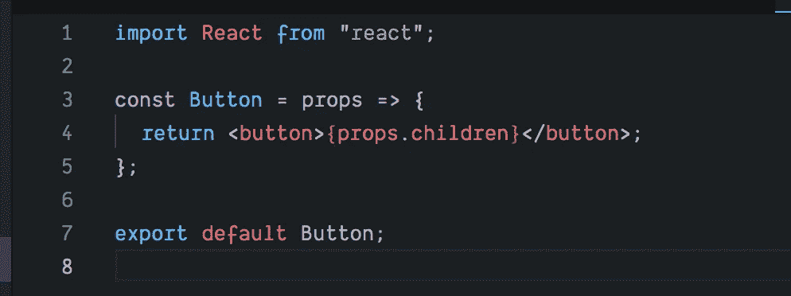
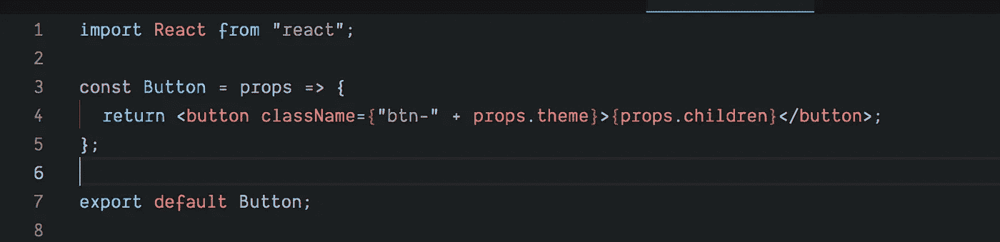
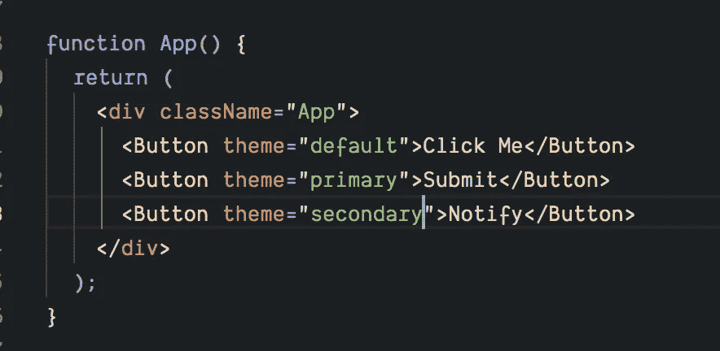

# 在 React with {props.children}中创建可重用组件

> 原文：<https://javascript.plainenglish.io/reactjs-reusable-components-by-props-children-df6d77d69a98?source=collection_archive---------1----------------------->

## 代码的可重用性是编写代码的最基本的部分。

如果你不能开发可重用的代码，那么你的技能需要提高。在 Javascript 中，通过使用 *OOPS* 、*设计模式、* *类*、*函数*等，重用是相当容易的。如果我们谈论 Reactjs，那么它的可重用性就变得棘手了。

一般来说，大多数开发人员认为，如果我们在制作组件，我们可以多次重用这些组件。不过，这是真的。

但是，想想那些我们必须使用相同组件但有不同需求的场景，例如内容不同、UI 不同、数据不同。

# **问题陈述:**

在你的应用程序中，你有 3 种类型的按钮，所有的按钮都有不同的字体颜色和背景颜色以及文本。大概是这样的:

现在，作为一个天真的开发人员，您将最终为按钮创建三个不同的组件。然而，在这里你将违反可重用代码的法则。实际上，您最终得到的是不可重用的代码。

如何解决这个问题？

# **解决方案**:道具.儿童

*props.children* 通过提供容器来放置任何东西，为您提供了重用组件的特性。基本上，*道具。children* 给你一个插槽来放置你想要传递的任何东西，它将在组件之间呈现。所以，现在你会有这样的按钮代码

因此，现在您只有一个组件，但是您在应用程序中重用了它三次。这仅仅解决了内容的一个问题，我们仍然需要解决主题的问题。为了处理不同的主题，我们将在 CSS 中创建不同的类，并尝试使用*按钮*组件中的*道具*对其进行定制。

*。BTN-默认，。BTN-主要，。BTN-中学*

现在，我们只有按钮的一个组件，但是我们用不同的内容和类名重用了它三次。这就是可重用性的力量，可以通过 *props.children* 来实现。您也可以有嵌套的子节点，这不会影响您的性能。

[https://codesandbox.io/s/7403046mvx](https://codesandbox.io/s/7403046mvx)

所以，下次在创建组件时，要考虑可重用性。记住 Reactjs 工作于合成而不是继承。

## 进一步阅读

 [## 如何在项目中重用 React 组件

### 最后，您完成了为应用程序中的表单创建一个奇妙的输入字段的任务。你对……很满意

比特云](https://bit.cloud/blog/how-to-reuse-react-components-across-your-projects-l4pz83f4) 

*更多内容请看*[***plain English . io***](https://plainenglish.io/)*。报名参加我们的* [***免费周报***](http://newsletter.plainenglish.io/) *。关注我们关于*[***Twitter***](https://twitter.com/inPlainEngHQ)[***LinkedIn***](https://www.linkedin.com/company/inplainenglish/)*[***YouTube***](https://www.youtube.com/channel/UCtipWUghju290NWcn8jhyAw)***，以及****[***不和***](https://discord.gg/GtDtUAvyhW) *对成长黑客感兴趣？检查* [***电路***](https://circuit.ooo/) ***。*****