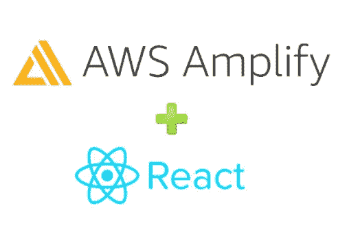

# 如何使用 AWS Cognito 在 React 中实现身份验证

> 原文：<https://javascript.plainenglish.io/reactjs-signin-with-aws-cognito-ce4cd43d37f9?source=collection_archive---------3----------------------->

## 使用 AWS Cognito 在简单的 React web 应用程序上实现身份验证。



React 是使用最广泛和最流行的 JavaScript 库之一，由脸书在 2013 年开发，用于创建单页面应用程序。


Image Source: [https://www.npmjs.com/package/react](https://www.npmjs.com/package/react)

如你所见，图表显示了相当多的数字。React 非常受欢迎，被前端开发者大量下载。关键原因是它很容易开始，你可以在观看几个视频后制作一个简单的 web 应用程序。

## 亚马逊 Cognito 是什么？

Amazon Cognito 提供的服务可以让你快速、轻松地将用户注册、登录和访问控制添加到你的 web 和移动应用中。

## 然后让我们看看如何使用它

**先决条件和要求:**

1.  AWS 帐户和 Cognito 配置。
2.  带有登录屏幕的基本 React 应用程序。

## 第一步:安装亚马逊提供的库。

> AWS Amplify 是一个 JavaScript 库，用于前端和移动开发人员构建支持云的应用程序。

```
npm i aws-amplify
```

## 步骤 2:初始化库

> 将这些行(如下所示)复制并粘贴到您的主基本组件中。(Index.js、Main.js 或 App.js)。您可以从“AWS 控制台-认知到用户池”和“AppClient”屏幕获得这些详细信息。

```
import Amplify from 'aws-amplify';
Amplify.configure({
  Auth: {
    userPoolId: 'XX-XXXXX_XXXXXX', //UserPool ID
    region: 'XXXXXX',
    userPoolWebClientId: 'XXXXXXXXXXXXXXX' //WebClientId
  }
});
```

## 第三步:调用函数

> 只要从您想要尝试登录的任何地方调用函数 Auth.signIn(用户名，密码)即可。

```
import {Auth} from 'aws-amplify';Auth.signIn(username, password).then((result) => {
    //Success 
   }).catch((err) => {
    // Something is Wrong
   })
```

## 第四步:获取 JWT 令牌

```
const getToken = async ()=>{
    var data = await Auth.currentSession()
    return data.idToken.jwtToken
}
// Now get JWT just by calling this function.
```

## 结论:

感谢您的阅读。我希望你喜欢这篇文章，并发现它很有用。

参考此[链接](https://aws-amplify.github.io)了解“aws-amplify”。

要了解更多关于 React 的信息，请点击[这里](https://reactjs.org/docs/getting-started.html)。

[*更多内容尽在 plainenglish.io*](http://plainenglish.io/)