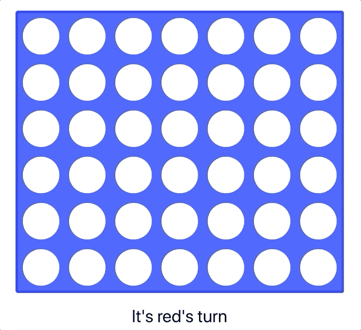
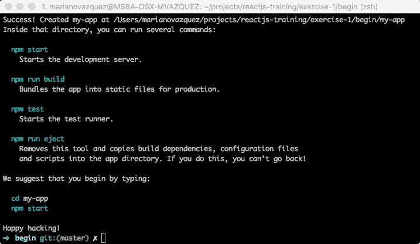
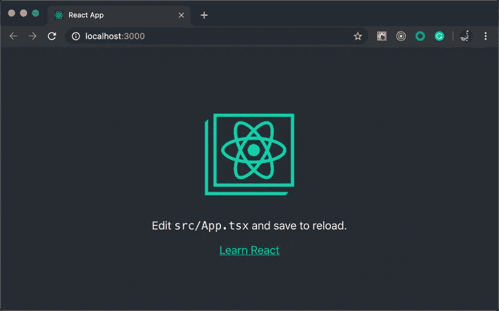
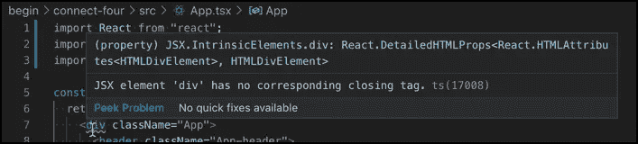
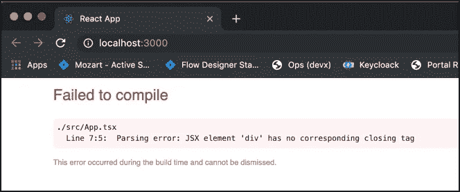
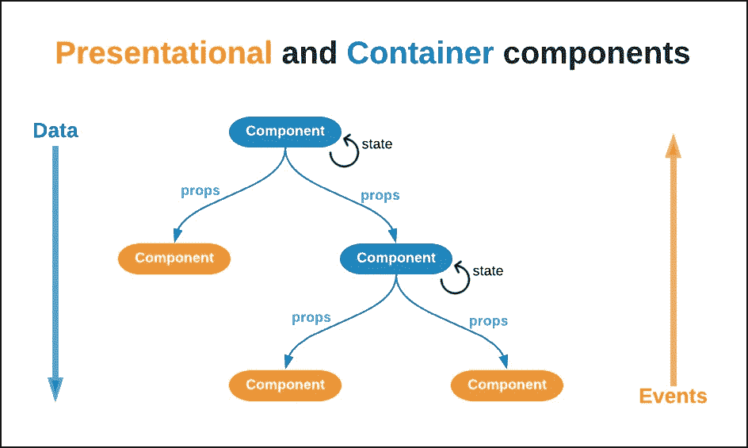
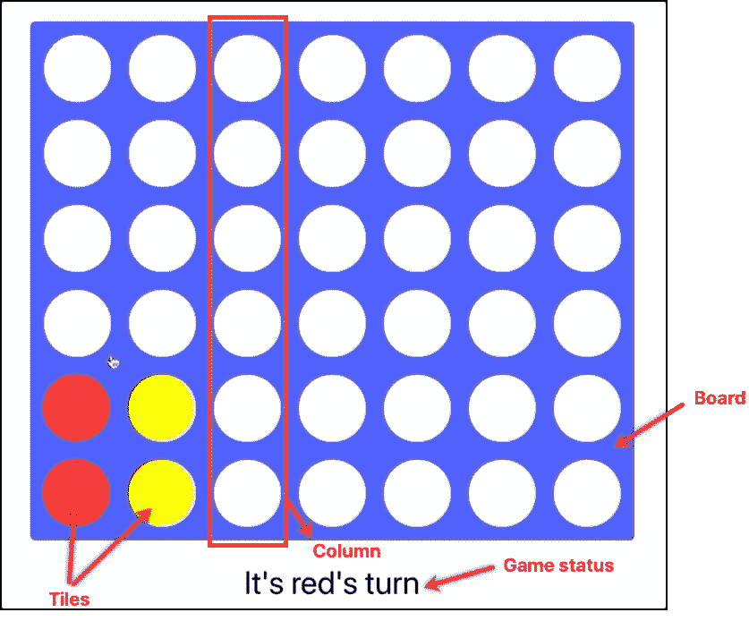
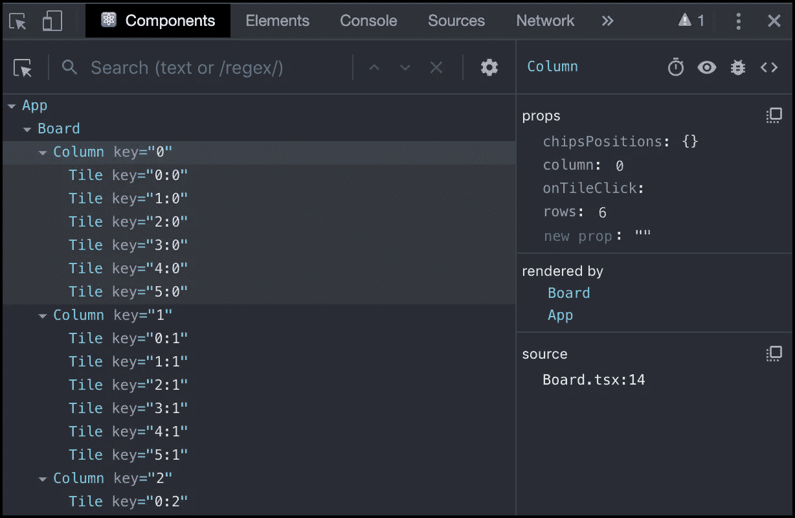
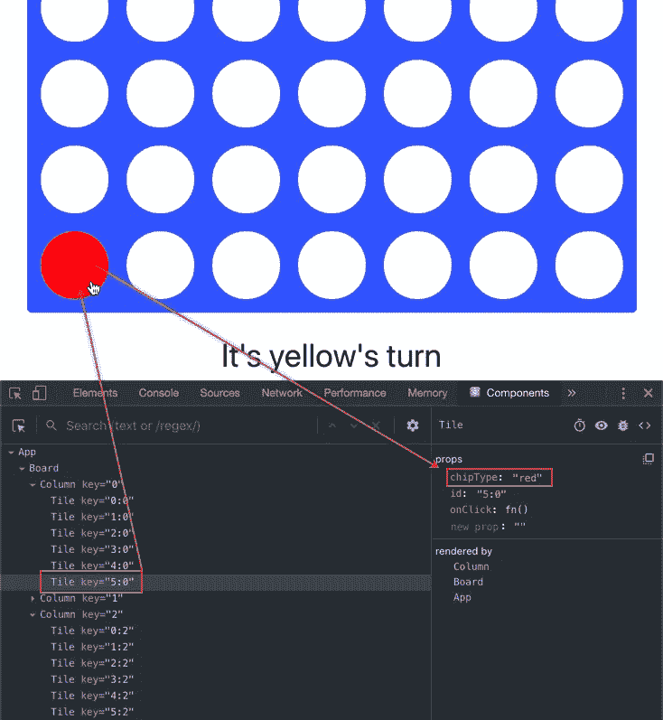

# ReactJS 培训:使用 React 和 TypeScript 创建您的第一个游戏

> 原文：<https://javascript.plainenglish.io/reactjs-training-creating-your-first-game-with-react-and-typescript-162f56b75e78?source=collection_archive---------2----------------------->


> 如果你想知道西班牙艺术的版本，请点击[进入](https://medium.com/@nanovazquez/reactjs-training-creando-tu-primer-juego-con-react-y-typescript-43232b988d87)。

既然我们已经介绍了基础知识，是时候让事情变得真实了。在本练习中，我们将从头开始建立一个 React 应用程序，然后我们将在它的基础上实现 [Connect Four](https://en.wikipedia.org/wiki/Connect_Four) 游戏。



This is the game we are going to build in this post: Connect four

通过遵循本逐步演练，您将在编写实际应用程序时了解 React 和 TypeScript。你准备好了吗？👾

# 初始设置

> **注意:**如果你想马上开始游戏逻辑，你可以跳过这一节，然后[打开本练习的 **begin** 应用，位于本次培训的 GitHub 资源库](https://github.com/nanovazquez/reactjs-training/tree/master/exercise-2/begin/connect-four)。记得在用`*npm start*`运行之前先用`*npm install*`。

正如我们在上一篇文章中解释的那样，TypeScript 和 JSX 都不能在浏览器中运行。因为我们要用这些语言编写代码，所以在执行我们的应用程序之前，我们需要*转换它。为此，我们有两种选择:*

1.  自己呈现、解释、分析和配置多个工具(Webpack/Rollup、Babel/tsconfig、CSS 模块等。)
2.  利用“架子工”(也称为*集成工具链*)，这是已经预先配置好的烘焙应用，不需要任何额外的设置就可以开始，让我们**只关注我们的代码**。

在这篇文章中，我们将采用后一种选择，利用脸书的 [Create React app](https://github.com/facebook/create-react-app) ，这是当今构建 React 应用程序的事实上的工具。

设置起来非常简单:

在你的终端中，运行`npx create-react-app connect-four --typescript`。该命令将在文件夹 **connect-four** 中创建一个 TypeScript 应用程序。等待该过程完成。您应该会看到类似以下内容的消息:



Create React app installation completed successfully message

> **注意:**如果`*npx*`不起作用，先用`*npm i -g create-react-app*`再用`*create-react-app connect-four --typescript*`试试。

浏览到您刚刚创建的 **connect-four** 文件夹，花一两分钟时间分析文件夹结构。您正在查看一个全功能的应用程序，其业务逻辑位于 **src** 文件夹中:

```
**connect-four** ├── node_modules
│   ├── ...
├── public
│   ├── favicon.ico
│   ├── index.html
│   └── manifest.json
│   └── ...
**├── src** │   ├── App.css
│   ├── **App.tsx** │   ├── index.css
│   ├── index.tsx
│   └── ...
├── package.json
├── tsconfig.json
└── ...
```

现在，运行`npm start`。该命令在*“开发模式”*下执行应用程序，这提供了许多额外的好处，如当您对代码进行更改时自动重新加载(也称为[热模块替换](https://webpack.js.org/concepts/hot-module-replacement/))。

打开 [http://localhost:3000](http://localhost:3000) 在浏览器中可视化您的应用程序:



Create React app initial Home screen

恭喜你！你已经用 React 和 TypeScript 创建了你的第一个应用程序👏 💃 🕺 👏

让我们兜一圈。使用 VSCode 或您偏好的 IDE 打开应用程序，并导航到 **src/App.tsx** 文件夹。


App.tsx file autogenerated by Create React app

> **注:**亲提示！您可以通过运行`*code .*`打开指向您终端所在文件夹的 VSCode。类似地，您可以用`*atom .*`对 Atom 做同样的事情。而对于 Sublime，可以运行`*subl .*`。

花几分钟时间来分析这个文件中的代码:

*   在顶部，有`import`语句。这是 JavaScript (ES6)将模块导入文件的方式。导入的值存储在变量中供以后使用。*你可以在这里* *了解更多 ES6 进口* [*。*](https://developer.mozilla.org/en-US/docs/Web/JavaScript/Reference/Statements/import)
*   *第 5 行*定义了一个名为`App`的[反应函数组件](https://reactjs.org/docs/components-and-props.html#function-and-class-components)。它返回 JSX 代码，稍后将由浏览器呈现(在翻译之后)。 *React 组件帮助我们将代码分割成小块，遵循单一责任原则(或者*[*SRP*](https://en.wikipedia.org/wiki/Single_responsibility_principle)*)。*
*   在第 7 行和第 22 行之间有 JSX 代码，代表我们在浏览器中看到的渲染。注意，除了第 9 行使用 JavaScript 变量引用(``)设置了 *src* 属性之外，它几乎与 HTML 相同。
*   最后，*第 26 行* *导出*我们的`<App />`函数，使其可以被*导入到其他文件中*。

在本地运行应用程序(如果您已经停止了它，在您的终端中运行`npm start`，通过删除第*行第 22、*行中的`</div>`结束标签来修改代码，并保存您的更改。

请注意，VSCode(或您的 IDE)现在会显示一个错误:



Error message displayed in VSCode

浏览器显示一个编译错误:



Compilation error in the browser

通过撤销您所做的来修复错误(我们移除了`</div>`结束标签)，保存您的更改并等待浏览器刷新您的应用。

现在，打开 **src/index.tsx** 文件。这是应用程序的主要入口点:

```
import React from “react”;
import ReactDOM from “react-dom”;
import App from “./App”;ReactDOM.render(<App />, document.getElementById(“root”));
```

你现在需要学习的最重要的事情是:

*   这个文件*导入*组件`<App />`，以及 React 和 ReactDOM 库。
*   它执行`ReactDOM.render()`方法，将`<App />`组件和一个以“root”为 ID 的文档(HTML)元素的引用作为参数传递。
*   你可以在 **public/index.html** 文件中找到你的应用启动时浏览器呈现的 HTML。在*第 31 行，*有一个空的`<div id="root">`元素。这是您的应用程序将被“装载”的地方，这意味着这是应用程序在`render()`方法中的代码将被注入的地方(作为 HTML)。

这个文件的内容与我们在之前的帖子中看到的之前的基本示例[完全相同。**这就是 React 的强大之处:**不管你的应用程序有多复杂，呈现它的代码都是一样的。](https://medium.com/@nanovazquez/reactjs-training-understanding-react-and-typescript-d01deb2dd127)

## 包扎

在初始设置的快速演练中，我们执行了以下操作:

1.  我们用终端中的一个(npm)命令创建了一个全功能的 web 应用程序。
2.  我们在本地执行 web 应用程序，并在浏览器中显示它。
3.  我们分析了应用程序的 *React + TypeScript* 代码，包括主要组件和主要入口代码，以及它的 HTML 代码。

最后，不要忘记**浏览器只理解 HTML、JS 和 CSS** ，不理解 TS 或 JSX。这个*搭建的应用*有一个**构建** *进程*，它将生成 JS 和 CSS 文件，并将它放在一个 **dist** 文件夹中，并在**index.html**文件中引用，也生成。这些自动生成的文件将被发送到浏览器进行解析、读取、解释和执行。

> **注意:**如果你有兴趣阅读 transpilation 过程的深入解释，以及如何为此配置工具，请在这篇文章中添加评论，我会写的！

# 将游戏逻辑添加到应用中

既然我们已经了解了 React 应用程序的基础，是时候添加游戏逻辑了。正如我们在上一篇文章中解释的那样，React 应用程序将业务逻辑分成不同的组件。但是我们必须处理不同的责任:决定谁赢(以及是否有人赢)的逻辑，选择绘制元素(以及如何绘制)的逻辑，决定谁的玩家可以移动的逻辑，等等。我们如何以一致的可重复的方式划分这些职责？

我们将使用一个广为人知的模式，[表示和容器组件](https://medium.com/@dan_abramov/smart-and-dumb-components-7ca2f9a7c7d0)，以一个简单但强大的结构组织我们的组件:



React data flows from “top to bottom”, while events bubble up information “from the bottom to the top”

该技术提出将所有业务逻辑和状态封装在父组件中(*容器*或*智能)*)。并使用它们的子组件，通常是树叶，来呈现 UI 和管理用户交互(*表示性*或*哑*组件)。

*容器*组件通过**道具**向其子组件发送数据和功能。*表示性*组件使用数据来决定画什么以及如何画。并在用户与这些函数交互时执行它们，通常以参数的形式发送信息。

> **注意:**由于你的应用程序将从上到下层叠信息，这种方法最适合中小型应用程序。由深度嵌套的层次结构组成的大型应用程序需要不同的方法。我们将在下一篇文章中讨论它。

通过使用这种技术，我们可以识别以下实体:

*   一个 **App** 组件，负责存储应用的状态。并计算出谁是赢家。就是*“父”/“容器”/“智能”*组件。
*   一个**棋盘**组件，负责绘制游戏的元素。该板由多个**列**组成，这些列由不同的**块**组成，这些块可能有也可能没有芯片。它们是“子元素”/“表象元素”/“哑元素”。
*   当点击**栏**时，一个新的**芯片**被添加到底部一个空的**瓷砖**中。这是 app 业务逻辑的一部分。



Split the application’s logic into small components

> 当然，您使用的组件可以根据您的偏好而有所不同。你能想出一种不同的方式来组织你的代码吗？

## 创建单幅图块组件

在 **src** 文件夹内创建一个名为 **components** 的新文件夹。

在该文件夹中，创建另一个名为 **Tile** 的文件夹，并在其中添加以下(目前为空)文件:

*   存储 css 代码的 **Tile.module.css** 文件
*   React 组件逻辑的 **Tile.tsx** 文件
*   以及用于组件的类型脚本类型的 **types.ts** 文件。

打开**src/components/Tile/types . ts**文件，粘贴以下代码:

```
export interface Props {
  id: string;
  chipType?: string;
  onClick: (id: string) => any;
}
```

通过键入**瓦片**组件的**道具**，我们定义了它的接口，或者契约。它告诉组件使用者:

1.  它必须通过组件的**道具**提供一个`id`。
2.  它可以向组件发送一个`chipType`。如上所述，**瓷砖**可以有**芯片**也可以没有。
3.  它必须附加一个功能到`onClick`道具，当用户点击**瓷砖**时将被触发。

然后，打开**src/components/tile . tsx**文件，粘贴以下代码:

```
import React from "react";
import classNames from "classnames";
import styles from "./Tile.module.css";
import { Props } from "./types";export default class Tile extends React.PureComponent<Props> {render() {
    const { id, chipType, onClick = () => {} } = this.props;
    const chipCssClass = classNames(styles.chip, chipType === "red" ? styles.red : styles.yellow);

    return (
      <div className={styles.tile} onClick={() => onClick(id)}>
        {chipType && <div className={chipCssClass} />}
      </div>
    );
  }
}
```

通过查看这段代码，你会注意到 **Tile** 组件是一个 *presentational* 组件，负责在你的板上绘制图块。它通过检查`chipType`属性的值来决定**芯片**是否存在，并根据其值设置 CSS 类。最后，当点击时，它触发设置为`onClick`道具的函数，发送**图块**的`id`作为参数。

> **注意:**有没有注意到我们把**道具**接口附加到了`*React.PureComponent*`定义上？这就是你输入 React class 的方式。IDE 将理解这一点，并告诉您组件中每个道具的类型。您可以通过将鼠标悬停在`render()`方法的第一行中的`*this.props*`值上来查看这一点。试试看！

最后，打开**src/components/tile . module . css**文件，粘贴以下 CSS 代码:

```
.tile {
  width: 75px;
  height: 75px;
  border: solid 10px #3355ff;
  border-radius: 100%;
  background-color: white;
}.chip {
  width: 75px;
  height: 75px;
  border-radius: 100%;
  background-color: gray;
}.yellow {
  background-color: #ffff33;
}.red {
  background-color: #ff010b;
}
```

> **注意:** Create React app 使用`*[name].module.css*`处理 CSS 文件的方式不同于普通的 CSS 文件，它使用 [CSS 模块](https://github.com/css-modules/css-modules)库来传输它们。这样做的主要好处是，您不需要担心 CSS 类名冲突，因为每个文件都可以被视为一个独立的模块。这是可以实现的，因为当传输文件时，所有 CSS 类名都被替换为格式`*[filename]_[classname]__[hash]*`的“唯一”值。
> 
> 有关该库的更多信息，请单击[此处](https://create-react-app.dev/docs/adding-a-css-modules-stylesheet)。

## 创建柱构件

现在导航到**组件**文件夹，并在其中创建一个名为**列**的新文件夹。

在这个文件夹中，创建以下文件:一个用于存储 css 代码的 **Column.module.css** 文件，一个用于 React 组件逻辑的 **Column.tsx** 文件和一个用于组件类型脚本类型的 **types.ts** 文件。

打开**src/components/Column/types . ts**文件，粘贴下面定义**列**组件的 props (contract)的代码:

```
import { ChipsPositions } from "../App/types";export interface Props {
  column: number;
  rows: number;
  chipsPositions: ChipsPositions;
  onTileClick: (id: string) => any;
}
```

这段代码告诉组件的使用者:

*   它需要提供一个`column`号。该值充当元素的 ID。
*   它需要定义**列**组件将有多少个`rows`。
*   `chipsPositions`道具是知道每个筹码位置的对象。我们将在后面看到这个对象是如何构建的。现在，你只需要知道它能告诉我们**瓷砖**里面是否有芯片。
*   最后，`onTileClick`函数用于让父节点知道用户何时点击了特定的磁贴。

打开**src/components/column . tsx**文件，粘贴以下代码:

```
import React from "react";
import Tile from "../Tile/Tile";
import styles from "./Column.module.css";
import { Props } from "./types";export default class Column extends React.PureComponent<Props> { render() {
    const { column, rows, chipsPositions, onTileClick } = this.props;
    const tiles = [];

    for (let row = 0; row < rows; row++) {
      const tileId = `${row}:${column}`;
      const chipType = chipsPositions[tileId];
      tiles.push(
        <Tile
          key={tileId}
          id={tileId}
          chipType={chipType}
          onClick={onTileClick}
        />
      );
    } return <div className={styles.column}>{tiles}</div>;
  }
}
```

这段(也是*表示性*)代码呈现一个`<div>`元素，该元素包含与`rows`值所指示的**平铺**组件一样多的`<div>`组件(通过*道具*发送)。每个区块将接收一个`chipType`和`onTileClick()`功能。注意，这里唯一的`tileId`是通过组合`row`和`column`的值来定义的。

最后，打开**src/components/Column/Column . module . css**文件，粘贴以下 CSS 代码:

```
.column {
  display: flex;
  flex-direction: column;
  cursor: pointer;
}
```

我们快到了！🙌

## 创建电路板组件

类似地，导航到**组件**文件夹，并在其中创建一个名为**板**的新文件夹。

在这个文件夹中，创建以下文件:一个用于存储 css 代码的 **Board.module.css** 文件，一个用于 React 组件逻辑的 **Board.tsx** 文件和一个用于组件类型脚本的 **types.ts** 文件。

> **注:**你在创建组件时看到的是一个通用的模式吗？

打开**src/components/Board/types . ts**文件，粘贴以下定义**板**组件道具(合同)的代码:

```
import { ChipsPositions } from “../App/types”;export interface Props {
  columns: number;
  rows: number;
  chipsPositions: ChipsPositions;
  onTileClick: (id: string) => any;
}
```

这段代码告诉组件的使用者:

*   它必须提供电路板上的`columns`和`rows`的数量。
*   它必须发送`chipsPositions`对象。*但是这个信息是由* ***栏的*** *组件使用的，而不是* ***板的*** *。*
*   它必须提供一个`onTileClick`函数，该函数将由 **Tile** 组件在被点击时发出信号。

然后，打开**src/components/board . tsx**文件，粘贴以下演示代码:

```
import React from "react";
import Column from "../Column/Column";
import styles from "./Board.module.css";
import { Props } from "./types";export default class Board extends React.PureComponent<Props> {

  renderColumns() {
    const { columns, rows, chipsPositions, onTileClick } = this.props;
    const columnsComponents = []; for (let column = 0; column < columns; column++) {
      columnsComponents.push(
        <Column
          key={column}
          column={column}
          rows={rows}
          chipsPositions={chipsPositions}
          onTileClick={onTileClick}
        />
      );
    } return <>{columnsComponents}</>;
  } render() {
    return <div className={styles.board}>{this.renderColumns()}</div>;
  }
}
```

这段代码类似于**列**组件的代码，但是我们没有创建**块**，而是创建了多个列，将所需的信息传递给它们，然后呈现结果。`this.renderColumns()`方法封装了这个逻辑。

> 你有没有注意到我们也用 React。这里有碎片吗？大概不是因为我们使用了简写的“`<></>”, which is`相当于“<的 React。片段></反应过来。片段>”。

最后，打开**src/components/Board/Board . module . css**文件，粘贴以下 CSS 代码:

```
.board {
  display: flex;
  flex-direction: row;
  border: solid 5px #002bff;
  border-radius: 5px;
  background-color: #3355ff;
}.columns {
  display: flex;
  flex-direction: row;
}
```

## 创建应用程序组件

我们现在要为我们的游戏开发主要的逻辑。特别注意这一节

在 **src/components** 文件夹中创建一个名为 **App** 的文件夹。在这个文件夹中，创建 **App.module.css** 文件、 **App.tsx** 文件和 **types.ts** 文件。

打开**src/components/App/types . ts**文件，粘贴以下类型:

```
export interface ChipsPositions {
  [key: string]: Player;
}export type Player = "red" | "yellow" | "";export interface Props {
  columns: number;
  rows: number;
}export interface State {
  chipsPositions: ChipsPositions;
  gameStatus: string;
  playerTurn: Player;
}
```

这里的定义是:

*   `ChipsPositions`对象的形状:一个字典，在每个位置包含这些`Player`类型的值之一:`"red"`、`"yellow"`或`""` (代表一个空值)。
*   App 的`Props`和`State`的形状。前者告诉我们需要为 **App** 组件提供`columns`和`rows`的编号进行初始化，后者告诉我们组件将存储的所有信息。

现在，打开**src/components/App/App . tsx**并粘贴以下代码:

```
import React from "react";
import Board from "../Board/Board";
import { Props, State, ChipsPositions } from "./types";
import styles from "./App.module.css";export default class App extends React.PureComponent<Props, State> {
  state: State = {
    chipsPositions: {},
    playerTurn: "red",
    gameStatus: "It's red's turn"
  }; calculateGameStatus = (playerTurn: string, chipsPositions: ChipsPositions): string => {
    // TODO
  }; handleTileClick = (tileId: string) => {
    // TODO
  }; renderBoard() {
    const { columns, rows } = this.props;
    const { chipsPositions } = this.state;
    return (
      <Board
        columns={columns}
        rows={rows}
        chipsPositions={chipsPositions}
        onTileClick={this.handleTileClick}
      />
    );
  } renderStatusMessage() {
    const { gameStatus } = this.state;
    return <div className={styles.statusMessage}>{gameStatus}</div>;
  } render() {
    return (
      <div className={styles.app}>
        {this.renderBoard()}
        {this.renderStatusMessage()}
      </div>
    );
  }
}
```

这是组件的基本结构:绘制/呈现**板**和**状态**消息的表示逻辑，以及默认的**应用**的状态。这段代码完全是功能性的，但是如果用户与游戏进行交互，应用程序仍然不会做出反应。*我们将在接下来的几行*中编写这个逻辑。

实现`handleTileClick()`方法以在用户点击**图块**时做出反应。

```
handleTileClick = (tileId: string) => {
  const { chipsPositions, playerTurn } = this.state; // Get the last empty tile of the column
  const column = parseInt(tileId.split(":")[1]);
  let lastEmptyTileId = this.getLastEmptyTile(column); // If there is no empty tile in the column, do nothing
  if (!lastEmptyTileId) {
    return;
  } // Add chip to empty tile
  const newChipsPositions = {
    ...chipsPositions,
    [lastEmptyTileId]: playerTurn
  }; // Change player turn
  const newPlayerTurn = playerTurn === "red" ? "yellow" : "red"; // Calculate game status
  const gameStatus = this.calculateGameStatus(newPlayerTurn, newChipsPositions); // Save new state
  this.setState({ chipsPositions: newChipsPositions, playerTurn: newPlayerTurn, gameStatus });
  };getLastEmptyTile(column: number) {
  const { rows } = this.props;
  const { chipsPositions } = this.state; for (let row = rows - 1; row >= 0; row--) {
    const tileId = `${row}:${column}`;

    if (!chipsPositions[tileId]) {
      return tileId;
    }
  }
}
```

花几分钟时间理解代码的作用:

*   首先，它需要被点击的列的最后一个空的**磁贴**。它通过解析`tileId`获得列号。
*   然后，它根据玩家的回合向选定的牌添加一个筹码，这仅由 **App** 组件知道。它会重新计算游戏状态。
*   最后，它将所有新信息存储在组件的状态中，如果有变化，就重新呈现整个应用程序。 *React 会为我们决定这个*。

最后，通过将下面的代码粘贴到 **App** 组件中来实现`calculateGameStatus()`方法。代码包含决定谁是赢家，或者谁是下一个玩家的逻辑:

```
calculateGameStatus = (playerTurn: string, chipsPositions: ChipsPositions): string => {
  const { columns, rows } = this.props; // Check four in a row horizontally
  for (let row = 0; row < rows; row++) {
    let repetitionCountStatus = { playerChip: "", count: 0 }; for (let column = 0; column < columns; column++) {
      const chip = chipsPositions[`${row}:${column}`];

      // If there is a chip in that position, and belongs
      // to a player, count that chip for that player 
      // (either increase the count or start over)
      if (chip && chip === repetitionCountStatus.playerChip) {
        repetitionCountStatus.count++;
      } else {
        repetitionCountStatus = { playerChip: chip, count: 1 };
      } // If the count for a player is 4, that player won
      if (repetitionCountStatus.count === 4) {
         return `Player ${repetitionCountStatus.playerChip} won!`;
      }
    }
  } // Check four in a row vertically
  for (let column = 0; column < columns; column++) {
    let repetitionCountStatus = { playerChip: "", count: 0 };

    for (let row = 0; row < rows; row++) {
      const chip = chipsPositions[`${row}:${column}`]; // If there is a chip in that position, and belongs 
      // to a player, count that chip for that player
      // (either increase the count or start over)
      if (chip && chip === repetitionCountStatus.playerChip) {
        repetitionCountStatus.count++;
      } else {
        repetitionCountStatus = { playerChip: chip, count: 1 };
      } // If the count for a player is 4, that player won
      if (repetitionCountStatus.count === 4) {
        return `Player ${repetitionCountStatus.playerChip} won!`;
      }
    }
  } // TODO: Check four in a row diagonally

  return `It's ${playerTurn}'s turn`;
};
```

> 你有没有注意到这个代码没有检查对角线上四个连续的相同值的芯片？你能为此提出一个实现吗？如果有，作为拉取请求发送给我[！](https://help.github.com/en/articles/creating-a-pull-request)

## 正在初始化应用程序

打开 **src/index.tsx** 文件，用以下代码替换其内容:

```
import React from "react";
import ReactDOM from "react-dom";
import App from "./components/App";
import "./index.css";// Initialize the app with 7 columns and 6 rows
ReactDOM.render(
  <App columns={7} rows={6} />, 
  document.getElementById("root")
);
```

通过在终端运行`npm start`来启动应用程序。

在新打开的浏览器窗口中，打开**开发者控制台**，然后点击**组件**标签。您将看到 React 应用程序的层次树，由您刚刚创建的组件组成:



Connect Four app hierarchy tree in the Developer Console

一点点玩游戏，往棋盘里加几个筹码，然后在开发者控制台里查看棋盘不同的**平铺**。请注意，收到的属性在您与它们交互后发生了变化。



When you click on an empty tile, its chipType changes

> **注意:**你也可以直接在右边面板修改道具的值来改变道具。通过将**牌**的筹码类型从`*"red"*`或`*undefined*`转到`*"yellow"*`来亲自尝试。

恭喜你！您刚刚用 React 和 TypeScript 创建了您的第一个游戏💪💪💪

## 包扎

在本练习中，我们学到了以下内容:

*   如何使用 React 和 TypeScript 从头开始创建应用程序。
*   如何把你的 app 的业务逻辑拆分成小组件？
*   如何通过道具发送信息和通知用户事件？
*   如何使用 React 开发人员工具来可视化您的应用程序的组件树及其状态。

🎉🎉

> 记住你可以在 [**这个 GitHub 资源库**](https://github.com/nanovazquez/reactjs-training) 找到完整的培训。