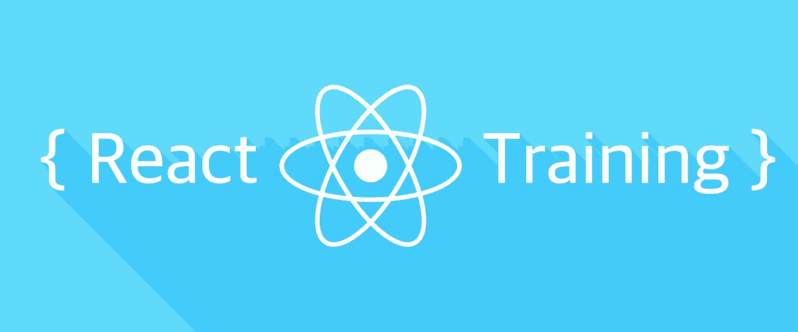
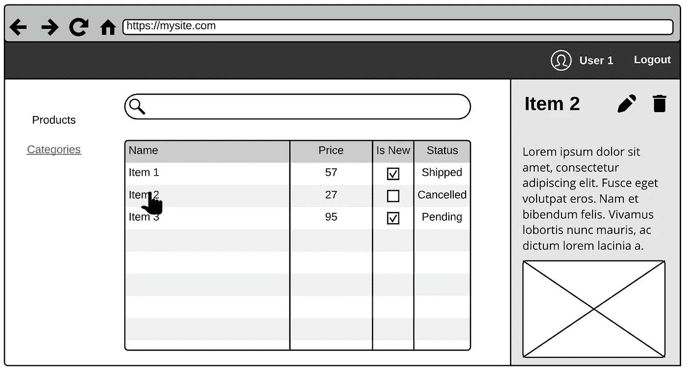
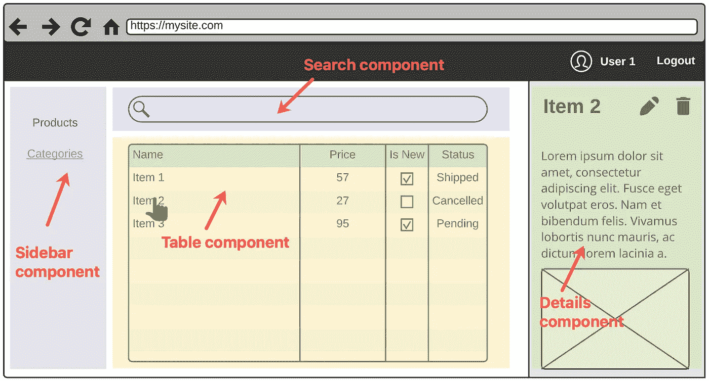
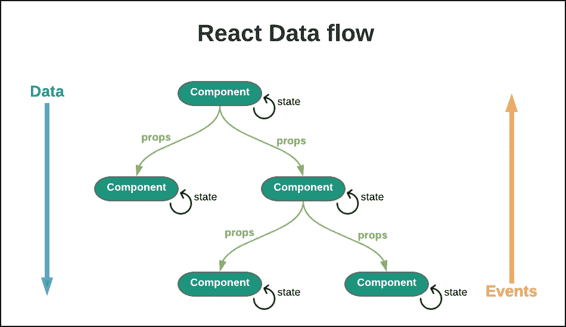
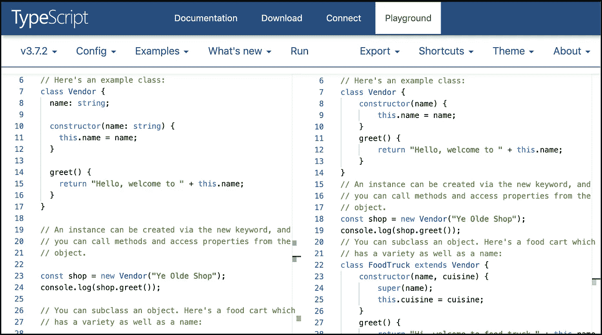
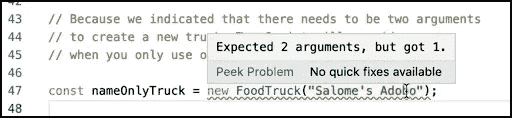
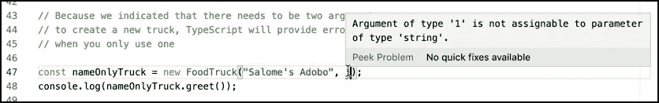

# ReactJS 培训:理解 React 和打字稿

> 原文：<https://javascript.plainenglish.io/reactjs-training-understanding-react-and-typescript-d01deb2dd127?source=collection_archive---------5----------------------->



> 如果你想知道西班牙语的版本，请点击[进入](https://medium.com/@nanovazquez/reactjs-training-entendiendo-react-y-typescript-5daf1fee26c7)。

在这个练习中，我们将介绍两个我们将用来开发 web 应用程序的核心库: [React](https://reactjs.org/) 和 [TypeScript](https://www.typescriptlang.org/) 。为此，我们将通过小而具体的例子来帮助我们理解主要概念，一次一个。

但是在开始编码之前，我们需要明白我们要做什么。想想你见过的最常见的用户界面(UI)布局，问问自己:

1.  如果我必须做这个，我应该从哪里开始？我必须一个人做所有的事情吗？有什么我可以利用的吗？
2.  我如何将工作分成不同的任务？最重要的有哪些？
3.  有可能在其他或未来的项目中重复使用我将要做的事情吗？



A typical back-office web application, displaying Products and their details

在接下来的几节中，我们将共同努力给出这些问题的答案。

# 简介:基于网络的开发

在开始编码之前，让我们快速回顾一下 web 开发的基本概念。

> 如果您熟悉这些概念，请跳过这一部分，直接跳到第 1 部分。

*   基本上，Web 应用程序是可以由(web)浏览器(Chrome、Firefox、Edge、Safari、Internet Explorer 等)执行的应用程序。).
*   网络浏览器只懂 HTML，JavaScript，CSS。
*   HTML 提供了网站的基本结构，也就是它的标记。
*   CSS 用于控制表示、格式和布局，也称为样式。
*   JavaScript 用于动态改变不同 HTML 元素和 CSS 样式的行为。通常取决于用户交互(例如，点击按钮、手指轻击或者甚至语音)。

例如，当你因为想搜索某样东西而导航到谷歌网站时，你正在使用一个网络应用程序！


When searching about React in Google we are using a web application

在这种情况下:

1.  页面的结构是用 HTML 定义的(显示为结果的文本，右边部分，等等。).
2.  网站的结构是如何使用 CSS 配置的(字体的颜色，结果项的设计以及它们是如何显示的，等等。).
3.  用户交互由 JavaScript 代码控制。例如，当某人键入一个问题并按下回车键时会发生什么是用代码配置的。

随着时间的推移，我们可以在任何 web 应用程序中做的事情的数量和复杂性都在增加。幸运的是，我们现在可以(重新)使用 JavaScript 库来避免重新发明轮子并减少重复工作。React 和 TypeScript 就是其中的一些库。

# 第一部分:ReactJS 是什么，它的用途是什么

> **注:**想了解 ReactJS 的更多信息，去它的官方[入门](https://reactjs.org/docs/getting-started.html)。

React 是一个用于构建用户界面的 JavaScript 库。React 最伟大的事情之一是它改变了你通常对创建应用程序的想法。它建议你按照[单一责任原则或 SRP](https://en.wikipedia.org/wiki/Single_responsibility_principle) 将逻辑分割成多个部分，命名为**组件**:每个部分(组件)应该只做一件事。

以我们之前的 UI 布局为例，我们可以将页面分成(例如)以下组件:

*   一个 *TableComponent* ，用来显示我们所有的实体。
*   *SearchComponent* ，过滤我们显示的实体。
*   *DetailsComponent* ，显示与所选实体相关的信息。
*   *SidebarPanelComponent* ，封装我们在左侧面板中呈现的内容的逻辑(链接和 *PROD* 按钮)。
*   …等等



A typical back-office web application, now split into different components

我们将布局分割成组件的方式完全是任意的，尽管现在看起来很难做到，但随着时间的推移会变得更容易。试错法最终会帮助我们决定在可重用性和维护方面什么是最好的答案。

> **注意:**我们可以继续将我们定义的组件分割成更小的组件，每个组件负责完成一项任务。例如，您能否建议如何将 TableComponent 组件分成更小的部分？

# 在行动中反应

React 是一个库，它通过将 UI 分解成组件来帮助我们构建 UI。让我们通过回顾 React 文档中的例子来共同理解这意味着什么:

打开**喂反应过来了！**点击[此处](https://codesandbox.io/s/hello-react-lbisk)举例。

```
import React from "react";
import ReactDOM from "react-dom";const App = () => <h1>Hello React!</h1>;
const rootElement = document.getElementById("root");
ReactDOM.render(<App />, rootElement);
```

花几分钟时间分析代码。注意，`*<App/>*`组件是一个*反应函数*，它只返回 *JSX 语法*。

> 什么是 JSX？ JSX 是 React 生态系统中呈现 HTML 元素的事实上的语法扩展。它不是 HTML，但语法非常相似。它可能会让您想起模板语言，但它也具有 JavaScript 的全部功能。如果你想更多地了解 JSX，请看这里的。

**浏览器不理解 JSX** 。为了让我们的代码在浏览器中工作，我们需要将我们的代码转换成浏览器能够理解的 JavaScript 代码。我们现在不需要担心这一点，但是您需要认识到，这段代码的最终结果是普通的旧 JavaScript:

```
var App = () => React.createElement("h1", null, "Hello React!")
var rootElement = document.getElementById("root");ReactDOM.render(React.createElement(App, null), rootElement);
```

我们现在将通过向`<App/>`组件提供定制呈现消息的能力来修改示例。为此:

用发送给组件的`message`参数替换硬编码的消息:

```
const App = ({ message }) => <h1>{message}</h1>;
```

初始化`App`组件时提供一个定制的`message`:

```
ReactDOM.render(<App message="Hello React!!" />, rootElement);
```

*React 函数*可以通过 **props** (简称 *properties* )接收任意的只读输入。这些**道具**模拟了函数返回的内容。例如，在我们前面的例子中，我们在浏览器中输出的消息依赖于`message`属性。

> **注意:**作为一个通用规则，所有的反应功能&组件必须作为相对于它们的道具的“纯功能”。这意味着它们在浏览器中返回(或呈现)的内容是由其输入值决定的，而不会改变接收到的参数/自变量(也称为“副作用”)。

让我们来看另一个例子。点击此处的[打开**反应定时器**示例。](https://codesandbox.io/s/react-timer-2y4k8)

```
class Timer extends React.Component {
  ...
}const App = () => <Timer />;
const rootElement = document.getElementById("root");
ReactDOM.render(App, rootElement);
```

注意，我们现在有两个文件:一个初始化应用程序的 *index.jsx* 文件和一个定义 React 组件的 *Timer.jsx* 文件。这一次，我们的 React 组件是一个从`React.Component`扩展而来的类，有一个`constructor()`和四个其他方法:

```
export default class Timer extends React.Component {

  constructor(props) { ... }

  tick() { ... }

  componentDidMount() { ... }

  componentWillUnmount() { ... } render() {
    return <div>Seconds: {this.state.seconds}</div>;
  }
}
```

React 允许您将组件定义为类或函数。当你从**伸出时做出反应。组件**，唯一的要求是定义一个 **render()** 方法，负责返回将在浏览器中显示的 JSX 元素。

此外，React 类组件提供了在特定时间执行的其他内置方法。你可以**将自己的代码与这些[生命周期方法](https://reactjs.org/docs/react-component.html#the-component-lifecycle)挂钩，只需实现它们。其中一些方法是`constructor()`、`componentWillMount()`、`componentWillUnmount()`，但还有其他的方法。**

> **注意:****render()**方法相当于我们在前面的例子中使用的 React 函数。

检查`componentDidMount()`和`componentWillUnmount()`中的代码。

```
export default class Timer extends React.Component {
  ... componentDidMount() {
    this.interval = setInterval(() => this.tick(), 1000);
  } componentWillUnmount() {
    clearInterval(this.interval);
  } ...
}
```

这段代码负责初始化、执行和清理定时器。通过使用这两个内置方法，React 保证在组件在 DOM 中呈现(“挂载”)和从 DOM 中移除(“卸载”)时执行您的代码。

> **注意:**如果您想了解更多关于状态和生命周期的信息，请点击查看[。](https://reactjs.org/docs/state-and-lifecycle.html)

最后，我们来回顾一下最后一种方法。自定义的`tick()`方法通过调用`this.setState()`来更新组件的状态:

```
export default class Timer extends React.Component {
  ... tick() {
    this.setState(prevState => (
      { seconds: prevState.seconds + 1 }
    ));
  } ...
}
```

每个 React 组件都可以将其本地状态存储在`this.state`中。**状态**类似于道具，但是是私有的，完全由组件控制。**不得直接修改状态**。相反，你应该总是使用`this.setState()`方法并返回一个新的状态。

> **注意:**您不应该直接改变状态的原因是，状态更新可能*潜在地*触发`*render()*`方法的新执行，重新绘制组件。如果您使用`*this.setState()*`，React 将为您进行这个调用，以及其他计算。

我们现在是本节的最后一个例子。点击[此处](https://codesandbox.io/s/react-questionnaire-4che1)打开**问卷**示例。

```
class Questionnaire extends React.PureComponent {
  ...
}const App = () => <Questionnaire />;
const rootElement = document.getElementById("root");
ReactDOM.render(<App />, rootElement);
```

花几分钟时间来分析所有涉及到的代码片段，以及它们每一个的职责。然后，玩复选框，看看结果。

打开 **Question.jsx** 和 **Answer.jsx** ，注意这些文件建模了一个 React 函数(或 React 函数组件),它们接收不同的属性并返回一个结果，通过 jsx 建模。

```
export default ({ question, value }) => (
  <p>
    <span>{`${question}: ${value}`}</span>
  </p>
);
```

打开**问卷. jsx** 文件。看看呈现组件的不同部分所使用的方法:问题和答案。注意我们如何使用`render()`方法编排所有的绘图逻辑。

```
export default class Questionnaire extends React.PureComponent {
  ...

  renderQuestions() {
    ...
  } renderAnswers() {
    ...
  } render() {
    return (
      <React.Fragment>
        {this.renderQuestions()}
        {this.renderAnswers()}
      </React.Fragment>
    );
  }
}
```

> **注意:** React Fragment 是一个内置组件，用于(逻辑上)分组一系列子节点，而无需向 DOM 添加额外的节点。如果你想了解更多，点击[这里](https://reactjs.org/docs/fragments.html)。

关注`renderQuestions()`方法并定位`onChange`支柱。请注意，我们向`onChange` prop 传递了一个`this.handleQuestionChanged()`方法，如果问题得到回答，该方法将更新 UI，并将值存储在(问卷调查)组件的状态中:

```
export default class Questionnaire extends React.PureComponent {
  ... renderQuestions() {
    ...

    return questions.map(question => (
      <Question
        key={question.id}
        id={question.id}
        text={question.text}
        checked={question.value}
        onChange={this.handleQuestionChanged}
      />
    ));
  } ...
}
```

请注意，我们处理用户交互的方式(通过*“events”*)与普通 JS 代码类似:

*   所有 JSX 元素都公开了一组事件(参见这里的所有支持的事件)。
*   我们可以通过给每个事件附加一个函数来与它挂钩。默认情况下，它将接收一个[合成事件](https://reactjs.org/docs/events.html)对象作为第一个参数，但是[您可以更改这个](https://reactjs.org/docs/handling-events.html#passing-arguments-to-event-handlers)。

## 包扎

通过回顾这些例子，我们了解到以下内容:

1.  在 React 中，我们通常用 **JSX** 来描述 UI 应该是什么样子。
2.  为了定制我们输出的内容，我们可以将 **props** 发送给我们的 React 函数或组件。
3.  React 提供了 **React。Component** 类来帮助将我们的代码封装在组件中。
4.  一个 **React 的 **render()** 方法的输出。组件**告诉浏览器我们想要画什么。
5.  每个 React 组件都有自己的**状态**来本地存储值。
6.  您可以通过将函数或类方法与 JSX 事件挂钩来捕捉用户交互。



[I](http://here)n React, data flows in one direction (top-down, from parent to child), and events flow from bottoms-up

> **注意:**您可以在 [React 文档](https://reactjs.org/docs/hello-world.html)中找到一组完整的示例，每一个都集中在一个单独的 React 概念上。

# 第 2 部分:TypeScript 添加了什么

[TypeScript](https://www.typescriptlang.org/) 是微软开发和维护的开源库，用于在 JavaScript 环境中实现大规模应用。它编译成普通的 JavaScript，可以在任何浏览器、Node.js 或任何支持 [ECMAScript](https://en.wikipedia.org/wiki/ECMAScript) 3(或更新版本)的 JavaScript 引擎上运行。

本质上，它是 JavaScript 的一个严格的语法超集，在开发时为语言**添加了可选的静态类型。**


TypeScript has great IDE support nowadays

使用该库的主要好处是:

*   它有静态检查和代码重构，以及一系列高效的开发工具和实践。
*   它允许您使用最新的特性和语法编写代码，而不用担心浏览器的支持(因为它会编译成普通的 JS)。
*   它不会强迫你使用 TypeScript:如果你愿意，你可以写 JavaScript。
*   微软和谷歌维护它。Angular 使用它。

# 运行中的 TypeScript

让我们用一个例子来看看 TypeScript 是如何工作的:

打开[打字稿游乐场](http://www.typescriptlang.org/play/)。这个运动场使用与 VSCode IDE 解释代码相同的工具。

在页面左侧的下拉菜单中，选择选项 [Hello world](http://www.typescriptlang.org/play/?target=1&e=178#example/hello-world) 。花点时间彻底阅读它的代码，理解 TypeScript 是什么和做什么。如果你愿意，继续阅读 *JavaScript Essentials* 部分的其他例子。

现在打开[类 101](http://www.typescriptlang.org/play/?e=155#example/classes-101) 的例子。让我们一起来回顾一下:



TypeScript Classes 101 example

*   在左边的面板中，有定义`Vendor`类的类型脚本代码和一个欢迎客户来商店的方法，通过它的名字来识别。
*   在右侧面板中，您可以看到通过将 TypeScript 代码传输到 ES2017 生成的 JavaScript 等价物。这是浏览器理解并能运行的代码。
*   类似地，左边有定义`FoodTruck`类的 TypeScript 代码，以及一个欢迎新客户端的方法。

将鼠标悬停在第 47 行的`FoodTruck`实例化上。请注意，IDE 显示了有关其构造函数的信息。



IDEs like VSCode provide IntelliSense for TypeScript code

添加第二个参数来实例化一个`FoodTruck`，比如`"asado"`。现在，通过右键单击页面打开浏览器的开发人员控制台(或开发人员工具)(但是在编辑器之外，比如在顶部的蓝色导航栏中)。然后，点击**运行**按钮。

嘿！我们的更改没有显示在控制台上，这不公平。要使其工作，要么在*行 48* 上添加`console.log(nameOnlyTruck.greet());`，要么用`nameOnlyTruck`实例替换*行 54* 。然后点击**再次运行**。

> **注意:**每个现代的网络浏览器都包括一套强大的开发工具，帮助开发人员理解浏览器解释的内容，并找到代码中可能存在的错误(HTML、JavaScript 或 CSS)。它还显示了一些指标，比如页面加载需要多长时间，以及浏览器发出的(和正在发出的)其他请求。如果你想深入了解这一点，点击[这里](https://developer.mozilla.org/en-US/docs/Learn/Common_questions/What_are_browser_developer_tools)。

最后，用数字`1`替换字符串`"asado"`。现在代码中有一个错误告诉你“数字不允许作为构造函数的参数”。请注意，这显示在 TypeScript 面板中，而不是 JavaScript 中(右侧面板)。



With IntelliSense, you can detect errors before running your code

通过将数字`1`替换为字符串值(如`"helado"`)来解决这个问题。

就是这样！

## 包扎

通过这个简单的例子，我们了解到:

*   TypeScript 代码可以转换成任何浏览器都可以执行的 JavaScript 代码。*你可以在这里* *找到它的手册* [*。*](https://www.typescriptlang.org/docs/handbook/basic-types.html)
*   TypeScript 允许您像在强类型语言中那样定义类型。*这里* *可以找到它的规格* [*。*](https://github.com/Microsoft/TypeScript/blob/master/doc/spec.md)
*   所有现代的 ide(vs code，WebStorm，Atom 等。)支持 TypeScript，可以提供提示和错误消息(IntelliSense)，以及静态分析(通过 [tslint](https://palantir.github.io/tslint/) )。

🎉

> *记住你可以在* [***这个 GitHub 资源库***](https://github.com/nanovazquez/reactjs-training) *里找到完整的训练。*