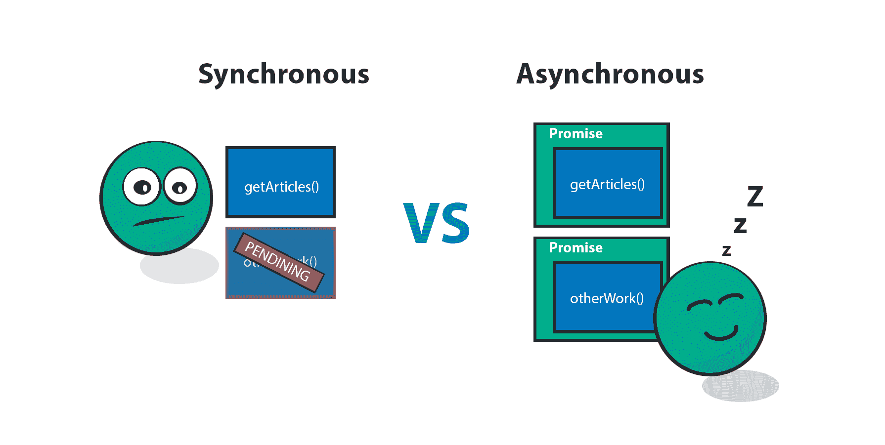

# 将文件作为数据流逐行读取

> 原文：<https://javascript.plainenglish.io/read-file-line-by-line-as-data-stream-deno-by-example-18fb340c9e1c?source=collection_archive---------6----------------------->

`Deno`提供多个 API 读取文件。您可以使用`Deno.readAll`和`Deno.readTextFile`读取整个文件。然而，逐行阅读在`std`库中仍然不可用。在本教程中，我将解释如何逐行(流)读取整个文件。


Google

在进入实际代码之前，让我们先通过例子了解一下标准库。

Deno 提供了`Deno.open` API 来打开文件。这是异步 API。意思，你需要`await`。作为回报，你会得到包含`rid`的`File`。

## 样本:打开文件 [#](https://deepakshrma.github.io/deno-by-example/advance_readline/#sample-open-file)

```
// examples/06_readfile_chunk.ts
async function main(name?: string) {
  if (name) {
    const file = await Deno.open(name);
    console.log(file);
  }
}
const [fileName] = Deno.args;
main(fileName);
```

## [运行]

```
$ deno  run --allow-read  examples/06_readfile_chunk.ts examples/tom.json## Output:
# File { rid: 3 }
```

可以看到`rid`作为回报。让我们使用这个`rid`来获取数据块。读取块需要 API `Deno.read`

```
// examples/06_readfile_chunk.ts
async function main(name?: string) {
  if (name) {
    const file = await Deno.open(name);
    const decoder = new TextDecoder();
    let buf = new Uint8Array(100);
    const numOfByteRead = await Deno.read(file?.rid, buf);
    console.log(numOfByteRead);
    console.log(decoder.decode(buf));
  }
}
const [fileName] = Deno.args;
main(fileName);
```

## **【运行】**

```
$ deno  run --allow-read  examples/06_readfile_chunk.ts examples/tom.json# Output
# 100
{
   "id": 1,
   "version": "1.0.1",
   "contributors": [
     "deepak",
     "gary"
   ],
   "actor": {
```

在这里，正如您所看到的，每次您调用`Deno.read`时，它都会返回已经读取的字节数。如果`numOfByteRead`是`null` ie。是文件**【EOF】**的结尾。

`new Uint8Array(100);`调用 read 时将填充 Uint8Array。缓冲区大小可以是任何值。读取器将读取字节，直到达到缓冲区大小。

如果您注意到，读取的文件不是一个完整的文件。您需要增加缓冲区大小来读取所有文件。

```
// examples/06_readfile_chunk.ts
async function main(name?: string) {
  if (name) {
    const file = await Deno.open(name);
    const decoder = new TextDecoder();
    let buf = new Uint8Array(1000); // 353
    const numOfByteRead = await Deno.read(file?.rid, buf);
    console.log(numOfByteRead);
    console.log(decoder.decode(buf));
  }
}
const [fileName] = Deno.args;
main(fileName);
```

## [运行]

```
$ deno  run --allow-read  examples/06_readfile_chunk.ts examples/tom.json# Output
# 353
## JSON here..
```

在这个例子中，我将缓冲区大小增加到了 1000，超过了 353。这样我就可以读取整个 JSON 文件。

**【注意】:**你应该避免大的缓冲区大小。读取大文件会产生内存问题。同时也很难预测实际的规模。

为了逐块读取整个文件，我们可以在`then` able API 上使用递归。

```
// examples/06_readfile_chunk.ts
async function main(name?: string) {
  if (name) {
    const file = await Deno.open(name);
    const decoder = new TextDecoder();
    let buf = new Uint8Array(100);
    let chunk = new Uint8Array(0);
    Deno.read(file?.rid, buf).then(function readByte(numOfByteRead) {
      if (numOfByteRead) {
        chunk = _append(chunk, buf, numOfByteRead);
        Deno.read(file?.rid, buf).then(readByte);
      } else {
        console.log(decoder.decode(chunk));
      }
    });
  }
}
const [fileName] = Deno.args;
main(fileName);
```

## [运行]

```
$ deno  run --allow-read  examples/06_readfile_chunk.ts examples/tom.json# Output
{
  "id": 1,
  "version": "1.0.1",
  "contributors": [
    "deepak",
    "gary"
  ],
  "actor": {
    "name": "Tom Cruise",
    "age": 56,
    "Born At": "Syracuse, NY",
    "Birthdate": "July 3 1962",
    "movies": [
      "Top Gun",
      "Mission: Impossible",
      "Oblivion"
    ],
    "photo": "[https://jsonformatter.org/img/tom-cruise.jpg](https://jsonformatter.org/img/tom-cruise.jpg)"
  }
}
```

## [故障]

在这段代码中，当我调用`Deno.read(file?.rid, buf).then`时。它将触发一个命名函数`function readByte(numOfByteRead)`。这将在每次内部检查`numOfByteRead`。您可以通过`decoder.decode`追加解码后返回的文本。我追加为 Uint8Array。对于命名的 Uint8Array 数组，我在`StackOverflow`上找到了一个很好的例子。

**[_ 追加】**

```
function _append(a: Uint8Array, b: Uint8Array, numOfByteRead:number) {
  var c = new Uint8Array(a.length + numOfByteRead);
  c.set(a, 0);
  c.set(b.slice(0, numOfByteRead), a.length);
  return c;
}
```

**【注意】:**如果没有通过`numOfByteRead`，可能会对上次读取的值进行垃圾处理。

尼斯（法国城市名）🙂，一切看起来都很好。然而，我们仍然没有逐行阅读。为此，我们将使用异步迭代器。



from: deadcoderising.com

## 异步迭代器的基本示例 [#](https://deepakshrma.github.io/deno-by-example/advance_readline/#basic-sample-for-async-iterator)

```
let range = {
  from: 1,
  to: 5,
  [Symbol.asyncIterator]() {
    return {
      current: this.from,
      last: this.to,
      async next() {
        const value = await new Promise<number>((resolve) =>
          setTimeout(() => {
            resolve(this.current++);
          }, 1000)
        );
        if (value <= this.last) {
          return { done: false, value };
        } else {
          return { done: true };
        }
      },
    };
  },
};
(async () => {
  for await (let value of range) {
    console.log(value); // 1,2,3,4,5
  }
})();
```

**【输出】:** `1，2，3，4，5 '

就像`Symbol.iterator`一样，我们可以使用`Symbol.asyncIterator`来创建一个异步迭代器。因为 typescript 支持现成的异步迭代器。我们可以使用这个 API。要了解更多，你可以阅读[异步迭代器生成器](https://javascript.info/async-iterators-generators)。

为了逐行读取，我创建了两个实用方法`_readTillDone`和`readLine`。

```
const _readTillDone = async (
  rid: number,
  text: string = ""
): Promise<[string, string, boolean]> => {
  let buf = new Uint8Array(100);
  let indexOfLine = text.indexOf("\n");
  if (indexOfLine === -1) {
    const num = await Deno.read(rid, buf);
    if (num) {
      text = text + decoder.decode(buf.slice(0, num));
      return _readTillDone(rid, text);
    } else {
      return [text, "", true];
    }
  } else {
    return [text.slice(0, indexOfLine), text.slice(indexOfLine + 1), false];
  }
};const readLine = async (fileName: string) => {
  const file = await Deno.open(fileName);
  let text = "";
  let done = false;
  return {
    [Symbol.asyncIterator]() {
      return {
        async next() {
          const [t, rest, d] = await _readTillDone(file?.rid, text);
          if (done) {
            return { done: true, value: t };
          } else {
            text = rest;
            done = d;
            return { done: false, value: t };
          }
        },
      };
    },
  };
};
```

## [故障]

`readLine`很简单。在每次异步迭代器调用时，它将调用`_readTillDone`并返回该行。但是，_readTillDone 有点复杂。我使用`file.rid`来跟踪文件的读取。

每当我用`file?.rid, text`打`_readTillDone`的时候。它试图用`newLine`分割文本。我找不到纽林。它试图读取更多的行，直到结束。`_readTillDone`返回三个参数`[t, rest, d]`。这里`t`，逐行读取的文本，`rest`作为缓冲文本，`d`作为完成返回。

***让我们完成教程。一旦我们有了这些实用程序，实现就非常简单了。***

## 示例-最终代码 [#](https://deepakshrma.github.io/deno-by-example/advance_readline/#example-final-code)

```
// examples/06_readfile_chunk.ts
import { readLine } from "[https://raw.githubusercontent.com/deepakshrma/deno-by-example/master/examples/file_reader.ts](https://raw.githubusercontent.com/deepakshrma/deno-by-example/master/examples/file_reader.ts)";async function main(name?: string) {
  if (name) {
    // Example 6
    const reader = await readLine(name);
    for await (let value of reader) {
      console.log(value);
    }
  }
}
const [fileName] = Deno.args;
main(fileName);
```

## [运行]

```
$ deno  run --allow-read  examples/06_readfile_chunk.ts examples/tom.json# Output
{
  "id": 1,
  "version": "1.0.1",
  "contributors": [
    "deepak",
    "gary"
  ],
  "actor": {
    "name": "Tom Cruise",
    "age": 56,
    "Born At": "Syracuse, NY",
    "Birthdate": "July 3 1962",
    "movies": [
      "Top Gun",
      "Mission: Impossible",
      "Oblivion"
    ],
    "photo": "[https://jsonformatter.org/img/tom-cruise.jpg](https://jsonformatter.org/img/tom-cruise.jpg)"
  }
}
```

TaDa！👏👏现在，您可以逐行读取整个文件。

希望你喜欢这个教程。请在评论中告诉我你的反馈。请支持(🙏🙏)通过订阅和鼓掌。

所有工作实例都可以在我的 Github 中找到:[https://Github . com/deepakshrma/deno-by-example/tree/master/examples](https://github.com/deepakshrma/deno-by-example/tree/master/examples)

*原载于*[*https://deepakshrma . github . io*](https://deepakshrma.github.io/deno-by-example/advance_readline)*。*

# 用简单英语写的便条

你知道我们有四份出版物和一个 YouTube 频道吗？你可以在我们的主页[**plain English . io**](https://plainenglish.io/)找到所有这些内容——关注我们的出版物并 [**订阅我们的 YouTube 频道**](https://www.youtube.com/channel/UCtipWUghju290NWcn8jhyAw) **来表达你的爱吧！**