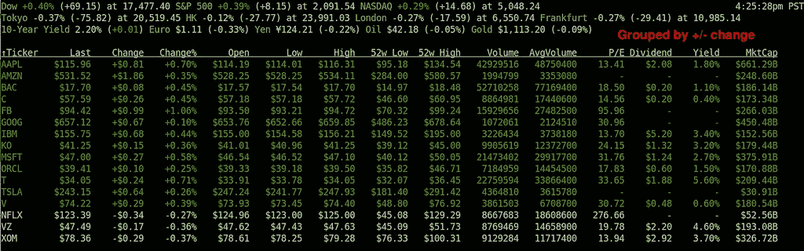
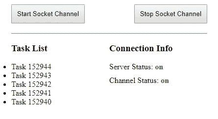

# 具有 redux-saga 事件通道和套接字的实时数据。超正析象管(Image Orthicon)

> 原文：<https://javascript.plainenglish.io/real-time-data-with-redux-saga-event-channels-and-socket-io-ad6e64dbefd9?source=collection_archive---------2----------------------->



# 介绍

有一堆关于在 react/redux 应用中处理实时数据的教程。他们通常展示如何制作一个简单的聊天应用程序，缺乏商业应用程序所需的实时数据管理的生产就绪功能。

大多数业务应用程序使用 socket 接收实时数据，而上游请求通过标准 REST API 进行，因此您将在下面看到的代码中没有`send`选项。但是一旦你理解了它是如何工作的，你就可以很容易地添加这个功能。

如今，实时数据应用有两种主要选择:

1.现成的 Google firebase 数据库

2.基于 socket.io 库的自定义后端

你可以很快开始使用 firebase，但是你的定制选项会受到限制。有了第二个选择，你可以做得更多。

如果你更倾向于第二种选择，请继续读下去。

# 基础

您在实时数据方面的主要挑战很可能是这样的:

1.您的 React/Redux 应用程序在架构上可能看起来很完美，但是一旦您尝试合并实时数据，它就可能开始崩溃

2.在经典的 REST API 中，如果一个服务器宕机，你会得到一个 500 错误，并向你的用户显示一条友好的消息。使用实时 API，您可能收不到任何东西，要么是因为服务器停机，要么是因为您没有任何新数据。因此，连接监控变得更加复杂和重要。

幸运的是，我们有 redux-saga 及其被称为`eventChannels` 的酷功能，以及`forks`、`delays`、`race` 和其他功能，它们共同帮助我们构建强大的实时数据应用。

如果你只是想看一个工作示例，可以直接跳到源代码[https://github.com/slava-lu/saga-socket-example](https://github.com/slava-lu/saga-socket-example)

否则，请阅读下面的解释，示例应用程序是做什么的。你必须知道 redux 和 redux-saga 的基础知识。

redux-saga 中有一个`take`函数，通常用来监听 redux 动作，并根据动作类型做一些事情。但是这个`take`功能也可以用来监听所谓的频道。

`**const** payload = **yield** take(channel);`

通道是用另一个带有标准签名的函数构造的，您只需从 redux-saga 文档(或我的例子)中获取该签名即可。这个签名使用了`eventChannel` redux-saga 函数来完成这个任务。

```
**const** createSocketChannel = socket => eventChannel((emit) => {
 **const** handler = (data) => {
 emit(data);
 };
 socket.on(**‘newTask’**, handler);
 **return** () => {
 socket.off(**‘newTask’**, handler);
 };
 }); 
```

因为您希望仅在成功连接到服务器时才创建套接字通道，所以您需要将`socket.on`事件监听器包装到承诺中，因为 redux-saga 使用承诺而不是回调。

综上所述，您的代码可能如下所示。

```
 **const** socketServerURL = **‘http://localhost:3000'**;
 **let** socket;

 *// wrapping function for socket.on* **const** connect = () => {
 socket = io(socketServerURL);
 **return new** Promise((resolve) => {
 socket.on(**‘connect’**, () => {
 resolve(socket);
 });
 });
 };

 *// This is how a channel is created* **const** createSocketChannel = socket => eventChannel((emit) => {
 **const** handler = (data) => {
 emit(data);
 };
 socket.on(**‘newTask’**, handler);
 **return** () => {
 socket.off(**‘newTask’**, handler);
 };
 });

 *// saga that listens to the socket and puts the new data into the reducer* **const** listenServerSaga = **function*** () {

 *// connect to the server* **const** socket = **yield** call(connect);

 *// then create a socket channel* **const** socketChannel = **yield** call(createSocketChannel, socket);

 *// then put the new data into the reducer* **while** (**true**) {
 **const** payload = **yield** take(socketChannel);
 **yield** put({type: ADD_TASK, payload});
 }
 };
```

我们可以在这里停止，因为除了基本的 react/redux/saga 设置之外，您只需要从您的 socket 服务器获取实时数据。

但是…

# 投入生产

但是，要将其投入生产，您还需要做更多的工作:

1.侦听断开连接和重新连接事件

2.通过单击按钮或在组件生命周期功能中打开和关闭通道

3.等待连接超时，以了解服务器是启动还是关闭(没有 500 错误)

4.确保服务器再次启动时，您的 saga 将自动接收数据

5.将所有这些连接信息放入 reducer 进行进一步处理

要把这一切联系起来，你需要足够好地理解 redux-saga。至少你要知道`call` 和`fork`、`all` 和`race`、`take` 和`takeEvery`的区别，还要明白如何取消任务。

所以，如果你想掌握 redux-saga 和实时数据管理，打开 redux-saga 文档和我的示例应用程序，成为一名 redux-saga 忍者:)

你可以在这里找到完整的代码[https://github.com/slava-lu/saga-socket-example](https://github.com/slava-lu/saga-socket-example)

要使用此示例应用程序，您需要:

1.在客户机和服务器文件夹中运行`yarn` 来安装 node_modules

2.通过运行服务器文件夹中的`node ./index.js`打开套接字服务器

3.通过运行客户端文件夹中的`yarn start`启动客户端应用程序，并将浏览器指向 [http://localhost:8080](http://localhost:8080)

如果你做的一切都正确，你应该看到这个屏幕

