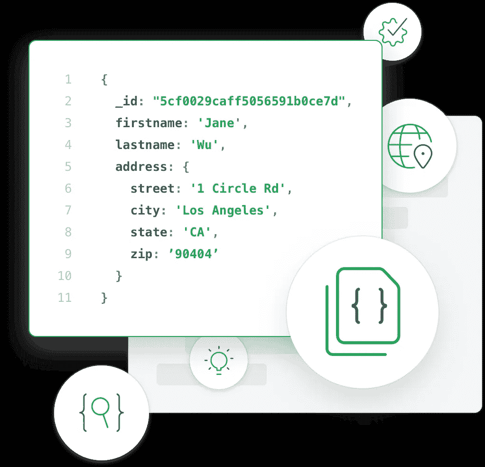
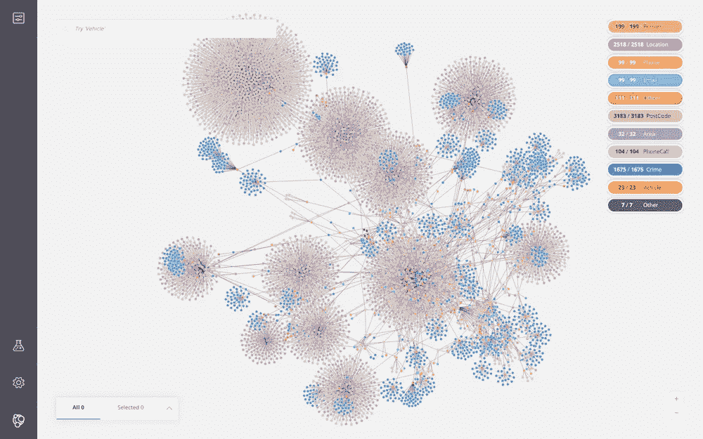
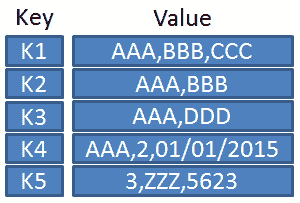

# 概述您必须了解的所有现有数据库类型

> 原文：<https://javascript.plainenglish.io/recap-of-all-existing-database-types-you-must-know-about-d5ae36c013d7?source=collection_archive---------5----------------------->

## 不， *SQL* 和 *NoSQL* 是不够的

很久以前，我写过一篇文章，讨论了 *SQL* 和 *NoSQL* 数据库之间的区别。当时还挺成功的。当时，我想我展示了一个数据库类型的综合列表。

我大错特错了。

首先，你听说过术语[多语言持久性](https://en.wikipedia.org/wiki/Polyglot_persistence)吗？

> ***“多语言持久性是指使用不同类型的存储技术，以满足应用程序内部的持久性需求”。***

我给你举个例子。假设你正在编写一个像脸书或 Instagram 这样的社交媒体应用。你使用一个 SQL 数据库来更好地记忆人与人之间的关系。他们关注谁，关注什么标签。

当然，在这个应用程序中，您希望存储有关用户会话的数据。让我们使用类似于 [*Redis*](https://redislabs.com/lp/the-best-redis-experience-for-your-most-important-applications/?utm_source=google&utm_medium=cpc&utm_term=redis&utm_content=ent-pro-v3&utm_campaign=search-brand-emea&gclid=EAIaIQobChMI_buynvux6QIVkuR3Ch00bwY4EAAYASAAEgJyNPD_BwE) *的键值存储来实现这一点。这将提供低延迟和高性能。*

如果您想对*大数据*进行分析以进行用户分析，该怎么办？你应该使用一个 w *ide-column* DB 来做这件事。

现在你的用户增加了，你想给他们提供更好的服务。你知道他们需要什么。这是一个推荐系统。让我们使用一个*图形数据库*来满足这个需求。

最后，让我们帮助他们找到他们的朋友。让我们像使用[*elastic search*](https://www.elastic.co/)一样使用一个*面向文档的* DB 来查找素材。

看，有这么多不同的数据库技术。做事情的方法太多了。就像刚才举的例子一样，有很多方法可以把东西组合在一起。拥有这样一个多语言系统可以弥补一些时间管理上的不足。这需要维护、测试和监控我们应用程序世界中的所有生态系统。

有什么更简单的方法吗？答案是肯定的。我在文章的最后揭示了这一点。首先，我想帮助你摆脱我们刚刚创造的知识重量。

让我们进一步了解不同的数据库技术。

## 面向文档的数据库

面向文档的数据库是 NoSQL 数据库的主要类型。它将数据存储在独立的文档中，这些文档通常是半结构化的或者类似于 JSON 的格式。

这些类型的数据库对于敏捷软件开发非常有用。而且适用于需求不断变化的应用程序。

所以如果你正在处理半结构化数据，或者需要一个非常灵活的结构。可能会随着时间的推移而改变，尤其是在开始一个项目时。这些类型的数据库也为[水平可伸缩性](https://stackoverflow.com/questions/11707879/difference-between-scaling-horizontally-and-vertically-for-databases)提供了巨大的可能性。以及对数据库的快速*读/写*操作。

属于这一类的流行 DB 有*[*MongoDB*](https://www.mongodb.com/cloud/atlas/lp/try2?utm_source=google&utm_campaign=gs_emea_italy_search_brand_atlas_desktop&utm_term=mongodb&utm_medium=cpc_paid_search&utm_ad=e&gclid=EAIaIQobChMI4NKG6_ux6QIVV-h3Ch2TCQdvEAAYASAAEgJTQfD_BwE)*，*[*couch DB*](https://www.datadoghq.com/dg/monitor/couchdb/?utm_source=Advertisement&utm_medium=GoogleAdsNon1stTier&utm_campaign=GoogleAdsNon1stTier-CouchDB&utm_content=Infra&utm_keyword=%2Bcouchdb&utm_matchtype=b&gclid=EAIaIQobChMIyIfo6_ux6QIVB813Ch3RXAySEAAYASAAEgLi3vD_BwE)*，*[*Google Cloud Datastore*](https://cloud.google.com/datastore)*。**

*这些系统的典型用途是*

*   ***库存管理***
*   ***体育直播应用***
*   ***管理用户评论***
*   ***基于网络的多人游戏***

***案例研究** : [使用 MongoDB 进行比特币基地缩放](https://www.mongodb.com/customers/coinbase)*

## *图形数据库*

*图形数据库也属于 NoSQL 家族。它们以*节点/顶点*的形式存储数据，加上我们所说的*边*形成关系。*

*每个节点对应一个实体，边代表它们之间的关系。*

**

*这些数据库特别好有两个主要原因*

*   ***当你需要可视化的时候**:图表是显示清晰数据的最常见方式之一，对吗？让我们把这个系统也用于数据库。*
*   ***低延迟**:就关系而言，图形数据库比 SQL 数据库更快。因为它们不是在查询时计算的。正如在 *SQL* 持久性系统中发生的连接一样。这些关系以边的形式存储，然后被提取。*

*这方面的一个理想应用示例可能是地图应用程序。城市是节点，它们之间的连接是边。只获取边缘，并找出它们是如何连接的。*

*此外，这些类型的数据库非常适合构建基于人工智能的应用程序、基因数据或推荐引擎。*

*最常见的图系是 [Neo4j](https://neo4j.com/sandbox/?program_name=PPC%20GG%2020%20Neo4j%20Sandbox&utm_source=google&utm_medium=cpc&utm_campaign=eu-search-branded&utm_adgroup=neo4j-general&gclid=EAIaIQobChMIssKtlfyx6QIVQcayCh2t3A4nEAAYASAAEgJ81vD_BwE) 。*

***案例分析**:[*NASA 如何利用 Neo4j*](https://www.zdnet.com/article/neo4j-and-nasa-where-graph-databases-technology-really-is-rocket-science/) *从错误中吸取教训。**

## *键值数据库*

*还在 *NoSQL* 家族这里。它们的存在非常简单。只有一个*键-值*对。用于最小延迟操作。密钥用作标识符，并有一个与之相关联的值。该值可以是简单的字符串，也可以是复杂的对象。*

*属于这一类的流行 DB 有 [*Redis*](https://redislabs.com/lp/the-best-redis-experience-for-your-most-important-applications/?utm_source=google&utm_medium=cpc&utm_term=redis&utm_content=ent-pro-v1&utm_campaign=search-brand-emea&gclid=EAIaIQobChMIkJjzwf2x6QIVEB0YCh1JsQAGEAAYASAAEgI_6fD_BwE) *，*[*Memcached*](https://memcached.org/)*，*[*hazel cast*](https://hazelcast.com/)*，* [*Riak*](https://riak.com/) 。*

**

*当您需要以非常低的延迟和最少的后端处理来获取数据时，请使用这种类型的持久性系统。*

*理想的情况是*

*   ***缓存***
*   ***存储用户状态***
*   ***存储用户会话***
*   ***实时数据管理***
*   ***队列***

***案例分析** : [*微软和 Redis 对于流量尖峰的处理。*](http://lp.redislabs.com/rs/915-NFD-128/images/CaseStudy-Microsoftv2.pdf)*

## *时间序列数据库*

*针对跟踪和保存时序数据进行了优化。对于这个术语，我指的是在事件发生时收集的与时间相关的数据。数据被跟踪、监控，然后根据特定的业务逻辑进行汇总。*

*通常，这种类型的数据来自自动驾驶汽车、传感器、实时金融应用程序。*

*所以，你可以猜到，收集这些数据的主要目的是为了进行分析。这对某些行业至关重要。来预测系统行为，并据此工作。*

*您需要实时连续地存储数据吗？去找一个*时间序列* DB。你可以查看最流行的如 [*潮人数据库*](https://www.influxdata.com/) 或 [*时标数据库*](https://www.timescale.com/) 。*

***案例研究:** [Oracle 使用 Influx 创建分析。](https://www.influxdata.com/customer/oracle/)*

## *宽列数据库*

*主要用于存储和处理大量数据。或者，如果你喜欢，大数据。高性能和可伸缩性是这些系统的主要优点。它们将数据存储在具有动态列数的记录中，有时也有数十亿列。*

**

*这些持久性系统的例子有[*Cassandra*](https://cassandra.apache.org/)*，*[*h base*](https://hbase.apache.org/)*，*[*Google BigTable*](https://www.datadoghq.com/dg/monitor/bigtable/?utm_source=Advertisement&utm_medium=GoogleAdsNon1stTier&utm_campaign=GoogleAdsNon1stTier-Bigtable&utm_content=Infra&utm_keyword=google%20bigtable&utm_matchtype=p&gclid=EAIaIQobChMIsP7a0Pyx6QIVCk8YCh2g-glLEAAYASAAEgJpwvD_BwE)。*

***案例分析:** [*网飞为什么要用卡珊德拉做串流。*](https://www.jcount.com/7-reasons-netflix-uses-cassandra-databases/)*

## *我可以用一个数据库来管理吗？*

*答案是肯定的。实际上，随着存储数据技术的进步，已经产生了特殊类型的数据库。这些被称为多模型持久性系统。他们能够让你在一个平台上使用不同的数据模型。图形数据库结合面向文档为例。用流行的 [*ArangoDb*](https://www.arangodb.com/) *，*[*CosmosDb*](https://docs.microsoft.com/en-us/azure/cosmos-db/introduction)*，或者*[*couch base*](https://www.couchbase.com/downloads/start-today?family=couchbase-server&utm_source=google&utm_medium=search&utm_campaign=GGL+-+EMEA+Tier+2+-+Italy+-+Desktop+-+Brand+-+Exact&utm_keyword=couchbase&kpid=go_cmp-10061360559_adg-101991526940_ad-435273185735_kwd-302141009278_dev-c_ext-_prd-&gclid=EAIaIQobChMItYbW6fyx6QIVEYGyCh3HFgs8EAAYASAAEgIsAPD_BwE)查看更多关于他们的内容。*

## *结论*

*希望这篇文章在写作时已经达到了它的主要目标。告知，告知读者，展示你可以在你的项目中应用的各种类型的持久性。受益于性能和能力。*

*— *皮耶罗**

## ***资源***

*   *来自[图标 8](https://icons8.com) 的图标*
*   *[多语言持久性](https://en.wikipedia.org/wiki/Polyglot_persistence)*
*   *[*Redis*](https://redislabs.com/lp/the-best-redis-experience-for-your-most-important-applications/?utm_source=google&utm_medium=cpc&utm_term=redis&utm_content=ent-pro-v3&utm_campaign=search-brand-emea&gclid=EAIaIQobChMI_buynvux6QIVkuR3Ch00bwY4EAAYASAAEgJyNPD_BwE)*
*   *[*弹力搜索*](https://www.elastic.co/)*
*   *[水平可扩展性](https://stackoverflow.com/questions/11707879/difference-between-scaling-horizontally-and-vertically-for-databases)*
*   *[*MongoDB*](https://www.mongodb.com/cloud/atlas/lp/try2?utm_source=google&utm_campaign=gs_emea_italy_search_brand_atlas_desktop&utm_term=mongodb&utm_medium=cpc_paid_search&utm_ad=e&gclid=EAIaIQobChMI4NKG6_ux6QIVV-h3Ch2TCQdvEAAYASAAEgJTQfD_BwE) *，* [*CouchDB*](https://www.datadoghq.com/dg/monitor/couchdb/?utm_source=Advertisement&utm_medium=GoogleAdsNon1stTier&utm_campaign=GoogleAdsNon1stTier-CouchDB&utm_content=Infra&utm_keyword=%2Bcouchdb&utm_matchtype=b&gclid=EAIaIQobChMIyIfo6_ux6QIVB813Ch3RXAySEAAYASAAEgLi3vD_BwE) *，*[*Google Cloud Datastore*](https://cloud.google.com/datastore)*
*   *[使用 MongoDB 进行比特币基地缩放](https://www.mongodb.com/customers/coinbase)*
*   *[Neo4j](https://neo4j.com/sandbox/?program_name=PPC%20GG%2020%20Neo4j%20Sandbox&utm_source=google&utm_medium=cpc&utm_campaign=eu-search-branded&utm_adgroup=neo4j-general&gclid=EAIaIQobChMIssKtlfyx6QIVQcayCh2t3A4nEAAYASAAEgJ81vD_BwE)*
*   *[*NASA 如何利用 Neo4j*](https://www.zdnet.com/article/neo4j-and-nasa-where-graph-databases-technology-really-is-rocket-science/) 吸取教训*
*   *[*Redis*](https://redislabs.com/lp/the-best-redis-experience-for-your-most-important-applications/?utm_source=google&utm_medium=cpc&utm_term=redis&utm_content=ent-pro-v1&utm_campaign=search-brand-emea&gclid=EAIaIQobChMIkJjzwf2x6QIVEB0YCh1JsQAGEAAYASAAEgI_6fD_BwE)*[*Memcached*](https://memcached.org/)*[*hazel cast*](https://hazelcast.com/)*[*Riak*](https://riak.com/)****
*   **[*处理流量尖峰的微软和 Redis。*](http://lp.redislabs.com/rs/915-NFD-128/images/CaseStudy-Microsoftv2.pdf)**
*   **[*流入量 DB*](https://www.influxdata.com/) 或 [*时标 DB*](https://www.timescale.com/)**
*   **[*Cassandra*](https://cassandra.apache.org/) *，* [*Hbase*](https://hbase.apache.org/) *，*[*Google BigTable*](https://www.datadoghq.com/dg/monitor/bigtable/?utm_source=Advertisement&utm_medium=GoogleAdsNon1stTier&utm_campaign=GoogleAdsNon1stTier-Bigtable&utm_content=Infra&utm_keyword=google%20bigtable&utm_matchtype=p&gclid=EAIaIQobChMIsP7a0Pyx6QIVCk8YCh2g-glLEAAYASAAEgJpwvD_BwE)**
*   **[Oracle 使用 Influx 创建分析。](https://www.influxdata.com/customer/oracle/)**
*   **[*为什么网飞要用卡珊德拉来串流*](https://www.jcount.com/7-reasons-netflix-uses-cassandra-databases/)**
*   **[*arango db*](https://www.arangodb.com/)*，*[*cosmos db*](https://docs.microsoft.com/en-us/azure/cosmos-db/introduction)*，或者*[*couch base*](https://www.couchbase.com/downloads/start-today?family=couchbase-server&utm_source=google&utm_medium=search&utm_campaign=GGL+-+EMEA+Tier+2+-+Italy+-+Desktop+-+Brand+-+Exact&utm_keyword=couchbase&kpid=go_cmp-10061360559_adg-101991526940_ad-435273185735_kwd-302141009278_dev-c_ext-_prd-&gclid=EAIaIQobChMItYbW6fyx6QIVEYGyCh3HFgs8EAAYASAAEgIsAPD_BwE)。**

## ****简明英语团队的笔记****

**你知道我们有四份出版物和一个 YouTube 频道吗？你可以在我们的主页[**plain English . io**](https://plainenglish.io/)找到所有这些——关注我们的出版物并 [**订阅我们的 YouTube 频道**](https://www.youtube.com/channel/UCtipWUghju290NWcn8jhyAw) **来表达你的爱吧！****