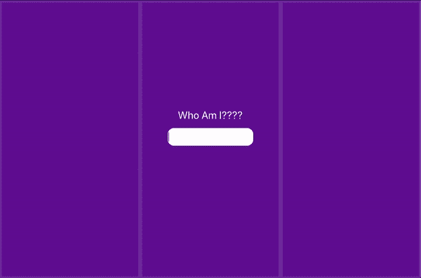

# 反冲. js &简单全局状态

> 原文：<https://javascript.plainenglish.io/recoil-js-simple-global-state-d84100b3d535?source=collection_archive---------4----------------------->


在其最简单的实现中，反冲允许您在 React 应用程序中保存全局状态，然后从任何组件使用或更新它。

反冲之所以大放异彩，是因为它使用起来非常简单，而且启动和运行它只需要很少的代码。反冲消除了传递道具的长路径，并且与 Redux 等其他全局状态库不同，设置时几乎没有学习曲线或样板代码。

今天，我们将建立一个应用程序，演示如何简单的反冲设置和使用。

*本指南假设您的计算机上安装了 Node ≥8.10 和 NPM ≥ 5.6，并且您可以轻松使用 React。使用 React 钩子的经验将使这变得更加容易。*

# 基本反冲功能和挂钩:

在构建我们的示例应用程序之前，我们应该熟悉一些函数和钩子。`Atom`、`useRecoilState()`、`useRecoilValue()`和`selector`。

## **原子**

一个`atom`代表一个单一的状态，可以从任何组件读取或写入。每当 atom 更新时，订阅它的所有组件都会更新。当创建一个原子时，给它一个惟一的键(在所有原子和选择器中都是惟一的)和一个默认值(通常是一个空字符串或对象)。

```
const dataAtom = atom({
   key: 'dataAtom',
   default: '',
});
```

## **useRecoilState()**

当需要读写 atom 时，导入并使用这个钩子。把你的 atom 传给`useRecoilState()`。在我们的重构任务中，我们将分配一个变量用于调用我们的状态，一个用于更新它。

`const [data, setData] = useRecoilState(dataAtom)`

## **useRecoilValue()**

当你需要读取一个原子的值而不是写入它的时候，使用这个钩子。

`const myData = useRecoilValue(dataAtom);`

## **选择器**

一个`selector`代表一段派生状态。基本上，它允许你调用一个原子，转换状态，并返回它。请注意，您不是在选择器中更新状态。

```
const cowboyHatTip = selector ({
    key: 'cowboyHatTip', // unique
    get: ({get}) => {
        const data = get(myData);
        return data + " pardner"
    }
})// assuming you are holding "howdy" in your myData state, 
// cowboyHatTip will return
// "howdy pardner" 
```

# 我们来树立一个榜样吧！

*查看* [*Github 资源库*](https://github.com/Josh-Gotro/Recoil_Tutorial) *以查看完整的演示，或者跟随并构建您自己的版本。*

在你的终端上，创建一个 React 应用程序，随便你给它起什么名字(我的名字叫反冲骨架)。

```
npx create-react-app recoil-skeleton
```

安装反冲。(如果使用纱线，用`yarn`替换`npm`)

```
npm install recoil
```

`cd`放入您新创建的应用文件夹，并在您喜欢的文本编辑器中打开它。

从您的终端运行`npm start`,这样您就可以在浏览器中实时看到您的更改。

清除掉大部分的`App.js`，从`import logo from './logo.svg';`和我们`return()`里面的所有东西开始。您剩下的应该是这样的:

Note, this won’t compile just yet!

使用反冲状态的组件需要`<RecoilRoot></RecoilRoot>`在父树的某个地方，在这种情况下，我们将在`App.js`左右添加它。我们现在也可以创建一些组件并添加它们。

现在让我们导入反冲工具并开始使用它们。

导入`RecoilRoot`、`atom`、`useRecoilState`、`useRecoilValue`和`selector`。

创建一个`atom`。我们给它一个键`textState`，给它一个空字符串作为默认值。

创建一个组件(`whoAmI`)，并设置我们的`useRecoilState()`，这样我们就可以调用并更新我们刚刚创建的 atom。

如果你熟悉 React 钩子，这个语法应该看起来很熟悉:)

我们在我们的`WhoAmI`组件中创建了一个`<input>`，它将我们的当前状态显示为值(`text`)。请记住，我们将`text`指定为变量，它代表了`textState`原子的当前状态。

`text`当前状态为空字符串。我们希望它将状态设置为当前用户输入的状态，所以让我们设置一个简单的`onChange`事件监听器来为我们处理这个问题。我们的`onChange`监听器会将任何输入更改发送到我们的`onChange`函数，该函数使用`setText()`来更新我们的状态。

## 我们有国家！

伸展你的腿，微笑，也许听一些肯尼·罗杰斯来庆祝你的成功。休息之后，我们将在一些兄弟组件中调用这个新创建的状态。

现在，我们将从编写状态的组件以及两个兄弟组件中调用我们的状态。在每个兄弟组件中，我们将使用一个`selector`来转换数据并显示它。

首先，我们接受用户输入，并以大写形式返回。

在第二个例子中，我们将拆分输入，颠倒它的顺序，然后重新组合它。

现在我们可以构建我们的兄弟组件并调用选择器。我们使用`useRecoilValue()`是因为我们在调用我们的状态，而不是改变它。

就是这样！看到下面的 gif 看到你所有的努力都有了回报！



我添加了一些 HTML/CSS 来将兄弟姐妹分隔到他们自己的列中，并添加了一些颜色。

# 最终注释:

## ***效果挂钩***

反冲是可能的，因为反作用钩。钩子让我们更喜欢功能组件而不是类。如果这是你第一次尝试 class-lite 或 classless 应用程序，那么你会想要熟悉钩子，特别是 reactions ' Effect Hook。`useEffect()`代替`componendDidMount()`、`componentDidUpdate()`、`componentWillUnmount()`。

权衡是一个净赢，但效果挂钩需要一些注意，特别是在编写清理方法以防止内存泄漏时。这些[文档](https://reactjs.org/docs/hooks-effect.html)很容易理解，值得一读。

## ***重构重构重构***

在这个演示中，我们的逻辑 and 都是用 **App.js** 写的。虽然这个*起作用*，但是对于一个管理更多状态的更大的应用程序，你可能想要保持一个或多个单独的文件来保存这些文件，以防止混乱并便于访问！

在这里找到本教程的 GitHub 库，在这里查看反冲. js 文档[。请随时在 joshuagauthreaux@gmail.com 联系我，或者通过我的网站联系 joshgotro.com。](https://recoiljs.org/docs/introduction/getting-started)

***感谢您的宝贵时间，保重！***