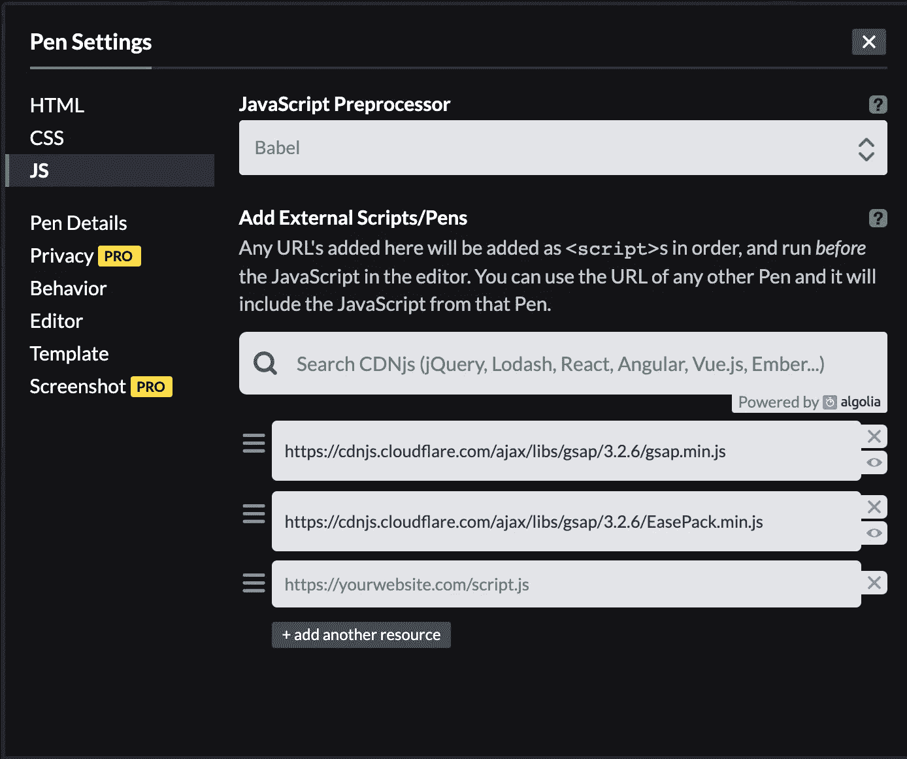
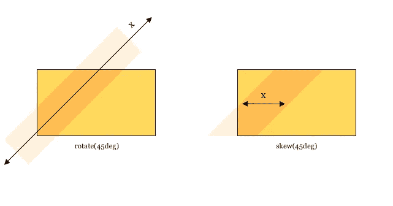
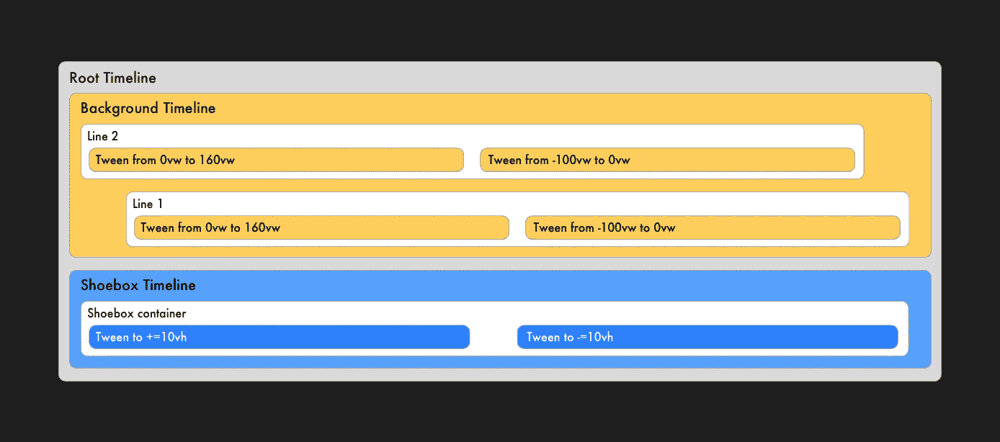
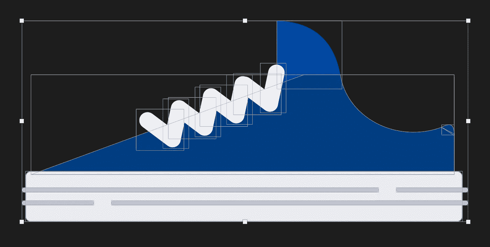
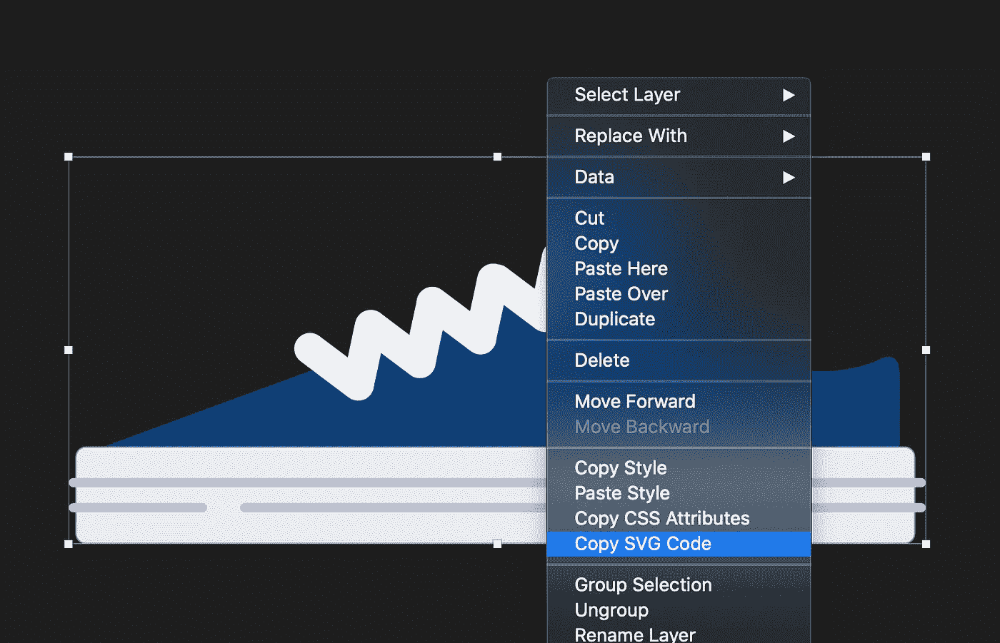

# 用格林索克的 GSAP 在 Codepen 上重新创建一个滴水不漏的动画

> 原文：<https://javascript.plainenglish.io/recreate-a-dribbble-animation-on-codepen-with-greensocks-gsap-d08874206ed0?source=collection_archive---------6----------------------->

我经常收到高级网页动画的请求。主要是针对那些想展示他们即将推出的闪亮产品的活动网站。很多时候，客户的艺术总监交付了一个疯狂的动画效果，需要在网站上实现。

> “让它在所有浏览器中都能工作！啊，你能让它在所有可能的屏幕尺寸上都有反应吗？并使其为 30kb。

每个项目都有它的挑战，但是讨论技术上的可能性总是会得到一个折中的结果。网络动画很有挑战性，但并不像看起来那么难。你唯一要做的就是练习…大量练习。

因为我是一名开发人员，我的设计技能不是很好，所以总是很难创造出一些很酷的东西，当你想练习的时候，这有点让人泄气。这就是重现一个滴水镜头的想法的来源。

# 再造一个滴水不漏的镜头

我们将重现由[塞斯·埃克特](https://dribbble.com/seth_eckert)制作的这件精美艺术品。我们将一步一步地做它(双关语)。

[](https://dribbble.com/shots/2613978-Kicks) [## 踢

### 我们制作了一个网站的动画！查看这里的视频，我们被要求在设计的同时为网站制作动画…

dribbble.com](https://dribbble.com/shots/2613978-Kicks) 

# 定义场景


**动画由几部分组成:**

*   具有从左到右动画的倾斜线条的循环背景。
*   放鞋模的鞋盒。
*   一只上下弹跳的鞋。

格林斯托克的《GSAP》将被用于制作动画。尼古拉斯·克莱默在上面写了一本很棒的[初学者指南](https://www.freecodecamp.org/news/the-beginners-guide-to-the-greensock-animation-platform-7dc9fd9eb826/)。

> GreenSock Animation Platform(简称为 [GSAP](https://greensock.com/gsap) )是一个强大的 JavaScript 库，使前端开发人员和设计人员能够创建健壮的基于时间轴的动画。这允许对更复杂的动画序列进行精确控制，而不是 CSS 提供的有时具有约束性的`keyframe`和`animation`属性。

# 准备新的密码笔

从一支[新笔](https://codepen.io/pen)开始。Codepen 允许你加载外部 JS 库。点击右上角的“设置”按钮，选择“JS”选项卡。您可以在这里添加 Greensock 库和 EasePack。另外，一定要选择 Babel 作为 Javascript 预处理器。

*   [https://cdnjs . cloud flare . com/Ajax/libs/gsap/3 . 2 . 6/gsap . min . js](https://cdnjs.cloudflare.com/ajax/libs/gsap/3.2.6/gsap.min.js)
*   [https://cdnjs . cloud flare . com/Ajax/libs/gsap/3 . 2 . 6/ease pack . min . js](https://cdnjs.cloudflare.com/ajax/libs/gsap/3.2.6/EasePack.min.js)



## 创造一个场景

我更喜欢将我的动画包装在场景元素中。这将代表动画的根。我们在本文中创建的所有东西都将放在那里。这样很容易移动或删除动画。

```
<div class="scene shoe-1"></div>
```

一个”。shoe-1 "类被添加到场景元素中，这将是动画的初始状态。稍后，这将被 Javascript 所取代。

接下来，定义场景并创建一个[时间轴](https://greensock.com/docs/v3/GSAP/gsap.timeline())。将“重复”属性设置为“-1”以无限循环时间轴。我们所有的动画都将被添加到这个时间线上。

```
const elements = {
  scene: document.querySelector('.scene'),
  // Later we will define more elements here.
}const timeline = gsap.timeline({
  repeat: -1
})
```

> 一个[时间线](https://greensock.com/docs/v3/GSAP/Timeline)是一个强大的排序工具，它充当补间动画和其他时间线的容器，使得从整体上控制它们并精确管理它们的时间变得简单。没有时间线，构建复杂的序列将会非常麻烦，因为你需要为每个动画使用一个`*delay*`。

# 背景

添加全屏 div 元素。向 div 添加两个子元素，它们将代表对角线:

```
<div class="background">
  <div class="line line-1"></div>
  <div class="line line-2"></div>
</div>
```

还有一些款式:

```
.scene.shoe-1 {
 --bg-light: #ffd85d;
 --bg-dark: #ffbd51;
}.background {
 position: fixed;
 left: 0;
 top: 0;
 width: 100%;
 height: 100%;
 background-color: var(--bg-light);
 color: var(--bg-dark);
}.background .line {
 position: absolute;
 top: 0;
 height: 100vh;
 background-color: currentColor;
}.background .line-1 {
 width: 35vw;
 left: 20vw;
 transform: skew(-45deg);
}.background .line-2 {
 width: 15vw;
 left: 60vw;
 transform: skew(-45deg);
}
```

为了能够容易地补间线的 x 位置，我选择使用“倾斜”而不是“旋转”。当我使用“旋转”时，x 位置是对角线，这使得元素很难从左向右移动。



Rotate vs. Skew

Basic setup with a fullscreen background.

## 设置背景时间线

我总是喜欢将我创建的每个时间线包装在一个函数中，以保持可读性和易于管理。

首先定义我们制作背景动画所需的元素。然后创建一个`createBackground`函数。这里我们为背景创建一个新的时间轴并返回它。

```
const elements = {
  scene: document.querySelector('.scene'),
  background: {
    container: document.querySelector('.background'),
    line1: document.querySelector('.background .line-1'),
    line2: document.querySelector('.background .line-2')
  }
}const createBackground = () => {
  const tl = gsap.timeline() return tl
}
```

最后，我们将背景时间轴添加到根时间轴:

```
timeline.add(createBackground())
```

## 对子时间轴中的线条进行补间

由于两条线的补间是相同的，我们创建了一个`createLineTimeline`函数，它将返回另一个包含线条动画的时间轴。然后我们将它们添加到背景时间轴中。

```
const createBackground = () => {
  const createLineTimeline = (element) => {  
    const tl = gsap.timeline() tl.fromTo(element, 0.75, {
      x: "0",
    },
    {
      x: "160vw",
      ease: "expo.in",
    }); tl.fromTo(element, 1, {
      x: "-100vw",
    }, 
    {
      x: "0",
      ease: "expo.out",
    }, "+=0.25"); return tl
  } tl.add(createLineTimeline(elements.line2), 0)
  tl.add(createLineTimeline(elements.line1), 0.05)
}timeline.add(createBackground())
```

线条从 向左 ***向*** 向右移动 ***所以我们要使用从[到](https://greensock.com/docs/v3/GSAP/gsap.fromTo())的方法。***

> `*gsap.fromTo()*`补间让您定义动画的起始值和结束值。

*   首先，从中心向右补间线条*。因为我们指定补间为 160vw，所以线条会向屏幕右侧移动。*
*   接下来，我们补间从屏幕左侧到屏幕中央的线*。*
*   使用`gsap.add`方法将补间添加到时间轴中。`0.05`是时间线中的位置，以秒为单位。第一场比赛将从`0`开始。第二个补间将在`0.05`秒开始。

你可能会对我们从`0`到`160`的渐变开始感到困惑，因为线条是从屏幕的中央开始的。代表行的初始位置，我们在 CSS 中指定了这一点。使用下面代码笔中的补间值来理解补间值。

> 始终只使用 CSS 定位元素。然后使用 Javascript 来操作这些值。这样，当动画被禁用时，您仍然可以使用标记。

我们的动画的第一部分将是这样的:

Background timeline containing two tweens.

# 鞋盒

```
<div class="shoebox-container">
  <div class="shoebox"></div>
</div>
```

和一些 CSS:

```
.shoebox-container {
 position: absolute;
 bottom: 0;
 left: 50%;
 height: 100vh;
 transform: translateX(-50%);
}.shoebox {
 position: absolute;
 bottom: 0;
 left: 50%;
 transform: translateX(-50%);
 width: 90vw;
 height: 20vh;
 background-color: var(--box-dark);
 color: var(--box-light);
}.shoebox::before {
 content: '';
 position: absolute;
 bottom: 100%;
 left: 50%;
 transform: translate(-50%, 50%);
 display: block;
 width: 105%;
 height: 10vh;
 border-radius: 10px;
 background-color: inherit;

}.shoebox::after {
 content: '';
 position: absolute;
 top: 5vh;
 left: 50%;
 transform: translateX(-50%);
 display: block;
 width: 100%;
 height: 3vh;
 background-color: currentColor;
}
```

## 让它弹跳

为了能够补间鞋盒，做同样的背景。在 elements 对象中定义 shoebox 元素:

```
shoebox: {
  container: document.querySelector(".shoebox-container"),
  box: document.querySelector(".shoebox"),
}
```

然后创建一个名为`createShoebox`的新函数，它返回鞋盒的新时间线:

```
const createShoeBox = () => {
  const tl = gsap.timeline(); tl.to(elements.shoebox.container, 0.3, {
    y: "+=10vh",
    ease: "power4.out",
  }); tl.to(elements.shoebox.container, 1, {
    y: "-=10vh",
    ease: "power4.out",
  }, "+=0.35"); return tl;
};
```

*   我在“y”位置使用了相对值。您可以使用`+=`和`-=`来指定这些。这允许您获取元素的实际位置，并*添加*给定值。增加第一个`10vh`使鞋盒下移。然后增加`-10vh`使鞋盒再次上移。
*   `+=0.35`是时间线中的时间(秒)。而不指定补间将直接添加到时间轴中上一个补间之后的时间。使用此相对值，补间将在第一个补间完成后`0.35`秒添加。这将在两个补间之间产生一点延迟。你也可以给它一个负值，让补间重叠。

此时，我们有一个包含两个子时间轴的根时间轴。一个用于背景，一个用于鞋盒:



Visual presentation of the timelines.

A root timeline containing two child timelines.

# 添加鞋子

它开始看起来像 Dribbble 拍摄了！唯一缺少的部分是鞋子。我更喜欢尽可能用 HTML 重新创建元素，但是因为鞋子有一些高级形状，所以最好使用内嵌 SVG。我制作了一个 Dribbble 的截图，并将其加载到 Sketch 中，然后描绘出形状:



Screenshot of different shoe shapes.

一旦你描绘出形状，你就可以很容易地从 Sketch 中复制 SVG 代码。右键单击要导出的组，然后单击“复制 SVG 代码”。这是一个非常好的功能😎。



Right-click the group, Then copy the SVG code.

我们对所有的鞋子都这样做，并将 SVG 包装在一个。鞋子”包装纸。包装将被定位在。鞋盒”。

```
<div class="shoebox-container">
  <div class="shoebox">
    <div class="shoe">
      <svg class="shoe-1">...</svg>
      <svg class="shoe-2">...</svg>
      <svg class="shoe-3">...</svg>
    </div>
  </div>
</div>
```

最初，我们只想看到第一只鞋，所以我们先隐藏所有的鞋。

```
.shoe {
 position: absolute;
 top: 0;
 left: 50%;
 transform: translate(-50%, 0);
 width: 70vw;
 height: 40vh;
 margin-top: -45vh;
}.shoe svg {
 display: none;
 position: absolute;
 left: 50%;
 bottom: 0;
 transform: translate(-50%);
 width: 100%;
 height: auto;
}
```

然后我们专门为第一只鞋添加一些款式。我们使用 CSS 变量定义鞋盒的配色方案，并使鞋子可见。

```
/* Shoe 1 */
.scene.shoe-1 .shoebox {
 --box-light: #2982ff;
 --box-dark: #55a1ff;
}.scene.shoe-1 .shoe-1 {
 display: block;
}
```

## 旋转鞋子

鞋子每次弹跳时都会旋转一点。因此，鞋子也将获得自己的时间线，我们也将把它添加到根时间线:

```
const createShoe = () => {
  const tl = gsap.timeline({
    delay: 0.5
  })

  tl.to(elements.shoebox.shoe, 1, {
    yPercent: -50,
    ease: 'power4.out'
  }, 0)

  tl.to(elements.shoebox.shoe, 0.5, {
    yPercent: 0,
    ease: 'power4.in'
  }, 1)

  tl.to(elements.shoebox.shoe, 0.5, {
    rotation: '-5deg',
  }, 0)

  tl.to(elements.shoebox.shoe, 0.25, {
    rotation: '5deg',
  }, 0.25)

  tl.to(elements.shoebox.shoe, 0.25, {
    rotation: '0deg',
    ease: 'power4.in'
  }, 1.25)

  return tl
}timeline.add(createShoe(), 0);
```

# 改变主题

一旦根时间轴播放完毕，颜色和鞋子必须改变。让我们先为另外两只鞋创建配色方案:

```
/* Shoe 2 */
.scene.shoe-2 {
 --bg-light: #b5f4e8;
 --bg-dark: #6aceba;
}.scene.shoe-2 .shoe-2 {
 display: block;
}.scene.shoe-2 .shoebox {
 --box-light: #ff8751;
 --box-dark: #ffa144;
}/* Shoe 3 */
.scene.shoe-3 {
 --bg-light: #c69ced;
 --bg-dark: #b98de7;
}.scene.shoe-3 .shoe-3 {
 display: block;
}.scene.shoe-3 .shoebox {
 --box-light: #00957c;
 --box-dark: #00a78c;
}
```

剩下的唯一一件事就是在时间线到达终点时改变当前的鞋子。我们将用一个事件回调来切换 shoe 类。

> **eventCallback()** 获取或设置事件回调，如“onComplete”、“onUpdate”、“onStart”、“onReverseComplete”或“onRepeat”(onRepeat 仅适用于 TweenMax 或 TimelineMax 实例)，以及应传递给该回调的任何参数。

*   **onComplete:** 每次时间轴完成时触发。
*   **onUpdate:** 每次时间轴更新时触发。
*   **onStart:** 每次时间轴开始播放时触发。
*   **onRepeat:** 每当时间线重复时触发。
*   **onReverseComplete:** 每次时间轴以反转模式完成时触发。

```
const timeline = gsap.timeline({ 
 repeat: -1, 
 onRepeat: setColorClass
});
```

时间线每重复一次`setColorClass`就会被触发。这里我们的一个鞋类基于`repeatIndex`被分配到背景。

```
let repeatIndex = 0const setColorClass = () => {
  const index = repeatIndex % 3
  elements.scene.classList = `scene shoe-${index + 1}`
  repeatIndex++;
};const timeline = gsap.timeline({ 
  repeat: -1, 
  onRepeat: setColorClass
});
```

# 决赛成绩

现在，每一次迭代，颜色都会改变，活动的鞋子就会可见。Tadaa！这里我们有完整的动画:

Final result

我希望你喜欢这篇文章，我很好奇你的[无聊的](http://dribbble.com/)拍摄娱乐。或者你有没有看到一个你想写出来的好镜头？请随时在 Twitter 上联系我，或者在回复中发表评论。

你也可以在我的 [Codepen](https://codepen.io/timrijkse) 账号上找到更多例子。

补间快乐！👊

## **用简单英语写的 JavaScript 笔记**

我们已经推出了三种新的出版物！请关注我们的新出版物:[**AI in Plain English**](https://medium.com/ai-in-plain-english)[**UX in Plain English**](https://medium.com/ux-in-plain-english)[**Python in Plain English**](https://medium.com/python-in-plain-english)**——谢谢，继续学习！**

**我们也一直有兴趣帮助推广高质量的内容。如果您有一篇文章想要提交给我们的任何出版物，请发送电子邮件至[**submissions @ plain English . io**](mailto:submissions@plainenglish.io)**，并附上您的 Medium 用户名，我们会将您添加为作者。另外，请让我们知道您想加入哪个/哪些出版物。****