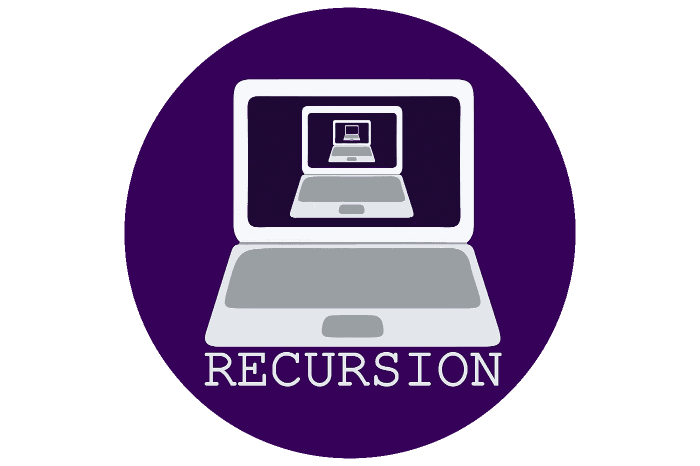
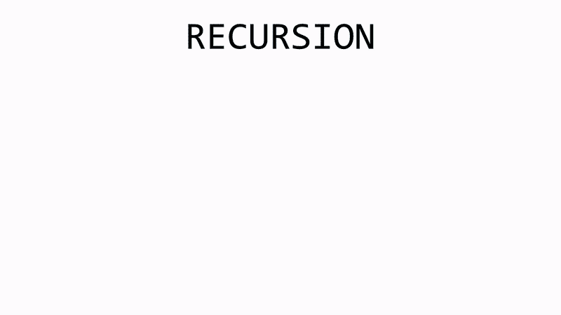

# 递归举例说明

> 原文：<https://javascript.plainenglish.io/recursion-explained-with-example-62473f311230?source=collection_archive---------5----------------------->



大部分程序员都听说过这个概念，都很恐惧。他们倾向于远离它。这是一个可怕的话题，但它并不一定如此！我花了几个星期才恍然大悟，希望我能为其他人加快这个过程。为了真正理解递归，你必须对不同的思考和解决问题的方式敞开心扉。

# 什么是递归？

递归是函数调用自己。我知道这听起来很奇怪。当一个人在编码时，你自己进行函数调用是很不寻常的，但是它可能是有用的。它经常出现在二分搜索法树上。下面是一个简单问题的递归示例:

```
//Returns the sum of all numbers from 0 to a given integer
function sumRange(num){
    if (num === 0){
        return 0
    }

    return num + sumRange(num -1)
}
```

关于递归，要记住的重要一点是，它是一种**不同的**思维方式。代码不是从头到尾都被求解的，它实际上是从末尾向后求解的。以下是计算机解决这个问题的方法:



Recursion Example

这就是计算机递归解决问题的方式。希望我没有失去你。这样做的好处是，你实际上不需要一次又一次地解决迭代，你只需要给函数一个可以遵循的模式。

```
//Returns the sum of all numbers from 0 to a given integer
function sumRange(num){
    if (num === 0){
        return 0
    }

    return num + sumRange(num -1)
}
```

我将解释递归思维的思维模式。让我们回头看看代码。

您可以将代码分为两部分:

```
if (num === 0){
    return 0
}
```

1-基本情况。

这就是你的模式的终点。在这种情况下，我们将从 0 到整数的所有数字相加。不管整数是 1、10 还是 100，我们总是把每个数字相加，当我们到达 0 时停止。

```
return num + sumRange(num -1)
```

2-主模式

这是函数根据特定问题的模式调用自身的地方。很常见的是，函数每次都用更小的**号**和更小的**号**来调用自己，直到它最终到达你的**基用例**。在这种情况下，我们用相同的数字减一再次调用该函数。这个数字会一直变小，直到达到我们的**基数**，0。

这就是递归的全部内容。递归思考实际上就是思考一个问题并把它分成两件事:它的基本情况是什么？它的模式是什么？

*原载于 2019 年 9 月 5 日*[*https://kyoung 90 . github . io*](https://kyoung90.github.io/recursion_explained_with_example)*。*