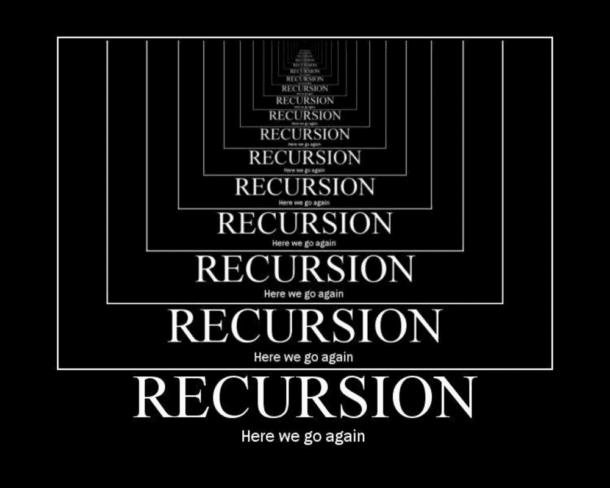
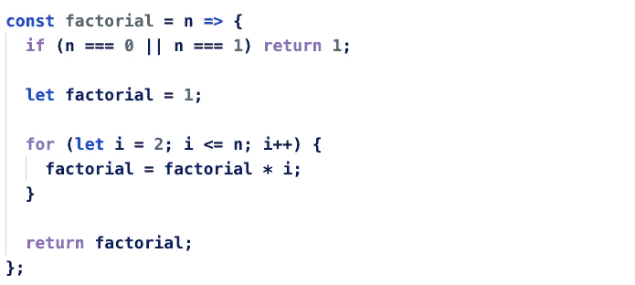
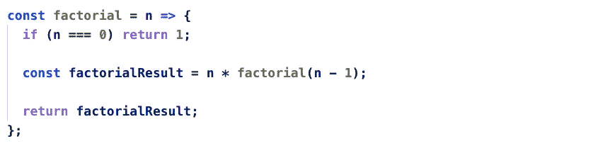
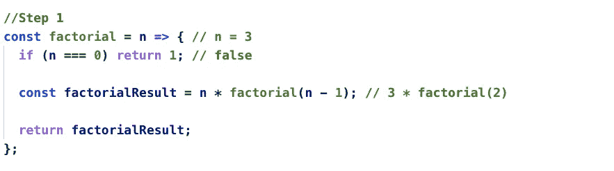
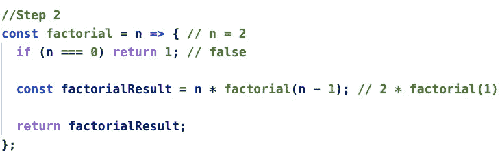
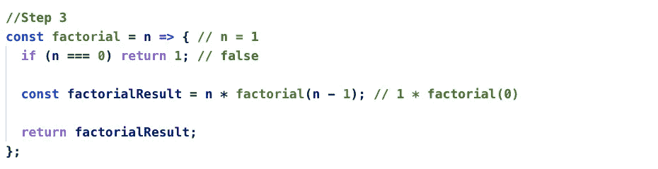
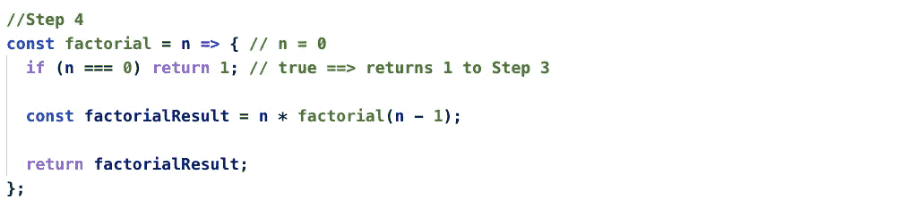
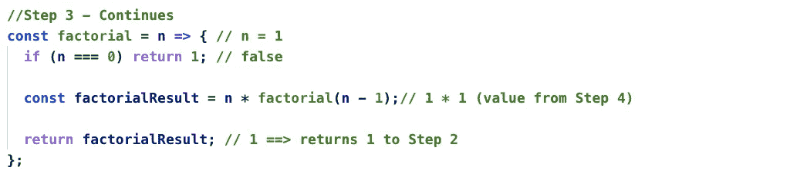
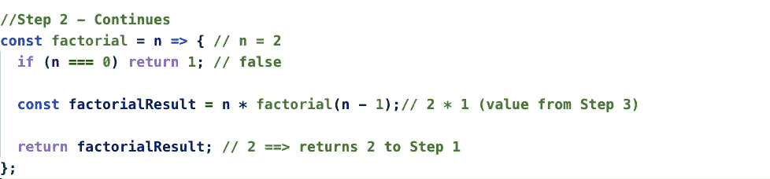
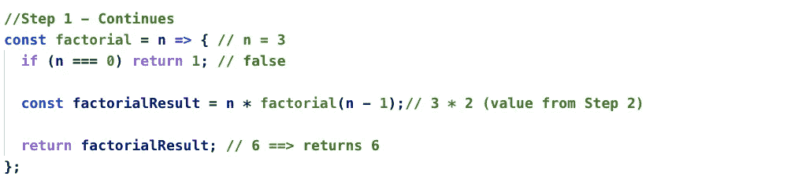

# JavaScript 中的递归—阶乘

> 原文：<https://javascript.plainenglish.io/recursion-in-javascript-factorial-afb8e83cd897?source=collection_archive---------7----------------------->

递归是编程语言中最复杂的事情之一。Javascript 也不例外。

**什么是递归？**

来自维基百科

> 计算机科学中的反转是一种解决问题的方法，其解决方案依赖于同一问题的较小实例的解决方案。

简单来说，

> **递归**是一种解决问题的方法，其中相同的代码可以用于不同的输入，而不是迭代地进行。

**为什么递归很难？**

1.  大多数代码逻辑都是递归发生的。所以很难理解其中的逻辑。
2.  很难跟踪递归调用之间的值。

阶乘是最容易理解递归的问题之一。

**阶乘问题:**

数学上， ***阶乘*** 是所有小于等于*给定数的正整数相乘。*

0! = 1

1! = 1

2! = 2 * 1 = 2

3! = 3* 2 * 1 = 3

**使用迭代法的阶乘:**

Factorial Iterative

上面的代码是用迭代法求阶乘。不涉及递归调用，所以非常容易理解逻辑是如何工作的。

**利用递归方法进行阶乘:**

下面的代码是用递归的方式求阶乘。代码很少，但是很难理解其中的逻辑。

**逐步解释:**

输入= > n = 3；

Step 1

Step 2

Step 3

Step 4

在步骤 4 中，n = 0，所以它返回 1 到步骤 3。

> 注意:当递归方法返回时，它将返回到上一步。递归函数调用作为堆栈工作。后进先出。

Step 3 — Continues

Step 2— Continues

Step 1— Continues

**结论:**

***与递归相关的事情要记住:***

1.  在你用递归写程序之前，确定你的问题是否需要递归。
2.  当你使用递归编写程序时，确保处理所有的情况。否则你的程序可能会陷入无限循环。

递归是编程中最强大的技术之一。我希望这篇教程能帮助你理解**递归**是如何工作的。如果你有任何意见或问题，请告诉我。

*更多内容请看*[***plain English . io***](https://plainenglish.io/)*。*

*报名参加我们的* [***免费周报***](http://newsletter.plainenglish.io/) *。关注我们关于*[***Twitter***](https://twitter.com/inPlainEngHQ)，[***LinkedIn***](https://www.linkedin.com/company/inplainenglish/)*，*[***YouTube***](https://www.youtube.com/channel/UCtipWUghju290NWcn8jhyAw)*，以及* [***不和***](https://discord.gg/GtDtUAvyhW) ***。***

***有兴趣缩放你的软件启动*** *？检查* [***电路***](https://circuit.ooo?utm=publication-post-cta) *。*