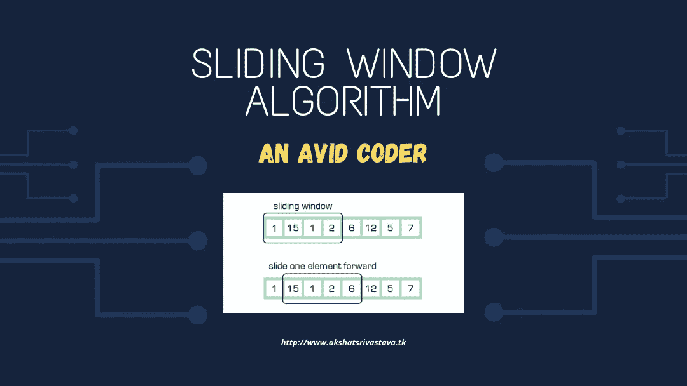
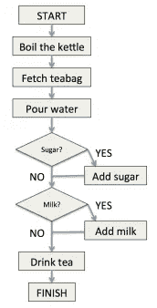
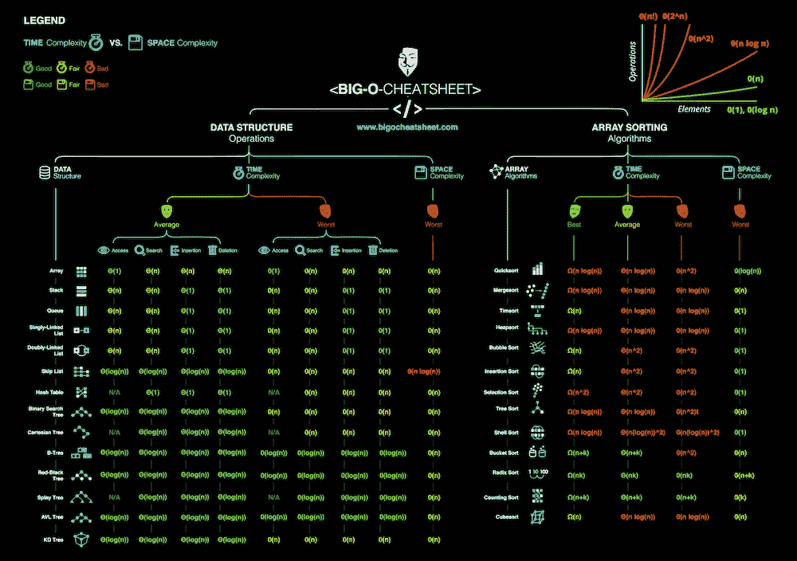
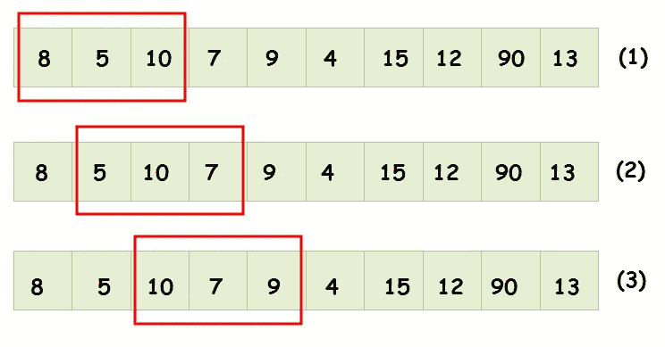

# 利用滑动窗口算法降低复杂性

> 原文：<https://javascript.plainenglish.io/reducing-complexities-with-sliding-window-algorithm-6fc3fb083abf?source=collection_archive---------3----------------------->

在这篇短小精悍的文章中，我将指导你如何借助滑动窗口算法降低程序的复杂性。

*抓紧了，我们开始吧。*

Sliding Window

> 如果你不能飞，那就跑，如果你不能跑，那就走，如果你不能走，那就爬，但无论如何，继续前进。小马丁·路德·金。

**什么是算法？**

算法可以定义为在有效时间内实现某个目标的一组规则/指令。

当你泡茶时，你遵循一定的算法。

*   把茶包放在杯子里。
*   把水壶装满水。
*   把水壶里的水烧开。
*   往杯子里倒一些开水。
*   加入糖(如果你喜欢的话)。
*   加入牛奶(如果你喜欢也可以)。

***茶现已泡好，抓紧杯子继续学习；D***

在**编程中，**算法在减少程序耗时和给出优化解方面起着重要作用。单个**算法**有可能减少**程序**解决问题所花费的时间。

**时间复杂度在竞争性编程中的重要性？**

Big O notation cheat Sheet.

时间复杂度在 CP 中起着至关重要的作用。只要看到问题中提供的约束，你就可以解决一半的问题。算法的复杂程度将决定你会得到 **AC** 还是 **TLE** 。当你的代码不太复杂，并且执行所有测试用例花费的时间更少时，你会得到 AC，否则你会以 TLE(超过时间限制)结束。为了将你从这种情况中解救出来，有许多优化的技术和算法，今天我们将讨论其中的一种技术/算法，即滑动窗口技术。

**什么是滑动窗口算法/技术？**

这项技术向您展示了如何将两个循环的嵌套转换为一个循环，并且可以大大降低时间复杂度。换句话说，你可以说**滑动窗口技术可以将一个算法的旅程从 O(n)转换为 O(n)。**

该技术有两种变化

*   固定大小的窗口。
*   可变大小窗口。

现在用一个例子来分析这个技术。

给你一个大小为**‘n’**的数组，我们的目标是计算数组中**‘k’个连续**元素的总和。

注:识别滑动窗口问题单词**连续/邻接**是破解问题的最大线索。

连续的意思是一个接一个，或者你可以说元素在一个数组中共享公共边界。

回到这个问题，给你一个大小为 5 的数组。

输入数组:- arr[]={10，20，30，40，50}

k=3

输出:- 120

解释:

10+20+30 = 60

20+30+40 = 90

30+40+50 = 120

所以 k=3 个元素的连续数组[30，40，50]是 120。因此程序的输出是 120。

让我们用**天真的**或**强力方法来分析程序。**

我们从第一个索引开始求和，直到第**个**元素。我们对所有可能的 k 个元素的连续块或组都这样做。这种方法需要嵌套 for 循环，外层 for 循环从 k 个元素的块的开始元素开始，内层或嵌套循环将累加到第**个**个元素。

[https://github.com/akshat-fsociety](https://github.com/akshat-fsociety)

上述代码的时间复杂度为 **O(k*n)** 在输入较大时会比较慢。

现在我们将讨论用于优化解决方案的**滑动窗口方法**。

*   我们将计算数组值的总和，直到达到窗口的大小，即 k。
*   当达到窗口大小时，我们将更新 maximun _ sum 值。
*   更新值后，我们将减去窗口的左端(最左边的元素),增加左右指针。

[https://github.com/akshat-fsociety](https://github.com/akshat-fsociety)

该方法的时间复杂度为 O(n)。

你可以把推拉窗想象成公共汽车的窗玻璃，可以左右滑动。

下图将帮助你分析这个概念，并能帮助你想象那条线是什么。

Sliding Window Concept

因此，您可以看到滑动窗口如何将您从循环嵌套中解救出来，并使您的代码运行得更快。我们将讨论一个固定大小窗口的例子。

**Q)** 一个大小为**‘n’**的数组中每个大小为**‘k’**的窗口的第一个负数？

示例:-

arr[] = {12，-1，-7，8，9，-14，13，14，15，-65}数组的大小是 10

k = 3

输出:- [ -1，-1，-7，-14，-14，-14，0，-65 ]

解释:-

第一个窗口:-**【12，-1，-7】**，8，9，-14，13，14，15，-65 **=** **-1**

第二个窗口:- 12， **[ -1，-7，8 ]** ，9，-14，13，14，15，-65 **= -1**

第三个窗口:- 12，- 1， **[ -7，8，9 ]** ，-14，13，14，15，-65 **= -7**

第四个窗口:- 12，- 1，-7，**【8，9，-14】**，13，14，15，-65 **= -14**

第五个窗口:- 12，- 1，-7，8，**【9，-14，13】**，14，15，-65 **= -14**

第六个窗口:- 12，- 1，-7，8，9， **[ -14，13，14 ]** ，15，-65 **= -14**

第七个窗口:- 12，- 1，-7，8，9，-14，**【13，14，15】**，-65 **= 0**

第八个窗口:- 12，- 1，-7，8，9，-14，13， **[ 14，15，-65 ] = -65**

**遂输出:-** **[ -1，-1，-7，-14，-14，-14，0，-65 ]**

[https://github.com/akshat-fsociety](https://github.com/akshat-fsociety)

上述码的时间复杂度为 **O(n)** 即线性时间复杂度**。**

上述代码的解释:-

*   接受数组大小**‘n’**，窗口大小**‘k’**，数组元素。
*   定义**队列**数据结构，其工作原理是**先进先出**。
*   遍历一个数组直到窗口大小，如果我们得到-ve 值，把它提供给队列。
*   现在从“k”开始遍历数组，直到数组的末尾。
*   如果我们的队列是(！空)那么它意味着我们有一个-ve 数，显示它，否则显示 0。
*   检查溢出，并开始向队列提供数组中的其他值。
*   最后，显示内容。

*注意:-* 对于**强力法**，外环将从 **0 运行到(n-k+1)** ，内环将从 **0** 运行到 **k** 。因此时间复杂度将为 **O((n-k+1)*k)** 也可以写成 **O(n*k)。**

您可以看到滑动窗口算法/技术如何将复杂性降低到线性时间。

现在进入滑动窗口技术的第二种变化，即**可变尺寸滑动窗口。**

**什么是可变大小滑动窗口？**

在上面的两个例子中，我们已经看到问题中已经提供了窗口的大小，但是在这个方法中，窗口的大小将不会给出，而是我们必须找到与之相关的东西。

让我们来探讨这些类型的问题。

**Q)** 找出**最大的子阵列**并且**和等于‘k’**？

*观察:-* 如果你仔细阅读这个问题，你会得到两个提示。

还没弄明白吗？

别急，看到第一个提示是**子数组**表示连续/连续，另一个提示是 **SUM 等于 k.**

那么 Akshat，这两个提示将如何帮助我们用滑动窗口技术解决这个问题呢？

**最大的子阵列将是我们必须找到的和 k** 的最大窗口的大小，问题就结束了。

示例:-

arr[] = {4，1，1，1，2，3，5}数组的大小是 n=7

k = 5 是我们必须找到的最大子阵列的和。

输出:- 4

解释:-

4+1 = 5(大小= 2)

1+1+1+2 = 5 **(大小= 4)**

3+2 = 5(大小= 2)

5 = 5(大小= 1)

*注意:-数组中的所有值都是连续的。*

**因此输出为 4**

[https://github.com/akshat-fsociety](https://github.com/akshat-fsociety)

上述代码的解释:-

*   对右端的值求和，直到得到所需的条件。
*   当条件达到时，我们将用窗口的大小来更新最大值。
*   如果总和超过“k ”,我们将通过从窗口左侧/窗格中减去这些值来减少该值。
*   增加左右指针，将窗口移动到数组末尾。

上述码的时间复杂度为 **O(n)** ，即线性时间复杂度。

在**强力方法**中，你必须再次应用嵌套循环，这将具有 **O(n)的时间复杂度。**(可以尝试一下，然后和优化后的方案对比)。

到现在为止，您一定已经意识到滑动窗口算法/技术将如何帮助您，而且它非常容易编码。对于不同的问题，您必须应用不同的数据结构和滑动窗口来获得更有效的解决方案，其中一个是队列数据结构，我已经在上面的示例中向您展示了它。

我会在文章的最后添加一些问题资源供你练习，如果你准备参加面试或任何 CP 比赛，如 ICPC，IOI。

# 结束语:

谢谢你到目前为止阅读这篇文章，也祝你未来的努力一切顺利。我希望这篇文章能帮助你理解这个概念，也希望你能成为你自己的最佳版本；).

敬请关注更多文章。

> 对知识的投资回报最高。

**在 GitHub 上查看要点:-**[https://gist.github.com/akshat-fsociety](https://gist.github.com/akshat-fsociety)

如果有疑问，你们可以联系我

**LinkedIn:-**[https://www.linkedin.com/in/akshat-srivastava-4812271a9/](https://www.linkedin.com/in/akshat-srivastava-4812271a9/)

**GitHub:-**https://github.com/akshat-fsociety

**数据结构算法库:-**[https://github . com/AK shat-fsociety/Data-Structures-Algorithms](https://github.com/akshat-fsociety/Data-Structures-Algorithms)

## 问题(资源)

*   [https://www.geeksforgeeks.org/tag/sliding-window/](https://www.geeksforgeeks.org/tag/sliding-window/)
*   [https://leetcode.com/problemset/all/?topicSlugs =滑动窗](https://leetcode.com/problemset/all/?topicSlugs=sliding-window)
*   [https://www.codechef.com/tags/problems/sliding-window](https://www.codechef.com/tags/problems/sliding-window)

这是练习滑动窗口技术的一些链接。

再见！！