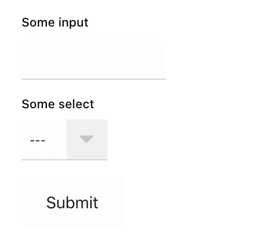
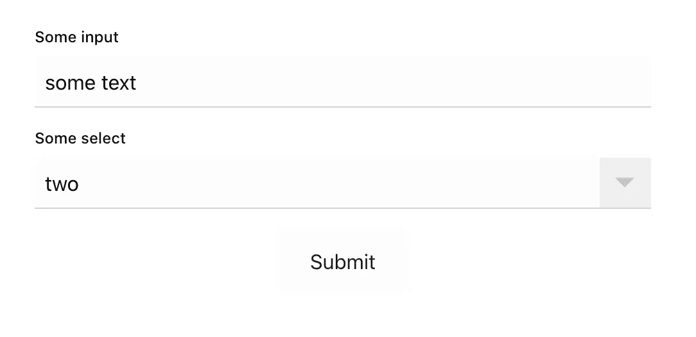

# 在 React 中干燥您的表单

> 原文：<https://javascript.plainenglish.io/reducing-development-routine-with-reusable-forms-in-pure-react-9ef7e542518e?source=collection_archive---------10----------------------->

我想每个人在他的职业生涯中都至少做过一次有很多表格的项目。每次我开发一个管理面板或一个有很多搜索表单的平台时，我都会面临这样的任务，这种例行公事真的让我很沮丧。

经过几个项目，我开发了一个简单的解决方案，我想与你分享。所以，我们继续吧！

这个解决方案的思想是构建一个表单组件，它控制表单数据和所有表单组件的状态。


Photo by [Maksym Kaharlytskyi](https://unsplash.com/@qwitka?utm_source=medium&utm_medium=referral) on [Unsplash](https://unsplash.com?utm_source=medium&utm_medium=referral)

## 第一步

我们从项目设置开始。例如，我将使用`[create-react-app](https://github.com/facebook/create-react-app)`命令。应用程序设置好后，我们就可以开始开发了。

首先，我们将编写一些表单控件组件:input 和 select。在这个概念中，每个表单控件组件都必须实现定义的接口:

*   每个控件都可以有`onChange`方法
*   每个控件必须使用`name`道具来定义表单数据中的一个键
*   每个控件都可以使用`value`属性来表示表单数据中的值
*   每个控件可以有一个`label`道具和一个`className`道具

我们将用一个基本的道具类型`FormControlBasePropTypes`来控制这个接口，并将定义放在`base-prop-types.js`文件中。

```
import PropTypes from 'prop-types';export const ***FormControlBasePropTypes*** = {
  className: PropTypes.***string***,
  label: PropTypes.***string***,
  name: PropTypes.***string***.isRequired,
  onChange: PropTypes.***func***,
  value: PropTypes.oneOfType([
    PropTypes.***string***,
    PropTypes.***number***,
  ]),
};
```

*这个* `*onChange*` *和* `*value*` *是可选的，因为我们不会把这个道具直接定义到组件上，但是我们后面会讲到。*

## 制造组件

对于表单控件组件，我们将定义基本样式和 HTML 结构，这种结构应该取决于项目的设计和要求，所以让我们说，我们有一个输入下单独标签的表单控件。然后，`Input`组件将包含以下代码:

```
import ***React*** from 'react';
import classnames from 'classnames';
import { ***FormControlBasePropTypes*** } from '../base-prop-types';
import './Input.css';

const Input = ({
  className,
  label,
  name,
  value,
  onChange,
}) => (
  <label className={classnames('form-control', className)}>
    {label && (
      <span className="form-control__label">
        {label}
      </span>
    )}
    <input
      className="input form-control__input"
      name={name}
      value={value}
      onChange={onChange}
    />
  </label>
);

Input.propTypes = {
  ...***FormControlBasePropTypes***,
};

Input.defaultProps = {
  className: '',
  label: '',
  value: '',
};

export default Input;
```

*这里我使用* `[*classnames*](https://github.com/JedWatson/classnames#readme)` *进行简单灵活的类名管理。*

对于`Select`组件，我们还必须定义一个附加属性`options`来定义 select 的选项。`Select`组件将包含以下代码:

```
import ***React*** from 'react';
import PropTypes from 'prop-types';
import classnames from 'classnames';
import { ***FormControlBasePropTypes*** } from '../base-prop-types';
import './Select.css';

const Select = ({
  className,
  label,
  name,
  value,
  options,
  onChange,
}) => (
  <label className={classnames('form-control', className)}>
    {label && (
      <span className="form-control__label">
        {label}
      </span>
    )}
    <select
      className="select form-control__input"
      name={name}
      value={value}
      onChange={onChange}
    >
      <option value="">---</option>
      {options.map(option => (
        <option key={option} value={option}>
          {option}
        </option>
      ))}
    </select>
  </label>
);

Select.propTypes = {
  ...***FormControlBasePropTypes***,
  options: PropTypes.arrayOf(
    PropTypes.oneOfType([
      PropTypes.***string***,
      PropTypes.***number***,
    ])
  ).isRequired,
};

Select.defaultProps = {
  className: '',
  label: '',
  value: '',
};

export default Select;
```

最后，我们可以从`Form`组件本身开始。组件的核心如下所示:

```
import ***React*** from 'react';
import PropTypes from 'prop-types';
import classnames from 'classnames';
import './Form.css';const Form = ({
  className,
  children,
}) => (
  <form className={classnames('form', className)}>
    {children} <button
      className="button form__submit"
      type="submit"
    >
      Submit
    </button>
  </form>
);Form.propTypes = {
  children: PropTypes.oneOfType([
    PropTypes.arrayOf(
      PropTypes.***node***,
    ),
    PropTypes.***node***,
  ]).isRequired,
  className: PropTypes.***string***,
};Form.defaultProps = {
  className: '',
};export default Form;
```

任何父组件中的表单显示将如下所示。请注意，应该在这一步定义`name`属性。

```
<Form className="app__form">
  <Input
    label="Some input"
    name="input"
  />
  <Select
    label="Some select"
    name="select"
    options={['one', 'two', 'three']}
  />
</Form>
```

你可能会想:“那又怎样？这里没什么有趣的。”但是请耐心点。“魔术”马上就要开始了。



在将所有的东西绑定在一起之后，我们在`Form`组件中获得了`Select`和`Input`组件，但是结果并不令人满意，开发者的控制台充满了错误，所有的东西都无法工作。

所以，让我们变戏法吧！

## 魔力

在 React 中，你可以在`[React.cloneElement](https://reactjs.org/docs/react-api.html?#cloneelement)`函数的帮助下[迭代子节点](https://reactjs.org/docs/react-api.html#reactchildrentoarray)并将一些道具应用于组件。这正是我们接下来要做的。

因此，我们不会直接在`Form`中渲染`children`，而是循环遍历所有子节点，并应用一些额外的道具，这些道具是我们在`FormControlBasePropTypes`中定义的。此外，我们将应用一个`className`道具，使所有控件在表单中看起来相似。

`Form`将在存储中存储每个控件的值，所以我们首先定义存储。

```
const [formValue, setFormValue] = useState({});
```

然后，我们定义了`formValue`更新处理程序。我们期望我们的控件应该在内部`onChange`事件之后触发`Event`对象，因此我们可以提取`name`和`value`。

```
const onFormValueUpdate = ({ target: { name, value } }) => {
  setFormValue({
    ...formValue,
    [name]: value,
  });
};
```

子渲染器代码变成带有以下代码的`map`循环:

```
***React***.***Children*** .toArray(children)
  .map((child) => ***React***.cloneElement(child, {
    value: formValue[child.props.name] || '',
    className: classnames(child.props.className, 'form__control'),
    onChange: onFormValueUpdate,
  }))
```

这里，我们添加了一个组件的`value`、`className`和`onChange`处理程序。现在，我们的组件看起来更好了，表单数据正在填充。但是我们仍然无法访问表单数据。

让我们完成我们的表格。我们应该将`onSubmit`属性添加到我们的`Form`组件中，并将处理程序添加到表单标签中。

```
const Form = ({
  className,
  children,
  onSubmit,
}) => {
  ...
  const onSubmitHandler = (e) => {
    e.preventDefault();
    onSubmit(formValue);
  };

  return (
    <form
      onSubmit={onSubmitHandler}
      className={classnames('form', className)}
    >
...
```

现在，我们有了一个完全有效且可扩展的有状态表单。



甚至我们的表单数据的`console.log`也在工作！

```
{
  input: “some text”,
  select: “two”
}
```

## 结论

这个例子并不理想，应该通过测试、额外的检查和组件来增强。例如，您可以添加表单重置按钮、错误突出显示等等。

我希望这个想法本身可以帮助你建立你的表单。

你可以通过[链接](https://github.com/Nick-Omen/react-form-example)在 Github 上找到完整的代码。

请随意评论，我欢迎任何建议和批评。

谢谢你的阅读！

## 用简单英语写的 JavaScript 的注释

我们已经推出了三种新的出版物！请关注我们的新出版物:[**AI in Plain English**](https://medium.com/ai-in-plain-english)[**UX in Plain English**](https://medium.com/ux-in-plain-english)[**Python in Plain English**](https://medium.com/python-in-plain-english)**——谢谢，继续学习！**

**我们也一直有兴趣帮助推广高质量的内容。如果您有一篇文章想要提交给我们的任何出版物，请发送电子邮件至[**submissions @ plain English . io**](mailto:submissions@plainenglish.io)**，并附上您的 Medium 用户名，我们会将您添加为作者。另外，请让我们知道您想加入哪个/哪些出版物。****