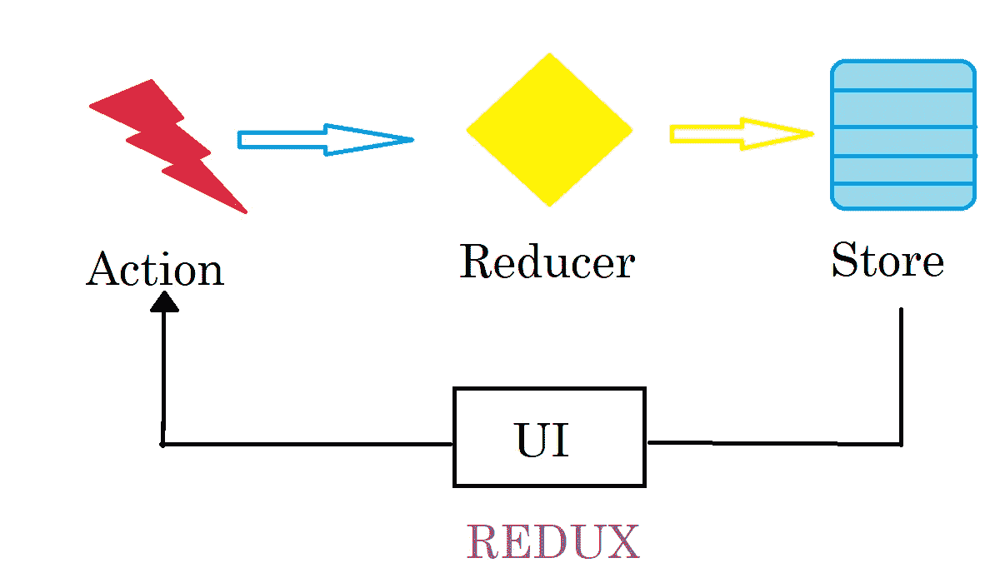
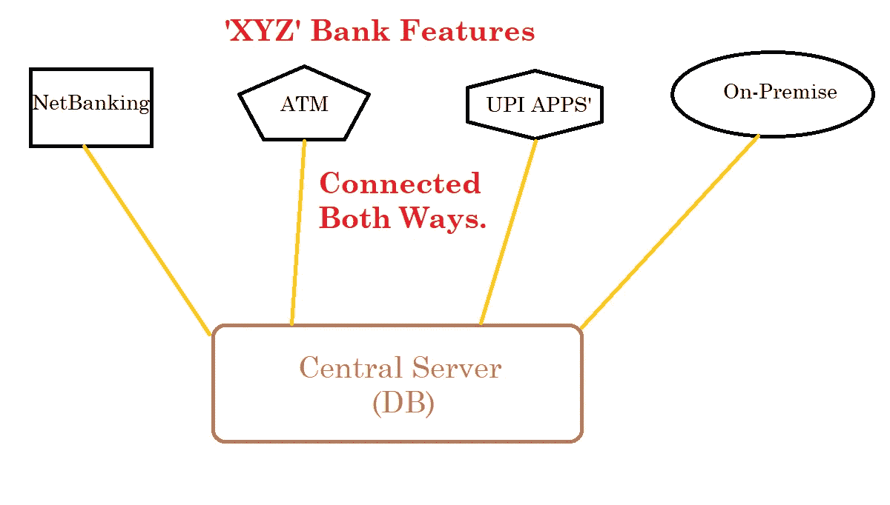
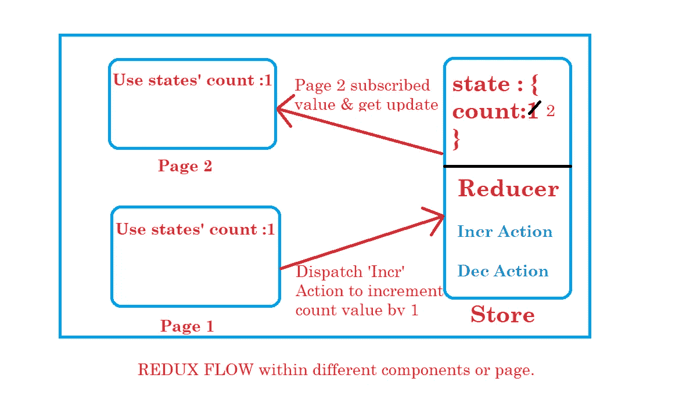
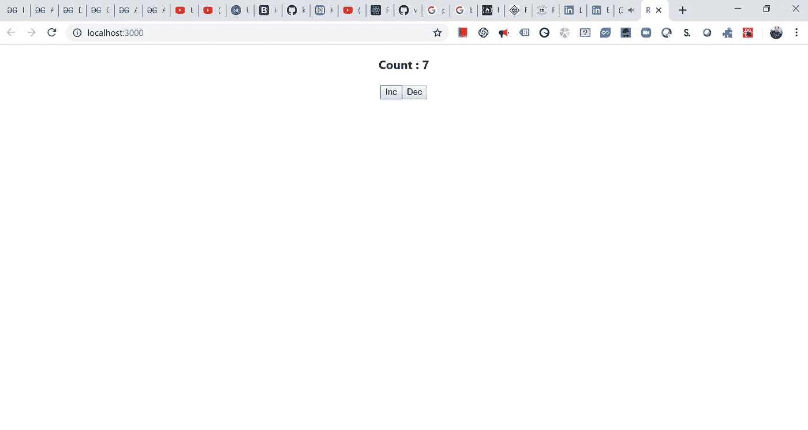

# 对 Redux with React 的基本理解

> 原文：<https://javascript.plainenglish.io/redux-basic-understanding-via-react-4fb470d6fd3e?source=collection_archive---------3----------------------->



你好连接！今天我们将讨论 **Redux** 。在这次短途旅行中，我们将涵盖对 **Redux** 的基本理解，为什么我们需要 **Redux** ，它是如何工作的，以及我们如何将其与 React 连接起来。它相比正常状态&道具有什么好处。所以让我们开始吧，不要再浪费时间了。

首先，要精通 **Redux** 我们需要知道我们为什么需要它。为了让我们的概念更清晰，比如说我们拥有一家银行' **XYZ** '在“XYZ”银行，最重要的特点是在银行里存钱。对于这些功能，我们可以有不同的选项，客户可以从中选择。



作为一名开发者，考虑到所有关于功能的选项，我们需要建立一个我们可以信任的真实来源，并复制到我们的每个选项中，以便在交易时不会出现金额不匹配的情况。为了高效地完成我们的工作，我们需要采取集中行动，让我们所有的选择都能发挥作用，并利用它们来完善银行设施。因此，我们可以将两个操作“取款”和“存款”作为一个公共操作，连接到我们的“中央服务器”来更新客户的数据库。通过这种方式，每当顾客从给予他的任何选项中访问他的账户时，他发现在(他/她)交易之前或之后的金额是相同的。

正如我们上面所讨论的，必须有一个中心“存储”和“动作”,我们所有的 CRUD 操作都可以从一个真实的来源获得数据。那么让我们从 **redux** 官方文档开始陈述: ***Redux*** 是一个状态管理库，它让你可以访问组件中任何地方的状态，而不需要传递属性。因此，它可以与 Angular 和 React 等任何前端库一起使用，但它与 React 一起使用效果最好。”“react-redux”是连接两者的官方库。



Redux Flow

在上面的图片中，我们可以看到两个组件或页面之间的 REDUX 流。假设我们有一个应用程序，其中我们维护了一个 redux 来控制前端级别的应用程序状态(数据)。为了建立一个我们可以信任的真理的中心来源，我们建立了一个 redux“STORE ”,其中有 2 样东西:

1)应用程序的状态。2) Reducer(包含我们所有动作的定义)。

假设我们的两个组件或页面正在使用状态值，例如其中一个页面 1:想要将 count 的值增加 1。因此，第 1 页将向“reducer”发送一个“action”来执行此操作。然后 reducer 会发现他是否得到了增量动作的定义，如果发现他对中心状态做了同样的事情&发出它的更新状态。像 Page 2 这样已经订阅了它的值的其他页面将会得到关于这个值的更新，并且现在会在它们的页面上显示更新后的值。为了充分理解这一点，让我们开始使用 React-redux 应用程序。

> 如果你是 react 新手，你可以找我的 Github 库(https://github.com/[vinodchauhan 7](http://React CRUD APP for Beginners)/React-CRUD-operation-with-router . git)React CRUD for 初学者，我在那里做了 5 课(分支)，你可以在具备 JS 基础知识的前提下一步一步地学习“React”。要安装 react，您必须在系统中安装 npm。

要安装 react : " `**npm install -g create-react-app**`"

创建 react 应用程序:"`**create-react-app react-redux-app**`"

在你的应用中安装 redux:“`**npm install — save redux react-redux**`

*如果从这一点上你没有进一步理解任何事情，不要沮丧，我将创建一个 GITHUB REPO，其中将通过多个课程(分支)一步一步地给出方法，在那里你可以理解如何顺利地将 REACT 转换为“REACT-REDUX-APP”。*

安装后转到 react-redux-app/src/index.js

```
import React from 'react';
import ReactDOM from 'react-dom';
import './index.css';
import App from './App'; ReactDOM.render(<App />,document.getElementById('root'));
```

和 react-redux-app/src/App.js

```
import React, { Component } from 'react';  class App extends Component {
	  render() {
	      return (
	      <div className="App">
	        <h1>Hello React!</h1>
	      </div>
	      );
	  }
	  }export default App;
```

现在在终端运行命令:“npm 启动”。这将启动你的应用程序和你的最爱。浏览器将打开“localhost:3000”并显示“Hello React”。

现在我们将首先创建一个存储，/src/store/reducer.js

```
const initialState = {
  count: 1
}; const reducer = (state = initialState, action) => {
  const newState = { ...state };
  switch (action.type) {
    case "INC":
      return {
        ...state,
        count: state.count + action.value
      };
 case "DEC":
      return {
        ...state,
        count: state.count - action.value
      }; default:
      break;
  }
  return newState;
}; export default reducer;
```

在这个文件中，我们为“count”值创建了一个“initialState”和一个“reducer”函数，其中定义了“INC”和“DEC”操作。此操作只是根据参数中给定的值更新 state.count 值。

Now /src/app.js

```
import React, { Component } from "react";
import "./App.css";
import { connect } from "react-redux"; class App extends Component {
  render() {
    return (
      <div className="App">
        <h3>Count : {this.props.count}</h3>
        <button onClick={this.props.handleINC}>Inc</button>
        <button onClick={this.props.handleDEC}>Dec</button>
      </div>
    );
  }
} *//subscriber*
const mapStateToProps = state => {
  return {
    count: state.count
  };
}; *//eventHandler(Action)*
const mapDespachToProps = dispach => {
  return {
    handleINC: () => dispach({ type: "INC", value: 1 }),
    handleDEC: () => dispach({ type: "DEC", value: 1 })
  };
}; export default connect(
  mapStateToProps,
  mapDespachToProps
)(App);
```

这个文件有 5 个主要步骤，但要理解这个概念，你首先必须知道“高阶组件”，这基本上意味着将一个函数作为参数传递给另一个函数，并在该函数中设置状态。要完全理解这个概念，现在就谷歌一下。

```
1)  Get the subscriber so that we can show count value in our app.js component. *//subscriber*
const mapStateToProps = state => {
  return {
    count: state.count
  };
};2) Show the value in render() method. All redux values comes in props only.render() {
    return (
      <div className="App">
        <h3>Count : {this.props.count}</h3>
        <button onClick={this.props.handleINC}>Inc</button>
        <button onClick={this.props.handleDEC}>Dec</button>
      </div>
    );
  }
```

到目前为止，我们已经使计数值对组件可见，但这将不起作用。

```
//eventHandler(Action)
const mapDespachToProps = dispach => {
  return {
    handleINC: () => dispach({ type: "INC", value: 1 }),
    handleDEC: () => dispach({ type: "DEC", value: 1 })
  };
};
```

> 现在从' react-redux '导入{connect}来连接我们的减速器组件。

```
export default connect(
  mapStateToProps,
  mapDespachToProps
)(App);
```

> 上面的代码片段将订户和调度连接到我们的主存储(reducer ),这是使用 redux 最重要的一点。这个概念是特设的(高阶组件)。

现在查找/src/index.js

```
import React from "react";
import ReactDOM from "react-dom";
import "./index.css";
import App from "./App";
import * as serviceWorker from "./serviceWorker";*//Provider provides to store to our all components*
import { Provider } from "react-redux";
*//createStore is redux app to create store in our app from redux.*
import { createStore } from "redux";*//importing our reducer in index.js*
import reducer from "./store/reducer"; *//creating store from createStore which takes reducer as argument.*
const store = createStore(reducer); ReactDOM.render(
*//Here we are providing Provider with store prop to our app component so that* 
*//count will be available to it as a props.*
  <Provider store={store}>
    <App />
  </Provider>,
  document.getElementById("root")
); *// If you want your app to work offline and load faster, you can change*
*// unregister() to register() below. Note this comes with some pitfalls.*
*// Learn more about service workers:* [*https://bit.ly/CRA-PWA*](https://bit.ly/CRA-PWA)
serviceWorker.unregister();
```



Result inbrowser

这是你将在浏览器上的应用程序中看到的结果。我希望你们理解这篇文章中的一些东西，如果有人需要它的一步一步的 git repo，不要担心，我将很快用 diff branches 更新这篇文章。