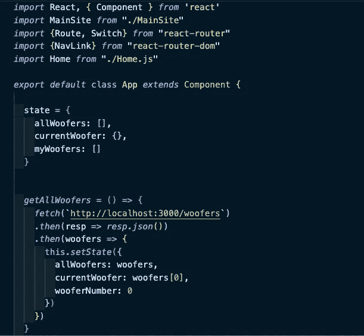
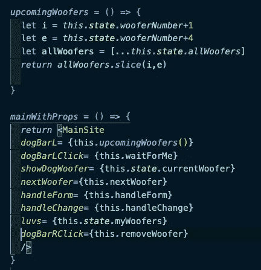
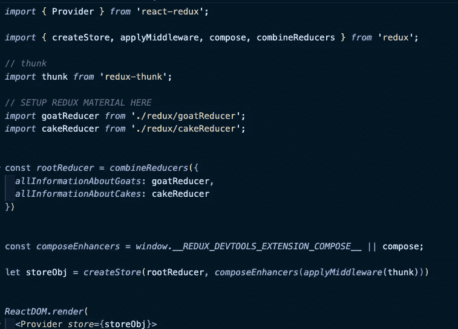
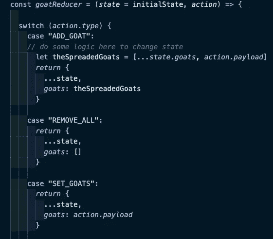
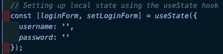
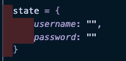
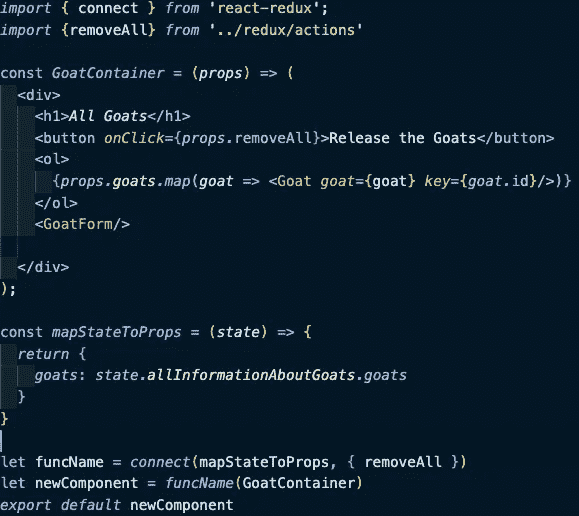
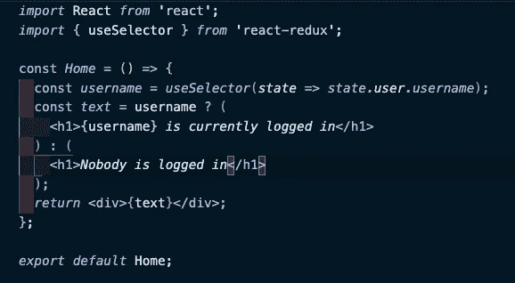
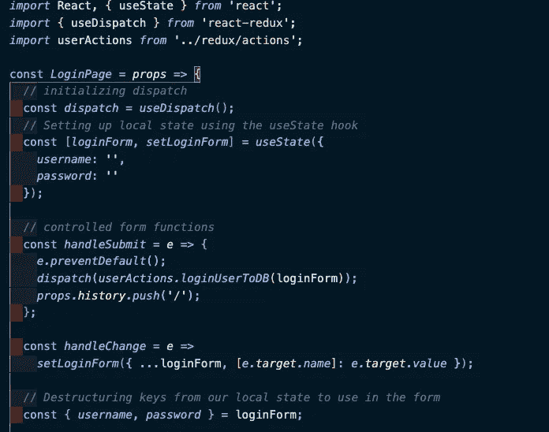

# Redux + Hooks =利润？

> 原文：<https://javascript.plainenglish.io/redux-hooks-profit-bf3f576e066d?source=collection_archive---------8----------------------->

This blog will turn you into Captain… Hooks?

作为一个受欢迎的“编码训练营”熨斗学校的学生，我有过很多次震惊的经历。从流行的简单易学的后端语言 vanilla Ruby 到 ActiveRecord 的 SQL 编写对象关系数据库(ORD)是一个巨大的飞跃。从 Rack/ [Sinatra](http://sinatrarb.com/) 令人沮丧的 web 生成框架的手工劳动到 [Rails](https://rubyonrails.org/) 的宏和简单路由的编程之美也是如此。

Digivolve into (coding)champion…

然而，我最近一次令人兴奋的经历是在 React.js 应用程序中同时实现 Hooks 和 Redux，以便处理可能在应用程序生命周期中发生变化的数据。

typical state-based react programming

以上是我做的一个简单的 React 项目的代码，名为“用低音扬声器保持平静”，这是一个可爱的应用程序，用于查看狗狗的可爱照片。也许如果你表现好，我会在博客末尾奖励你一张狗狗照片。但是现在，观察基本的基于“状态”的程序。在这个“类”组件中，我有一个名为“状态”的普通对象，它包含了我要获取的所有狗(明白吗？)以及其他可能与我的应用程序相关的信息。

但是，我如何访问构成应用程序不同区域的其他“组件”中的数据呢？

Woof, that’s a lot of props.

上面看到的答案是一个复杂的系列，将“状态”作为“道具”传递下去，一种在“父母”中设置变量的方式，以及“道具函数”，通过 [Javascript ES6 箭头函数](https://developer.mozilla.org/en-US/docs/Web/JavaScript/Reference/Functions/Arrow_functions)固有地绑定到父母的函数。这很…复杂。有些函数返回组件，道具，有些函数是道具，但仍然会改变状态。这是一个错综复杂的网络，坦率地说，非常令人困惑。但是这种状态管理有一个流行的替代方法:Redux。

当我听说 Redux 的时候，我太激动了。避免做所有的工作似乎很棒。不管是什么，都应该简单些，对吧？

right???

这段代码来自[埃里克·金](https://medium.com/@hyeokjungkim)，他是我在熨斗的一位伟大的老师，在他向我们解释 Redux 的时候。然而，即使与我的“低音扬声器”的第一张图片相比，你可以看到我们正在导入更多的模块，我几乎不能声称理解的代码页，以便获得我可以在不同组件中更改的“状态”对象的效果。我们有中间件，一个称为“提供者”的组件，一个称为“存储”的对象和方法，我们从中获取状态。我们甚至有一些奇怪的东西叫做“thunk”。

did somebody say “chunk”?

更重要的是，我们甚至不能像访问“state”那样通过“this.store”直接访问“store”。我们甚至不能用公认的麻烦的“this.setState”函数来改变它。我们必须使用名为“actions”的对象，这些对象被发送给名为“reducers”的函数，这些函数本身通过路径来改变存储中的状态，这些路径通过大写字符串(如“ADD_GOAT ”)来描述。

This is baaaaaaaa…rd.

TLDR，这和我们通常在 React 中使用的错综复杂的道具、状态和回调函数一样难。

然而，我从我的教练那里学到了另一种方法，安妮·苏扎，特别是 T2·马赞·阿尔斯瓦和 T4，他在 JWT 的惊人的媒体职位。

它是 React、Redux 和一个叫 React Hooks 的东西的组合。

(Captain) Hook vs. (Captain) State!

这是一个简单的挂钩/状态比较。如前所述，State 通常是包含可变数据的对象，而 Hooks 允许使用单独的变量来设置 state，第一个变量设置为等于 useState 是所需的数据，第二个变量是更改该数据的函数。

我经常发现，与设置状态的基础相比，钩子是不必要的复杂，尽管它们允许你在一个“功能”组件中使用状态，一个更小的 React，通常更好地遵守编程的[“单一责任原则”](https://medium.com/@severinperez/writing-flexible-code-with-the-single-responsibility-principle-b71c4f3f883f)，否则就不能使用状态。

然而，钩子在 Redux 中的工作方式让生活变得简单多了。

通常，使用 React-Redux，如果我们想要访问“store”中的“state ”,我们必须做这样的事情。

这更多的是埃里克的代码。我们导入了一个名为“connect”的东西，手动编写了一个名为 mapStateToProps 的方法，导入了另一个我们用来做“mapDispatchToProps”的方法，使用 connect 来获取这些函数和我们的原始组件，然后将它们混合到一个新的组件中，该组件可以从…本身(排序)接收属性，然后处理数据。

作为对比，这段代码怎么样？

woah

我们只有两样进口的东西，但看看我们得到了什么！没有道具，没有书面状态或对商店的引用，什么都没有，我们只是使用行:

const*username*=*use selector*(*state*=>state . user . username)；

这只是从 redux 存储的状态中提取我们需要的任何东西，将其存储在一个变量中，然后使用它。我们跳过了大约 20 步！

We murdered those other pieces of code.

[useSelector()](https://react-redux.js.org/next/api/hooks) 是一个钩子，可以让你瞬间访问商店！只要你已经在你的父目录中创建了你的存储，比如 index.js 或者 App，你就可以访问一个字符串，一个数组，一个对象，甚至一个函数定义！

你可能会问，调度呢？那有时候超级讨厌。一部分将继续，因为减速器和行动的概念仍然需要一些时间来掌握。

mapDispatch is dispatched with!

这更多的是 [Mazen](https://medium.com/u/b72ac0bfd7b?source=post_page-----bf3f576e066d--------------------------------) 的美丽代码。我们又一次跳过了这么多东西！我们没有将 Dispatch 映射到 props，导入“connect”并返回一个新组件来继承 props 本身，而是使用了另一个钩子， [useDispatch()](https://react-redux.js.org/next/api/hooks) ，我们可以直接使用它，也可以像 Mazen 一样抽象成一个简单的函数“dispatch”。这使得我们可以轻松地发送动作，而不需要使用来自父母的道具、状态、映射或绑定回调函数！通过使用钩子，我们已经成功地将 Redux 简化成了它本来的样子:一种让我们的生活变得更容易而不是更难跨组件共享状态的方式。

仅此而已。谢谢你对我的容忍。正如我在帖子开头所说的，从 Redux 到 Redux with Hooks 的简单性是我在这次疯狂的训练营之旅中经历的最棒的事情之一。

使用 useSelector()和 useDispatch()可能并不适合每个正在开发适合 state 的小应用程序的人，或者不适合使用 Redux 的遗留应用程序(例如，不确定框架的公司工作),但我知道我会在自己的项目中使用它，并融入增加易用性的好处。

现在，正如承诺的，是一只可爱的狗:

cooper!

这是诺伯·库珀，收容所男孩的混血儿。它很臭，喜欢跳上柜台偷自己的食物。他喜欢拥抱，但只是有时候。他正在努力。

他也喜欢钩子，这对他们来说是一个很好的论据。

非常爱你，

网络信息中心(Network Information Center)ˌ网路界面卡(Network Interface Card)ˌ全国工业理事会(National Industrial Council)ˌ航行情报中心(Navigation Information Center)