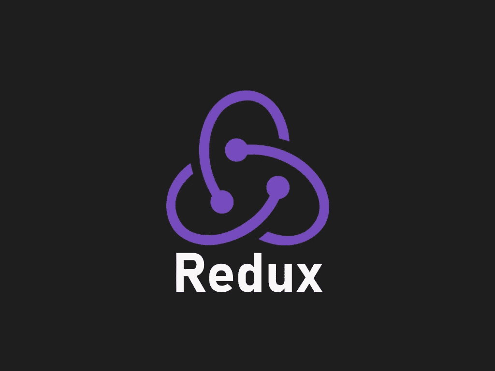
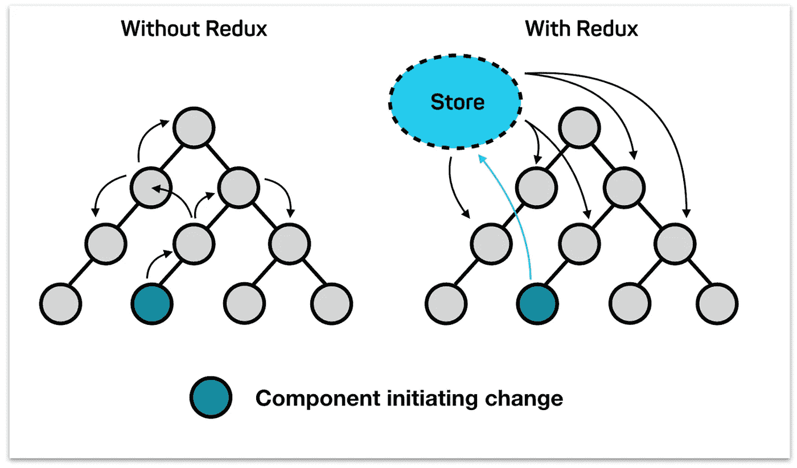
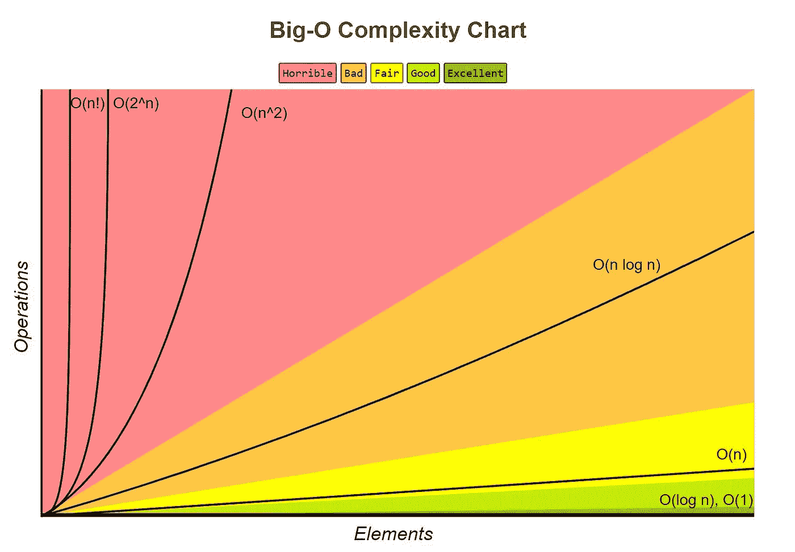

# Redux 不可变更新模式

> 原文：<https://javascript.plainenglish.io/redux-immutable-update-patterns-a6801d49f160?source=collection_archive---------6----------------------->



Source: [https://linguinecode.com/](https://linguinecode.com/)

我认为您正在阅读一篇关于 [Redux](https://redux.js.org/) 的文章的主要原因之一是，您正在开发的应用程序正处于成长阶段，可能会变得越来越复杂。您正在获得新的业务逻辑需求，这些需求要求您处理不同的域，并且需要一种一致且可调试的方式来处理应用程序状态。

如果你是一个开发简单应用程序的开发人员(或者刚刚开始学习一个新的前端框架，如 [React](https://reactjs.org/) ，我们在本文中以此为例)，我打赌你可能不需要 Redux 除非你把这当成一个学习的机会。

Redux 使您的应用程序变得更加复杂，但这是一件好事。这种复杂性为大规模状态管理带来了简单性。

*   当你有一些独立的组件不需要相互通信，并且想要维护简单的 UI 或业务逻辑时，尽一切可能使用[本地状态](https://reactjs.org/docs/state-and-lifecycle.html#adding-local-state-to-a-class)
*   如果您有几个组件需要订阅以获得相同类型的数据，那么作为反应，调度通知、更改或事件[加载器](https://blog.logrocket.com/component-state-local-state-redux-store-and-loaders/)可能是您最好的朋友
*   但是，如果您有几个组件(如下图所示)需要与其他组件[共享某种状态，而没有直接的父子关系](https://blog.codecentric.de/en/2017/12/developing-modern-offline-apps-reactjs-redux-electron-part-3-reactjs-redux-basics/)，那么 Redux 是一个完美的解决方案

如果没有 Redux，每个组件都需要以某种形式将状态传递给可能需要它的其他组件，并处理相应的命令或事件调度。大规模维护、测试和调试这样的系统很容易成为一场噩梦。然而，在 Redux 的帮助下，任何组件都不需要持有任何关于管理内部状态的逻辑。他们所要做的就是订阅 Redux 来获得他们需要的状态，并在需要时向它发送动作。



Redux 支持状态管理的核心部分是 [Store](https://redux.js.org/api/store/) ，它将应用程序的逻辑保存为一个状态对象。该对象公开了一些方法，这些方法支持获取、更新和侦听状态及其变化。在本文中，我们将只关注更新状态。这是使用 dispatch(action)方法完成的。这是修改以这种形式发生的[状态的唯一方法。](https://redux.js.org/api/store/#dispatchaction)

“商店的归约函数将与当前的 [getState()](https://redux.js.org/api/store/#getState) 结果和给定的动作同步调用。它的返回值将被认为是下一个状态。从现在开始，它将从 [getState()](https://redux.js.org/api/store/#getState) 返回，并且将立即通知更改监听器”

要记住的首要事情是，状态的任何更新都应该以不可变的方式发生。但是为什么呢？

# 为什么是不可变更新？

假设您正在开发一个电子商务应用程序，初始状态如下:

我们这里有各种各样的数据类型——字符串、布尔、数组和对象。为了响应应用程序事件，这些状态对象参数需要更新，但是以不可变的方式。换句话说:

[**原始状态或其参数不会改变(或突变)；但是需要通过复制原始值并修改它们来返回新值。**](https://redux.js.org/recipes/structuring-reducers/immutable-update-patterns/)

在 JavaScript 中:

*   默认情况下，字符串和布尔值(以及数字或符号等其他原语)是不可变的。下面是字符串不变性的一个例子:

*   对象是可变的，但是可以被[冻结](https://developer.mozilla.org/en-US/docs/Web/JavaScript/Reference/Global_Objects/Object/freeze):

在下面的例子中，我们看到了这一点。我们还看到，当我们创建一个新的对象，将它指向一个现有的对象，然后改变新对象的属性，这将导致两个对象的属性都发生变化。

如果我们想完成对对象的不可变更新，我们有几个选择，比如使用 Object.assign 或 spread 操作符。

*   数组有可变和不可变的方法:

记住哪些数组方法是哪些方法是很重要的。这里有几个案例:

*   不可变方法: **concat、filter、map、reduce、reduceRight 和 reduceRight**
*   可变方法:**推送、弹出、移位、取消移位、排序、反转、拼接和删除**

请记住，spread 运算符也适用于数组，并且可以使不可变的更新变得更加容易。让我们看一些可变和不可变的更新作为例子:

所以在一个真实的例子中，如果我们需要更新状态的 error 属性，我们需要向 reducer 发送一个动作。Redux reducers 是[纯函数](https://hackernoon.com/functional-programming-concepts-pure-functions-cafa2983f757)，这意味着:

*   它们总是基于相同的输入(即状态和动作)返回相同的值
*   它们不会产生任何副作用，比如进行 API 调用

这要求我们以不可变的方式处理 reducers 中的状态更新，这有几个优点:

*   更容易测试减速器，因为输入和输出总是可预测的
*   调试和时间旅行，所以你可以看到历史的变化，而不仅仅是结果

但是最大的好处是保护我们的应用程序不会出现渲染问题。

在像 React 这样依赖状态来更新[虚拟 DOM](https://reactjs.org/docs/faq-internals.html) 的框架中，拥有正确的状态是必须的。这样，React 可以通过比较引用(具有 1 的[大 O 符号表示快得多)而不是递归比较对象(具有 n](https://yourbasic.org/algorithms/big-o-notation-explained/#constant-time) 的[大 O 符号表示慢得多)来意识到状态是否已经改变。](https://yourbasic.org/algorithms/big-o-notation-explained/#linear-time)



在我们分派 HANDLE_ERROR 动作之后，通知 reducer 我们需要更新状态，下面是发生的情况:

*   作为第一步，它使用 spread 操作符复制 stat 对象
*   第二步，它必须更新错误属性并返回新状态
*   订阅 store 的所有组件都会收到关于这个新状态的通知，并在需要时重新呈现

到目前为止，我们已经以不变的方式介绍了 Redux 更新模式的基础知识。然而，有些类型的更新可能比其他类型的更新更棘手，比如删除或更新嵌套数据。让我们一起来看看这些案例:

# 在数组中添加项目

如前所述，unshift、push 和 splice 等几种数组方法是可变的。如果我们要就地更新阵列，我们希望远离它们。

无论我们是想将项目添加到数组的开头还是结尾，我们都可以简单地使用 spread 操作符返回一个包含所添加项目的新数组。如果我们打算在某个索引处添加项，我们可以使用一个拼接，只要先制作一个状态副本，然后就可以安全地改变任何属性:

# 在嵌套对象的数组中添加项

更新嵌套数据变得有点棘手。对于**嵌套属性中的更新，要记住的主要事情是正确地更新每一层数据并正确地执行更新。**让我们看一个向位于嵌套对象中的数组添加项目的例子。

# 移除数组中的项目

以不可变的方式移除项目可以通过几种方式来执行。例如，我们可以使用像 filter 这样的不可变方法，它返回一个新数组。：

```
function removeItemFiter(array, action) { return array.filter((item, index) => index !== action.index)}
```

或者我们可以先复制一个数组，然后使用 splice 来删除数组中某个索引中的一项:

```
function removeItemSplice(array, action) { let newArray = array.slice() newArray.splice(action.index, 1) return newArray}
```

下面的例子展示了在 reducer 中使用这些不变性概念来返回正确的状态:

# 移除嵌套对象内数组中的项目

最后，我们要移除一个嵌套对象中的数组项。非常类似于添加一个条目，但是在这个例子中，我们将过滤掉嵌套数据中的条目。

# 结论

让我们一起回顾一下我们学到了什么:

*   为什么以及何时我们可能需要像 Redux 这样的状态管理工具
*   Redux 状态管理和更新如何工作
*   为什么不可变更新很重要
*   如何处理棘手的更新，如在嵌套对象中添加或删除项目

请使用下面的参考列表来获得更多关于这个主题的信息。在本文中，我们打算学习 Redux 中手动不可变更新模式的基础知识。然而，有一组不可变的库，如 [ImmutableJS](https://immutable-js.github.io/immutable-js/) 或 [Immer](https://github.com/immerjs/immer) ，可以让你的状态更新更少冗长，更可预测。

# 参考资料:

[https://medium . com/daily js/redux-immutable-data-modification-patterns-614 ff 394 da7f](https://medium.com/dailyjs/redux-immutable-data-modification-patterns-614ff394da7f)

[https://dev . to/dced dia/immutable-updates-in-react-and-redux-kg](https://dev.to/dceddia/immutable-updates-in-react-and-redux-kg)

[https://blog . code centric . de/en/2017/12/developing-modern-offline-apps-react js-redux-electronic-part-3-react js-redux-basics/](https://blog.codecentric.de/en/2017/12/developing-modern-offline-apps-reactjs-redux-electron-part-3-reactjs-redux-basics/)

[https://cogent . co/blog/the-internet-says-you-may-not-need-redux/](https://cogent.co/blog/the-internet-says-you-may-not-need-redux/)

[https://blog . log rocket . com/component-state-local-state-redux-store-and-loaders/](https://blog.logrocket.com/component-state-local-state-redux-store-and-loaders/)

[https://daveceddia.com/react-redux-immutability-guide/](https://daveceddia.com/react-redux-immutability-guide/)

[https://www . top tal . com/JavaScript/immutanbility-in-JavaScript-using-redux](https://www.toptal.com/javascript/immutability-in-javascript-using-redux)

[https://Vincent . billey . me/pure-JavaScript-immutable-array/# un shift](https://vincent.billey.me/pure-javascript-immutable-array/#unshift)

[https://redux . js . org/recipes/structuring-reducers/immutable-update-patterns/](https://redux.js.org/recipes/structuring-reducers/immutable-update-patterns/)

[https://medium . com/@ Dan _ abra mov/you-may-not-need-redux-be 46360 cf 367](https://medium.com/@dan_abramov/you-might-not-need-redux-be46360cf367)

*更多内容看* [***说白了。报名参加我们的***](http://plainenglish.io/) **[***免费周报***](http://newsletter.plainenglish.io/) *。在我们的* [***社区不和谐***](https://discord.gg/GtDtUAvyhW) *获得独家获取写作机会和建议。***