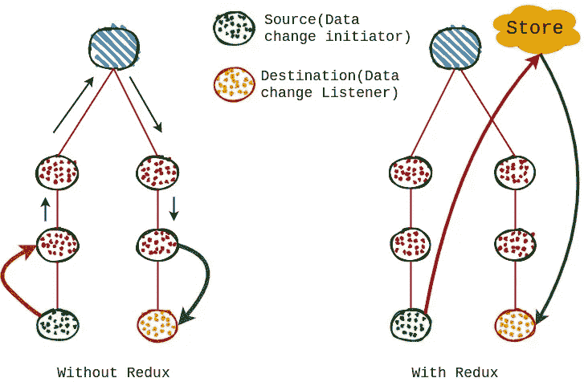
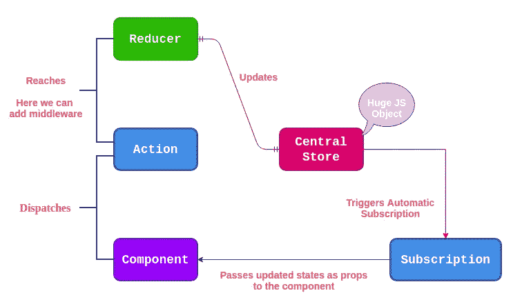

# 还原反应的全流程和设计

> 原文：<https://javascript.plainenglish.io/redux-in-react-complete-flow-and-design-5a0e96d99b69?source=collection_archive---------5----------------------->

## *如果* ***反应过来*** *就是力量，那么* ***反应过来——热毒的*** *就是你的超能力。*

状态变化是 React 做出反应并触发 DOM 重新呈现的唯一事情。*状态是一条数据，您可以在其中存储属于组件的属性*。随着应用程序的增长，管理状态可能很困难。组件之间的数据传输可能会变得非常困难，并且涉及到一长串的道具，这并不是一种优雅的方式。



我们将数据从一个组件发送到另一个组件，但是如果最终所有的东西都是 JavaScript，并且我们将 JS 文件打包作为输出，那么为什么我们不能设置一个全局变量来保存我们整个应用程序的状态呢？我们可以简单地从一个组件更新全局变量，并从另一个组件访问它，而不是将数据从一个组件传递到另一个组件。它将解决管理国家和长支柱链的问题。

问题在于，reactor 不会对以这种方式定义的全局变量中的任何更改做出反应。这就是 Redux 通过提供一个**中心商店来拯救自己的地方。**

# **热毒**

Redux 将这个全局变量作为**中心存储**提供给我们，并为我们提供更新存储(状态)的流程或过程，以便对其做出反应。

Redux 的构建模块:

1.  **中央存储区:**存储整个应用程序状态的巨大 js 对象
2.  **动作:**部件向减速机发送的带类型(描述)的信息包
3.  **reductor:**一个简单的 js 函数，接收旧的状态和动作作为输入，返回更新的状态。它应该只是输入和输出，没有延迟
4.  **订阅:**每当商店状态更新时在组件中触发
5.  **mapStateToProps:** 它将我们需要的部分状态(全局变量)映射到组件道具
    中注意:***use selector****hook 是一种新的&clean way*
6.  **mapdispatchtrops:**它把你想要调度的动作映射到道具的组成部分
    中注意:***used is patch****hook 是一种新的&clean way*
7.  **连接:**该功能用于配置组件中的 mapStateToProps 和 mapDispatchToProps】注意:*如果使用 useSelector useDispatch*则不需要

# **理论**



*   首先创建一个减速器并存储(全局变量)并连接它们
*   从具有类型(描述)的组件调度动作，该动作将到达缩减器*(这里，我们从一个组件发起状态改变)*
*   到达 reducer 后，将应用某种逻辑(基于类型),它将返回一个更新的状态(全局变量)
*   一旦 reducer 更新状态(全局变量)*(在这里，我们可以访问另一个组件中更新的状态)*，组件中的所有订阅都将被触发
*   在订阅中，我们必须指定我们需要状态(全局变量)的哪一部分，即 mapStateToProps，以及我们需要通过 connect 函数调度什么操作，即 mapDispatchToProps。

**注:**动作既没有直达店铺，也没有任何逻辑。它只是一个信使。只有减速器可以更新存储，因此 ***减速器与存储*** 紧密相连。

# **让我们开始**

## **1。安装 Redux**

```
npm install redux
```

## **2。创建一个减速器**

因为我们需要在创建存储时在 **createStore** 函数中传递一个 reducer，因为*存储和 reducer 是强连接的*。

```
const initialState = {
  rank: 1,
  userName: 'ABC',
  country: 'India',
  profession: 'Software Engineer',
};
const reducer = (state = initialState, action) => {
  return { ...state };
};
export default reducer;
```

## **3。使用创建的减速器**创建商店

Index.js 是在我们的应用程序启动之前创建商店的好地方。

```
import { createStore } from 'redux';
const store = createStore(reducer);
```

## **4。连接商店以作出反应**

现在，我们已经使用 redux 创建了一个存储，但是我们需要将它与 react 连接起来，以便 react 知道它。为此，我们需要一个包 **react-redux。**

```
npm install react-redux
```

React-redux 为我们提供 Provider，Provider 包装我们的 app 并注入到 store 中。Provider 是一个助手组件，它允许我们将存储注入到 react 组件中。我们需要在 provider 中传递特殊属性 **store** ，并在其中传递我们创建的 store。

```
import { Provider } from 'react-redux';ReactDOM.render(<Provider store={store}>
                   <App />
                </Provider>, document.getElementById("root"));
```

这样，我们的*商店就连接到了 react 应用程序*。

## **5。在组件**内访问存储、调度动作和订阅

我们不能使用 store.getState()或类似 store.dispatch()的操作直接访问组件中的商店，这是行不通的。React-Redux 应该能够为我们处理这个问题，为此它为我们提供了 **connect** 函数。

```
Syntax of connect,export default connect(***mapStateToProps,* mapDispatchToProps)**(ComponentA)
```

Connect 接受两个参数，分别是**mapStateToProps****(您想要的状态的一部分)和****mapdispatctoprops****(*您想要调度的动作* ) **。**让我们来看看细节:**

## ****5.1。访问商店****

****从中央状态**(或者存储)你想要在组件中的那部分状态，或者从庞大的 JS 对象中你需要的值。**

**在第一个参数中，我们将创建一个变量 mapStateToProps，它存储一个函数，并期望将存储在 Redux 中的状态作为输入，并返回一个 js 对象，该对象映射组件的 Props 中所有传递的属性。**

```
**const ***mapStateToProps*** = centralState => {
  return {
    rank: centralState.rank,
    name: centralState.userName,
  };
};**
```

**考虑一下，我们在中央存储中有四个属性: *rank、username、country、*和 *profession、*，但是我们只对 *rank* 和 user *name、*感兴趣，所以我们可以在 mapStateToProps 内部的对象中传递 rank 和 username。这被称为状态的一部分，这些值将被映射到组件的属性中。可以在组件中以 *props.rank* 和 *props.userName 的形式访问。***

****注意:**这个函数最终会被 react-redux 调用，因为我们会将它传递给 connect。这只是配置我们需要的部件的一种方式。**

## ****5.2。调度动作****

****您想要从组件**分派的动作将到达 reducers 并更新状态。**

```
**const **mapDispatchToProps** = dispatch => {
  return {
    incRank: () => dispatch({ type: "RANK" })
  };
};**
```

**在第二个参数中，mapDispatchToProps 存储一个函数，并期待来自 Redux 的 dispatch 方法，并返回一个对象，该对象将在组件的 Props 中映射该函数的引用。**

**这里，incRank 将被存储在保存 fn 引用的组件的 props 中，并且可以在需要时被调度。现在，您只需点击一个按钮，即可发送该邮件:**

```
**<button onClick={**props.incRank**}>
        Rank Count
</button>**
```

**现在我们需要在 **connect** 函数中传递这两个参数。**

```
**import React from "react"; **import { connect } from "react-redux";**const UserComponent = props => {
  return (
  .....
  );
};const mapStateToProps = centralState => {
  return {
  .....
  };
};const mapDispatchToProps = dispatch => {
 .....
};**export default connect(mapStateToProps, mapDispatchToProps)(UserComponent);****
```

*****注:*** *以上事情(访问存储即 mapStateToProps***和调度动作即 mapDispatchToProps)现在可以很容易地完成，而不需要使用 connect complications。通过使用钩子，上面的代码在使用 connect 时也是有效的，但是使用这些钩子要干净得多。****

*****useSelector:获取状态(或状态的一部分)
useDispatch:分派动作*****

## **上下文 API 能代替 Redux 吗？**

**在小型项目中可以避免 Redux，因为它会增加开发人员的复杂性。React 内置了上下文 API，因此我们不需要任何额外的依赖。它的尺寸更小，实现更简单。然而，目前*上下文 API 对于低频率更新(例如认证)*是好的，但是对于你的应用的状态管理是不好的。**

## ****下一步(又名“你接下来应该学什么”)****

*****中间件* :** 中间件是可以添加在两个进程之间执行某些操作的一段代码。我们之前了解到，reducers 不应该处理任何复杂的任务，而应该只是输入和输出，没有延迟。所以对于异步代码，我们可以添加中间件(Thunk，Saga)。**