# Redux 与 Storeon:应用程序之间的比较

> 原文：<https://javascript.plainenglish.io/redux-vs-storeon-an-app-to-app-comparison-8066c63ad97f?source=collection_archive---------4----------------------->

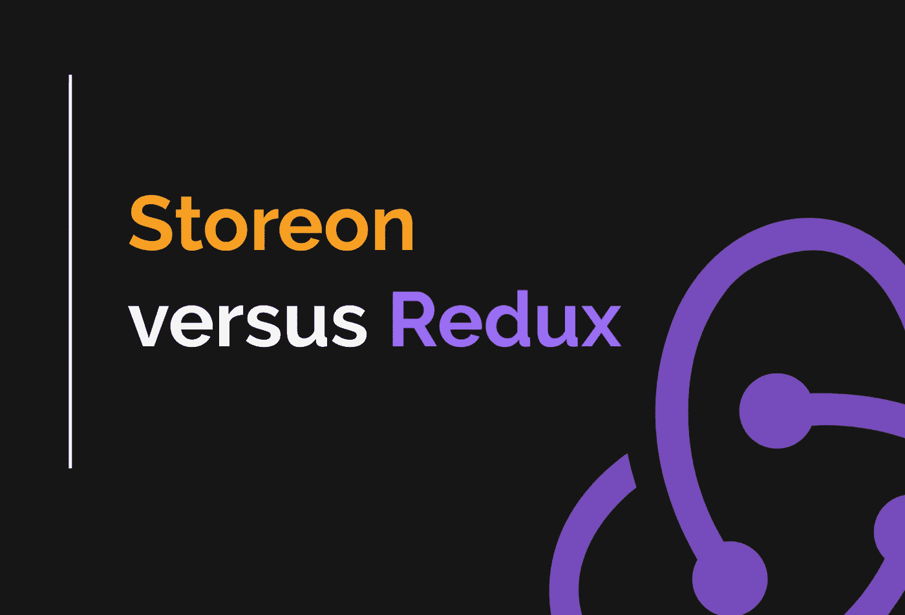

An app to app comparison

长期以来，Redux 一直是 React 应用程序的状态管理库。它可靠、可扩展，而且资源无处不在。

然而，众所周知，Redux 设置往往非常臃肿。编写一个新的 action + action creator + reducer 三重奏需要大量的代码。

即使你正确地组织了你的动作和 reducers，大量的文件跳转也是正常的。

# Storeon: Redux 的性感表妹

如果你一直在纠结 Redux 但是还没有结账离开 Storeon， [*请阅读这篇文章*](https://evilmartians.com/chronicles/storeon-redux-in-173-bytes) *。*

Storeon 是 Redux 的更瘦、更快、更简单的表亲。总结一下好处:

*   **只有 173 字节**。
*   **异步动作内置于**中。
*   **没有选择器功能要处理。**它只重新呈现订阅了已更改状态的组件。
*   **没有将“还原者”和“动作”分开。你可以把所有东西都放在一个地方，同时保持可读性。**

# 基准 React 应用程序

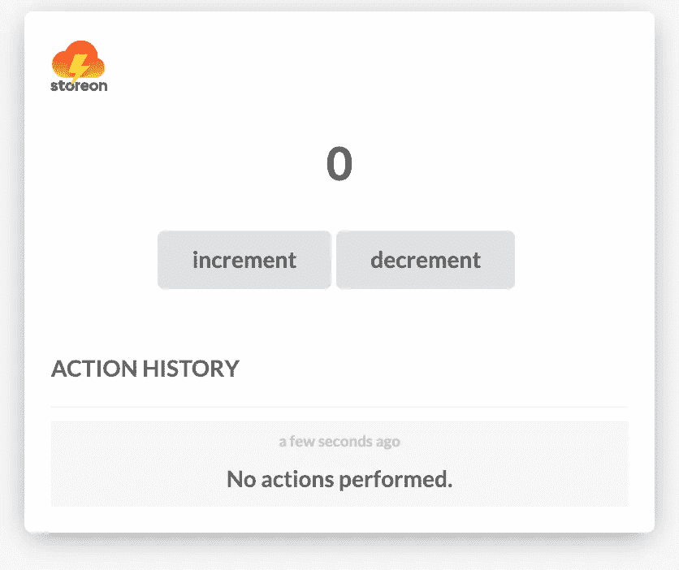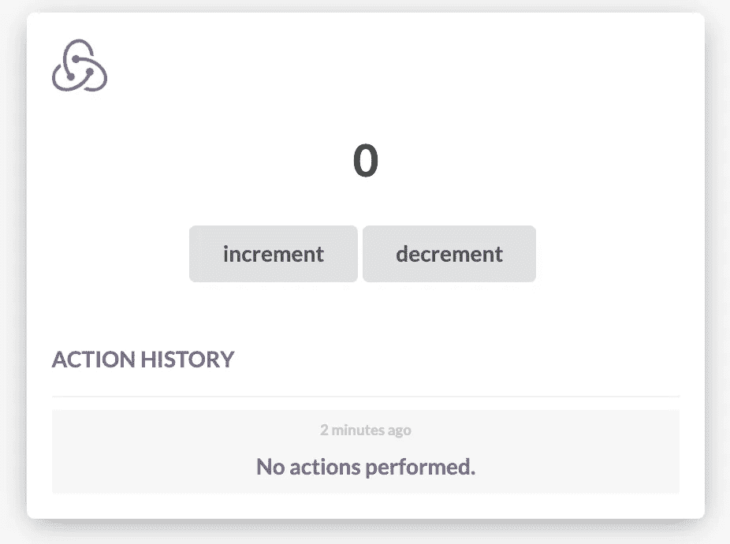

Our Basic Counter App

我构建了两次相同的 React 应用程序:一次由 Redux 支持，一次由 Storeon 支持。该应用程序是一个简单的计数器。计数器的每次更新都会遇到一个假 api (setTimeout 为 1 秒)，设置按钮的加载状态，更新计数器，然后在“动作历史”列表中记录递减或递增。

[***下面是 Redux 项目***](https://codesandbox.io/s/react-redux-letkp) 的链接

[***这里是 Storeon 项目的链接***](https://codesandbox.io/s/react-storeon-counter-e5zyo)

# 文件夹结构

我知道这因项目而异，所以您的体验可能会有所不同。有了 Redux，把你的动作和 reducers 组织到文件夹里也不失为一个好主意。

我们有一个 reducer 负责保持计数，`count.js`，另一个负责记录历史，`history.js`。然后我们将这些减速器组合到我们的`index.js`文件中。

Storeon，正如你将在后面看到的，并不真正需要“动作”和“还原”的分离。使用 Storeon，您可以将数据分解到独立的模块中，由于它们的编写方式，您可以拥有一个整洁的文件夹结构。

下面是 Storeon 的文件夹结构与 Redux 的对比:

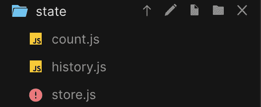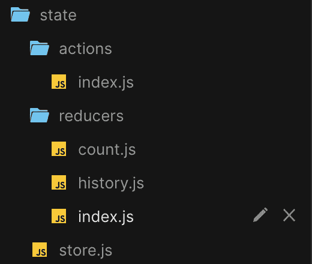

Storeon vs. Redux (folder structure)

使用 Storeon，一个模块负责计数，另一个负责历史记录。文件夹结构简单，不言自明。即使你以前从未使用过 Storeon，你也可以很快地解决问题。另一方面，Redux 在理解文件夹结构之前，需要关于什么构成了一个动作和一个缩减器的上下文。

# 创建商店

使用 Redux，创建一个包含所有我们想要的东西的存储有点冗长。有了 Storeon，事情就简单多了。让我们一起来看看:

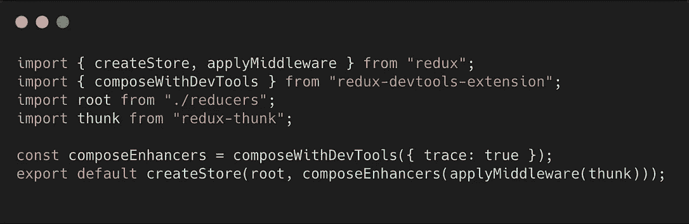

store.js (left: Redux, right: Storeon)

在 Redux 中，如果我们想使用 redux dev 扩展，我们需要`composeWithDevTools`和`composeEnhancers`。如果我们想要 thunk，loggers，analytics middleware 等，就需要`applyMiddleware`函数。

我们从调用`combineReducers`的`reducers/index.js`导入我们的“根”减速器，以便构建这个单根减速器。它看起来是这样的:

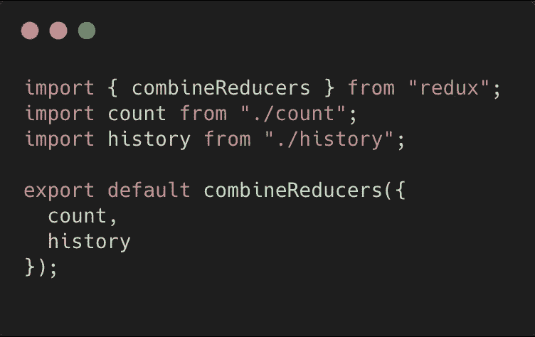

reducers/index.js

因为 Storeon 处理模块，所以你提供给`createStore`的所有东西，包括中间件，都只是一个模块数组！

此外，Redux dev tools 与 Storeon 一起开箱即用。只需安装 redux devtools 扩展，并像任何其他模块一样添加 devtools 中间件。

Storeon 的另一个好处是，如果您的模块列表开始变长，您可以通过下面的例子轻松实现自动化(假设您使用的是 Webpack):

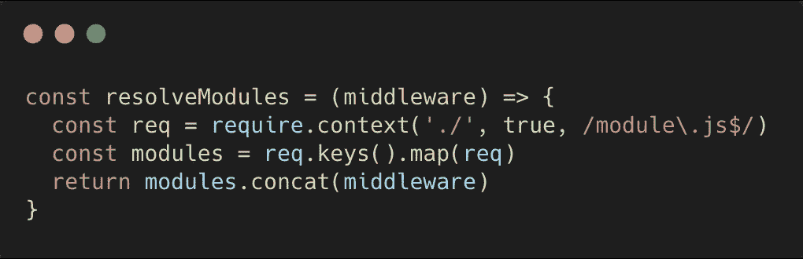

easy module resolver (assumes modules live in same folder as this function)

只要您遵循命名约定`[name].module.js`，您就再也不用担心将您的模块连接到您的商店了！

一个很好的好处是，我们可以使用 redux 开发工具扩展和 Storeon 开箱即用。我们的商店已经设置好，可以由商店提供商使用了。

# 商店提供商

这里没有明显的区别。

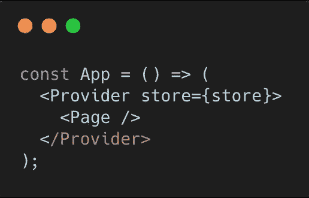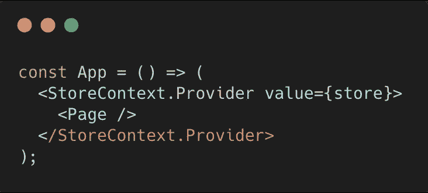

Redux on the left, Storeon on the right

# 动作和减少器(Redux)

正如我们前面在文件夹级别看到的，使用 Redux，我们将我们的 reducers 拆分成单独的文件，然后将它们合并到`/reducers`下的`index.js`文件中，并导出结果供我们的商店使用。

让我们仔细看看 Redux 中用于计数的缩减器是如何设置的:

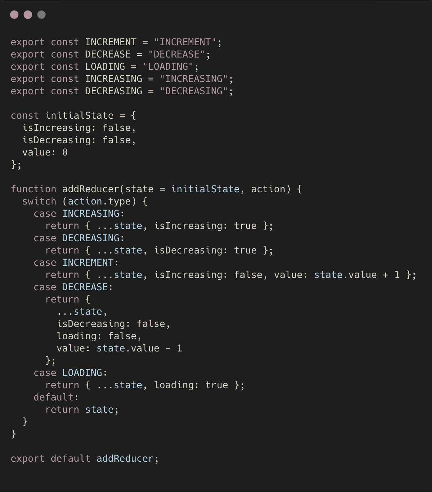

count.js (Redux reducer for our counting state)

给你一些上下文，我们基本上只有一些增加和减少计数器的动作，以及一个让 UI 知道计数器何时“加载”的动作。

Storeon 的减速器是什么样子的？

嗯…如果我向您展示，它会破坏一切，所以请耐心听我展示 Redux 操作创建器来更新计数器:

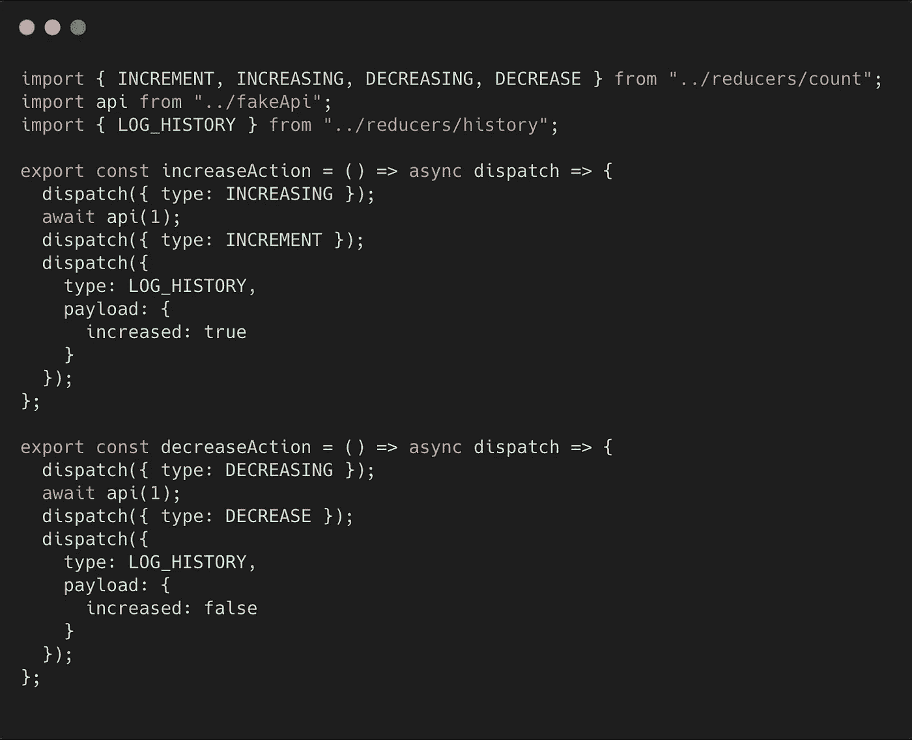

async action creators (Redux)

如果你熟悉 Thunk 中间件，这没什么特别的。

1.  我们分派名为`INCREASING`和`DECREASING`的“加载”动作。
2.  然后我们调用我们的假 api(传入等待的秒数),并在承诺完成时分派我们的`INCREMENT`或`DECREMENT`动作。
3.  然后我们调用一个叫做`LOG_HISTORY`的动作，我们很快就会看到。

如果您习惯于 Redux，这似乎是一个足够简单过程。

# 事件和模块(Storeon)

Storeon 对你们中的许多人来说是新的，所以我将把它分成小块。我们将首先创建一个模块来处理我们的计数器状态。

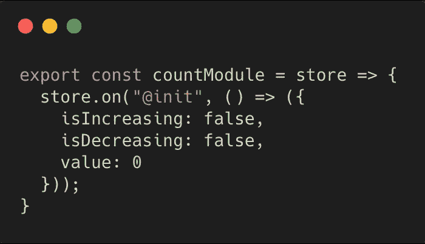

basic module and state initialization

使用 Storeon 时，您可以使用事件和模块。模块是我们如何组织状态逻辑的不同部分，我们在这些模块中设置的事件定义了我们如何与外部世界的状态进行交互。

1.  我们首先创建并导出名为`countModule`的模块。Storeon 将把存储对象传递给我们传递给`createStore`的每个模块，就像我前面展示的那样。
2.  store 对象是我们设置事件和分派动作的方式。Storeon 有一些内置事件，比如`@init`，这是我们设置初始状态的地方。[查看文档，了解其他内置事件。](https://github.com/storeon/storeon#events)

好了，现在还没有足够的证据来对 Redux 和 Storeon 进行比较。让我们添加几个事件，它们将作为 Redux 术语中的“reducers ”:

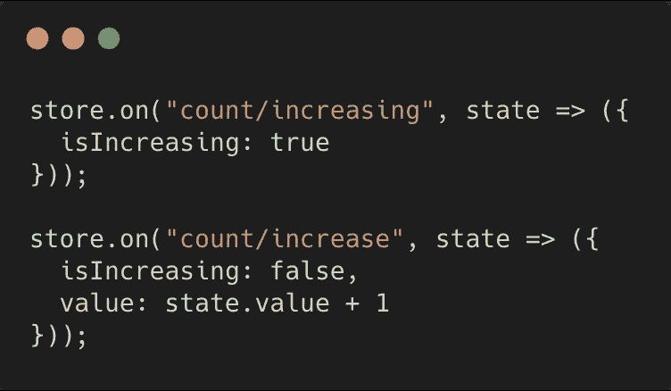

Our first action events!

在初始化事件的正下方，我们创建了两个名为`count/increasing`和`count/increase`的新事件。基本上，这就像我们的“加载与已加载”行为。我们使用路径命名约定`[module-name]/[event-name]`来避免名称冲突，因为 storeon 通过唯一的字符串引用事件(比如 Redux reducers)。

您可能已经注意到，在 Redux 的意义上，没有任何“reducers”和“actions”。在 Storeon 中，我们在 Redux 中使用它们的方式并没有严格区分这两者。

在我们的 UI 中，如果我们调用`store.dispatch('count/increase')`，我们的事件将被触发，状态将被更新。

这太棒了，因为现在我们在一个地方既有我们的“行动”又有“缩减者”，这使得它更容易遵循！

# 事件与动作创建者

让我们创建一个事件，调用我们刚刚创建的这些“reducer”类事件，然后调用一个 api，最后更新我们的计数器。这里有一个截图，左边是我们的 Storeon 事件，右边是我们的 Redux 动作创建器:

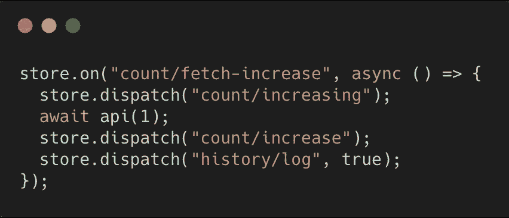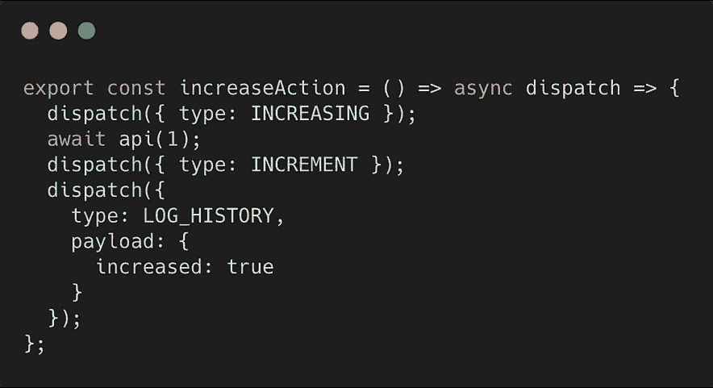

Async actions: Storeon vs. Redux

你觉得哪个看起来更容易理解？Storeon 内置了异步事件。不需要中间件。因为我们的事件是在我们的模块中定义的，我们已经在范围中有了`store`。

你可能也注意到了，我们不需要用 Storeon 返回 state。我们可以分派负责更新状态的其他事件。同样，所有这些都是现成的。

在第`store.dispatch('history/log', true)`行中，我们传递了一个“有效载荷”值，让历史记录器(我们稍后会看到)知道我们增加了一个值，而不是减少了。如果我们愿意，我们可以传递一个数字、一个字符串或一个对象。

请记住，Redux 操作是完全独立于 reducer 定义的。我们的行动住在`actions/index.js` 而我们的缩减者住在`reducers/count.js`。这不一定是 Redux 的要求，但是这个结构让人感觉很受鼓励。另一方面，有了 Storeon，我们可以将所有的逻辑放在`count.js`中，同时仍然保持所有内容的可读性。

# 模块与减速器

我们的`count.js`文件有点长，所以我将向您展示一个与`history.js`文件并排的文件，这样您可以更好地比较 Storeon 模块和 Redux reducer:

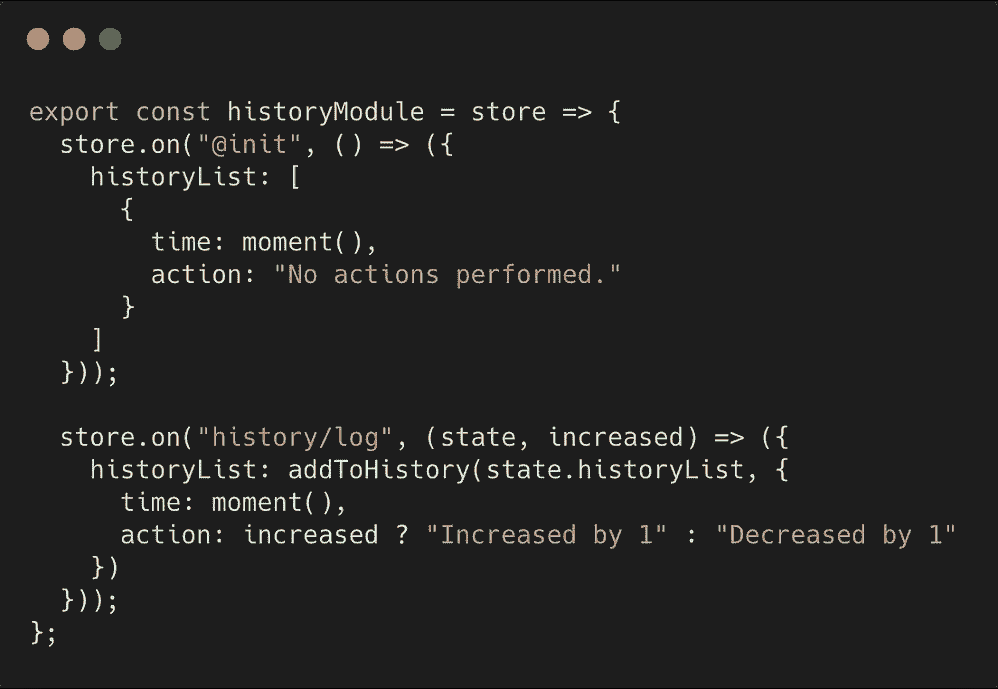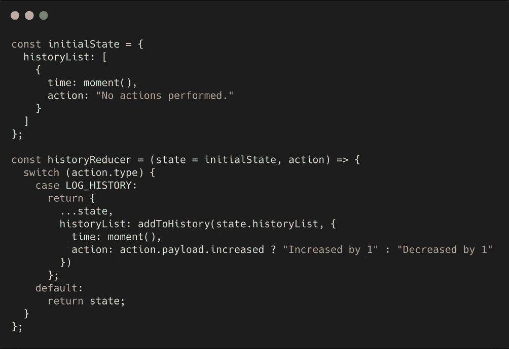

history.js (left: Storeon, right: Redux)

现在直接对比这两个文件也不是 100%准确。尽管我们只是在我们的`history/log`事件中更新状态，就像 Redux 中的`LOG_HISTORY`动作一样，但我们并不局限于此。我们可以很容易地在我们的`history/log`事件下面添加一个触发其他事件的异步事件:

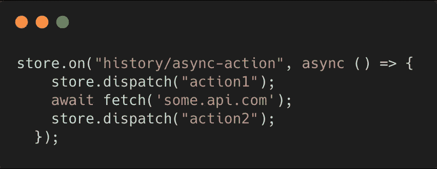

Storeon async event (note: this is not apart of the benchmark app)

使用 Redux，我们不会这样做。我们的减速器就是我们的减速器，就是这样。因此，当我们需要一些异步功能和多个触发动作时，我们必须在其他地方创建一个 thunk。

# 选择状态和调度操作

幸运的是，React Redux 引入了钩子，所以实际上获取状态和分派动作真的不是问题。这是 Storeon 和 Redux 的并排图:

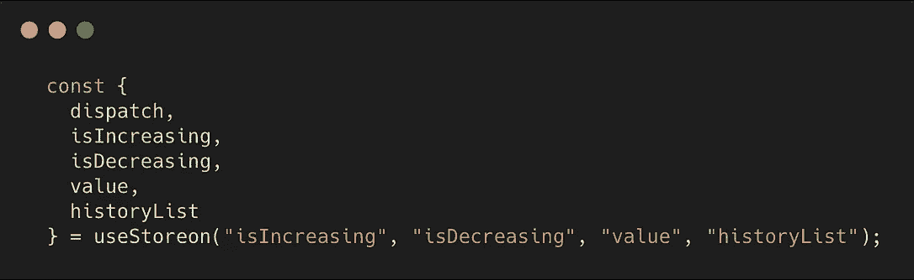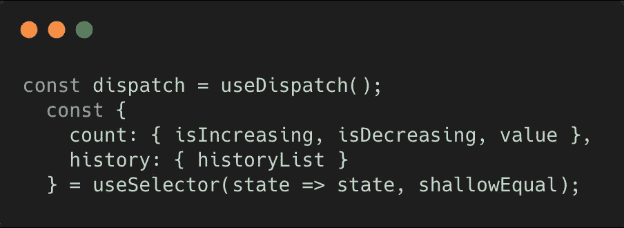

Storeon vs. Redux

Storeon 在左边，我们只需要指定从 state 中提取的变量的名称。这让 Storeon 知道组件需要监听状态的哪一部分进行更新，同时也防止了不必要的重新呈现。我们也可以直接从`useStoreon`中拉出调度功能。

redux 在右边，我们进行一个单独的`useDispatch`调用来获得调度函数。我们还需要一个选择器函数来确定返回哪个状态片段。这需要一些小心的处理来确保我们没有订阅我们不需要的状态。我们还可以传递一个比较函数，在本例中是`shallowEqual`。

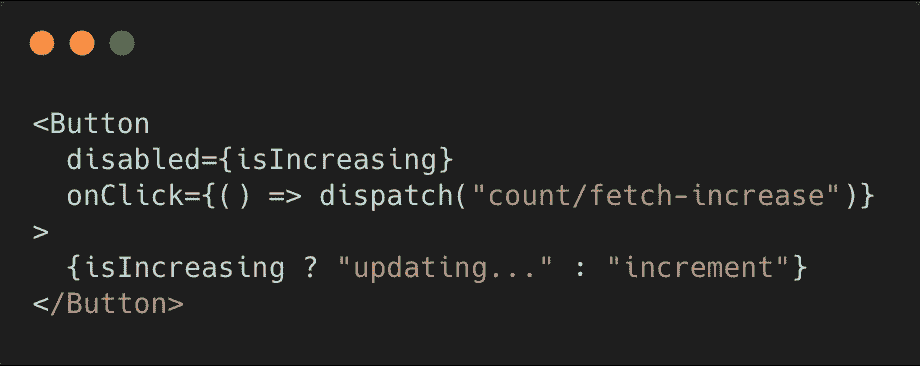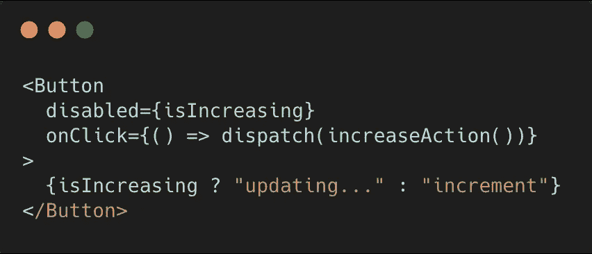

The button to increment our counter

这里很相似。Storeon 的一个好处是我们不需要像 Redux 版本那样导入任何东西。我们通过它的事件名来调度它，传递我们需要的任何值，就这样。

也就是说，您可能希望至少从您的模块中导出事件名称，这样您就不必在每次更改名称时都更新引用。

# 资源和文档

没有可比性。你所有的冗余问题可能都已经被问过和回答过了。文档非常丰富。另一方面，Storeon 除了它的 Github 文档、一些 Github 问题和几篇文章(不包括这篇文章)之外没有更多的东西。

# 以打字打的文件

Storeon 附带了 TypeScript 声明！由于 Storeon 的简单性，为模块和状态创建类型比用 TS 编写的典型 Redux 应用程序要少得多。

# 哪个更好？

你可以看出我非常倾向于 Storeon。它是轻量级的，很容易上手，可读性很强，很容易组织，并且解决了 Redux 普遍存在的许多问题。

也就是说，我意识到我用一个玩具应用程序来比较这两者。

对于需要细粒度性能调优、良好支持的库以及大量学习资源、扩展和开发人员的大规模应用程序，Redux 显然是赢家。

在 Storeon 在大型应用程序上测试之前，很难确切地说出它与 Redux 相比有多有限(或多强大)。

然而，如果您厌倦了在构建中小型应用程序时使用 Redux 带来的麻烦，Storeon 可能是您一直在寻找的金矿。

**这是判决结果**

*这取决于你的项目！如果你有一个中小型的网络应用，试试 Storeon 吧。你不会后悔的。如果您正在从事一个大型项目，Redux 可能是目前更安全的选择。*

# 最后的话

随着我对 Storeon 越来越熟悉，以后我会写更多关于它的内容。我在当前的项目中使用这两个状态管理库，到目前为止，我还没有找到一个理由*不*切换到 Storeon。

如果你喜欢这样的文章，请分享给你的开发者朋友！也可以[在 instagram 上找我。](https://www.instagram.com/krisguzman_dev/)