# 面向初学者的 Redux 演练

> 原文：<https://javascript.plainenglish.io/redux-walkthrough-b11dbfb48d61?source=collection_archive---------3----------------------->

在 React 世界中，状态管理已经走过了漫长的道路。我们可以在组件级、Redux 或 React 钩子上使用本地状态。我学习了组件级和 Redux 的本地状态，并在我的辅助项目中实现了它们。在我学习 Redux 期间，我理解了每个概念的作用，但不理解它的整体流程。每当我学习一个新的 Redux 概念时，我都练习键入必要的代码，直到它成为肌肉记忆但未能看到全貌。每个概念是如何融入 Redux 的整体范围的？

在我们开始这篇博客的其余部分之前，我想对我的技术教练 Jeff 说一声，因为他对 Redux 的评论减轻了我 99.9%的困惑。

**请注意:**本演练并不是关于 Redux 机制的详尽自述。这意味着从头到尾展示 Redux 本身的整体实现，以及概念之间的联系。这也是我理解 Redux 帮助我记忆的方式。你可能有的任何问题都可以在 [Redux 文档](https://react-redux.js.org/)中找到。

# 安装 Redux 和 React-Redux

为了开始演练，我们需要安装 Redux 和 React-Redux。根据 Redux 文档:

> React Redux 7.1 需要 React 16.8.3 或更高版本。
> 
> 要在 React 应用程序中使用 React Redux:

```
npm install react-redux
```

我们还需要安装 redux:

```
npm install redux
```

到目前为止，一切顺利。

# 冗余流量

在我们开始实现 Redux 之前，对 Redux 流有一个整体的了解是有益的。理解这个流程帮助我理解了逻辑是如何以及为什么从 A 点到 b 点的。

以下是 Redux 流程的流程图:

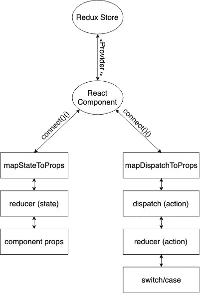

Redux Flow Chart

不要担心一开始会有很多东西需要接受。随着博客的深入，流程图的适用部分将会突出显示。当我们沿着流程图往下走时，会有截图和要点的混合。截屏的目的是展示文件结构，这是我在使用 Redux 时学到的最佳实践。

在演练中，我将制作一份购物清单。这是我在技术面试中看到并要求做的一个很常见的例子。我知道使用组件状态管理将会更加有效和简单，因为这是一个单页面应用程序，但是它没有忽略 Redux 将会实现相同结果的事实。

# 创建和链接 Redux 存储

让我们从流程图的顶部开始。

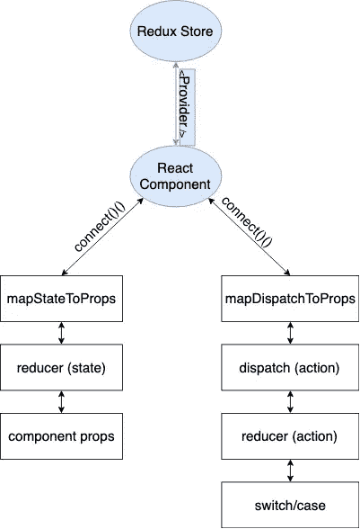

您可以将 Redux 和应用程序视为两个独立的实体。应用程序的状态存在于 Redux 存储中，而应用程序不直接知道它的状态，这与组件状态管理不同。为了桥接 Redux 和应用程序，从 React-Redux 库中导入提供者组件(如第 6 行所示)并将应用程序包装在一个`<Provider />`标记中(如第 13–15 行所示)。我们还将`store`属性设置为在第 10 行创建的 store 变量。

根据[文件](https://react-redux.js.org/api/provider)，

> `<Provider />`使 Redux `store`对任何已经被包装在`connect()`函数中的嵌套组件可用。
> 
> 由于 React Redux 应用程序中的任何 React 组件都可以连接，大多数应用程序将在顶层呈现一个`<Provider>`，整个应用程序的组件树都在其中。
> 
> 通常，您不能使用连接的组件，除非它嵌套在`<Provider>`中。

那么`createStore`和`groceryListReducer`呢？

一个`store`是 Redux 保存应用程序状态的地方。这意味着存储可以同时保存多个不同的状态。当应用程序扩展并在多个不同的组件上有多个不同的状态时，这尤其有用。注意 Redux 应该只有 ***一个*** 店铺。

`createStore`创建一个新的`store`，其中您必须至少在其参数中传递一个 reducing 函数。该减少功能应返回基于该动作的新状态。(本演练稍后将详细讨论这些操作)。我在第 7 行导入了`createStore`函数，在第 10 行创建了一个新商店，并在创建新商店时将`groceryListReducer`作为参数传递。

`groceryListReducer`是我创建的一个减速器函数。这是在第 8 行导入的，用作`createStore`的参数。通常 reducer 函数包含在它们自己的文件夹中。下面是我在其他应用程序和`groceryListReducer`功能中使用 Redux 时使用的文件夹结构截图。

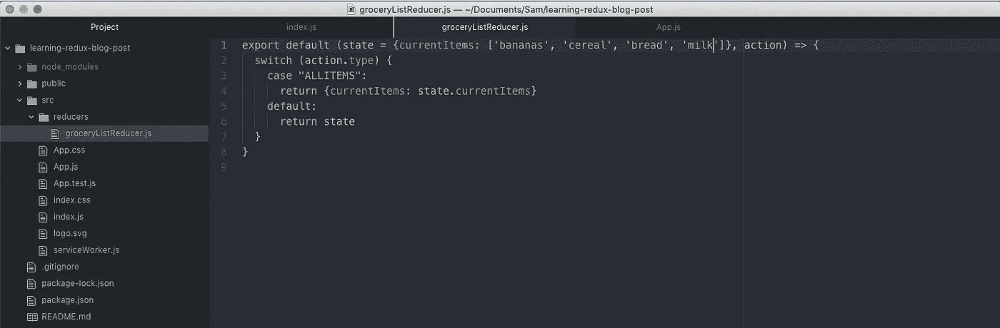

现在不要担心`groceryListReducer`函数做什么。这个截屏的目的是显示文件结构和 reducer 函数的存在，以便创建商店。我们将在讨论`mapDispatchToProps`时深入探讨。

# mapStateToProps

让我们看看流程图的左分支。

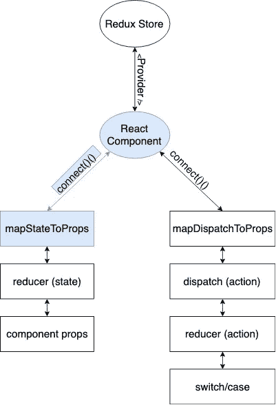

`mapStateToProps`是一个函数，它接受一个参数，传统上称为状态，并返回一个对象。返回的对象将作为道具包含在调用`mapStateToProps`的组件中。下面是实现`mapStateToProps`之前 App.js 文件的要点。

如果您按原样运行，下面的屏幕截图将显示在窗口和控制台中:

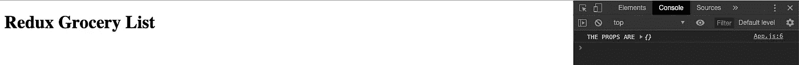

Before Implementing mapStateToProps

让我们创建`mapStateToProps`函数并在应用程序中实现它(第 15–19 行)。

下面是创建`mapStateToProps`函数后的窗口和控制台截图:

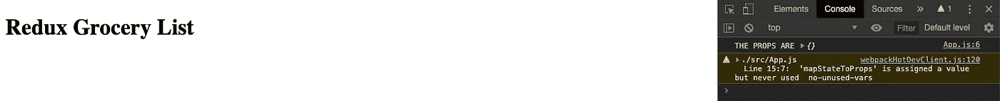

After Implementing mapStateToProps

但是等等…道具里没有还原状态。怎么回事？

这是因为 Redux 存储与组件本身之间没有连接。为了让组件连接到 Redux 存储，组件需要用`connect()`函数包装。

你可能想知道，`<Provider />`和`connect()` 函数有什么区别？为了简化起见，`<Provider />`让组件 ***访问*** 到 Redux 存储(就像看门人一样),而`connect()`函数是 Redux 存储和组件之间的桥梁，或者说 ***连接*** 离子。

对于`connect()`函数的深入解释，您可以阅读它的[文档](https://react-redux.js.org/api/connect)，但是出于本演练的目的，要知道它是一个[高阶组件](https://reactjs.org/docs/higher-order-components.html)，它最多接受两个参数`mapStateToProps`和/或`mapDispatchToProps`。第一个参数指向`mapStateToProps`，第二个参数指向`mapDispatchToProps`。

现在我们对`connect()`有了一个大致的了解，让我们将它实现到应用程序中。

在第 4 行中，`connect()`函数是从 React-Redux 导入的。在第 25 行中，`connect()`函数用`mapStateToProps` 函数包装了 App 组件。下面的截图是实现`connect()`功能后的窗口和控制台。

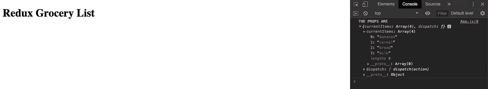

Implemented Connect Function

万岁！我们的道具终于有了还原状态！我们现在可以像操作 React 组件中的任何其他属性一样操作这个属性中的数据。

但是国家从何而来？

# 减速器功能中的状态

这是从我们的`groceryListReducer`传来的！

Grocery List Reducer Function

上面的要旨与“创建和链接 Redux Store”一节中提到的 reducer 函数截图相同。`state`的默认值是对象`{currentItems: [‘bananas’, ‘cereal’, ‘bread’, ‘milk’]}`。

**这个状态，或者说这个减速器功能的第一个自变量，就是** `**mapStateToProps**` **功能所指的地方。**

虽然这个演练有点操之过急，但下面的流程图突出了`mapStateToProps`、减速器功能和组件道具之间的相关性。

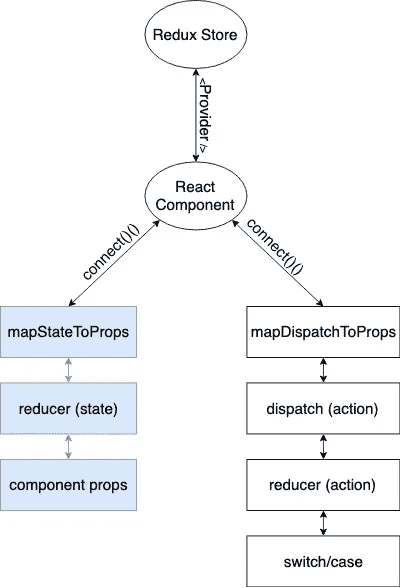

# **mapDispatchToProps**

是时候看看流程图的右边分支了。

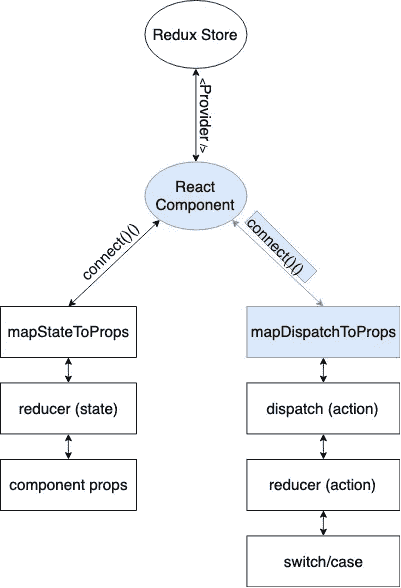

`mapDispatchToProps`是一个函数，允许您创建在被调用时被调度的函数。那些创建的功能也是组件道具。这可能一开始听起来有点混乱，所以让我们一步一步来。

首先，让我们创建`mapDispatchToProps`函数，并通过`connect()`函数将其连接到组件。

**注意:**如果您的组件只需要调度功能，您可以将`mapStateToProps`替换为`null`，如下所示:

`connect(null, mapDispatchToProps)(YOUR COMPONENT NAME HERE)`

在上面的要点中，第 25–29 行创建了`mapDispatchToProps`函数。它返回一个对象，它的键是`addItem`，而它的值是一个回调函数。这个回调函数 ***调度*** 一个 ***动作*** 名为`actionIsToAddTheNewItem`，其参数为`newItem`。

# 将 DispatchToProps 映射到操作

进入流程图的下一步:


目前，在演练的这一点上，应该会出现一个错误，指出没有定义`actionToAddTheNewItem`。所以，我们来定义一下。因为这是一个动作，我通常会将我的动作放在一个单独的文件夹中，类似于我对 reducing 函数所做的。


创建动作后，记得将其导入到适当的组件文件中(在本例中是 App.js)。

通常，一个动作返回一个具有两个键值对的对象:一个键为`type`，另一个键为`payload`。`type`键是一个保留键/字，其 ***必须与减速器功能中的*** 匹配，以便执行正确的动作。`payload`键是为了完成所述动作而发送的数据本身。

下面的要点显示了已完成的`actionIsToAddTheNewItem`。

# 发送至减速器至开关/外壳

这移动到流程图的下一步。

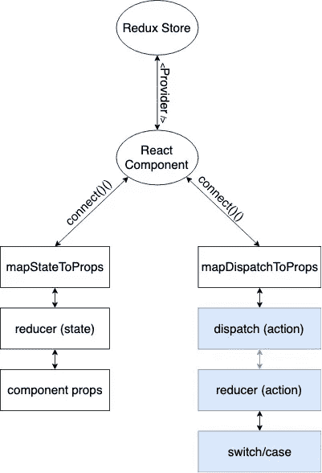

现在将根据 reducer 函数中的开关情况逻辑来执行分派的动作。这就是`groceryListReducer`功能的第二个参数的目的。由于`groceryListReducer`函数目前没有`"NEWITEM”`的 case，应该和`actionIsToAddTheNewItem`函数中的`type`一样，所以我们来添加一下。这显示在下面要点的第 6–9 行。

在所有 reducer 函数中，每种情况都根据预期的动作返回新的状态。对于这种情况，`“ADDITEM”`应该返回一个新的状态，从有效载荷中添加新的项目(即`action.payload`)。通过 spread 操作符复制和创建项目当前状态的新数组，并将新项目追加到新数组的末尾，来执行此操作。由于使用了相同的关键字`currentItems`，旧的`currentItem`状态(在分派动作之前)被新的`currentItem`状态(在完成动作之后)覆盖。

# 执行派单

现在已经完成了`mapDispatchToProps` 函数、动作和 reducer 函数，我们如何分派一个动作呢？分派动作通常在事件发生时发生(例如，点击、提交、onChange 等)。)

为了演示这一点，让我们制作一个表单，向当前的杂货列表中添加一个新项目。

在上述要点的返回部分，添加了新代码来呈现当前的项目列表，在底部添加了一个表单，并通过本地状态管理使输入字段成为受控组件。可以通过 Redux 管理输入的状态，但是为了一致性和简单性，我们将只管理条目的状态。

目前，该窗口看起来像下面的截图。


下面是组件的道具截图。

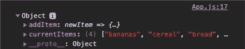

从截图来看，`addItem`调度员在我们的道具里。在提交表单时，应该执行`addItem`调度程序，使新项目附加到我们的`currentItems`属性中，然后呈现在列表的底部。

第 31 行的表单中添加了一个`onSubmit`属性。`onSubmit`属性指的是第 16–20 行上的一个名为`handleSubmit`的回调函数。`handleSubmit`函数停止 post 动作的默认执行，然后执行`addItem`调度程序。`addItem`调度程序执行“调度减速器至开关/机箱”一节中解释的流程。新项目将被追加到 Redux 存储中。当新的项目被添加到 Redux 存储中时，React 将被 ping 到状态已被更改，导致重新呈现，并因此在列表的底部呈现新的项目。

# 结论

Redux 有很多小步骤。困难不在于理解每一步，而是所有这些步骤是如何结合在一起的。第一次尝试不懂 Redux 也不用担心。我绝对没有。我花了整整三天时间才掌握 Redux，更不用说执行它了。本演练的目的是尝试了解每个步骤如何适应 Redux 的整体流程，并成为一个独立的代码。

希望这个演练有助于澄清您对 Redux 的理解！如果这让你更加困惑，欢迎来到编码生活！