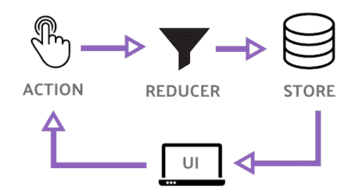
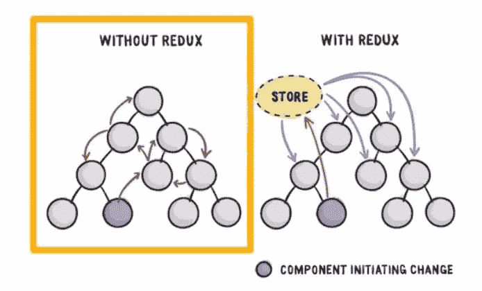
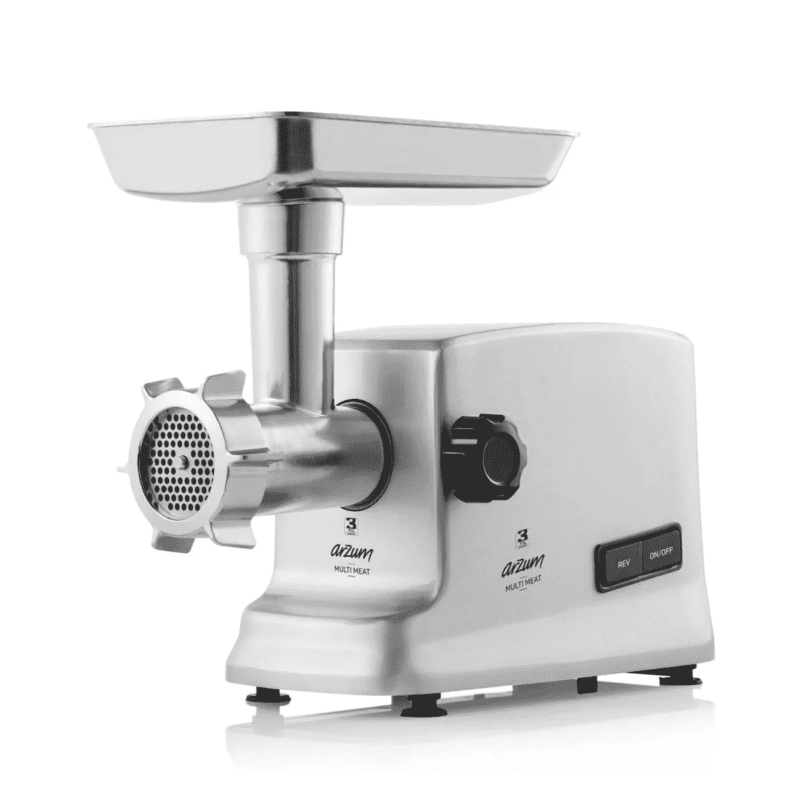

# Redux with React 很简单

> 原文：<https://javascript.plainenglish.io/redux-with-react-is-simple-3e3480a83432?source=collection_archive---------6----------------------->

*亲爱的读者*，Redux 一开始可能很难理解。相信我，这很容易。它将帮助您在前端存储数据，以便您以后可以在组件中使用它。

**Redux 是 JavaScript 应用**的可预测状态容器。它帮助您编写行为一致、在不同环境(客户机、服务器和本机)中运行、易于测试的应用程序。

React 应用程序中的 Redux 已经成为构建可伸缩 React 应用程序的行业标准。

观看此视频，我在下面的视频中用一个例子教这篇文章



# 为什么是 Redux？

通常，我们将状态作为**道具**从父组件传递到子组件，反之亦然。假设你要传递一个组件从低到高三步你要传递的是三次。这叫做**组件钻孔**。

而 redux 中的**所有数据都存储在存储器**中。当**任何组件需要数据时，它连接到存储并获取数据**。



# 冗余原则

*   ***店铺不能直接*** 更改，**店铺只能通过发出动作**来更改。*每个像提交表单这样的动作都会发出一个动作*。例如，用户可以点击按钮来提交联系人表单，这将触发 SUBMIT_CONTACT_FORM 动作。
*   ***状态变化而由纯功能处理的称为*** 。 ***减速器更新状态*** 。

**Reducer 是一个接受当前状态的函数和一个动作**，它返回一个新的状态。每个动作/操作由一个或多个**减速器处理，这些减速器更新单个存储器**。减速器接收当前状态和动作，它包含 if 开关检查动作类型，并返回新状态。reducer 返回新状态后，存储被更新。React 重新呈现利用数据的组件。

# 1.行动

**Redux 是一个状态管理框架，更新状态是其核心任务之一**。在 Redux 中，**所有的状态更新都由调度动作**触发。

**一个动作只是一个 JavaScript 对象，它包含关于已经发生的动作事件的信息**。操作必须有一个属性类型和一个可选的有效负载

```
const action = {
    type: ‘LOGIN’
};
```

创建一个动作后，下一步是将该动作发送到 Redux 存储，这样它就可以更新它的状态。动作创建器只是一个返回动作的 JavaScript 函数。

```
const action = {
    type: ‘LOGIN’
};// action Creator
const actionCreator = () => {
   return action; 
}
```

可以总结，写成动作创作者

```
const actionCreator = () => {
   return { type: ‘LOGIN’ } 
}
```

*另一个* ***的例子*** *一个动作率电影并且有一个有效载荷*

```
rateMovie(rating) {
    return { type: RATE_MOVIE, payload: rating }
}
```

您可以将可序列化的内容传递给 JSON。你不应该传递函数。rateMovie 是一个动作创作者。

## 调度操作事件

`dispatch`方法用于将动作分派给 Redux 存储。调用`store.dispatch()`并传递从动作创建者返回的值会将动作发送回商店。

```
store.dispatch(actionCreator());
store.dispatch({ type: 'LOGIN' });
```

示例:这里我们将登录操作创建者发送到商店

```
const store = Redux.createStore(
   (state = { login: false }) => state
);const loginAction = () => { 
   return { type: 'LOGIN' }
}; // Dispatch the action 
store.dispatch(loginAction());
```

# 2.还原剂

**Reducer 是接受当前状态和动作**并返回新状态的函数。每个动作/操作由一个或多个**减速器处理，这些减速器更新单个存储**。

请注意，reducer 从不调用 API 端点，也从不隐藏任何意外。**reducer 只是一个纯粹的函数，它接受状态和动作，然后只返回一个新的状态**。

为了改变存储，我们调度一个最终由 reducer 处理的动作。它就像一台绞肉机



```
function myReducer(state = initialState, action){
    // Return new state based on action passed
}
```

示例:句柄增量计数器

```
function myReducer(state, action){
    switch(action.type){
        case "INCREMENT_COUNTER":
            state.counter++;
            return state;
        default:
            return state;
    }
}
```

注意:(你不能这样做你是变异状态正确的一个)`creating the new object by copying the existing state. and on that new object increment the counter.`

还原剂必须是纯功能，不能有副作用。用同一组参数调用它们总是会返回值。

```
function myReducer(state, action){
    switch(action.type){
        case "INCREMENT_COUNTER":
            return {...state, counter: state.counter + 1};
        default:
            return state;
    }
}
```

Reducers 应该返回状态的更新副本。Redux 将使用该副本来更新存储。

```
const defaultState = {
   login: false
};// Reducer
const reducer = (state = defaultState, action) => {
   if (action.type === ‘LOGIN’) {
       return {…state, login: true}
   } else {
       return {…state, login: false}
   }
};const store = Redux.createStore(reducer);const loginAction = () => {
     return { type: ‘LOGIN’ }
};
```

## **使用 switch 语句在单个减速器中处理多个动作**

```
const defaultState = {
  authenticated: false
};const authReducer = (state = defaultState, action) => {  switch(action.type){
 case ‘LOGIN’:
       return {…state, authenticated : true}
 case ‘LOGOUT’:
       return {…state, authenticated : false} 
 default:
       return state
}
};const store = Redux.createStore(authReducer);const loginUser = () => {
   return { type: ‘LOGIN’ } 
};const logoutUser = () => { 
   return { type: ‘LOGOUT’ }
};
```

移除**魔法线**是一个很好的做法。将动作类型指定为只读常量，然后在使用这些常量的地方引用它们。所以我们通过添加`LOGIN`和`LOGOUT`作为`const`来重构上面的代码。

```
const LOGIN = 'LOGIN';const LOGOUT = 'LOGOUT';const defaultState = {
  authenticated: false
};const authReducer = (state = defaultState, action) => {  switch(action.type){
 case LOGIN:
       return {…state, authenticated : true}
 case LOGOUT:
       return {…state, authenticated : false} 
 default:
       return state
}
};const store = Redux.createStore(authReducer);const loginUser = () => {
   return { type: LOGIN } 
};const logoutUser = () => { 
   return { type: LOGOUT }
};
```

# 3.商店

Redux `store`是保存和管理应用程序`state`的对象。Redux 对象上有一个名为`createStore()`的方法，用于创建 Redux `store`。该方法将一个`reducer`函数作为必需的参数。

```
const reducer = (state = 5) => { return state;}let store = Redux.createStore(reducer)
```

redux 遵守单一责任原则。

Store = >存储状态变化的数据和 Reducer 关注点。

Redux store 对象提供了几种允许您与之交互的方法

## 商店可以

*   store.dispatch(操作)
*   store.subscribe(操作)
*   store.getState()
*   替换减速器(nextReducer)

`The only way to change a store by dispatching an action. Store cannot be changed directly. Actions are handled by reducers.`

例如，您可以使用`getState()`方法检索 Redux store 对象中保存的当前`state`。

```
const store = Redux.createStore(
    (state=5) => state
);let currentState = store.getState();
```

**注册一个商店监听器**

在 Redux `store`对象上可以使用的另一个方法是`store.subscribe()`。这允许您为存储订阅侦听器函数，每当针对存储调度一个操作时都会调用这些函数

```
const ADD = 'ADD';const reducer = (state = 0, action) => {switch(action.type) {
 case ADD:
   return state + 1;
 default:
   return state;
 }
};const store = Redux.createStore(reducer);let count = 0;store.subscribe( () => {
    count++;
 }
);store.dispatch({type: ADD});console.log(count);store.dispatch({type: ADD});console.log(count);store.dispatch({type: ADD});console.log(count);
```

它将在每次调度操作时订阅并打印计数器 1、2、3。

# 单存储多减速器

您可以通过 redux 中的多个 reducers 来管理状态变化的片段。当一个动作被调度时，所有的 reducers 都被调用。每个 reducer 中的 switch 语句查看动作类型，以确定它是否有什么要做的。这就是为什么所有的 reducers 都应该返回默认的非接触状态。这样，没有案例与传递的操作相匹配，将返回现有状态。

例如，我有三个 reducers LoadStatus、Courses 和 Authors，只有处理 DELETE_COURSE 动作类型的 reducer 会做任何事情。其他人将简单地返回传递给他们的状态。每个缩减器处理它的状态部分。事实上，每个缩减器只传递它的状态片段。因此它只能访问它所管理的那部分状态。

因此，虽然 redux 只有一个存储，但是创建多个 reducers 允许独立地处理对存储的不同部分的更改。所有的减速器共同构成了商店里的图片。

编写独立的小 reducer 函数，负责对状态的特定部分进行更新。我们称这种模式为“减速器组合”。一个给定的动作可以由它们中的全部、部分或全部来处理。”

每个动作可以由多个减速器处理。每个减速器可以处理多个动作。

检查以下项目:不久我会添加更多的这篇文章。

```
const rootReducer = Redux.combineReducers({
  auth: authenticationReducer,
  notes: notesReducer
});
```

例子

```
const INCREMENT = 'INCREMENT';
const DECREMENT = 'DECREMENT';const counterReducer = (state = 0, action) => {
switch(action.type) {
    case INCREMENT:
         return state + 1;
    case DECREMENT:
         return state - 1;
    default:
         return state;
 }
};const LOGIN = 'LOGIN';const LOGOUT = 'LOGOUT';const authReducer = (state = {authenticated: false}, action) => {
 switch(action.type) {
     case LOGIN:
           return { authenticated: true }
     case LOGOUT:
           return { authenticated: false }
     default:
           return state;
 }
};const rootReducer = Redux.combineReducers({
      auth: authReducer,
      count: counterReducer
})
const store = Redux.createStore(rootReducer);
```

# 向商店发送行动数据

**在** [**Instagram 上关注我**](http://instagram.com/hidayatarg) 📷**[**Linkedin**](https://www.linkedin.com/in/hidayatarg/)**💬**。******

****[](https://github.com/hidayatarg/React-Redux-Basic-Template) [## hidayatarg/React-Redux-Basic-Template

### 这个项目是用 Create React App 引导的。在项目目录中，您可以运行:在…中运行应用程序

github.com](https://github.com/hidayatarg/React-Redux-Basic-Template) ****