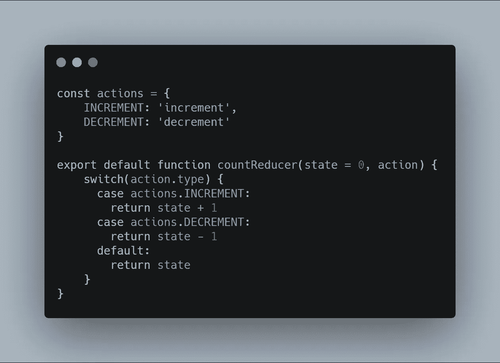
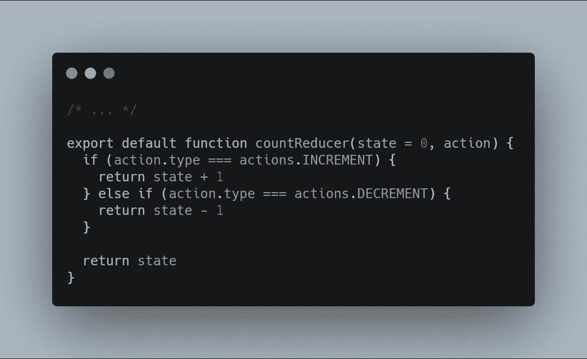
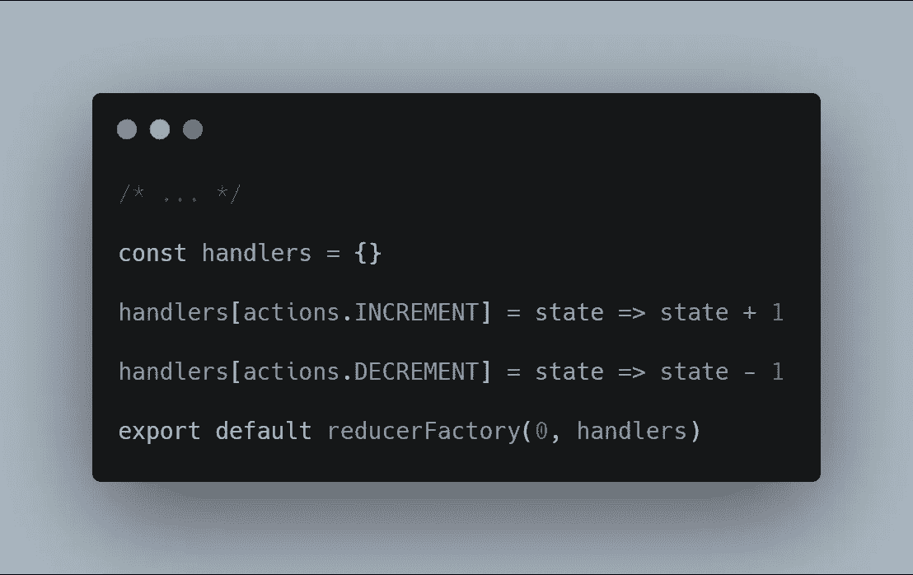
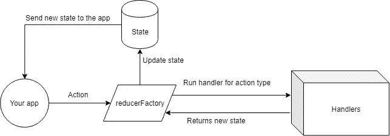
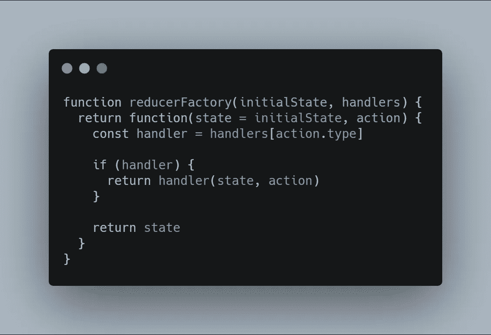
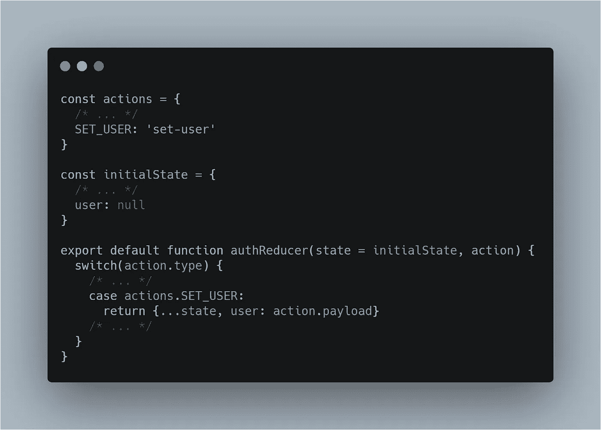
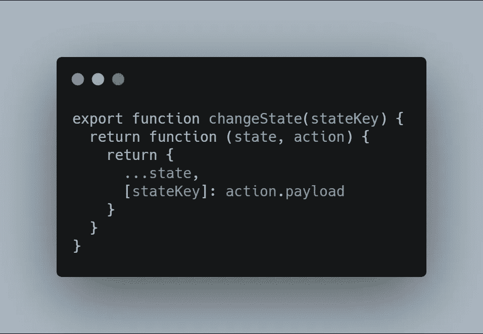
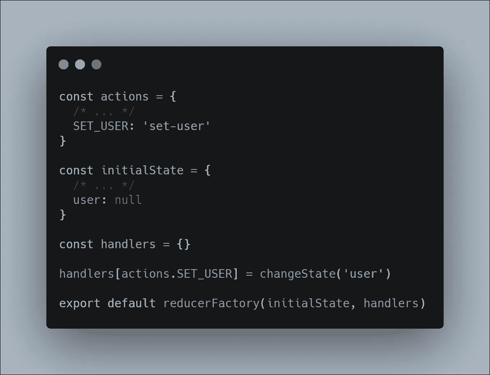
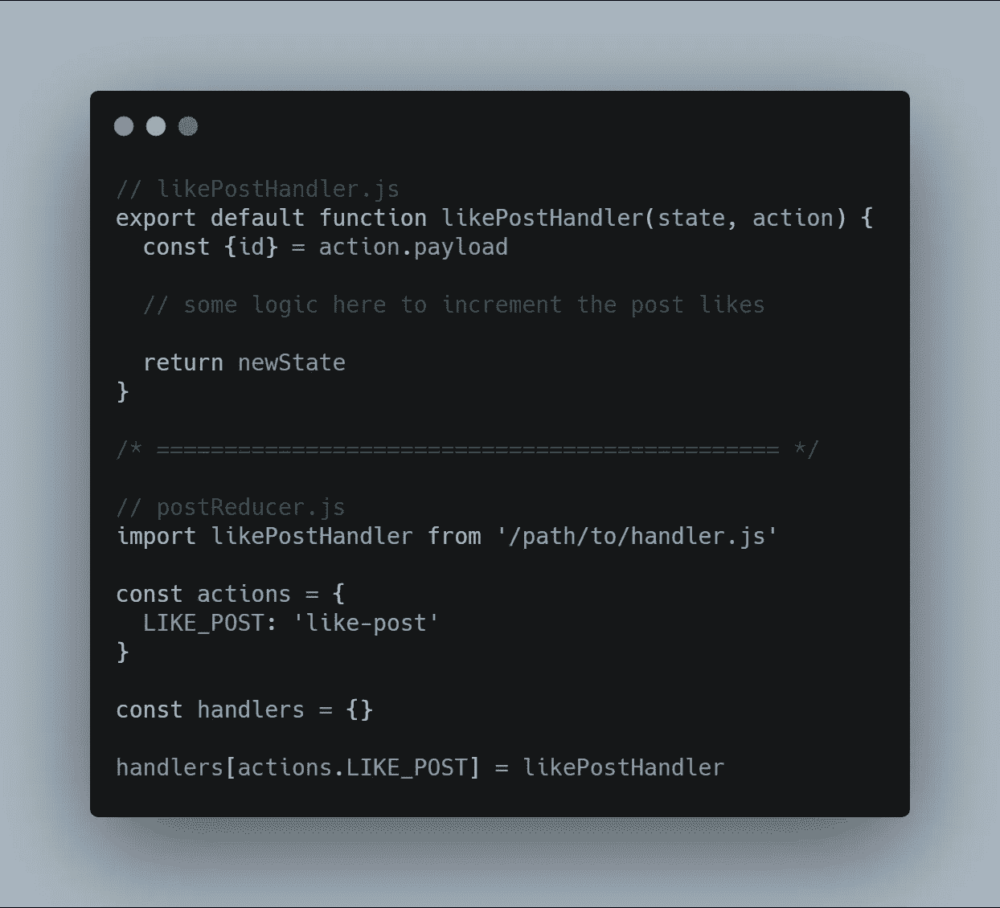

# 没有开关盒的 Redux(和其他一些技巧)

> 原文：<https://javascript.plainenglish.io/redux-without-switch-cases-and-some-other-tips-6a3d27157da6?source=collection_archive---------0----------------------->

**【更新】:嘿，伙计们，我写这篇文章已经有很长时间了，自从**[**@ reduxjs/toolkit**](http://twitter.com/reduxjs/toolkit)**被添加为 redux 开发的官方推荐以来，这篇文章目前毫无用处，redux toolkit 中的片段相当于我们在这篇文章中看到的，如果你出于任何原因不使用 redux toolkit，它可能仍然会对你如何构造你的 reducers 提供一些见解和想法。**

大家好，今天我在这里向你们展示一种更好的方法来构造你们的减速器，而不是我迄今为止所见到的大多数开发人员都如此依赖的经典的开关式风格。

我首先写这篇文章的原因主要是因为过去几周我一直在指导一名初级开发人员，我意识到当新的程序员开始使用 redux 时，他们看不到 redux 文档示例中到处使用 switch-case 的明显结构。

当我向这位初级开发人员(姑且称之为 bob)展示我的结构时，他只是花了很长时间来理解事情是如何工作的，在他的脑海中，可能对于大多数初学者来说，减速器的想法总是与开关盒联系在一起，这肯定不是真的，甚至不是真的。

因此，我们要做的第一件事是准确定义什么是减速器:

> 缩减器是接收状态并基于某些信息返回新状态的任何函数。

基于这些信息，我们可以准确地解释开关实例，而不用关心它的开关部分。

这是一个非常常见的 reducer 示例，我们可以确认它与 *reducer 定义相匹配，*它接收当前状态作为参数，并基于一些信息(在本例中是动作类型)返回新的状态。我想在这里澄清的是，开关盒只是为了方便，它不是强制性的，也不是定义我们的 reducer 逻辑的最佳方式，我们可以简单地用 if 和 else 重写这个例子:

基于*缩减器定义*，这是完全可以接受的，它也接受当前状态，并基于一些信息返回一个新的状态。

现在我们已经知道了什么是 reducer，我们可以开始为它创建新的结构，在我们继续之前，我想澄清一下，我并不是说这是最好的方法，或者你应该出于任何原因使用它，我只是演示了一种不同的方法来编写你的 reducer，它可以为你带来一些好处，比如:

*   可重用代码
*   更容易理解
*   很容易将逻辑提取到另一个文件中(我们将在后面看到)
*   在大型团队中更容易维护
*   专注于重要的事情(逻辑)，忘记开关盒

让我们从使用我们的新结构创建我们的**反减速器**开始，然后我们可以开始解释上面的好处。

所以，我们的**减速箱**在新结构上看起来是这样的

这个奇怪的语法是什么？**的经手人**是什么对象？ **reducerFactory** 功能是什么？它接受什么作为参数？当你看到这段代码时，你可能会想到一些问题，让我们一个接一个地解释所有这些问题，如果你还有其他问题，请在评论中告诉我。

这是什么奇怪的语法？还有什么是**处理程序**对象？很棒的问题！在新的结构中，我们替换了对象的切换用例，即**处理程序**对象，这个对象的每个属性都是一个函数，它接收一个**状态**和一个**动作**作为参数。

**reducerFactory** 功能是什么？它接受什么作为参数？还有一个很棒的问题哈哈，这个函数负责基于某种状态创建我们的 reducer，以及一个 handlers 对象，所以，每次 reducer 被调用时，它都会检查是否有一个为这个**动作**定义的 **handler** ，如果有，新的**状态**将是这个 **handler 的结果。使用图表更容易理解:**

在这个图上，我们可以准确地理解 **reducerFactory 的目的**，它接收动作，检查这个动作的处理程序是否存在，如果有处理程序，它将使用这个处理程序的结果更新状态，否则，状态不会改变。

现在让我们看看**减速器工厂**代码:

仅此而已，基本上我们收到了减速器的初始状态和一个处理程序对象。当一个动作命中这个方法时，我们基于**动作类型**获得处理程序，如果处理程序不是**未定义的**，我们返回它的结果，将当前状态和完整动作作为参数传递，否则我们只返回当前状态，因为没有为这个动作定义处理程序。

现在我们知道了这种结构是如何工作的，让我们用一些其他的例子来讨论它，以及使用这种结构代替开关盒的所有好处。

# 代码可重用，更容易理解

这肯定是这种方法最大的好处，因为我们没有被一个命令式的切换用例代码所束缚，相反，我们拥有对象的全部能力，我们可以定义处理程序，并在需要时修改它们，例如，你可能发现自己编写的 reducers 只是接收一些对象，并将其发送到存储中，就像这样

在很多情况下会发生这种情况，你只是收到动作的状态，然后把它发送到商店，没有检查，没有副作用，你只是想用你的参数更新商店，你必须为此写很多样板代码。考虑到这些情况，我们可以创建一个 **changeState** 函数来实现这一点，因为我们不再受限于开关情况，这可以是一个只接收一个参数的生成器函数，类似于:

使用这个函数，我们可以得到完全相同的逻辑，但是具有更好的可读性，最终结果将是:

这更容易阅读，你甚至不用花一秒钟就能理解**的行动。SET_USER** 确实如此。

# 很容易将逻辑提取到另一个文件

这是一项非常容易的任务，因为我们在 reducer 文件上需要的只是处理程序的定义，它的逻辑可以在任何地方，所以我们能够做到以下几点:

这样，我们就拥有了函数的全部能力，可以在任何需要的地方抽象我们的处理程序逻辑。

# 在大型团队中更容易维护

项目越多，存储库的冲突就越多，这不是我的观点，这只是一个严酷的事实，如果两个人同时处理同一个文件，最终结果几乎不可能不会在 git 存储库上产生新的冲突，这就是为什么我们应该不惜一切代价避免创建大的代码文件，因为文件越大，两个开发人员有涉及更改该文件的任务的可能性就越大。使用这种结构，我们可以将处理程序的逻辑移动到它们自己的文件中，避免最终结果上的冲突，即使有任何冲突，解决起来也会容易得多。

# 专注于重要的事情

嗯，这甚至没有必要说，但是，有了这种结构，更容易专注于您的逻辑，您自己的文件，而不用担心像开关大小写错别字这样的愚蠢的事情。

最后一件事，这里介绍的所有概念都适用于 redux 减速器，也适用于 react **useReducer** 吊钩。

朋友们，我希望你们能像我喜欢写作一样喜欢阅读，如果有任何问题或想法，请在评论中告诉我。