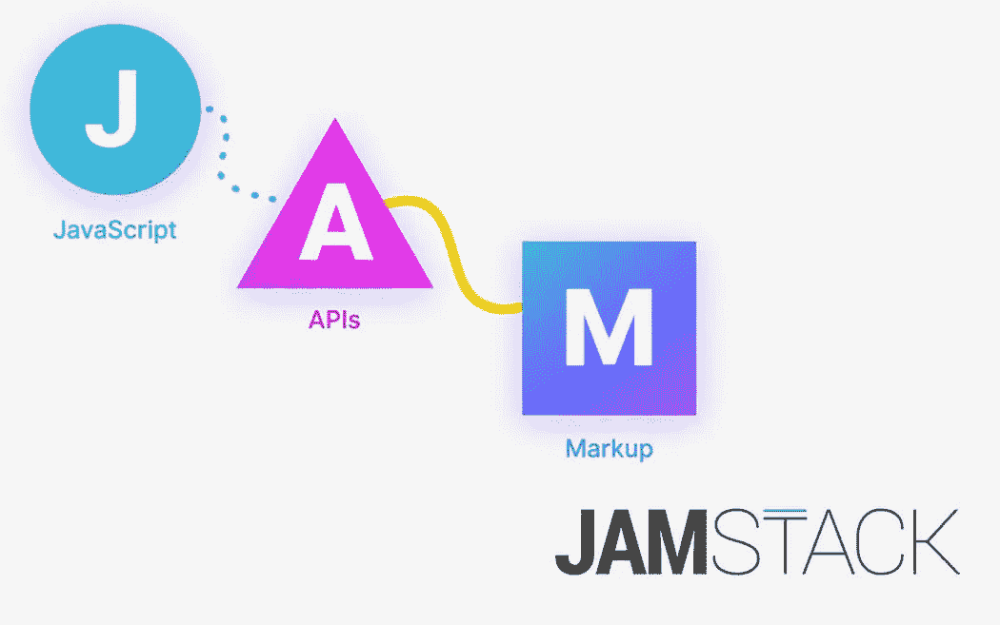
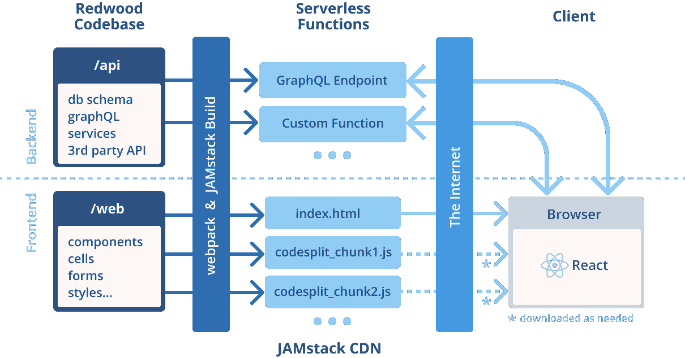
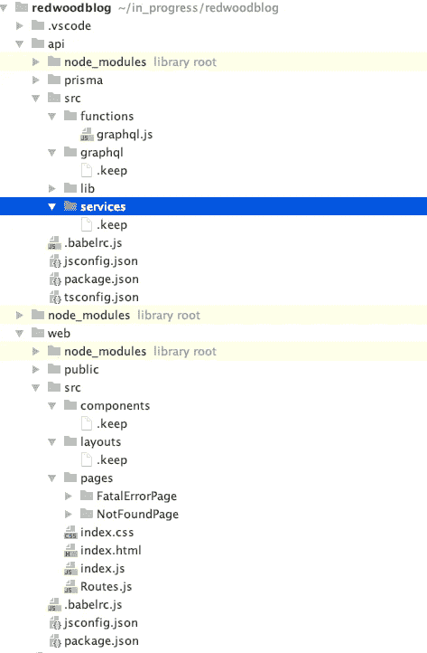
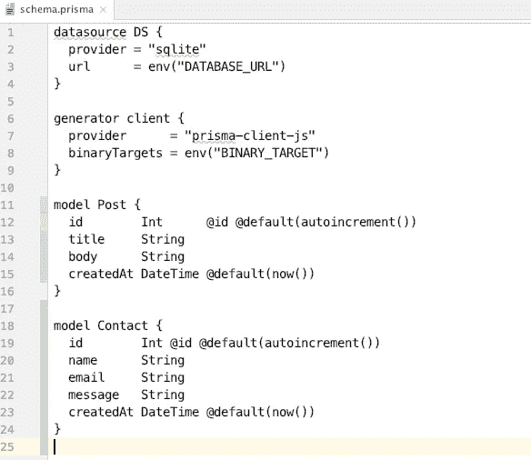
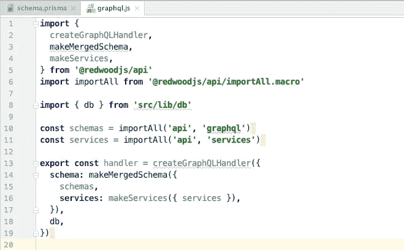
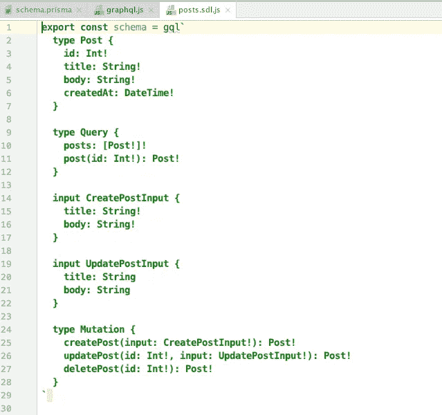
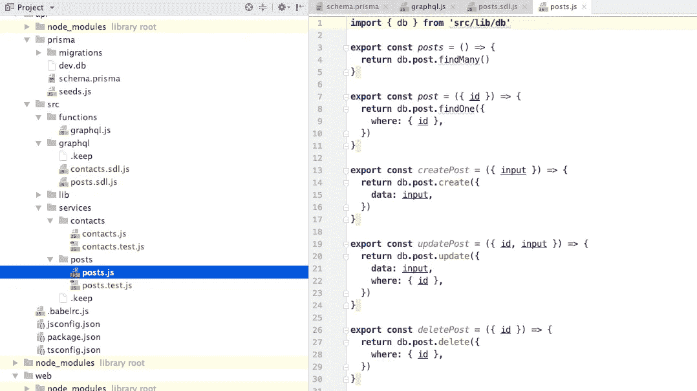
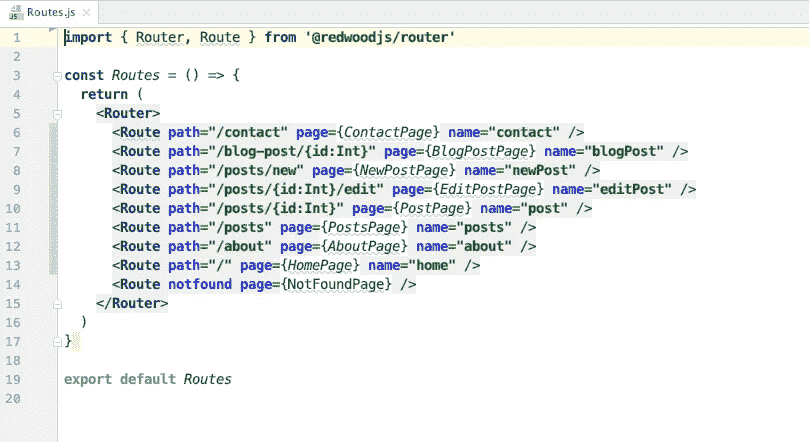
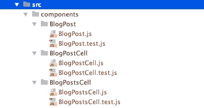

# RedwoodJS 面向开发者的全栈 JavaScript 框架

> 原文：<https://javascript.plainenglish.io/redwoodjs-full-stack-javascript-framework-with-a-developer-in-mind-dfa7d7a6d905?source=collection_archive---------2----------------------->

## 雷德伍德

## 使用 React、GraphQL 和 JAMStack 的全栈 JavaScript


RedwoodJS — Full-stack JavaScript with React, GraphQL & JAMStack

您是否对构建 JavaScript 项目所需的所有配置选项和附加技术感到不知所措？

然后你想把它连接到一个 GraphQL。那里发生了什么？每周您都会看到另一个 GraphQL 客户机出现。

谁不会疲惫不堪，不知所措呢？

我一直在用 RedwoodJS 玩，它有一些不错的功能。这实际上让你的生活变得轻松了一些。

在这篇文章中，我将谈谈我的发现。我们将讨论:

*   红木积木
*   后端部分
*   前端部分
*   红杉的优点
*   红杉的缺点

这是什么？

> **RedwoodJS 是一个以无服务器方式部署的全栈 JavaScript 框架。**

# 红木积木

RedwoodJS 使用:

*   [反应过来](https://reactjs.org/)
*   [GraphQL](https://graphql.org/) ( [阿波罗](https://github.com/apollographql))
*   [jam stack](https://jamstack.org/)
*   [棱镜](https://www.prisma.io/)
*   [笑话](https://jestjs.io/)(即将推出)
*   [故事书](https://storybook.js.org/)(即将推出)
*   [巴别塔](https://babeljs.io/)
*   网络包



RedwoodJs 利用了 JAMstack 架构的优势。

JAMstack 是一个基于客户端 JavaScript、可重用 API 和预建标记的现代 web 开发架构。

JAMstack 的另一个想法是，您可以将代码推送到 git 存储库，这将触发部署，然后您就完成了。

RedwoodJS 负责控制应用程序的数据端。您不必考虑数据库或您的模式。它试图包含所有这些方面，然后只是给你反应。

RedwoodJS 嵌入了这些原则:

*   对前端(获得 JAMstack 的速度)和后端(独立扩展的 API 和无服务器功能)的关注点进行了严格的分离，
*   和统一的开发人员体验，实现快速本地开发。

这是红杉林的建筑外观:



RedwoodJS Architecture

RedwoodJS 主要建立在 React 开发流程的基础上。

要启动应用程序，请编写:

```
yarn create redwood-app ./redwoodblog
```

这将为你的应用程序创建一个基本的结构。看起来是这样的:



API 文件夹包含你的应用程序的后端。

WEB 文件夹包含您的应用程序的前端。

我会边走边描述每一部分。让我们从一个后端开始。

# RedwoodJS 的后端部分

## GraphQL

在 RedwoodJS 中，后端是你的前端将要运行的 API。

后端运行 NodeJs，即服务器端的 JavaScript。它不使用流行的 express 模块来创建后端，后端是从头开始的。

[Appolo 服务器](https://www.apollographql.com/docs/apollo-server/)是后端。GraphQL 在一个 [lambda 函数](https://docs.aws.amazon.com/lambda/index.html)中运行(无服务器)。此外，您可以创建自定义函数。

在无服务器函数中添加 GraphQL 时有一些限制。

GraphQLs 的理念是成为所有查询的一个入口点。这就是为什么所有的 GraphQL 查询都在一个 Lambda 函数中的原因。

单一功能过长与无服务器理念不符。使用无服务器，您可以部署独立、分离的代码。只做一件事的小功能。有了 GraphQL，你就有了一个大函数来处理所有的查询。

λ函数有一个[大小限制](https://docs.aws.amazon.com/lambda/latest/dg/gettingstarted-limits.html)。如果你有一个巨大的后端，你将会达到你能部署到 lambda 函数的代码量的极限。

有趣的是，当您部署到 Netlify 时，他们会自动将您的函数部署到您的 GraphQL 函数中。

## 服务

除了函数和 GraphQL 之外，您还会看到服务文件夹。您的 GraphQL 由几个服务组成。这是一种业务逻辑方式的服务。

例如，负责张贴、编辑、获取和显示论坛帖子的内容服务。

另一个例子是计费服务，它显示计划和账单，并允许您升级和降级。

当你把你的应用程序想象成各种各样的高级服务时，你就开始以一种长期可维护的方式组织你的代码。

RedWoodJS 中的服务被抽象为比 GraphQL 高一个级别。

为 GrapghQL 查询编写一个[解析器映射](https://www.apollographql.com/docs/graphql-tools/resolvers/)是一件痛苦的事情。RedwoodJS 自动将 GraphGL 解析器映射到您从服务文件中导出的函数。

## Prisma 模式

您定义了一个 Prisma 模式。RedWoodJS 使用 [Prisma Client JS](https://github.com/prisma/prisma-client-js) 与数据库对话。Prisma 有另一个名为 [Migrate](https://github.com/prisma/migrate) 的库，它以一种可预测的方式更新数据库的模式，并对这些变化进行快照。

每次更改都被称为迁移，当我们对模式进行更改时，迁移会创建一个迁移。

Post 和联系模型的模式示例。



RedWoodJS 创建 SQLlite 作为默认数据库。定义模式后，您可以通过运行以下命令来创建迁移:

```
yarn redwood db save
```

该命令完成后，您将看到在`api/prisma/migrations`下创建了一个新的子目录，其中包含时间戳和您为迁移指定的名称。

我们用另一个命令来应用迁移:

```
yarn rw db up
```

这将应用迁移(针对数据库运行命令以创建我们需要的更改)，从而创建一个名为`Post`的新表，其中包含我们在模式中定义的字段。

## 功能

Functions 文件夹包含在 Lambda function 上运行的 graphql.js 文件，它是 graphql:



在 graphql 文件夹中，有 SDL 文件。例如，SDL 发布模型文件:



根据名称，它被转移到一个服务:



当你在你的服务目录中命名导出的函数与在你的查询或变异中相同时，你的 SDL 文件的映射将自动为你发生。

您不需要调用解析器，函数导出就是解析器。

服务的真正好处是您可以在其他服务中使用它们。

在服务中，您有自己的核心业务逻辑，并且您希望从其他服务中调用它。

服务和所有您从服务文件中导出的功能，这是您真正的后端 API。GraphQL 可以暴露其中的一部分，但是它并没有这么做。

API 完全定义在前端和后端之间。您向前端公开了一些服务，但不是全部。

[博客的例子](https://github.com/redwoodjs/example-blog)有点简化。在更复杂的应用程序中，服务会更精细，更复杂。但它是映射的一个很好的例子。

自动映射简化了开发人员的生活。你给它起个正确的名字，耗时的任务就会自动完成。

有边界和后端作为一组服务给了你长期的可维护性。它通过目录结构和解析器映射来实施。

## 数据库和 Prisma

[Prisma](https://www.prisma.io/) — GraphQ 是一个用于 SQL 数据库的开源 ORM 库。Prisma 是一个查询构建器++。

目前，Prisma 专注于关系数据库。非关系数据库也在计划之中。Prisma 是活动记录的替代品。它向您提供数据对象。只有数据没有对象。不能调用 posts . save()；

通过 Prisma，RedwoodJs 获得了一个基于 web 的数据接口，就像 PHP 为 MySQL 提供 PHPMyAdmin 一样。

从长远来看，RedwoodJs 希望支持 NoSQL 和 SQL。因此，根据您要解决的问题，您可以同时使用这两种方法。

## 将无服务器连接到关系数据库的问题

很难像控制 web 服务器的数量那样实现连接池。

对于 SQL 数据库，您希望数据库正在运行。问题来自于缩放。

当进行扩展时，首先要考虑的是数据库，而无服务器正在试图解决这个问题。

RedwoodJs 希望简化部署，只需按一个按钮，就可以了。他们希望成为一个无需您做任何事情就可以无限扩展的解决方案。

# 红杉的前端部分

## 反应

RedwoodJs 很轻，前端最小。前端是 React app，单页 app。您的标记最终是最小的。

## 静态页面的预呈现

你可以做预渲染和静态页面。您有一个构建阶段来呈现静态页面。渲染之后，你可以像在更传统的 JAMstack 应用程序中一样推送这些静态页面。API(后端)是这个堆栈的一部分。

## 路由器

RedwoodJs 有自己的路由器。它从 Ruby on Rails、React Router 和 Reach Router 中获得灵感，但却非常固执己见。

像在 Rails 中一样，您只有一个路由文件。



您可以在一个文件中放置路由和嵌套路由行为。嵌套路由使得在调用某个 URL 时很难看到运行的是什么代码。RedwoodJS 路由消除了不必要的复杂性。它将 URL 连接到一个页面。

这种方法的缺点是，在单页应用程序中，你通常不想重新加载整个页面，你可能希望侧边栏或其他组件保持不变，你只想重新加载页面的主要部分。

因为 RedwoodJS 通过使用 Appolo 来兑现站点，所以 rerender 的成本并不高。重新呈现不会重新运行任何查询，只是重新加载静态页面。

## 成分

页面是正常的组件。

我喜欢组件的命名约定。



Components in RedwoodJs

没有索引文件，文件由组件命名。当我一次编辑多个组件时，我的编辑器中没有打开一堆索引文件。我也喜欢的一件小事。

## 细胞

单元格是一种声明性的数据获取方式。它们是进行 GraphGL 调用的声明性方式。细胞创造了一个获取的循环。

从 cells 中，您可以成功地从 GraphQL 中获取一个数据池。您只需声明您的查询，声明您的成功组件，就大功告成了。您还声明失败和空状态。

细胞正在解决的 GraphQL 中的问题是[瀑布问题](https://www.apollographql.com/blog/optimizing-your-graphql-request-waterfalls-7c3f3360b051):

例如，您有一个位于页面顶层的组件，它获取一些数据，如用户配置文件页面。你想要用户基本信息。您有一个需要获取文章列表的子组件。在嵌套在顶级组件中组件中，您必须执行另一个查询。

如果你有嵌套的组件，在你有请求内部查询所需的数据之前，你必须获取并完成并开始呈现外部查询。

但是如果您仅仅依赖用户 id 来获取数据，那么您没有理由必须等待。你可以同时做这些事情。这个问题被称为瀑布问题。

抽象解决了瀑布问题。

单元是为您处理数据负载的高阶组件。您需要指定查询，RedwoodJs 会在幕后为您完成所有的工作。

## 形式

[Redwood Forms](https://redwoodjs.com/tutorial/everyone-s-favorite-thing-to-build-forms) 用[React Hook Forms](https://react-hook-form.com/)打造出色的用户表单体验。

# 红杉的优点

尝试 RedwoodJs 的原因是 JavaScript 栈的完全集成。您使用了所有新奇的东西，所有这些都集成到您为后端开发的优秀开发人员体验中。RedwoodJs 是关于开发者体验的。

与传统内容相关的 JAMstack 的区别在于，当你需要编写所有后端代码时，你也可以使用 RedwoodJS。

许多开发人员对启动项目所需的配置选项和附加技术感到不知所措。

RedwoodJS 有更多的约定和观点，让你以更有成效的方式做事。

RedwoodJs 为您整合了所有工具和配置设置，因此您不必浪费时间将它们整合在一起。

像 Rails 一样，这是配置方法的惯例。你能用 Rails 做的任何事情，你也能用 RedwoodJS 做。

它是完美集成的全栈:服务、数据库、测试。它的部署模式非常容易扩展，几乎不需要干预，并且是 JavaScript 端到端的。

RedwoodJs 是现有部分的框架构建。他们正在解决的问题是，在 JavaScript 堆栈中集成前端和后端代码的方式非常多。也没有明确的良好实践。

他们有[好教程](https://redwoodjs.com/tutorial/welcome-to-redwood)。为了进行尝试，我用教程建立了一个博客。我喜欢带你经历这个过程的视频。

Redwood 是一个合适的框架，随着时间的推移，您将受益于持续的性能和功能升级，并且只需付出最少的努力。

它通过选择相关的技术和工具，并为开发人员决定使用哪些技术、如何将代码组织成文件以及如何命名事物，使开发人员的生活变得更加轻松。

# 红杉的缺点

Lambda 函数的长度有限制，无服务器连接到关系数据库也有问题。

雷德伍德很年轻。

现在还不要用 Redwood 做任何主要的东西，它还很早，还没有准备好投入生产。

它严重依赖目前正在测试中的 Prisma2。

只有几个生产场所。这里有一个例子:[https://predictcovid.com/](https://predictcovid.com/)

# 结论

RedwoodJS 还处于早期阶段。这绝对值得关注。你可能会喜欢用它来建造一个周末项目。

# **简单英语团队的声明**

你知道我们有四个出版物和一个 YouTube 频道吗？你可以在我们的主页 [**上找到这些——关注我们的出版物并订阅我们的 YouTube 频道**](https://plainenglish.io/) **来表达爱意！**