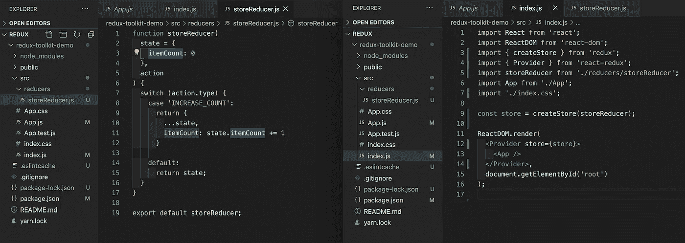
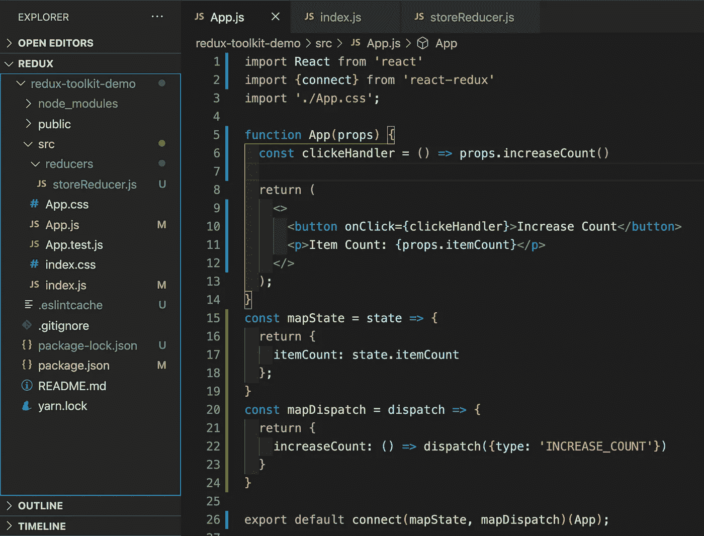
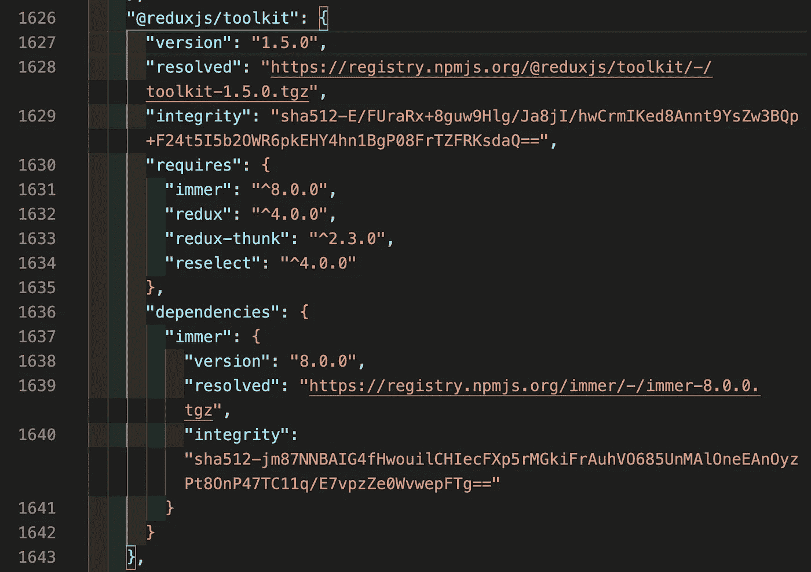
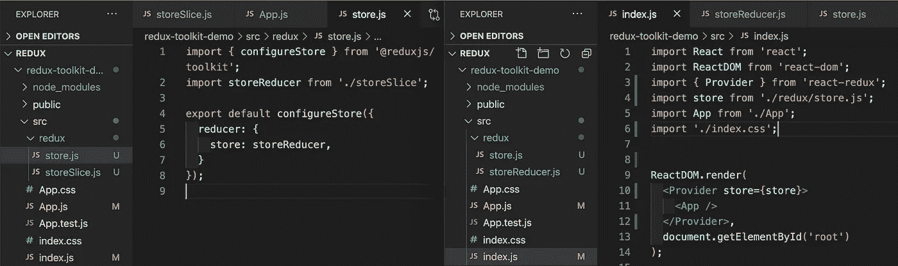
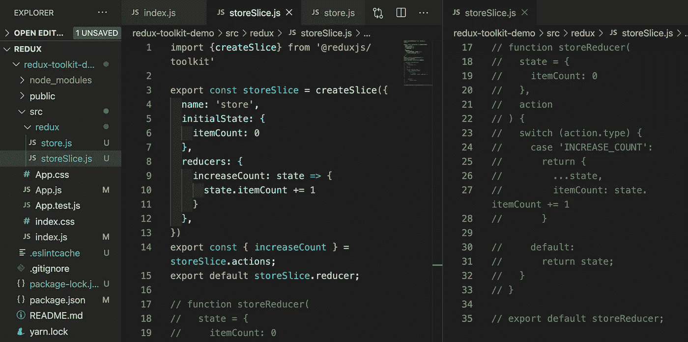
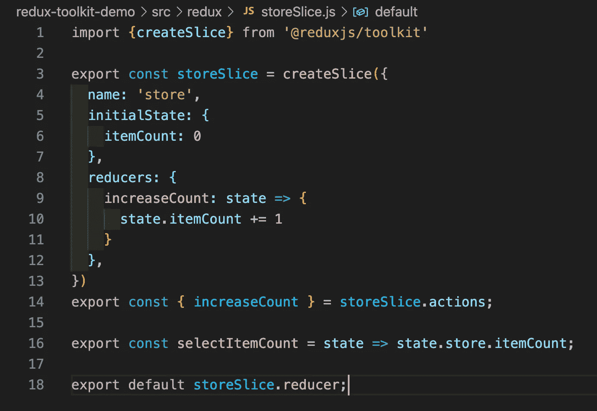
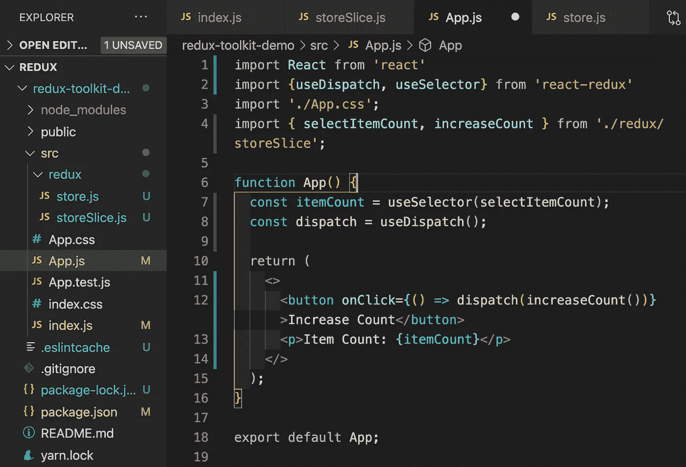

# 重构现有 Redux w/ Redux Toolkit & Hooks

> 原文：<https://javascript.plainenglish.io/refactoring-existing-redux-w-redux-toolkit-hooks-550a628d74a9?source=collection_archive---------4----------------------->


在今年的 Reactathon 上，我有幸看到的最酷的演示之一是马克·埃里克森(Mark Erickson)的演示。他在那里展示了一些现代 Redux 技术，特别是 React 工具包和曾经流行的钩子的使用。它启发我回去重构我的一些旧 Redux 代码，从使用‘connect’高阶组件到使用工具包。因此，如果你想重构 Redux 来利用它的钩子，我将通过一个简单的重构和 Redux Toolkit 的实现。

首先，我将从一个基本的 React 应用程序开始，它内置了一些 Redux‘connect’功能。出于演示的目的，这将是一个简单的商店应用程序与项目计数器。下面是包含 Redux 功能的三个主要文件的基本设置。Reducer、Index.js(出于本演示的目的，我在这里创建了我的商店)和 App.js(通过它的 props 连接到商店的状态和调度):



Reducer (left) & Index.js (right)



App.js

这里我们已经设置好了一切。我们的应用程序组件订阅了我们的 Redux store，它是单个状态(itemCount ),并且有它的单个分派方法来增加 itemCount 的计数。这是一个简单的 superrrr 设置，通常在一个较大规模的应用程序中，你会看到一个包含所有不同调度功能的动作文件，这样它们就可以跨组件重用，但这对于一个简单的演示来说是很好的。

那么，我们从哪里开始重构代码以利用 Redux Toolkit，然后使用 React-Redux 挂钩呢？嗯，安装它可能是个好主意。

```
npm install --save @reduxjs/toolkit 
```



packlock.json for Redux-Toolkit

这将安装工具包，其中有一些工具方便地捆绑在一起。这不包括 React-Redux，如果你打算使用 Redux 的钩子(useSelector，useDispatch ),你仍然需要安装 React-Redux。它还附带了 immer、thunk 和 reselect，所有这些都很有用，对于 React Toolkit 在更大范围内发挥作用非常重要。但是我们稍后还会回到这些。现在，让我们从重构一些现有代码开始。

首先，我们将把 store.js 文件添加到 Redux 文件夹中。现在，我们将把商店的创建从 index.js 移到这个文件中。使用 Redux Toolkit 方法 configureStore，我们可以导入 storeReducer 并导出到 index.js，这是一个完全配置的存储。如果我们有多个减速器，这也是我们可以组合它们的地方(想想组合减速器)。下面是重构后的代码，一定要注意导入中的变化。在 store.js 中，我们现在从@reduxjs/toolkit 导入。



New Store.js (left) & Refactored Index.js (right)

现在我们已经完成了这两个变化，我们将继续真正的魔术，这将是在我们的 storeReducer。这里我们将利用我最喜欢的 Redux 工具包方法“createSlice”。这将本质上把我们的缩减器和动作结合在一起，形成一个状态的“切片”。首先，为了清楚起见，我将把 reducer 文件重命名为 storeSlice.js，然后从 store.js 文件中修改我们的导入。接下来，我们将从使用 createSlice 声明一个新切片开始。然后，我们将使用以“名称”开始的键/值对对其进行一些配置，这将与“存储”保持一致。接下来，我们还将定义它的初始状态，对于我们来说，它只包括最初设置为零的 itemCount。在 initialState 之后，我们定义了 Redux Toolkit 导出后的 reducers，这些 Redux Toolkit 将转化为我们可以在整个应用程序中使用的调度操作。最终，它应该看起来像这样，我把前面的 Reducer 代码留在了右边，以供参考。



Refactored reducer into storeSlice

在上面，您还可以看到我们正在导出“increaseCount ”,作为 storeSlice 的一项操作。这是我们最终将在应用程序组件中调用的调度方法。这就剩下我们遗漏的最后一个导出，它处理订阅状态。既然我们正在重构“connect”方法，并且没有将我们的状态/分派映射到 props，我们将使用钩子“useSelector”。因此，我们需要在导出 storeSlice.reducer 之前导出我们的状态(itemCount)。



Final storeSlice.js

State.store.itemCount 指向我们命名为“store”的片，然后在我们的 initialState 中将 itemCount 设置为零。当然，selectItemCount 是导出的常规命名，您可以随意命名。现在，我们最后一次重构将发生在我们的应用程序组件中！

我们可以做的第一件事是删除所有的 mapState 和 mapDispatch 代码。“取消连接”我们的应用程序组件，并更改我们所有的导入，以便我们现在从 react-redux 导入我们将需要的两个挂钩(useSelector & useDispatch)。然后，我们还将从 store slice(selectItemCount & increase count)中导入我们的特定状态和我们的操作。

最后一步是在组件中使用它们。我们使用“useSelector”声明一个变量，它将为我们的组件订阅 redux 存储的那一部分。然后，我们还通过调用组件中的钩子来声明我们的调度。然后，我们只需点击应用程序按钮，调用调度方法“increaseCount ”!



Refactor of App.js

现在你知道了！我们从本质上重构了我们所有的原始功能，从 Redux 的“连接”方法到我们新的 Redux 工具包。当然，这只是 Redux 工具包功能的皮毛。能够使用 Immer 在我们新创建的 slice 中轻松操作状态的功能允许直接操作状态，这与 Redux 以前的工作方式相比是一个巨大的变化。此外，Thunk 也包含在 Redux Toolkit 中，它允许通常对 API 的异步调用。在接下来的博文中，我将对这个例子进行扩展，并添加一些更复杂的状态操作，甚至一些使用 JavaScripts ' fetch '的调度调用的虚拟例子。

当然，如果你想更深入地了解 Redux Toolkit 的功能和“幕后”发生的事情，他们官方网站上提供的文档是一个不可思议的资源。

*【1】:Redux-Toolkit Docs(*【https://redux-toolkit.js.org/】T2)

【https://redux.js.org/】【2】:Redux Docs()

*【3】:React-Redux Docs(*[https://react-redux.js.org/](https://react-redux.js.org/))