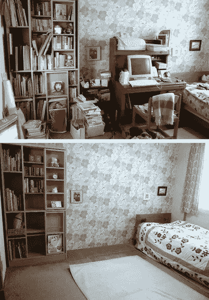
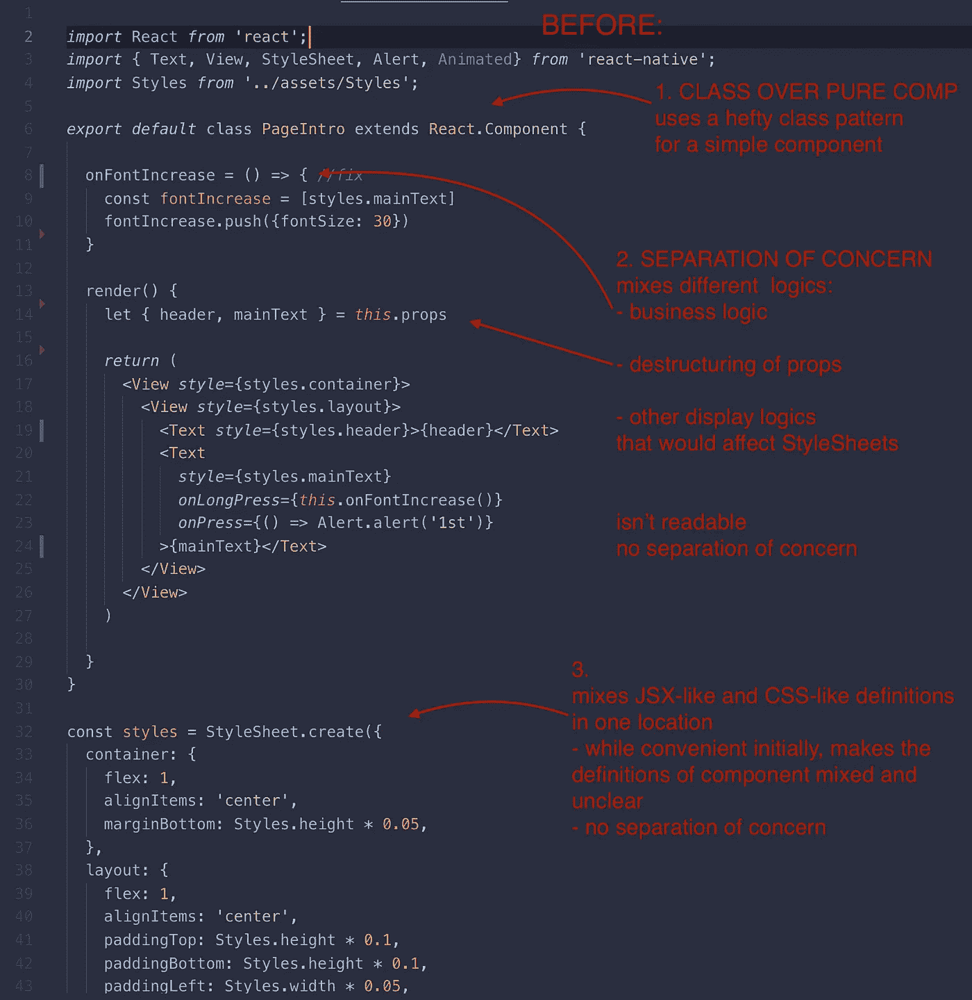
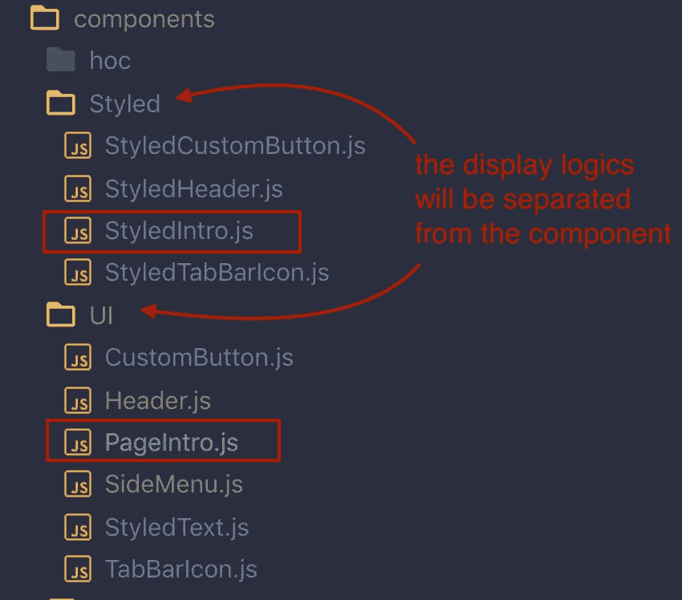
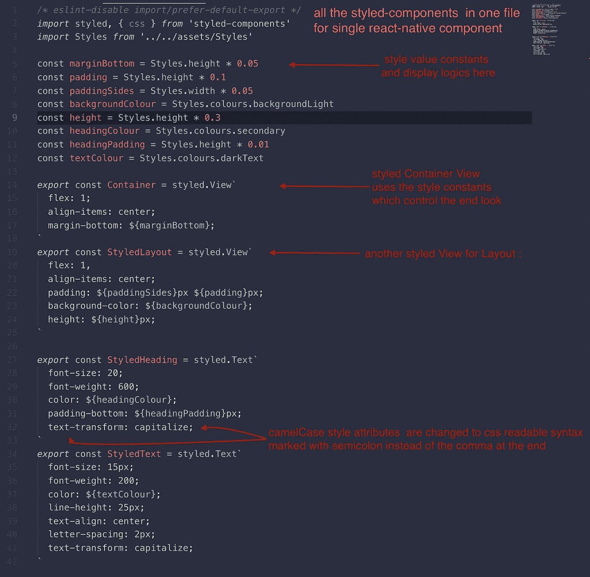
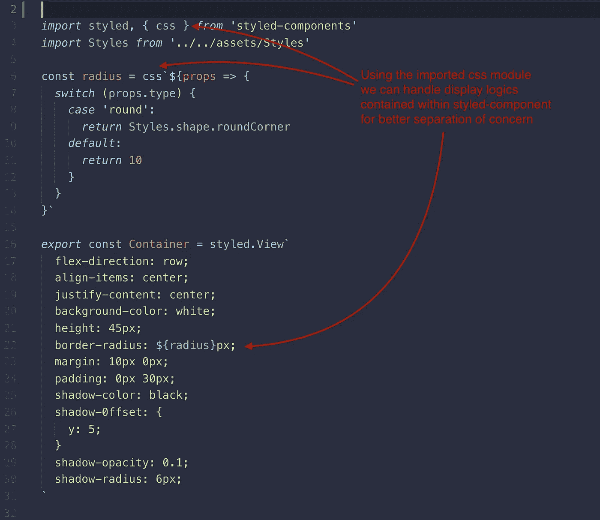
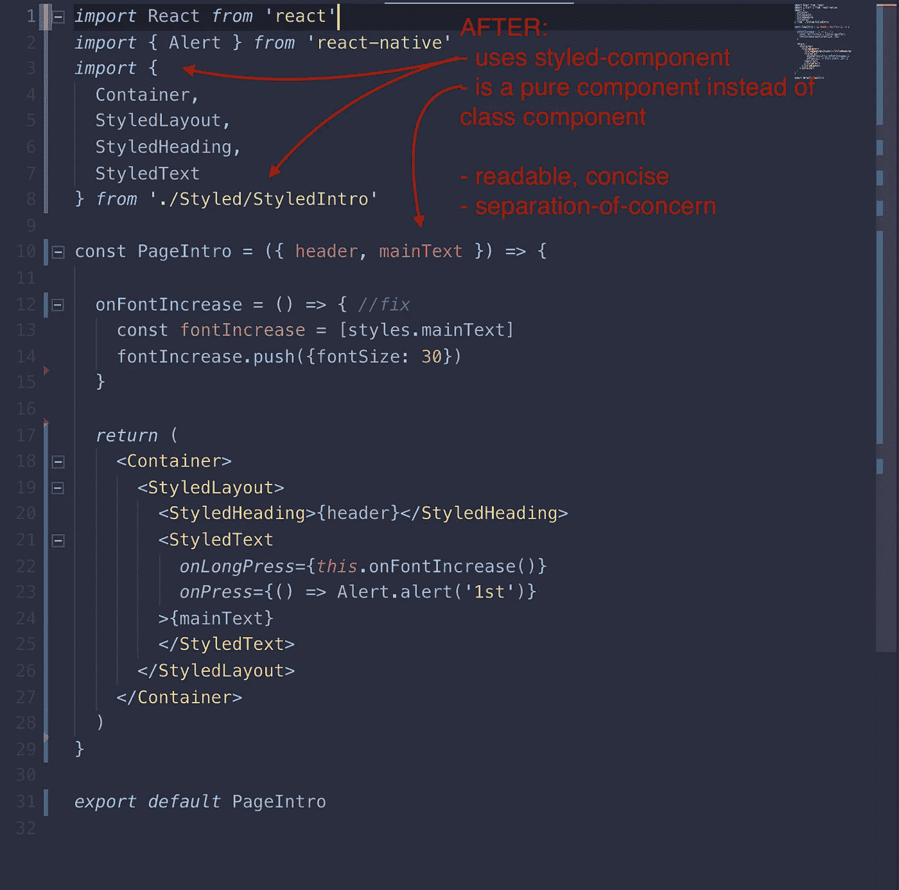
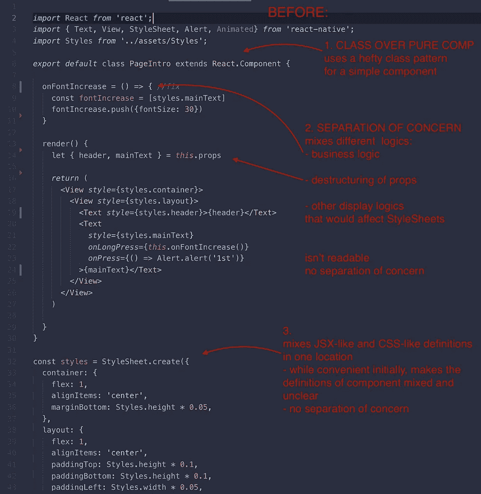
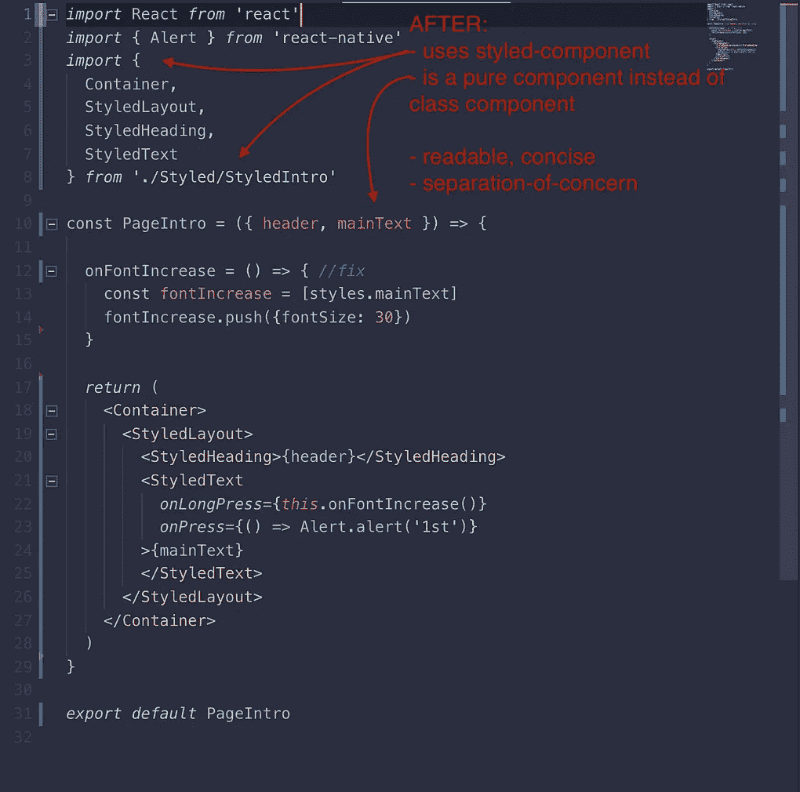

# 使用样式化组件和纯组件模式重构 React-Native UI

> 原文：<https://javascript.plainenglish.io/refactoring-react-native-ui-using-styled-components-and-pure-component-patterns-144b93476eb6?source=collection_archive---------0----------------------->

最近，我发现 styled-components 是一个令人兴奋的附加物，它有助于将显示逻辑从业务逻辑中分离出来，同时改进每个组件中的整体声明性组合

**作为一组声明而非一组详细说明出现，如本文所述*

## 重构前:

让我们看一个 react-native 组件的例子，它是使用可用的 react-native 组件(如视图、文本和样式定义的样式表)定义的。

在重新分类之前，我们注意到组件 1。使用 React 类定义 PageIntro 组件。2.混合业务逻辑、显示逻辑(额外的样式推送)和 3 . react-native 组件集的返回，并向其传递样式引用( *style={style.container}* )。4.样式引用是在组件外部使用 react-native 样式表定义的，但是在同一个文件中。总而言之，一个大文件要做几件事:

Before refactoring the react-native component

## 将砾岩分为两部分:

每个 react-native 组件都可以拆分并定义为两个部分的组件:

第一部分是类似 jsx 的— *纯组件*(或功能组件)，第二部分是类似 css 的— *样式化组件(类似 CSS)*

在这个例子中，我们将样式化组件和纯组件放在不同的目录中。我们将“UI”目录设置为保存所有的表示(纯)组件，将“Styled”目录设置为包含 Styled-components——前缀为 Styled <compname>。js。</compname>

对于 UI 目录中的 **PageIntro.js** 组件，它在样式化目录中有对应的 **StyledIntro.js** :

project directory holds presentational components in **UI** directory and styled components in **Styled** directory

首先让我们安装样式组件:

*npm 安装样式化组件*

或者

*纱线添加样式-组件*

接下来，我们[为 react-native 组件定义 styled-comp](https://medium.com/swlh/using-styled-components-with-react-native-de645fcf4787):

StyledIntro.js 将保存样式化组件的定义

—在 StyledIntro.js 中，我们导入“样式组件”模块，并

—使用*样式。视图，风格化。Text* 定义 react-native 视图和文本组件的外观。

—为任何 css 属性和显示逻辑的处理设置常数(见下面的两张图片)

在下面的例子中，你会看到*容器*、*样式布局*、*、【样式标题*】和其他*页面介绍. js* 需要显示的视图和文本的定义。

**为便于阅读，习惯在样式化组件前加上“styled”前缀*

styled-components inside StyledIntro for later import into PageIntro.js component

## **显示完全在样式化组件内处理的逻辑:**

所有由 props 通知的显示逻辑(例如本例中的 type)都可以在 styled-components 内部进行本地评估:评估基于 type prop 的按钮角的圆度，并将其设置为 *StyledIntro.js、*容器*styled-comp 内部的 border-radius。*

moving all the display-related logic to styled-component definition

## 重构后:

迄今为止，我们已经:

1.  切换到纯组件模式，而不是 React 类模式
2.  单独定义显示逻辑(在 styled-comp 文件中),而不是在 pure comp 中本地定义。
3.  我们定义了导入的样式组合，而不是反应原生的
4.  保持组件组合主要是声明性的，而不是命令性的

且看结果！🤩

比较同一个 comp 的前后效果会更加明显:

BEFORE and AFTER

我现在爱读组件。这是简洁和舒适的大小。可读性强，易于扩展。希望是有用的！