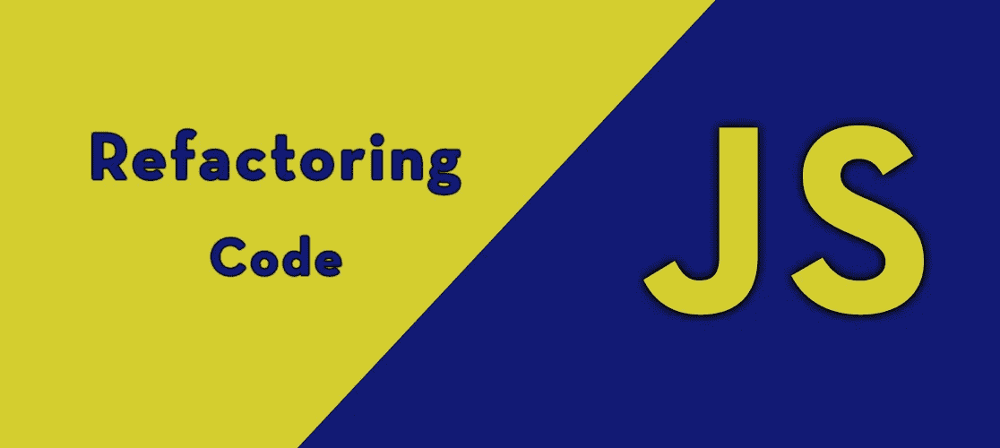
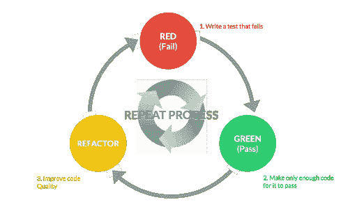

# 用 JavaScript 重构代码

> 原文：<https://javascript.plainenglish.io/refactoring-your-code-in-javascript-a2b23cc0a1c6?source=collection_archive---------3----------------------->

如果您已经从事一个项目有一段时间了，您可能会开始意识到您正在处理的文件变得非常大，有点难以阅读。当然，这在刚开始的时候不是问题，但是，当你的文件已经增长到数百甚至数千行时，回头再做修改会困难得多。为了帮助降低文件大小和复杂程度，您应该养成重构代码的习惯。

# 什么是重构？

首先，你可以 ***把重构你的代码想象成重写它*** ，这样它更容易阅读，也更容易在将来使用。这通常也会减小您正在处理的文件的大小。为了更好地理解重构代码的基础，看一下下面处理一些复选框的代码:

这段代码看起来非常庞大和重复，这使得它很难操作，如果我们想给每个复选框添加新的道具，这就变得特别麻烦。如果我们将来想添加更多的复选框，我们每次都必须写出相同的代码块。现在让我们来看看重构后的相同代码:

即使在这个例子中重构版本有更多的代码行，它仍然更好，因为如果我们以后决定添加更多的复选框，我们只需要改变使每个复选框唯一的东西，而不是每次都写出整个东西。如果我们有 10 个甚至 20 个复选框，你可以很容易地看到这是如何在代码编辑器中为你节省空间的。

# 什么时候应该重构代码？

重构代码的最佳时机是当你在做一些你需要一遍又一遍地写*的事情的时候。这不是唯一一次你可以重构你的代码，然而，遇到重复的事情是非常常见的。请记住，重构代码的全部目的是让代码更容易阅读和使用。重构并不是绝对必要的，但从长远来看，它会让你的生活变得更容易，尤其是如果你决定以后再去做某件事的话。如果你想了解更多关于重构的知识，下面的视频很好地深入介绍了何时重构以及如何重构。*

**

# *重构代码的基础*

*要重构你的代码，你基本上可以通过一个相当简单的 3 步过程。如果你在编码习惯中实现了这一点，你会很快发现你的代码看起来更加专业和整洁。下图显示了重构代码时应该经历的典型的 3 步过程。*

**

*[Source](https://quasarbyte.com/blog/java/code-refactoring-techniques/)*

*本质上，我们不断努力确保我们的代码是尽可能高质量的，这样我们在将来就可以轻松地使用它。大多数时候，这将涉及到把许多行代码变成几行代码。*

**

# *附加说明*

*我强烈建议养成定期重构代码*的习惯，而不是时不时地一次完成。如果你坚持下去，重构会使编码变得更简单、更容易管理，从而使编码变得更容易、更令人愉快。你应该养成不断尝试改进代码的习惯的另一个原因很简单，从长远来看，这也将使你成为一名更好的开发人员。在对同一类型的事情进行几次重构之后，你将学会第一次做得更好。重构是朝着成为专业开发人员的正确方向迈出的一大步，它和你在编码时做的任何事情一样重要。**

***来源:***

**[https://quasar byte . com/blog/Java/code-refactoring-techniques/](https://quasarbyte.com/blog/java/code-refactoring-techniques/)**

**[https://youtu.be/vhYK3pDUijk](https://youtu.be/vhYK3pDUijk)**

**[https://refactoring.com/](https://refactoring.com/)**