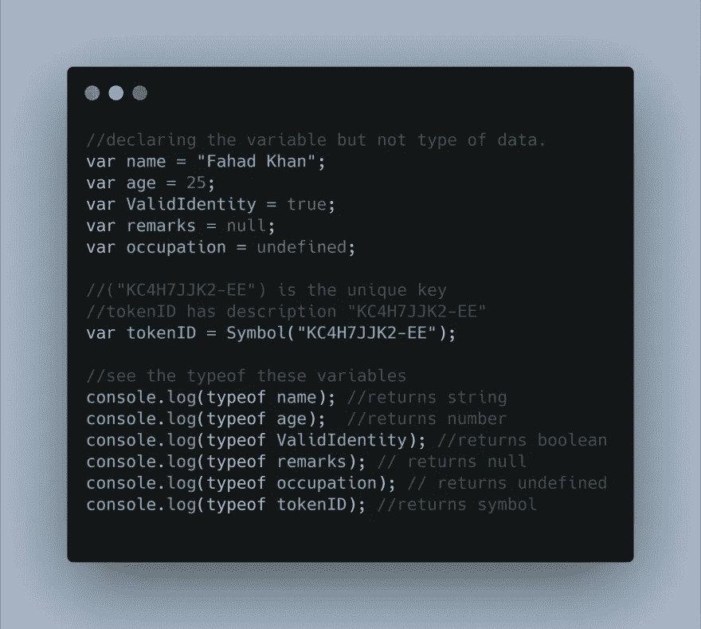
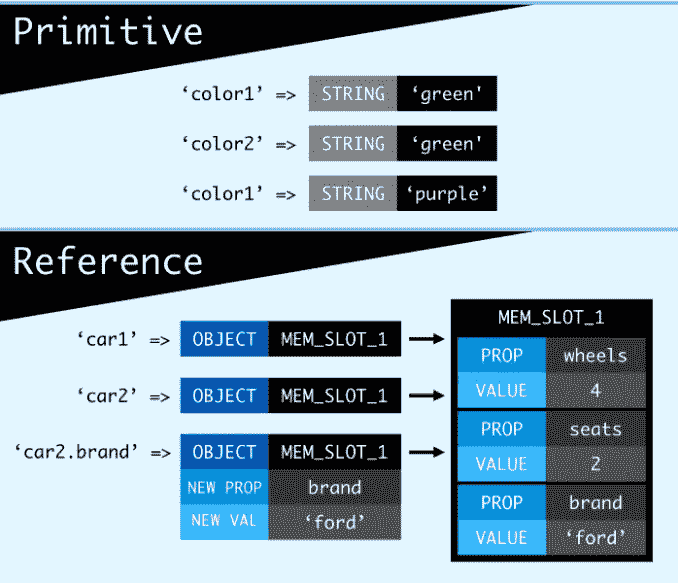
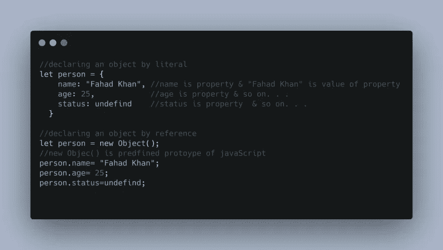

# JavaScript 中引用和文字的区别？

> 原文：<https://javascript.plainenglish.io/reference-vs-literal-in-javascript-1492edc17df5?source=collection_archive---------3----------------------->

在阅读这篇文章之前，你必须具备`JavaScript`的中级知识，比如一点点`OPP`的概念、`Arrays` `Objects` & `functions`。

# 你会学到什么？

在这里我们将看到，

1.  数据类型和变量
2.  原始类型 **vs** 引用类型
3.  文字**对**引用(对象、函数、数组)

# 1.数据类型和变量

# 数据类型

如果你熟悉编程语言如，`C` `C#` `C++` `Java`等。你已经注意到每种编程语言都有自己的数据类型和变量声明，JavaScript 也是如此。但是如果你搜索 JavaScript 的**数据类型，你会找到各种各样的答案，一些资源会说有 8 种数据类型，一些会说有 6 种，等等。但是不要搞混了，通常 JavaScript 中有 6 种数据类型。**

1.  Number > integer、BigInt、floats 等。
2.  字符串>字符数组，即单词
3.  布尔型>真/假
4.  Null >无值(从技术上讲，null 是一个值)
5.  未定义>在声明时未定义
6.  symbol >不等于另一个值的唯一值

你必须知道，这些是数据的**类型或者说是数据的形式。以上 6 种类型可以像在子类别中一样进行更详细的修改。由于 JavaScript 是一种松散的动态类型语言，这意味着没有必要编写数据的形式，例如`int` `string` `boolean`你只需要简单地告诉计算机关于数据的声明，而不是数据的形式。例如。**

我们只是通过不告诉机器我们声明的数据是什么类型来声明变量。JavaScript 的工作是找到数据的类型。为了确保安全，我们可以通过 **JavaScript** 询问我们通过`typeof`关键字/操作符声明了什么类型的数据。让我们在这里停止讨论数据类型，因为这不是我们的主要话题。

# 一个变量

在上面的可视代码中，我们也包含了变量。此外，变量是内存中存储某种数据的部分。现在变量`name`在包含数据`Hawking`的内存中有了空间

# 2.基本类型与引用类型

无论我们在上面看到什么，这些都是原始类型的数据，这意味着每当内存存储时，这些数据将以无序的方式保存(内存看到空间放在那里),但在引用情况下，内存按顺序存储整个数据(有内存引用),你知道为什么吗？因为引用类型的变量有`Array` `Function`和`Object`。因此，这些类型按顺序存储在内存中，并在内存单元中生成引用(地址)。这是原始数据类型和引用数据类型之间的根本区别。
换句话说，引用类型意味着当你创建一个对象时，那个值不直接赋给变量。相反，设置的是对该值的引用。变量所知道的只是对象在内存中的位置，而不是对象本身。
现在看看原语和引用是如何在内存端工作的。

# 3.文字与引用

(Object，Function，Array)
从某种意义上说，文字和引用是一回事，但文字是在对象中创建数据原型(蓝图)的一种方式。而函数、数组和引用形式已经在 JavaScript 中设计了一个构造函数，可以用`new`关键字访问。

基本上，**构造函数**是“OOP”方法的一部分！如果你是初学者，就不要想太多。

请看下面的代码，文字和引用在现实中是什么样子。例如。

两者`let person = {} , let person = new Object()`申报时工作相同但结构性质不同。在这种情况下，我只是创建引用对象，但是你可以用`new Function()` `new Array() .`
来引用`Function`和`Array`，这就是引用与文字的区别。如果你有任何疑问，你可以随时问我。

*原载于 2020 年 9 月 9 日*[*https://dev . to*](https://dev.to/fahad07_khan/reference-vs-literal-in-javascript-f8k)*。*