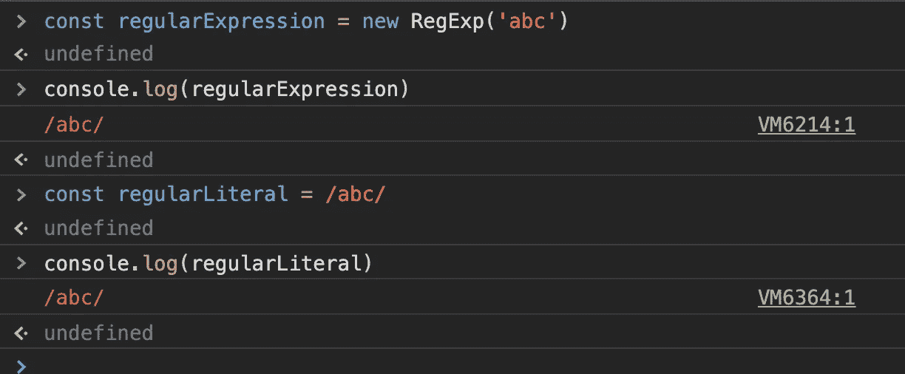
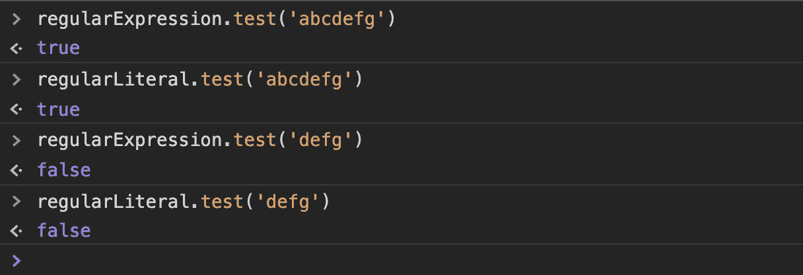
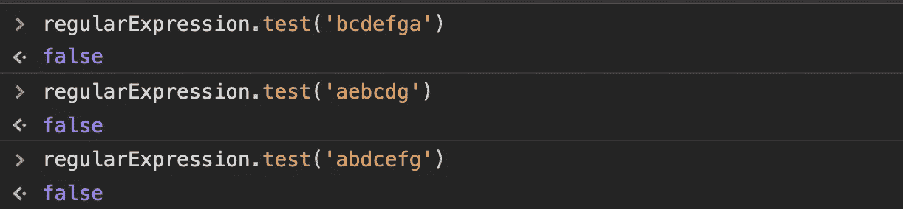
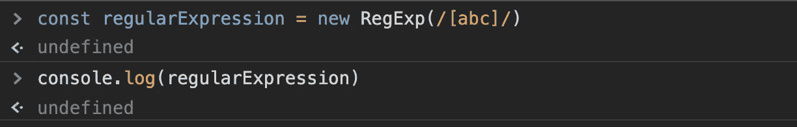
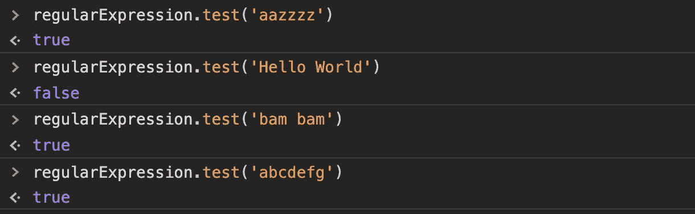
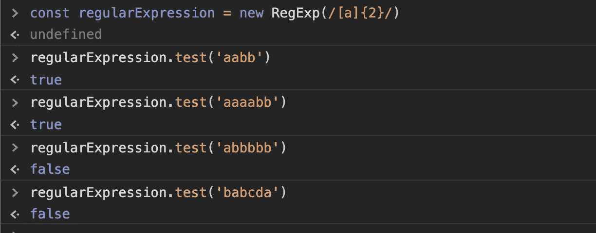

# 理解正则表达式第 1 部分

> 原文：<https://javascript.plainenglish.io/regular-expressions-part-i-6965172168f8?source=collection_archive---------12----------------------->

## 简介

亲爱的读者，我要对你说实话。我讨厌正则表达式。对我来说，它们很复杂，而且在许多方面令人困惑。我总是通过使用替代品来尽力避免使用它们。对我来说，即使是一组复杂的嵌套条件也比一行正则表达式更好，我必须用头撞墙才能最终得到正确的模式。

尽管如此，我还是决定打败正则表达式这个存在主义怪物。正如老话所说，千里之行始于足下。我向你保证这将是一个漫长的旅程。然而，就像处理任何其他似乎超出你能力的复杂话题一样，我们必须一步一步来。

# 创建简单的正则表达式

让我们从创建一个简单的正则表达式开始，看看它是如何解决问题的。在 JavaScript 中，可以通过两种方式创建正则表达式:使用 RegExp 构造函数或创建文字。下面两行显示了用模式“abc”双向创建一个正则表达式。

Defining a regular expression object and literal

这些是最简单的正则表达式。一个是作为正则表达式对象创建的，另一个是文字。这两个都是表示字符串模式的模式，即“a”紧接着“b”，紧接着“c”。为了了解这些表达式是如何工作的以及它们的用途，让我们来看看为正则表达式显式开发的方法。

JavaScript 提供了许多将正则表达式应用于字符串的方法。下面是一个简单的列表:

1.  **Exec:** 在字符串中搜索正则表达式模式，并返回第一个匹配文本的数组、匹配开始的索引、下一个匹配开始的索引(如果有)以及带括号的子字符串匹配(如果有)。
2.  **Replace:** 在字符串中搜索正则表达式模式，并用给定的子字符串替换该模式。它返回 null 或带有替换项的新字符串。
3.  **Match:** Like exec match 返回一个匹配数组。主要的区别在于，这个方法作用于字符串本身，而不是正则表达式，即 String.prototype.match()。
4.  **matchAll:** 类似于 match，只是它返回所有匹配模式的结果的迭代器，包括捕获组。
5.  **Test:** 如果在字符串中找到正则表达式的匹配项，则返回 true，否则返回 false。

# **简单测试**

现在，让我们关注这些方法中最基本的**测试**。只有在字符串中找到匹配项时，它才返回 true。

test method applied to simple strings

结果并不令人惊讶。该函数在第一个字符串中找到“abc”的匹配项，并返回 true 而在第二个字符串中没有找到匹配。此外，我们可以看到，测试方法将正则表达式文字和对象视为相同。如果我们改变字母的顺序呢？

letters are now out of order

**匹配字母**

假设你只是想看看一个字符串是否包含字母 a、b 和 c，但不关心顺序。为此，我们需要匹配字符串中出现的单个字符，而不管它们的位置。让我们重新加载控制台并重新定义正则表达式。

introducing the brackets

将这些字母用括号括起来会创建一个隐含的 OR，意思是查找与这些字符中的任何一个匹配。

从上面看，我们可以看到该方法成功地找到了 a、b 或 c 的匹配项。换句话说，该函数表示，如果您可以在该字符串中的任何位置找到 a、b 或 c，1 次或多次将返回 true。这是一个需要把握的重要区别，因为它将在我们将来处理更复杂的模式时帮助我们。

**时代**

让我们通过修改这个问题把它提高一个档次。如果我们想在字符串中找到一个字符特定的次数呢？让我们回过头来，把注意力集中在一个字母“a”上来回答这个问题。

上面，我们用{}为两个 a 编写了一个正则表达式搜索。这些{}可以用{x}表示 x 次，或者用{x，}表示 x 次或更多次，或者用{，x}表示 0 到 x 次。该测试方法查找两次匹配“a”或“aa”第一个和最后一个结果有意义。第二个回答可能令人费解。似乎应该返回 false，因为子字符串是' aaa '然而，这并不是测试函数的工作方式。一旦在字符串中找到第一个匹配项，该函数就返回 true，而不再进一步查找。所以第三个‘a’被忽略了。稍后，我们将研究解决这个问题的方法。

# **结论**

JavaScript 正则表达式提供了识别字符串中特定字符模式的能力。JavaScript 提供了几种在字符串上使用正则表达式的方法:match、matchAll、exec、replace 和 test。函数 match、matchAll 和 exec 返回一个匹配数组。Replace 查找模式匹配并用子字符串替换它。其中最简单的是，如果存在匹配，test 简单地返回 true。方括号[]允许 test 查找那些括号中的任何字符的匹配。{}括号指定了这些字符应该重复的精确次数或次数范围。

在本系列的下一部分中，我们将研究更复杂的正则表达式，以获得更通用的匹配模式。