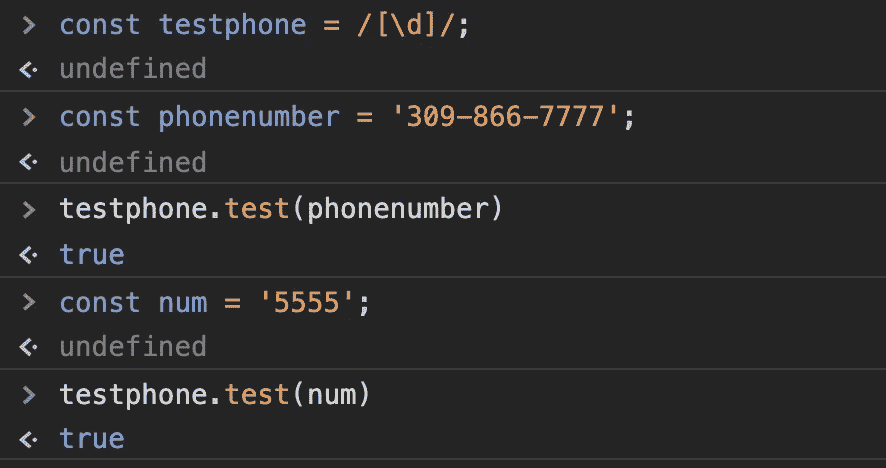
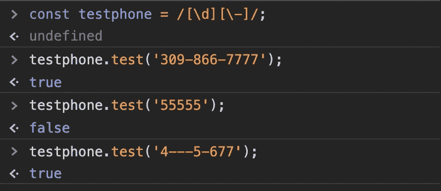
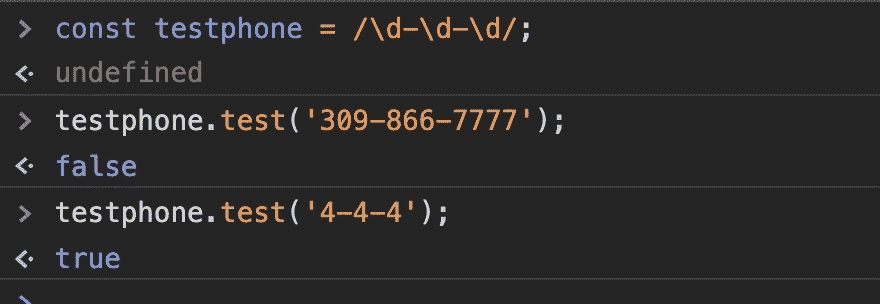
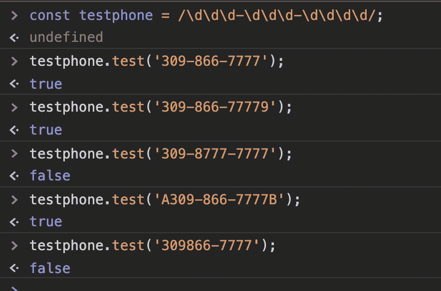
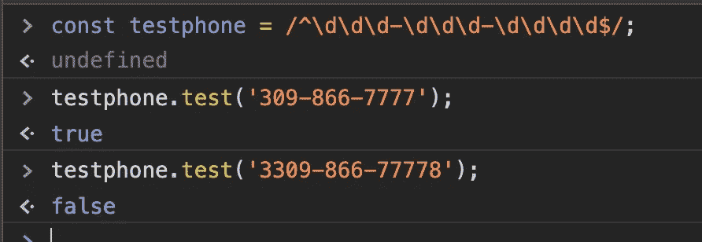
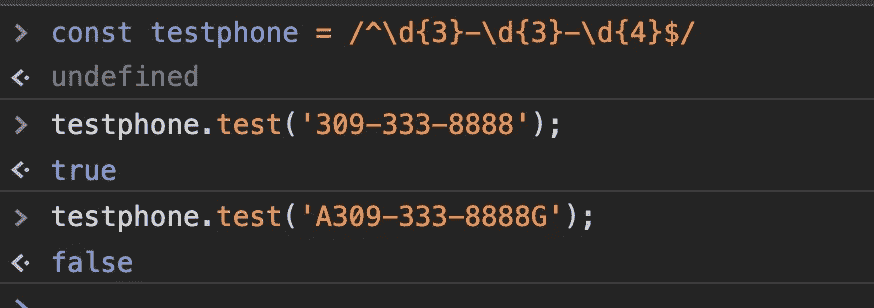
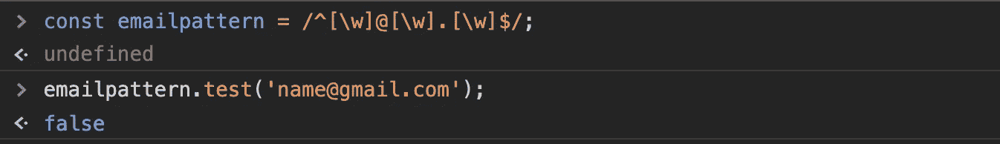
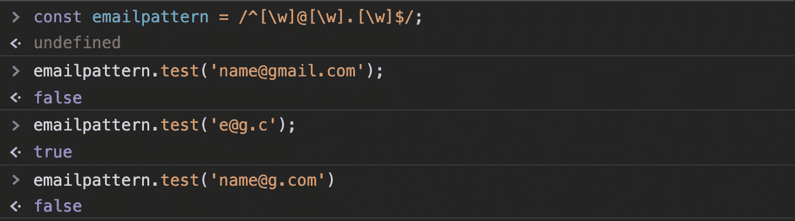
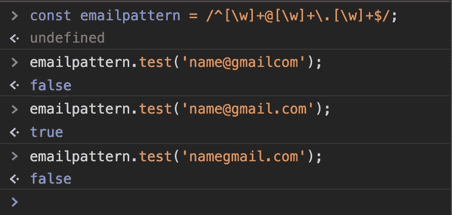

# 理解正则表达式第 2 部分

> 原文：<https://javascript.plainenglish.io/regular-expressions-part-ii-1c5b5d516af5?source=collection_archive---------14----------------------->

## **表单验证**

对于正则表达式系列的第二部分，让我们通过解决 web 开发表单验证中的一个常见问题来进行更深入的研究。让我们以填写电话号码字段和基本配置文件表单为例。在这种情况下，我们希望验证用户输入了 ddd-ddd-dddd 形式的输入。

首先，我们需要解释我们的正则表达式' testphone '\d 是 JavaScript 正则表达式中的特殊字符，表示任何数字。换句话说，[\d]相当于[0–9]。因此，测试被指示查找字符串中任何字符 0–9 的匹配项。当然，这给了我们一个肯定的电话号码，但这是因为它给了一个肯定的任何数字匹配。

要解决这个问题，我们需要更具体一点。让我们进一步处理连字符。让我们在正则表达式中添加一个要求来查找连字符。为此，让我们使用[\d\-]。我们使用转义字符' \ '作为连字符，因为它有特殊的含义。

在这种情况下，我们将获得任何包含数字或连字符的字符串的匹配。我们需要的是包含两者的字符串的匹配。除了 OR，我们还需要 AND 的逻辑。

现在我们离实现目标又进了一步。我们的正则表达式成功地找到了一个包含连字符和数字的字符串的正匹配。然而，我们要寻找的是一种特定的模式。我们需要模式数字—数字—数字。

我们的正则表达式只匹配一个数字的模式。如果能找到数字-数字-数字模式，测试返回 true。所以我们必须在正确的地方指定要匹配的位数。为了解决这个问题，我们将正则表达式改为:/\ d \ d \ d \ d-\ d \ d-\ d \ d \ d/。

看看结果，我们似乎离解决问题更近了一步。事实上，正则表达式测试确实可以识别模式。但是，它不看后面是什么，也不遵循模式。要最终解决这个问题，我们需要找到一种方法来告诉测试方法:寻找这种周围没有字符的模式。

为此，我们需要介绍两个特殊字符:^和$。^的角色说在我之后的应该是字符串的开始。$字符表示在我之前的应该是字符串的结尾。组合^和$字符可以有效地隔离模式。

看起来很有效。然而，我们可以稍微重构一下代码。我们有一个用括号来指定一个数字出现的次数的简写方法。所以让我们把正则表达式简化为:/^\d{3}-\d{3}-\d{4}$/.

让我们来解决一个类似但相关的问题，这个问题经常出现在电子邮件中。我们希望验证输入的电子邮件是否符合有效电子邮件的一般模式。对于几乎所有的电子邮件来说，这种格式都是:name@emailhost.domain。【人物】。出于我们的目的，我们不会担心字符的数量。

为了帮助实现我们的目标，我们需要引入一个新工具，' \w '。\w 代表单词字符。它们被定义为任何字母、数字或下划线。让我们把正则表达式设为'/^[\w]@[\w]\.[\w]$/。

这是一个有趣的结果。我做错了什么？事实证明，测试方法寻找的模式是一个单词字符后跟@再跟一个单词字符再跟。后面跟着一个字符。^和$保证没有额外的匹配字符。下面的命令确认这是返回 true 的正确模式。

那么我们如何解决这个问题呢？在这种情况下，我们希望字符在一个范围内出现多次。我们已经有了一种方法，用我们在电话号码问题上使用的括号符号来指定它。{1，}将告诉函数我们想要一个或多个字符外观。这是可行的，但是我们确实有一个更短的表达式可以用于这种情况。“+”字符查找一个或多个匹配字符。

## 关键要点

1.  [\d]是[0–9]的快捷方式，表示匹配 0 到 9 之间的任何数字或任何字符。
2.  \ '可以用作“转义”字符，表示通常具有特殊含义的字符应该像任何其他字符一样按字面意思理解。例如，通常情况下，^意味着下一个字符应该在字符串的开头。但是如果您想要匹配'^'字符本身，您将需要使用转义字符——'\^'.
3.  如果您需要隔离一个模式，并确保在模式开始之前不包含任何字符，请使用^字符。这意味着跟随我的必须开始一个字符串。
4.  如果您需要隔离一个模式，并确保模式结束后不包含任何字符，请使用$字符。这意味着后面的内容必须在字符串的末尾。
5.  括号符号可以用来指定一个字符应该出现的精确次数。例如，后跟{3}的字符表示查找其中三个字符的匹配项。一个字符后接{2，}再接 2 个或更多字符。{，3}表示 1 到 3 个字符。{2，4}表示 2 到 4 个字符。
6.  “+”字符本质上与{1，}相同，意味着该字符应该出现 1 次或多次。

在本系列的下一部分中，我们将向正则表达式工具集添加更多技巧来解决更多问题。