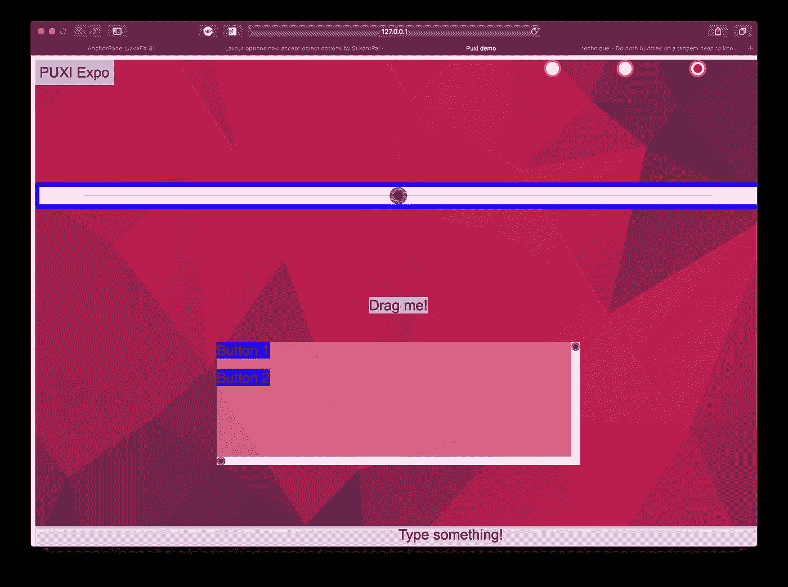

# 发布 PuxiJS 1.0.0-RC

> 原文：<https://javascript.plainenglish.io/releasing-puxijs-1-0-1210c88eb845?source=collection_archive---------4----------------------->

了解官方 PixiJS GUI 库及其各种开源小部件和布局！—[https://pixijs.io/pixi-ui](https://pixijs.io/pixi-ui)

PixiJS 是一个快速、轻量级的网络 2D 渲染引擎。它是创建丰富的、交互式的、快速的内容的首选解决方案，而无需一头扎进 WebGL API。然而，很长一段时间以来，它一直缺乏一个全面的 GUI 小部件解决方案，为您处理*呈现*和*交互*并公开一个基于事件的 API。

Nicholai Mortenson 建立了一个名为 pixi-ui 的库，它得到了 PixiJS 的官方支持。它的大部分用途是将它分支到现有的项目中，并将其转换成 MVVM 组件。然而，它从未发布到 npm，并最终退出维护。这就是为什么我接手了这个项目，并把它重新命名为 PuxiJS。我选择将其命名为 Puxi 是因为:I)这不会是一个插件，而是几个组件的 monorepo，我认为它应该有自己的品牌名称，ii)这个词包含“UX/UI ”,同时明显与 Pixi 相似。

我会在 npm 上发布 PuxiJS，这样你也可以看看！：

```
npm install puxi.js
```

PuxiJS 的基本构件是“小部件”。小部件是一种 UI 控件，它可以:

*   给定一些约束条件，计算最佳宽度和高度。
*   布局并将其自身呈现在屏幕上的矩形内。
*   用填充在其内容后面显示背景。

`PUXI.Widget`类提供了一个高级 API 来帮助您配置这些特性。

# 场景图和舞台

在 PuxiJS 应用程序中，有两个场景图——小部件图和显示对象图。一个`PUXI.Stage`是小部件图的根元素，它可以作为子元素添加到 PixiJS 应用程序中的任何一个`PIXI.Container`中。

小部件层次结构中的任何全局阶段都存储在阶段中。这允许您创建多个 GUI 阶段，当您需要切换页面或显示新内容时，可以“交换”这些阶段。

```
/* Basic setup of a PuxiJS application*/// Create your PixiJS application.
const app = new PIXI.Application({ /* ... */ });// Create a stage that covers the whole canvas!
const stage = new PUXI.Stage(app.view.width, app.view.height);// Place a button widget on the top-left corner!
stage.addChild(
  new PUXI.Button({ text: "Hello World!" })
    .setBackground(0x00FFFF)
    .setPadding(8)
) // This is a bit confusing! app.stage is the PixiJS stage while
// stage is the PuxiJS stage.app.stage.addChild(stage);
```

在内部，显示对象图不会在阶段结束。每个小部件都有多个`PIXI.Container`对象。

*   `contentContainer`:这个容器包含了呈现小部件内容所需的所有显示对象，包括子对象。
*   `insetContainer`:这是容纳任何填充内容的容器。

当一个子部件被添加到父部件时，它的`insetContainer`会被添加到父部件的`contentContainer`中。

> 舞台不是一个小部件，它是一个`PIXI.Container`；但是，它的子对象必须是小部件。然而，它共享了小部件的许多特征，如布局和背景。

# 布局

PuxiJS 最强大的特点是它的布局系统。布局系统很大程度上是受 Android 的`ViewGroups`集合的启发。

## 布局经理

布局管理器负责定位和调整小部件的子部件。一个`PUXI.WidgetGroup`可以附加你想要的布局管理器。配置一个特定子节点的布局，您可以使用`Widget#setLayoutOptions`指定布局选项。每种布局类型都有自己的布局选项类。

> 您可以通过创建自己的布局管理器来自定义小部件组的子部件的布局方式。或者，您可以使用 PuxiJS 提供的布局之一— `FastLayout`、`AnchorLayout`和`BorderLayout`。随着 PuxiJS 的增长，更多的布局将被添加到这个列表中！

## 布局选项

```
const widget = new PUXI.Text("Widget").setBackground(0xfefefe);widget.setLayoutOptions(new PUXI.LayoutOptions({
  width: PUXI.LayoutOptions.WRAP_CONTENT, // natural width
  height: PUXI.LayoutOptions.FILL_PARENT // height = stage's height
});const widget2 = new PUXI.Text("Widget2").setBackground(0xffeeaa);widget2.setLayoutOptions(new PUXI.LayoutOptions({
  width: .5, // 50% width
  height: 42 // 42px height
}); stage.addChild(widget, widget2);
```

基类`PUXI.LayoutOptions`允许您指定小部件的宽度和高度。宽度/高度可以设置为:

*   `WRAP_CONTENT`:使用宽度的自然宽度/高度。
*   `FILL_PARENT`:填充母体的宽度/高度。
*   固定值，例如 96:宽度/高度可以设置为固定的像素值。这将强制小部件以该宽度/高度呈现自己。
*   百分比值，例如. 5:如果在布局选项中传递的值小于 1，则它被解释为父项的宽度/高度的百分比。

## 舞台和快速布局

舞台采用快速布局。您还可以在任何小部件组上使用快速布局。

快速布局允许您指定小部件的 *(x，y)* 位置和您想要的宽度/高度。

## AnchorLayout 示例

Anchor layout 允许您将每个子部件的边缘锚定到相对于父部件的 insets(或其`contentContainer`的边缘)的特定偏移量。这些偏移也可以是父对象宽度或高度的“百分比”。要强制小部件填充锚定区域，请将其宽度/高度设置为零。

下面的例子使用 anchor-layout 在画布的左边和右边放置了两个按钮。左按钮的宽度填充其锚定区域，而右按钮的高度填充其锚定区域。

## 测量和布局通道

PuxiJS 的优势在于*自适应*。它应该适用于移动屏幕、平板电脑和台式机。测量和布局通道是这种能力的基础。

在测量过程中，一个小部件在一组约束条件下计算它的最佳宽度和高度。如果小部件附有布局管理器，布局管理器将测量子部件。

在布局过程中，布局管理器根据测量的宽度和高度定位子部件。使用在每个子节点上设置的布局选项来配置该过程。

# 高级小部件

## ScrollWidget

scroll 小部件显示其部分内容，并允许用户滚动查看其内容的不同部分。它自动创建滚动条，处理拖动、鼠标滚动和放松滚动。



PuxiJS Example Expo

## 滑块

滑块允许用户通过拖动滑块的手柄来设置最小值和最大值之间的值。

## 文本输入

文本输入允许用户键入文本。当文本溢出时，它还具有滚动功能。

# 小部件的其他功能

## 背景

您可以将小部件的背景设置为任何颜色或像素显示对象。例如，如果要使用圆角矩形:

```
widget.setBackground(
  new PIXI.Graphics()
    .beginFill(0xff)
    .drawRoundedRect(0, 0, 32, 32, /* radius: */ 8)
    .endFill()
);
```

## 填料

您可以在小部件的内容周围添加填充。

```
widget.setPadding(/* horizontal: */ 8, /* vertical: */ 12);
```

## 立面图(实验)

在一个小部件上使用一个仰角将会在它的背景上添加一个投影。

```
widget.setElevation(4);// adds a drop-shadow with distance=4
```


Button with a drop-shadow & rounded rect background!

# 进一步的工作

## 动态文本

pixi-ui 的原作者创造了一个叫“动态文本”的东西。这种类型的文本将在纹理中缓存文本的每个字母，并使用它进行绘制。PuxiJS 将在 1.0.0 之后发布该特性。

## 更多布局和小部件

更高级的布局仍然需要推出——列表布局、网格布局和一些基于约束的布局。小部件也是如此——幻灯片小部件、图标和图像按钮、下拉菜单等。

## 造型支架

在未来，我想支持一个特性，你可以使用类似 react native 的`StyleSheet`来设计你的组件。

## 响应背景

现在，小部件的背景只是一个静态的显示对象。如果背景能够响应像悬停、点击、拖动和聚焦这样的事件，那不是很好吗？

## 反应式数据模型

如果你是一名前端开发人员，在为 WebGL 应用程序开发 GUI 时，你会错过 React 的范例。我将致力于弥补 PixiJS 中的差距！

## 智能缓存

小部件大多是静态的。它们很容易被缓存，只有在发生变化时才被渲染。

# 贡献

PuxiJS 是开源的，将感谢贡献:[https://github.com/pixijs/pixi-ui](https://github.com/pixijs/pixi-ui)。我们还有很多事情要处理。

这个项目是一个 monorepo，构建系统类似于 PixiJS，用 Typescript 编写。

嘿，伙计们，我是 Shu Kant Pal——pix ijs 的核心维护者和 Silcos 内核的创建者。喜欢我的内容？，跟我来这里:

[](https://twitter.com/ShukantP) [## 舒坎特·库马尔·帕尔

### Shukant Kumar Pal (@ShukantP)的最新推文。PixiJS 项目成员，pixi-UI/PuxiJS 的维护者。自我…

twitter.com](https://twitter.com/ShukantP)