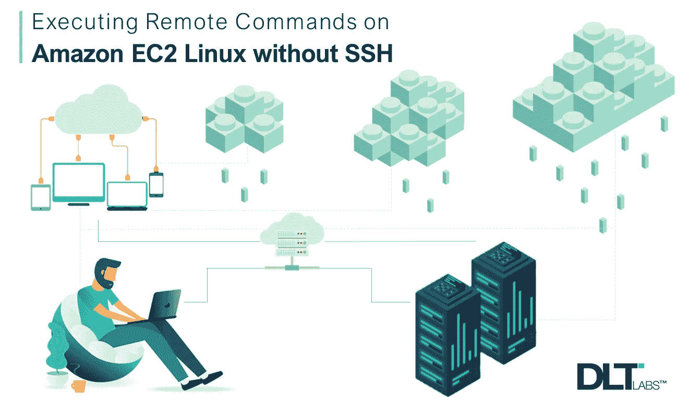
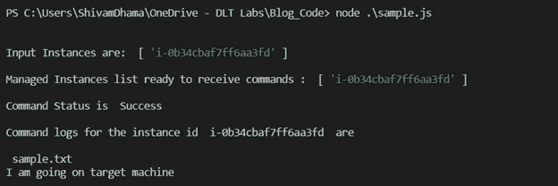

# 远程执行 Amazon EC2 Linux 命令，无需 SSH

> 原文：<https://javascript.plainenglish.io/remotely-execute-amazon-ec2-linux-commands-without-ssh-fc2f64164410?source=collection_archive---------9----------------------->

[](http://www.dltlabs.com)

当我在 DLT 实验室[](http://www.dltlabs.com)**担任软件工程角色时，与各种云提供商合作时，我遇到了一个非常有用的技术，我们可以利用它在亚马逊 Web 服务(AWS)虚拟机(EC2 实例)上运行命令或脚本，而不需要 SSH 访问，也不允许任何端口访问。**

**我将使用名为 **AWS 系统管理器**的服务来实现这一点。**

**AWS 系统管理器(SSM)是众多流行的 AWS 服务之一，它可以帮助您在一台或多台 EC2 机器上轻松运行远程命令或脚本。**

**在这篇博客中，我将分享我们如何使用 **AWS SDK NodeJS 来做到这一点。****

# **目标**

**在代码实施期间，我们的目标是通过使用 AWS SSM 在 EC2 机器上执行以下命令:**

*   **触摸 sample.txt**
*   **Echo 我来自目标机> > sample.txt**
*   **限位开关（Limit Switch）**
*   **Cat sample.txt**

**此外，我们将学习如何在应用服务器上查看命令状态和相应的日志。**

# ****先决条件****

**读者应该对 Amazon AWS 有一些了解，例如，他们应该了解 IAM 角色、IAM 用户以及如何将角色附加到 EC2 实例。除此之外，我将使用 NodeJS 技术栈。两者的细节描述如下:**

## ****1。** **需要的配置和策略。****

*   ****IAM 用户的凭证:**创建一个 IAM 用户，并将 **EC2** 和 **SSM** 策略附加到该用户，以便该用户能够在目标机器上执行命令。**
*   ****IAM 角色:**创建一个新的 IAM 角色，并将***awsec 2 roleforsm***策略附加到它。所有的目标机器都应该附加这个角色，以便 SSM 服务能够与 EC2 机器通信。**

## ****2。** **软件/库****

*   ****NodeJS 引擎****
*   ****AWS-SDK 模块:**要安装此模块，请使用: **npm i aws-sdk****
*   ****蓝鸟:**使用 **npm i 蓝鸟****
*   ****Lodash** :使用 **npm i lodash****

****> >代码实现将发生在以下阶段:****

1.  **在向目标机器发送命令之前，首先我们将检查目标机器是否准备好接收命令。**
2.  **如果机器准备好了，我们就发送指令。**
3.  **之后，我们将持续监控命令状态。**
4.  **一旦命令被执行，我们可以在远程机器的控制台中看到它们的日志。**

**一切就绪，让我们从实际的代码实现开始。**

# **实施我们的准则**

****第一步**:创建一个 samplefile.js。**

****第二步:**导入所有模块，并在 SSM 对象中设置 IAM 用户的凭证。**

```
// Importing modulesconst AWS = require(‘aws-sdk’)const Promise = require(‘bluebird’)const _ = require(‘lodash’)const ssm = new AWS.SSM({accessKeyId: ‘KLIAT7SDWDFRR4HBJ3E4N’, // Insert your IAM User Access KeysecretAccessKey: ‘xxxxxxxxxxxxxxxxxxxxxxxxxxxxxxx’, //User secret keyregion: ‘us-east-2’})
```

****步骤 3:** 将以下代码片段添加到 samplefile.js 中**

```
// @params {Array} instanceIds : Array of instance idsasync function mainFunction(instanceIds) {if (!Array.isArray(instanceIds)) instanceIds = [instanceIds];console.info(“\n”);console.info(“Input Instances are: “, instanceIds, “\n”);try {let managedInstanceIds = await checkInstanceIsReady(instanceIds)console.info(“Managed Instances list ready to receive commands : “, managedInstanceIds, “\n”);if (!_.isEmpty(managedInstanceIds)) {let commandParameters = {DocumentName: “AWS-RunShellScript”,Targets: [{Key: “InstanceIds”,Values: managedInstanceIds}],Parameters: {workingDirectory: [“/home/mydir”],commands: [“touch sample.txt”, “echo I am from target machine >> sample.txt”, “ls”, “cat sample.txt”]},TimeoutSeconds: 60000,MaxConcurrency: “50”,MaxErrors: “0”,};let data = await sendCommandToInstances(commandParameters);let commandExecStatus = await checkCommandStatus(data.Command.CommandId, 80);console.info(“Command Status is “, commandExecStatus , “\n”);for (let eachInstance = 0; eachInstance < managedInstanceIds.length; eachInstance++) {let logs = await getCommandsLogs(managedInstanceIds[eachInstance], data.Command.CommandId, commandExecStatus);console.info(“Commands logs for instance id “, managedInstanceIds[eachInstance], “ is \n”, logs);}return Promise.resolve(commandExecStatus);}else {console.error(“No Instances are ready for receiving the command”)return “No Instances are ready for receiving the commands”}}catch (err) {console.error(“Error came while sending commands “, err);return Promise.reject(err);}}try {mainFunction([“i-0b34cbaf7ff6aa3fd”]);}catch(err){console.error(“Error while calling main function “, err);}
```

**当我们运行***sample file . js***时，**main function(*instance ids*)**将是执行开始的第一个。**

**然后`**mainFunction(*instanceIds***` **)** 会调用另一个函数`**checkInstanceIsReady(*instanceids*)**`。**

## ****调用 CheckInstanceIsReady*(instanceIdList)*****

```
/*** Function to check whether instances are ready to receive commands* and return an array of such instances* @params {Array} instanceId : Array of instance ids*/function checkInstanceIsReady(instanceIdList) {let readyInstancesList = []let params = {InstanceInformationFilterList: [{key: “InstanceIds”,valueSet: instanceIdList}]}return new Promise((resolve, reject) => {ssm.describeInstanceInformation(params, function (err, data) {if (err) {console.error(err);reject(err);}let instanceObj = data.InstanceInformationListfor (let eachInstance = 0; eachInstance < instanceObj.length; eachInstance++) {readyInstancesList.push(instanceObj[eachInstance][“InstanceId”]);}resolve(readyInstancesList);})})}
```

**函数 `**checkInstanceIsReady(*instanceIds*)**`又调用一个 AWS SSM 内置函数`**describeInstanceInformation()**` 并返回一个包含所有准备好从远程机器接收命令的实例 id 的数组。**

**这些实例被称为 ***托管实例*** ，因为它们可以使用系统管理器(SSM)进行配置。**

> ****注意:** *如果任何实例正在运行，但仍未出现在数组中，我们需要检查以下内容:***
> 
> ***>所需角色已正确配置(在先决条件中描述)***
> 
> ***>【SSM 代理安装完毕】(如果默认不安装)***

**现在创建一个 ***命令参数*** 对象，该对象将具有以下关键点:**

*   ****文档名:**要运行的系统管理器文档的名称。这可以是公共文档，也可以是自定义文档。这里我们使用的是***AWS-RunShellScript***，它是一个公共文档，用于在 EC2 机器上远程执行命令。**
*   ****参数:**它具有以下属性**
*   ****工作目录:**命令将被执行的目标位置的数组。
    **如** `**“/home/mydir”**`**
*   ****命令:**我们希望在目标机器上执行的命令数组。这些命令将连续执行。**
*   ****Targets:** 它接受键值对来标识实例。**
*   ****关键字:**用户定义的标准，用于发送以满足标准的实例为目标的命令。**
*   ****值:**映射到关键字的用户定义的标准。
    例如，如果**键**是‘instance ids ’,那么其对应的**值**应该是实例 id 的数组。**

**这个 commandParameters 对象将被传递给函数`**sendCommandToInstances(*commandParameters*)**`。**

## ****调用 sendCommandToInstances *(命令参数)*****

```
/*** Function will send the command to EC2 machines* @params {Object} commandParameters : command parameters information*/async function sendCommandToInstances(commandParameters) {return new Promise(function (resolve, reject) {ssm.sendCommand(commandParameters, function (err, data) {if (err) {console.error(“Unable to sendCommandToinstances:”, err.message);reject(“Request Failed! Instance Id/Credentials is not valid or Role not assigned to Ec2”);}resolve(data);});});}
```

**函数 `**sendCommandToInstance(*commandParameters*)**`将调用另一个 AWS SSM 内置函数`ssm.sendCommand()`，并返回一个包含命令信息的对象，即 *commandId、DocumentName、Status* 等等。**

**现在我们将调用函数`**checkCommandStatus(*commandId*, *maxRetry*)**`，该函数随后调用 AWS SSM 内置函数`**ssm.listCommands()**`。基于`commandId`，`**ssm.listCommands()**`将返回相应的命令状态。**

## ****调用 checkCommandStatus*(command id，maxRetry)*****

```
/*** Function will check the command status i.e. Success, Failed* @params {String} commandId : command Id* @params {Number} maxRetry*/async function checkCommandStatus(commandId, maxRetry) {let currentTry = 1;return new Promise((resolve, reject) => {let params = {CommandId: commandId};let toStopInterval = setInterval(() => {ssm.listCommands(params, (err, data) => {if (err) reject(“Command id not found”);if (currentTry > maxRetry) {clearInterval(toStopInterval);reject(“Max Limit Reached! Status cannot determined”);}let commandStatus = data.Commands[0].Status;if (commandStatus === ‘InProgress’) {currentTry += 1;}else {clearInterval(toStopInterval);resolve(data.Commands[0].Status);}});}, 1500);});}
```

**这里我们可以使用我们使用的`**setInterval()**.` 进行连续监控。**

**如果命令状态为 ***成功*** 或 ***失败*，**控制将直接返回`**mainFunction()**`，但如果状态为`**InProgress**`，则`**ssm.listCommands()**` 功能将检查状态，直到达到`maxRetry`极限。**

****到目前为止，我们已经向目标机器发送了命令，并准备好查看它们的日志。****

**为此，我们调用函数`**getCommandsLogs(*instanceId*, *commandId, commandExecStatus*)**` ，该函数将调用 AWS SSM 内置函数`**ssm.getCommandInvocation()**` ，并将命令日志返回给`**mainFunction()**` **。****

## ****调用 getCommandsLogs *(instanceId，commandId，commandExecStatus)*****

```
/*** Function will help to get the command logs* @params {Array} instanceId : Instance Id of Ec2 machine* @params {String} commandId : command Id* @params {String} commandExecStatus : command status*/async function getCommandsLogs(instanceId, commandId, commandExecStatus) {let params = {CommandId: commandId,InstanceId: instanceId}return new Promise((resolve, reject) => {ssm.getCommandInvocation(params, (err, data) => {if (err) {console.error(“Error came while fetching the logs “, err);reject(err);}let logs = commandExecStatus === “Success” ? data.StandardOutputContent : data.StandardErrorContentreturn resolve(logs);})})}
```

# ****代码输出****

****

**Output of the above code | [Source](http://www.dltlabs.com)**

**这就是我们如何轻松地远程执行命令，并在控制台中查看相应的命令日志。有了 SSM，我们不用登录就可以轻松地管理和配置实例。**

**[](https://medium.com/@dltlabs/enterprise-blockchain-the-cooperation-machine-e8a539f4d45) [## 企业区块链:合作机器

### 企业区块链可以帮助您的内部部门保持一致并培养信任。

medium.com 的 DLT 实验室](https://medium.com/@dltlabs/enterprise-blockchain-the-cooperation-machine-e8a539f4d45) 

***作者*** *— Shivam Dhama，DLT 实验室*

**关于作者** — *Shivam* 目前与 DL 工具团队有关联，拥有亚马逊 web 服务、NodeJS、Python、机器学习的实践经验。

*亚马逊网络服务和 AWS 是 Amazon.com 公司或其附属公司在美国和/或其他国家的商标。Node.js 是 Joyent 公司的注册商标。npm 是 npm 公司的注册商标。DLT 实验室是 DLT 全球公司的商标*** 

> ****参考文献:****
> 
> **[https://docs . AWS . Amazon . com/AWSJavaScriptSDK/latest/AWS/SSM . html](https://docs.aws.amazon.com/AWSJavaScriptSDK/latest/AWS/SSM.html)**
> 
> **[https://docs . AWS . Amazon . com/AWSJavaScriptSDK/latest/AWS/iam . html](https://docs.aws.amazon.com/AWSJavaScriptSDK/latest/AWS/IAM.html)**

**[](http://www.dltlabs.com)**