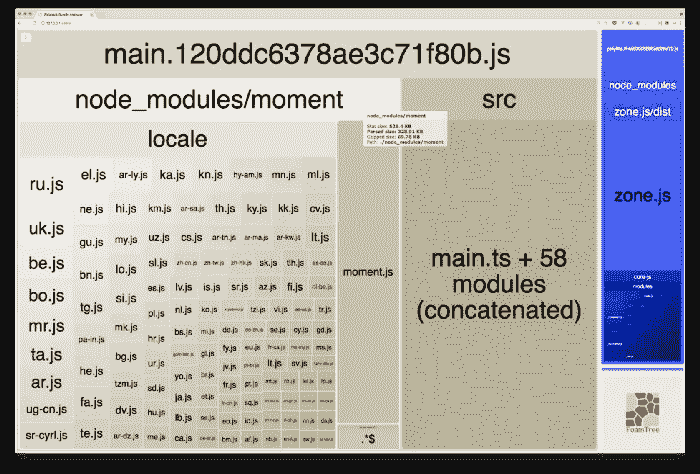

# 从 Angular app JS 软件包中移除 Moment.js 语言环境

> 原文：<https://javascript.plainenglish.io/removing-moment-js-locales-from-your-angular-app-js-bundles-2abfec434109?source=collection_archive---------0----------------------->

## 您的捆绑包大小超出了分配的预算或接近预算？ [Moment.js](https://momentjs.com/) 可能是罪魁祸首之一。让我们看看如何解决这个问题。

Picture courtesy of [Clever Visuals](https://unsplash.com/@clever_visuals)

在本文中，我将介绍从应用程序的 JavaScript 包中移除未使用的 Moment.js 语言环境并使其变得轻如鸿毛所需的步骤。

# MomentJS 怎么了？

Moment.js 是一个非常流行和强大的库。它支持日期/时间的格式化和本地化，允许方便地为世界各地的用户适当地显示日期/时间。

不幸的是，它没有跟上现代图书馆利用 es 模块(ESM)来提供更好的模块化的趋势。一旦您在代码中从“moment”导入一些内容，您的 JS 包就会自动包含 Moment.js 支持的所有语言环境。在大多数情况下，这是没有用的，因为应用程序通常只支持少数语言环境。

Catastrophic impact on bundle size

每个 Moment.js 语言环境文件“仅仅”重几 KB，但是如果你把它们加在一起，那么它就开始变得非常糟糕；尤其是对于中小型应用。

请注意，上面的可视化是由 [webpack-bundle-analyzer](https://medium.com/swlh/analyzing-your-angular-app-js-bundles-8f5def43cd53) 生成的，这是一个非常有用的工具，我在我的[上一篇文章](https://medium.com/swlh/analyzing-your-angular-app-js-bundles-8f5def43cd53) : [“分析你的 Angular 应用 JS bundles”](https://medium.com/swlh/analyzing-your-angular-app-js-bundles-8f5def43cd53)中介绍过。

另一方面，诸如 RxJS、Lodash 等库只在需要时才支持导入特定的函数/操作，这大大减小了包的大小；把它限制在绝对必要的范围内。

这是 Moment.js 的一个已知问题，但是[还有希望](https://github.com/moment/moment/issues/5492)；从某种意义上来说，这可能会得到改善。不过现在，我们必须实施一个解决方案，因为这对用户体验、性能…和地球都非常不利；-)

# 新项目最简单的解决方案

新项目可能更适合使用像 [date-fns](https://date-fns.org/) 这样的库。

date-fns 支持单独导入特定的函数，这意味着它不会不必要地增加 JavaScript 包的重量。这可能是因为 date-fns 是一个函数库，而不是像 Moment.js 那样面向对象的函数库。

date-fns 也很强大。我不能和 Moment.js 详细比较，但我相信两者大致相当。如果你正在寻找两者的对比，那么你可以看看下面的文章中的[。](https://medium.com/@k2u4yt/momentjs-vs-date-fns-6bddc7bfa21e)

顺便说一句，如果你正在寻找角度支持，那么知道有一个相当于 [ngx-moment](https://www.npmjs.com/package/ngx-moment) 的日期-fns，称为 [ngx-date-fns](https://github.com/joanllenas/ngx-date-fns) 。

# 定制 Webpack 配置拯救世界

在最近的一篇文章中，我解释了如何轻松地[定制 Angular 应用程序的 Webpack 配置](https://medium.com/javascript-in-plain-english/customizing-your-angular-apps-webpack-configuration-4099144949fc)。

好消息是，我们可以通过定制 Webpack 配置来快速修复 Moment.js 捆绑问题。您需要做的是默认排除所有 Moment.js 语言环境，并手动导入您需要的语言环境。

以下是排除 Moment.js 区域设置的方法:

这个解决方案使用 Webpack 的 [Ignore 插件(一个核心插件)来忽略 Moment.js 区域设置文件。](https://webpack.js.org/plugins/ignore-plugin/)

一旦将它添加到您的项目中，就不会将 Moment.js 区域设置添加到您的 js 包中。但是你当然希望*至少包含一个*！

要包含一个区域设置，现在必须在应用程序代码中显式导入它。例如，您可以在“main.ts”文件中执行此操作:

有了这些，JS 包将只包含您真正需要的东西。

# 结论

在本文中，我已经向您展示了，默认情况下，Webpack 将在您的 JavaScript 包中包含 Moment.js 支持的所有语言环境。

考虑到它给 JS 包增加了多少重量，意识到这个问题很重要，更重要的是确保避免它。幸运的是，正如我上面所展示的，一旦你知道如何[定制你的 Angular 应用程序的 Webpack 构建](https://medium.com/javascript-in-plain-english/customizing-your-angular-apps-webpack-configuration-4099144949fc)，这个修复就很容易实现。

希望这将帮助您改进您的应用程序，并使它为最终用户快速加载。

今天到此为止！

# 喜欢这篇文章吗？

如果你想了解关于软件/Web 开发、TypeScript、Angular、React、Vue、Kotlin、Java、Docker/Kubernetes 和其他很酷的主题的大量其他很酷的东西，那么不要犹豫[拿一本我的书](https://www.amazon.com/Learn-TypeScript-Building-Applications-understanding-ebook/dp/B081FB89BL)并订阅[我的简讯](https://mailchi.mp/fb661753d54a/developassion-newsletter)！