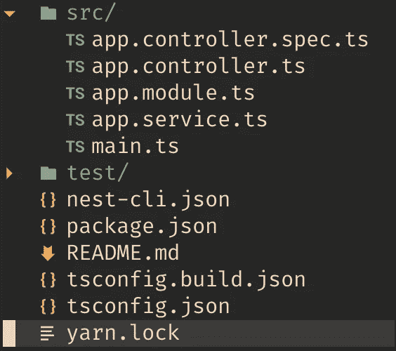
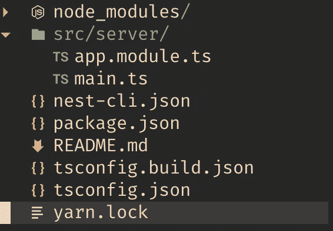
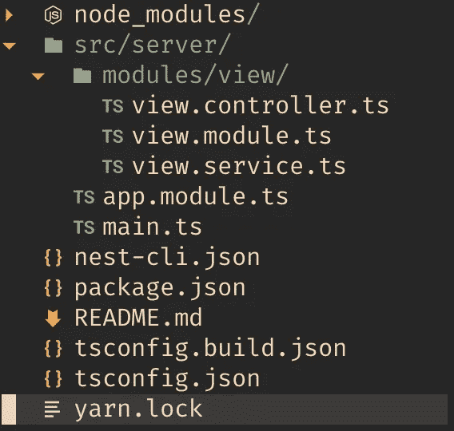
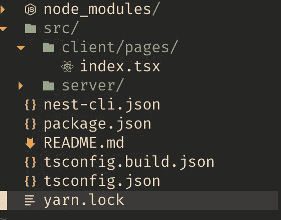
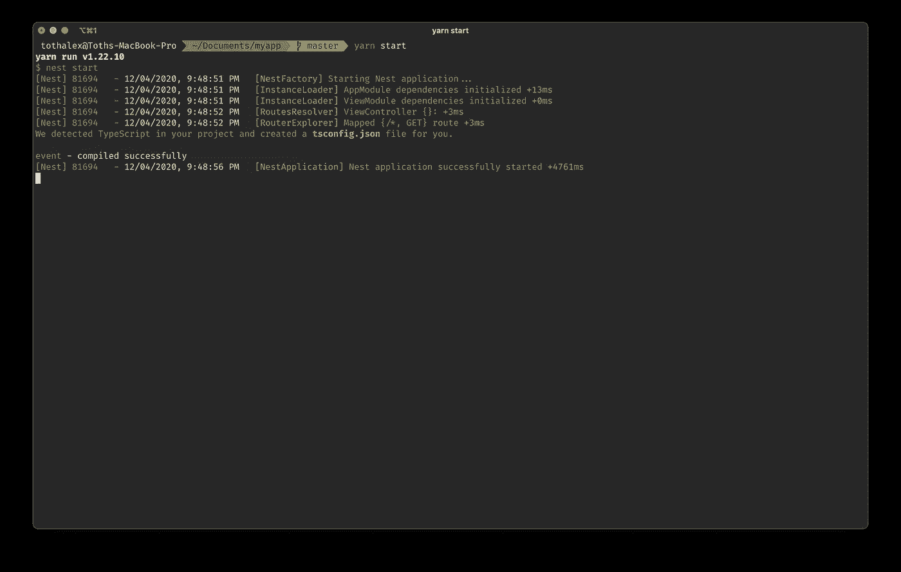
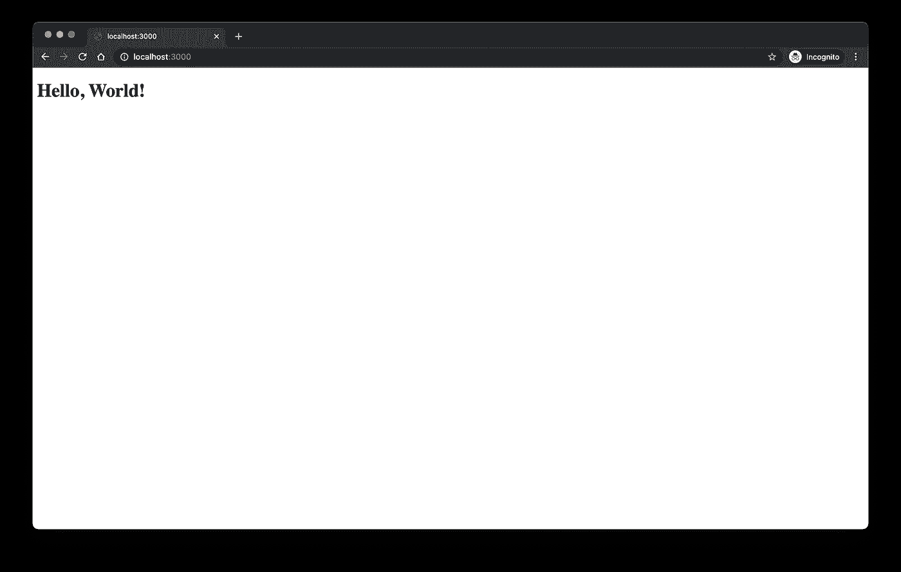

# 如何使用 NestJS 渲染 Next.js

> 原文：<https://javascript.plainenglish.io/render-next-js-with-nestjs-did-i-just-made-next-js-better-aa294d8d2c67?source=collection_archive---------0----------------------->

## 我只是让 Next.js 变得更好了吗？


如果您阅读本文，您可能对这两个框架有一点了解，如果没有，我会建议您先看看它们，它们的网站上有很好的文档。

*   [https://nextjs.org/docs](https://nextjs.org/docs)
*   [https://docs.nestjs.com/](https://docs.nestjs.com/)

# 故事时间

很明显，我创建了一个小的 Github 存储库，在那里我创建了一些 web 应用程序样板，我还想要一个服务器端的渲染解决方案。所以当我沉入 monorepo 魔法世界的深渊时🎩，我遇到了一个关于 Next.js 和 NestJS 的问题。我真的需要两台节点服务器吗？🤔一个用于呈现反应应用程序，一个用于后端 API？**不！**所以我们想把这两者结合起来。

# 下一个。js 太棒了！

Next.js 的人已经考虑过了，他们的网站上有关于如何使用定制服务器的描述，所以从这里开始，我的工作变得 100%简单。

*   [https://nextjs.org/docs/advanced-features/custom-server](https://nextjs.org/docs/advanced-features/custom-server)

但有一个问题，没有东西是没有价格的。我们将失去 [*自动静态优化*](https://nextjs.org/docs/advanced-features/automatic-static-optimization) 的价格，但我不介意。在我的项目中，几乎每个页面都有“阻塞数据需求”，所以这在我的情况下不是一个大缺点。

# 与 NestJS 集成

在 NestJS 中，我们将控制器和服务封装在模块中，所以在我的例子中，我认为最好的选择是创建一个模块，其目的仅仅是为 UI 端服务，所以基本上是呈现我们的反应页面。

让我们调用这个模块 View Module，它将包含 View Controller(路由处理)、View Service(提供下一个渲染)。

# 让我们编码！🚀

首先，让我们安装用于创建项目的 NestJS CLI 工具:

```
npm i -g @nestjs/cli
```

**注意:**我建议使用纱线，我对 npm 有一些问题，显然是为 Next.js 安装了错误的 webpack 版本。

现在创建一个基础应用程序(选择纱线):

```
nest new myapp
```

项目结构应该是这样的:



我建议改变结构以符合我们的目标。我们需要分开客户端和服务器文件，删除 *app.controller.ts，app.service.ts* 文件，也是为了让这个删除测试文件更简单(临时)。



我们需要修改一些额外的文件:

> nest-cli.json

```
{
  "collection": "@nestjs/schematics",
  "sourceRoot": "src/server",
}
```

> tsconfig.json

```
{
  "compilerOptions": {
    "module": "commonjs",
    "declaration": true,
    "removeComments": true,
    "emitDecoratorMetadata": true,
    "experimentalDecorators": true,
    "allowSyntheticDefaultImports": true,
    "target": "es2017",
    "sourceMap": true,
    "outDir": "./dist",
    "incremental": true,
    "jsx": "preserve" 
  },
  "include": ["src/server/**/*.ts"],
}
```

下一步是安装**下一步，反应，反应-dom** 包:

```
yarn add next react react-domyarn add -D @types/react @types/react-dom
```

现在我们需要实现我们的视图模块。让我们在其中创建一个模块目录和一个视图目录，这将包含我们的 *view.controller.ts，view.module.ts，view.service.ts:*



## 视图服务

这里我们将创建下一个对象(🪄发生的地方)。

> src/server/modules/view/view . service . ts

```
import { Injectable, OnModuleInit } from '@nestjs/common'
import next from 'next'
import NextServer from 'next/dist/next-server/server/next-server'

@Injectable()
export class ViewService implements OnModuleInit {
  private server: NextServer

  async onModuleInit(): Promise<void> {
    try {
      this.server = next({ dev: true, dir: './src/client' })
      await this.server.prepare()
    } catch (error) {
      console.log(error)
    }
  }

  getNextServer(): NextServer {
    return this.server
  }
}
```

**注意:**在应用程序启动之前，我们在 *OnModuleInit，*中创建了 *NextServer* 对象，因此我们可以处理请求。

## 视图控制器

这将把我们的 NestJS 应用程序与 Next.js 服务器(其中💥发生)。

> src/server/modules/view/view . controller . ts

```
import { Controller, Get, Res, Req } from '@nestjs/common'
import { Request, Response } from 'express'

import { ViewService } from './view.service'

@Controller('/')
export class ViewController {
  constructor(private viewService: ViewService) {}

  @Get('*')
  static(@Req() req: Request, @Res() res: Response) {
    const handle = this.viewService.getNextServer().getRequestHandler()
    handle(req, res)
  }
}
```

基本上，我们所做的是将请求对象传递给*下一个请求处理程序(* '* '用于匹配每个路由，是的，react 页面仍然由 Next.js 呈现)。

我们需要做的最后一件事是修改 *view.module.ts，app.module.ts:*

> src/server/modules/view/view . module . ts

```
import { Module } from '@nestjs/common'

import { ViewController } from './view.controller'
import { ViewService } from './view.service'

@Module({
  imports: [],
  providers: [ViewService],
  controllers: [ViewController]
})
export class ViewModule {}
```

> src/server/app.module.ts

```
import { Module } from '@nestjs/common'

import { ViewModule } from './modules/view/view.module'

@Module({
  imports: [ViewModule],
  controllers: [],
  providers: []
})
export class AppModule {}
```

## 客户

这将包含我们的反应页面。该结构将如下所示:



我们需要将 react 页面放在 client/pages 目录下(这是 Next.js 识别页面的方式)。

> src/客户端/pages/index.tsx

```
import React from 'react'
import { NextPage } from 'next'

const Home: NextPage = () => {
 return <h1>Hello, World!</h1>
}

export default Home
```

现在运行魔法命令:**纱线启动**



**注意:** Next.js 会创建自己的 *tsconfig.json，next-env.d.ts* 这是预期的行为。

五[油à](https://en.wiktionary.org/wiki/voil%C3%A0) :



## 结论

我并没有把 Next.js 做得更好，我只是用可用的函数创建了一个更现代的服务器，这样你可以更好地设计你的 API 路由(视图模块应该总是作为最后一个导入，因为' * '将匹配每一个路由)，你也可以利用[*getServerSideProps*](https://nextjs.org/docs/basic-features/data-fetching#getserversideprops-server-side-rendering)*。*我有一个关于我的[github❤️](https://github.com/tothalex/webapp-boilerplates/tree/next-ssr-same-server) 的例子。

## 进一步阅读

[](https://plainenglish.io/blog/which-database-should-you-use-for-your-next-js-app) [## Next.js 应用程序应该使用什么数据库？

### 如果你在 2022 年要开发一个全栈应用，选择流行的 Next.js 会让你有 95%的机会…

简明英语. io](https://plainenglish.io/blog/which-database-should-you-use-for-your-next-js-app) [](https://plainenglish.io/blog/how-to-build-a-graphql-ecommerce-app-from-scratch) [## 如何从头开始构建一个 GraphQL 电子商务应用程序

### 这就是你要建造的东西！埃森哲的一项调查(19 个国家的 20，000 多名消费者)发现，47%的人…

简明英语. io](https://plainenglish.io/blog/how-to-build-a-graphql-ecommerce-app-from-scratch) [](https://blog.bitsrc.io/next-js-13-what-do-the-new-bleeding-edge-features-actually-do-d3e5fd418563) [## Next.js 13:新的前沿特性实际上是做什么的？

### 你听说过 Next.js 13 是一个游戏改变者，但是为什么？让我们看看有哪些新功能，有哪些变化，以及它们…

blog.bitsrc.io](https://blog.bitsrc.io/next-js-13-what-do-the-new-bleeding-edge-features-actually-do-d3e5fd418563) 

*更多内容请看*[***plain English . io***](https://plainenglish.io/)*。报名参加我们的* [***免费周报***](http://newsletter.plainenglish.io/) *。关注我们关于*[***Twitter***](https://twitter.com/inPlainEngHQ)[***LinkedIn***](https://www.linkedin.com/company/inplainenglish/)*[***YouTube***](https://www.youtube.com/channel/UCtipWUghju290NWcn8jhyAw)*[***不和***](https://discord.gg/GtDtUAvyhW) *。对增长黑客感兴趣？检查* [***电路***](https://circuit.ooo/) *。***