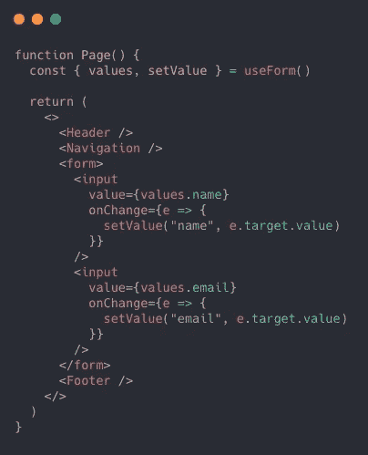
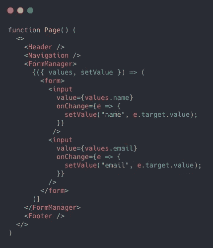
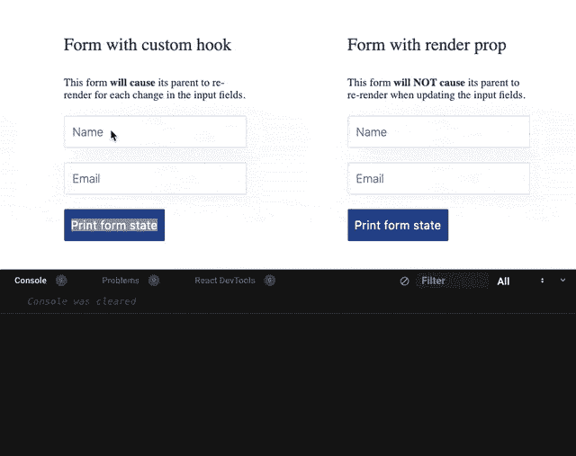

# 渲染道具 vs React 钩子:哪个效率更高？

> 原文：<https://javascript.plainenglish.io/render-props-vs-hooks-a73ec72180ed?source=collection_archive---------3----------------------->

## 你能猜出哪个代码片段效率更高吗？为什么？

我用同样的问题开始了一个 [twitter 讨论](https://twitter.com/moubi/status/1271429303574556672)，试图了解人们是否对钩子和渲染道具有强烈的意见。把两者对立起来不是空想，而是来自于一种现实的关切。

**说到状态管理*渲染道具组件* :**

-通常**比纯钩子解决方案更灵活，更不容易出错**

——仍然适用于**常见的**情况

现实中，钩子和渲染道具握手言和，配合得很好。但是，如果你必须在两者之间做出选择，让我们把这个决定放在压力上。

想看看最终基准吗？跳到*“行动中的比较”*部分，否则请继续阅读…

*如果你对钩子和渲染道具模式不熟悉——不要担心——一个好的起点是* [*渲染道具*](https://reactjs.org/docs/render-props.html) *，* [*使用渲染道具！*](https://cdb.reacttraining.com/use-a-render-prop-50de598f11ce)*[*挂钩一目了然*](https://reactjs.org/docs/hooks-overview.html) *。最后还提供了一个资源列表。**

# *渲染道具没有死*

*埃里克·拉斯姆森(Erik Rasmussen)的一次演讲引发了我的写作。它概述了我们如何从 HoCs 到 hooks。看着它，它应该让事情变得更清楚。*

*我记得我脑海中的声音按下了 React Europe 视频的播放按钮:*“等等，我是不是应该重新编写我的库，去掉我非常喜欢的渲染道具”*。那时 [**的 **v2 的 Enform****](https://github.com/moubi/enform) 发布了，我很满意。立即重写 v3 会破坏我的动机。*

***可能是你:***

*-使用钩子，但不要完全理解它们*

*-将挂钩视为神奇的解决方案*

*-想用钩子重写吗*

*如果是这样，那么接下来的事情可能会让人大吃一惊。*

# *问题是*

*钩子和渲染道具可以解决同样的问题。从概念上讲，它是将状态从你的组件中移走，这样它就可以被重用。问题是哪一个做得更好？什么时候？既然我们已经有了 hooks API，那么为包装组件和渲染道具而烦恼又有什么关系呢？*

*为了回答这个问题，让我们在整个过程中使用下面的通用表单示例。这很简单，你可能已经看过很多次了:*

*The form is intentionally kept simpler.*

*片段可能会迫使你思考:*“这是一个灾难的配方”*。对，州政府是主要嫌疑人。除此之外，通常表单中涉及更多的字段，需要处理验证、提交、API 调用和错误消息。当然，结果是**你的组件将会增长，你可能需要通过抽象来减轻状态逻辑**。*

# *用钩子处理状态抽象*

*请看这段简化的代码:*

*Try it out in [codesandbox](https://codesandbox.io/embed/controlled-form-with-hooks-1e9o7?expanddevtools=1&fontsize=14&hidenavigation=1&module=%2Fsrc%2FApp.js&theme=dark)*

*它是相同的表单组件，但是使用了函数而不是类和`useState`钩子。简单的动作已经让事情变得更好了。在这个受控表单中包含更多的字段就像在组件中处理更多的状态一样简单。*

*使用钩子和功能组件已经是一种胜利。好的，但是你会遇到另一个麻烦——组件状态是和表单一起生长的。从这一点来看，有两个选择。创建一个单独的表单组件或一个自定义钩子来保持状态重载。*

## *表单自定义挂钩*

*我想你知道如何建造一个。有很多例子，所以我们不要关注下面的`useForm`实现。有趣的是它如何改善我们的组件，以及它是如何被消耗的。请记住，我们正在慢慢触及痛点——定制挂钩是否是这里的最佳方法。*

*最后，请再次原谅这种简单，因为这个想法只是为了说明模式。*

*[This codesandbox](https://codesandbox.io/embed/controlled-form-with-custom-hook-f810j?expanddevtools=1&fontsize=14&hidenavigation=1&module=%2Fsrc%2FApp.js&theme=dark) contains all the details.*

*理想情况下，添加更多的逻辑将导致仅`jsx`(渲染)部分增长，而`useForm`为您管理状态。*

****侧注:****

*`*useForm()*` *(挺常见的名字)可能会漏掉——参考你*[*react——hook——form*](https://github.com/react-hook-form/react-hook-form)*。名字匹配，但理念不同。* `*react-hook-form*` *不是解决这里描述的状态问题，而是通过让形式成为不受控制的来避免。**

*回到我们的例子。添加错误和提交功能:*

*尽管如此，它的规模相当不错。您可以将更多的逻辑移入挂钩中，并使其可被项目中的所有表单组件重用。*

*状态不再驻留在`<Form />`中，但是组件将继续对场变化做出反应。最后，它是同样的`useState`用法，但是被移到了`useForm`。*

*这种方法的明显好处是直观(没有奇怪的语法)，可伸缩性很好，并且可能是 React 未来的一部分。*

*好吧，但是渲染道具呢？*

# *通过渲染属性处理状态*

*使用 render props 方法按状态卸载表单组件需要创建一个包装器组件。所以，表面上没有钩子，而是一个普通的组件。在这个例子中是`children`作为渲染道具，但是你可以用`render`(或者其他什么)来代替。*

*Curious about `FormManager’s` implementation? Here is the [codesandbox](https://codesandbox.io/embed/controlled-form-with-render-props-xvil0?expanddevtools=1&fontsize=14&hidenavigation=1&module=%2Fsrc%2FApp.js&theme=dark).*

*以一种奇怪的方式将状态抽象出来，对吗？是的，就是这样。*

*来自官方文件:*

> *术语“渲染道具”指的是使用其值为函数的道具在 React 组件之间共享代码的技术。*

****“…使用一个值为函数的道具”***——正是第一次看到渲染道具时显得笨拙的地方。除此之外，它的工作方式与`useForm`相似，只是`<FormManager />`只是一个普通组件。这种模式可能很熟悉，尤其是当您正在使用第三方库时。*

***渲染道具的方法和钩子有相似的好处，但是看起来很奇怪，有时不能有效扩展。**为什么会这样？*

*想象以下情况:*

*This snippet is actually a [real example](https://github.com/moubi/flow-task/blob/master/src/components/Board/Board.js#L129).*

*带有渲染属性的嵌套包装组件。哦，那看起来不是很有希望。它甚至会欺骗一些人，让他们相信这种模式已经过时，而支持*“用钩子做所有事情】*。钩子[不遭遇嵌套问题](https://reactjs.org/docs/hooks-faq.html#do-hooks-replace-render-props-and-higher-order-components)，确实如此。*

*但是如果渲染道具在钩子上没有优势，那么这篇文章将会走进一个死胡同。不过，还有一些与语法无关的东西。*

*继续…*

# *现状核实*

*让我们回顾一下。还记得开头这部分吗？*

*我有意在 jsx 中留下了更多的元素(`<h1 />`)，而不仅仅是`<form />`。这应该是一个提示，因为**在现实中，一些组件并不那么简单。通常他们会呈现更多你无法控制的代码。***

*一个更现实的例子应该是这样的:*

*现在，我知道你可能会说:*谁会那样使用 jsx？显然，您可以将表单逻辑提取到另一个组件中，并将其呈现在这里。是的，你可能是对的——这似乎是正确的做法，但并不总是如此。**

*挂钩有三个一般限制:*

*1.你需要 react@16.8.0(带钩子的那个)*

*2.你必须使用功能组件*

*3.**你可能会陷入重新渲染的问题***

*跳过前两个…如果你有类组件和 react 的较低版本，你显然不能使用钩子。**然而第三个，是决定挂钩和渲染道具时的基石。***

## *您可能会遇到重新渲染的问题*

*给定最后一个例子，每次你在表单中输入字段`setValue`都会被调用，导致整个`<Page />`组件重新呈现。因为您正在更新状态，所以这是意料之中的。但不可取。**突然填表可能会成为一项非常昂贵的操作。***

*React 足够聪明，可以保护你免受不必要的渲染，但它不会违背自己的原则。每个组件都有自己的追赶，你需要解决这些问题，所以它对渲染是安全的。不幸的是，`<Header />`、`<Navigation />`和`<Footer />`可能就不是这样了，因为，让我们想象一下，你没有时间去重构它们。而有了`<SomeOtherThirdPartyComponent />`，你甚至可能做不到。*

*这里没有太多选择。**从一个单独的组件中提取是使用钩子的方法**。因此——你需要为项目中的每个表单重复这个步骤，迫使树不可避免地生长。*

*如果您正在构建一个导出类似于`useForm`的钩子的表单库呢？你希望你的用户做上面额外的提取步骤吗？你可能会说这没什么大不了的。不是大的，是不太灵活的。*

*钩子并不能解决所有的问题，它们也不是为了这个目的。上面假设的(或不假设的)初级读本就是你可能需要额外灵活性的情况之一。*

*用钩子，但是加点糖。*

## *仅重新渲染相关的内容*

*渲染道具不会遭受相同的重新渲染问题挂钩。原因如下。*

*`**<FormManager />**` **确保无论表单中发生什么变化，它都将被隔离在该表单中。** `<Page />`对不必要的渲染免疫。您可以添加更多的 jsx 而不会有副作用。*

*当然你总是可以打破有用的模式。想象一下，由于表单操作，更新了一些与`<Page />`相关的状态。这将导致额外的渲染。但是，这不是 FormManager 的错。*

*现在，如果您表单库使用呈现属性导出组件，它的用户将获得额外的灵活性。他们不再被迫创建额外的组件。*

# *行动比较*

*挂钩和渲染道具并排:*

**

*Feel free to play with [the set up](https://codesandbox.io/embed/forms-that-cause-re-render-issue-sd6tn?expanddevtools=1&fontsize=14&hidenavigation=1&theme=dark).*

*瞧。现在，您可以看到每个表单的渲染结果。左边的一个(自定义钩子)会导致所有页面子元素的重新渲染，而右边的一个(渲染道具)不会。*

# *最后的话*

*如果您想隔离 jsx 的一部分，并注入一些状态，而不会给组件带来副作用，那么 Render props 非常有用。*

*许多渲染道具实现在内部使用钩子是很常见的，所以说*“要么是钩子，要么什么都没有”*是极端的。钩子很好地支持了这种模式，并获得了它们在某些情况下缺乏的额外灵活性。这是在选择一种或另一种方法时要考虑的。*

*但是，你的表单库也可以导出包装组件和钩子。这也很常见。这让开源工作变得如此有趣。*

**📩* [订阅](https://webup.org/blog/subscribe) *我的下一篇手工 JavaScript/React 写作。
每月发行。**

# *资源*

*这里的列表并不全面。有些主题更高级，有些只是触及基础。**欢迎大家补充。***

1.  *[渲染道具](https://reactjs.org/docs/render-props.html) (React 文档)*
2.  *[一目了然](https://reactjs.org/docs/hooks-overview.html) (React docs)*
3.  *[使用渲染道具！](https://cdb.reacttraining.com/use-a-render-prop-50de598f11ce)(迈克尔杰克逊)*
4.  *[牛逼的 React 渲染道具](https://github.com/jaredpalmer/awesome-react-render-props)(贾里德·帕尔默)*
5.  *[渲染道具没有死](https://www.youtube.com/watch?v=pn0pIgdQvhU&list=PLCC436JpVnK0Q4WHoB85ZYBwcCyTaMgAl&index=6)(埃里克·拉斯姆森)*

****原贴于此:*** [***《渲染道具 vs 钩子》***](https://webup.org/blog/render-props-vs-hooks/) ***。****