# 用纯 JavaScript 函数替换 Lodash

> 原文：<https://javascript.plainenglish.io/replacing-lodash-with-pure-javascript-functions-7c1cdbca9dd6?source=collection_archive---------6----------------------->

[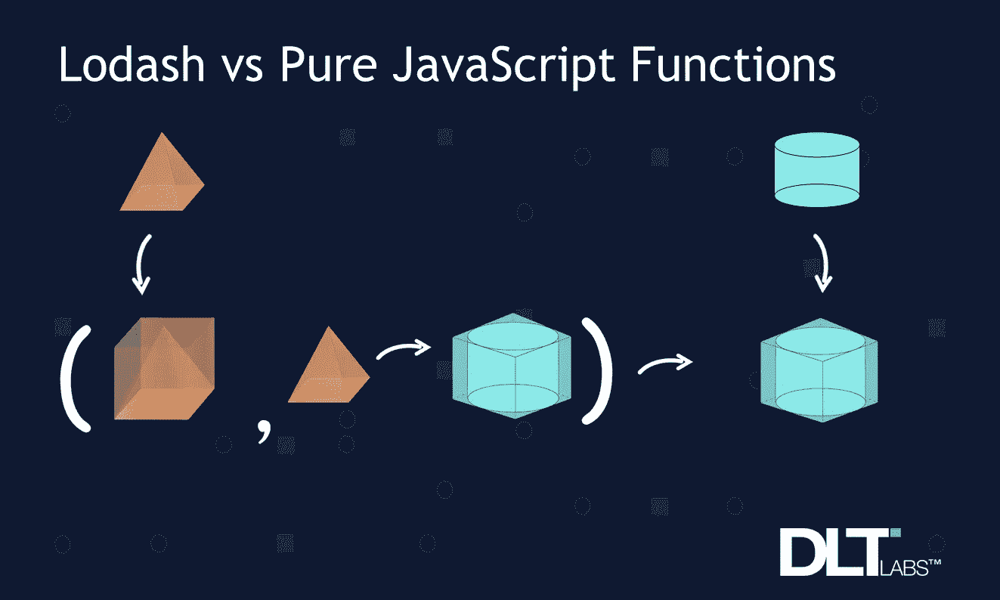](http://www.dltlabs.com)

在我们的编码之旅中，我们力求完美。在这个永恒的旅程中，我们可能会面临需要优化我们编写的代码的情况。这种努力可能会导致冗长而庞大的代码行。

在这种情况下，选择有用的库如 [Lodash](https://lodash.com/) 来优化代码似乎是一个不错的选择。我们遵循高级术语(比如外部库)，以避免编写复杂的代码行，包括许多验证、循环和 if-else 条件。

Lodash 为*数组*、*集合、对象、字符串、数学、数字、语言、日期*等提供了很多有用的函数。

但是，JavaScript 作为一个独立的平台，有非常有用的特性和功能，可以用来代替 Lodash 函数。今天我们来研究其中的一些功能。

# 下面是 13 个可以用 Javascript 函数替换的 Lodash 函数:

## 1> **_。assignIn()**

我们使用这个函数给对象添加一个新的属性。此外，我们还可以将一个对象的属性分配给另一个对象。JavaScript 也有针对这类需求的规定。我们可以通过以下方法实现这一点:

```
let first_object = {name: “john”} ;let second_object = {location: “California”};
```

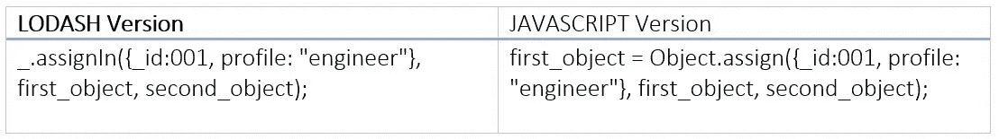

**输出:**

```
{_id: 1, profile: “engineer”, name: “john”, location: “California”}
```

## **2 > _。values()**

这个函数很方便**获得对象集合**中每个属性的值。我们可以使用 JavaScript 来实现这个功能，因为它有一个同名的兼容函数。

```
var users = {‘Amar’: { ‘emp_id’: 001, ‘location’: ‘India’},‘Umar’: { ‘emp_id’: 002, ‘location’: ‘Canada’},‘John’: { ‘emp_id’: 003, ‘location’: ‘USA’},‘Rishi’: {‘emp_id’ :004, ‘location’: ‘USA’} };
```

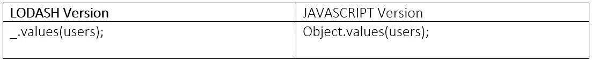

**输出:**

```
{emp_id: 1, location: “India”} {emp_id: 2, location: “Canada”}{emp_id: 3, location: “USA”}{emp_id: 4, location: “USA”}
```

## 3> **_。pick()**

顾名思义，pick 函数用于**收集对象中的一个属性。**我们可以选择从对象中挑选多个属性，它将在对象中返回响应。

让我们使用第 2 点中来自'*用户'*示例的样本数据:

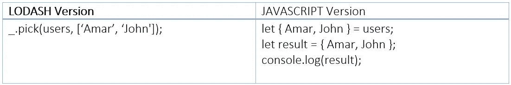

**输出:**

```
{Amar: {emp_id: 1, location: “India”}John: {emp_id: 3, location: “USA”} };
```

## 4> _.省略()

Omit 用于**从输入中删除选中的属性，并在响应中给出新的对象。我们也可以使用简单的 JavaScript 代码来获得这个结果。**

我们将使用上面的用户示例:

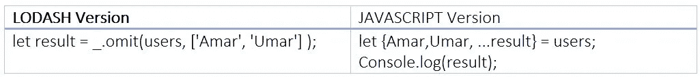

**输出:**

```
{John: {emp_id: 3, location: “USA”}Rishi: {emp_id: 4, location: “USA”}}
```

## **5 > _。compact():数组**

*压缩*是整理数组的理想函数。该函数用于**从数组中删除所有未识别的值。**我们可以使用 compact 处理诸如 *null、false、undefined、Nan、0、*之类的值。

```
var arr = [12,’hi’,undefined, 0,12.9, null,”];
```

在 JavaScript 中，我们可以使用 *filter* 方法从数组中移除无法识别的值。

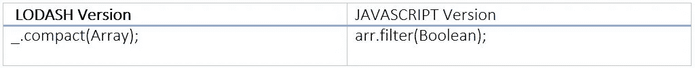

**输出:**

```
[12, “hi”, 12.9]
```

## 6> **_。uniq():数组**

uniq 函数也是一个基于数组的实用程序。该功能对于**消除数组**中的重复值非常有用。

```
let arr =[2,4,6,”as”,”as”,8,-8,-9,-9,0,0,null,null];
```

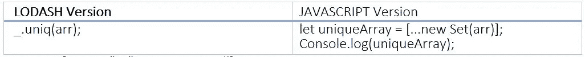

**输出:**

```
[2, 4, 6, “as”, 8, -8, -9, 0, null]
```

## 7> _.查找()

find 函数是最常用和最常用的功能之一。顾名思义，它有助于在数据集中找到一个元素。我们使用该函数**获取集合**中的第一个对象，前提是它满足我们设置的条件。

```
let emp_data= [ {emp_id: 1, location: “India”},{emp_id: 2, location: “Canada”},{emp_id: 3, location: “USA”},{emp_id: 4, location: “USA”}]
```

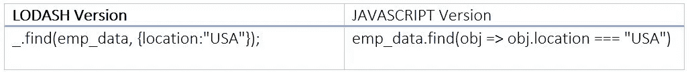

**输出:**

```
{emp_id: 3location: “USA” }
```

## 8> _.过滤器()

过滤功能与我们之前讨论的*查找*功能非常接近。该功能也**根据我们提供的条件过滤所有元素来提供结果。**我们可以从一个集合中获取满足我们特定条件的所有元素。对于过滤函数，我们将遵循上面的示例。

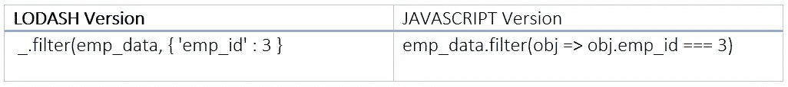

**输出:**

```
[{emp_id: 3,location: “USA” }]
```

## 9> _.每()

*每*功能是**一个条件功能，作为所有元素的扫描仪。**我们提供一个操作条件，这个函数检查并提供所有符合条件的元素的结果(真或假)。

我们将遵循 emp_data 示例的示例数据:

```
let emp_data= [ {emp_id: 1, location: “India”},{emp_id: 2, location: “Canada”},{emp_id: 3, location: “USA”},{emp_id: 4, location: “USA”}]
```

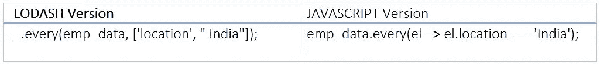

**输出:** `false`

## 10> _.一些()

我们可以把*某些*功能看作是*每个*功能的选择版本。我们提供了一个操作条件，这个函数**检查并提供一个结果(真或假)，如果数组中至少有一个元素符合所提供的条件。**

我们将遵循相同的“emp_data”作为参考，从第 9 点开始:

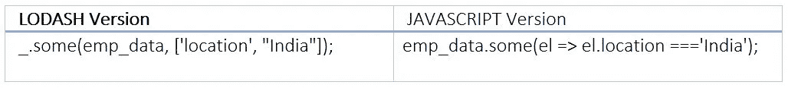

**输出:** `true`

## 11> _.包括()

该功能**用于检查集合中是否存在特定的元素。**该功能接受*字符串数据类型*以及*数组数据类型*。

我们将遵循相同的 emp_data 作为参考:

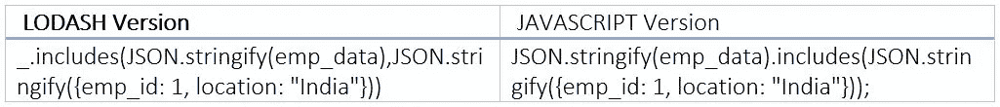

**输出:**T2

## 12> _.压平()

如果我们需要**将一个嵌套数组放到同一个层次上，那么我们可以用一个同名的 JavaScript 函数(扁平化)**来实现，而不是使用 lodash 函数。

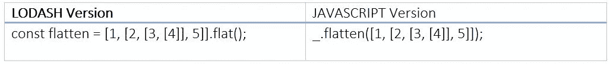

**输出:** `[1, 2, Array(2), 5]`

## **13 > _。差异()**

我们可以使用 JavaScript 来获得两个不同数组之间的差异。Lodash 有一个定义的方法来获取差异，但是在 JavaScript 中，我们使用**过滤器**和 **include** 方法来获取差异。

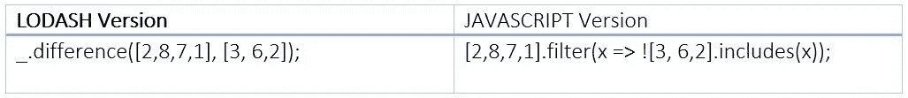

**输出:** `[8,7,1]`

希望这些信息能帮助您在各种场景中使用 JavaScript 时选择更好的选项。

编码快乐！

[](https://dltlabs.medium.com/using-docker-apis-to-perform-health-checks-cb70f543ef18) [## 使用 Docker APIs 执行健康检查

### 维护生产环境的一个关键部分是执行运行状况检查。我们在这里分享如何做到这一点。](https://dltlabs.medium.com/using-docker-apis-to-perform-health-checks-cb70f543ef18) 

*作者——妮莎·肖汉，DLT 实验室*

**关于作者:** *妮莎*是**DLT 实验室的一名软件工程师，是我们 DL Certify 团队的一员，负责前端和后端工作。她精通 Angular js，Node js，PSQL，JavaScript。**

***参考文献:*[*https://lodash.com/doc*](https://lodash.com/doc)**

**[](http://www.dltlabs.com)**