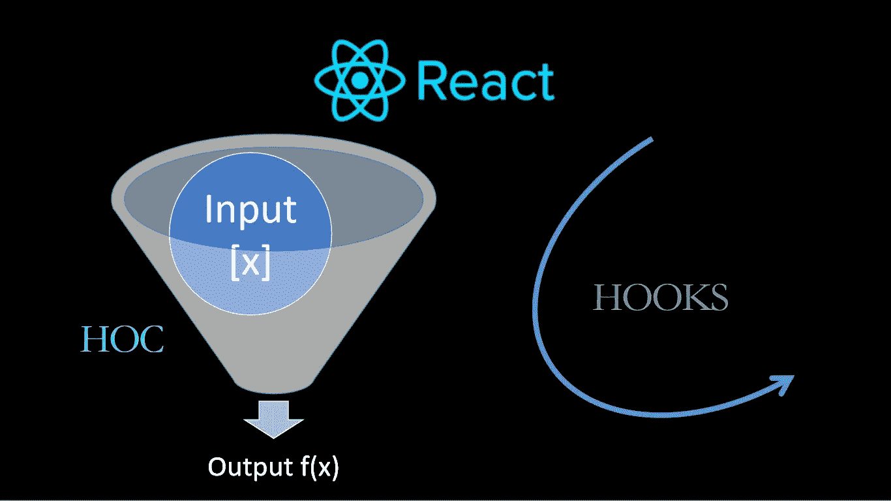

# 用反应钩替换反应钩

> 原文：<https://javascript.plainenglish.io/replacing-react-hocs-with-react-hooks-b0b0a616f759?source=collection_archive---------6----------------------->



如果你没有玩过 [React Hooks](https://reactjs.org/docs/hooks-intro.html) ，你绝对应该花些时间回顾一下这个概念，并尝试一下。

所以，让我们假设你已经知道 React 钩子是怎么回事了。我想展示如何用一个定制的 React 钩子替换一个 [React HOC](https://reactjs.org/docs/higher-order-components.html) 。

**是的，我们将回顾一些 React 挂钩，但我们也将创建一个自定义挂钩，所以喝杯咖啡，为这一集做好准备。**

# 我们的 HOC 将被替换

我们将采用 React 文档中提供的特定示例，如果您还没有看到它，[请查看](https://reactjs.org/docs/higher-order-components.html)。

这是特设的签名:

```
function withSubscription(WrappedComponent, selectData)
```

# 对 HOC 的简要描述(如果您知道它的作用，可以跳过这一部分)

所以，这个带订阅的*要做的是:*

1.  包装另一个组件( *WrappedComponent*
2.  给它添加一些逻辑( *selectData* )

你为什么要这么做？这是一种在组件之间共享公共逻辑的策略。*with subscription*function(HOC)**将创建一个全新的组件(理解这一点很重要)**，其中它将使用 *selectData* 参数从某处选择一些数据，并将这些数据作为属性注入到 *WrappedComponent* 中。

这样，无论何时底层数据发生变化，它都会更新由 *withSubscription* 函数创建的组件的状态，并自动刷新 *WrappedComponent* 。

你使用那个 HOC 的方法如文件所示:

```
const CommentListWithSubscription = withSubscription(
  CommentList,
  (DataSource) => DataSource.getComments()
);
```

在这种情况下， *CommentList* 是要包装的组件，而*data source . get comments()*是要执行的从数据源检索一些数据的函数。你看到好处了吗？您将能够订阅/取消订阅数据源，并从其中获取一些数据，而不需要您想要的组件上隐含的实际逻辑，只需用 *withSubscription* 函数包装它。

# 从一个特设转移到一个反应钩，为什么？

但是为什么从一个特设，而不是使用反应钩？嗯，我不是假装说 hoc 不好，但是我确实认为*它们是你的项目中包装器地狱的一个很好的来源，特别是在调试和测试*的时候。

这是我个人的看法。但不管怎样，如果你不同意我的观点，那也没关系。我仍然认为你会发现这很有趣。

# 临时实施

为了让大家更好地理解我们正在做的事情，我整理了一些东西:

1.  虚假数据源:

DataSource.js

2.特设的完整版本:

withSubscription.js

3.使用 HOC 的两个组件:

BlogPost.js

CommentList.js

如您所见，这种方法有一些很大的好处:

*   我们在特设委员会内部有一些共同的逻辑。周围没有重复的代码。
*   我们的组件看起来非常干净。我们甚至不需要在 BlogPost 和 CommentList 组件上实现 *componentDidMount* 或 *componentWillUnmount* 。

所以，这很好。我们在任何与我们的特定实现相匹配的组件之间共享一些逻辑。

但是我们可以在这个实现上做一些改进:**我们可以利用 React 钩子来代替 HOC，这样我们就可以通过移除每个组件的包装器和移除类的使用而从中受益(这是钩子的原始动机，正如在**https://reactjs.org/docs/hooks-intro.html#motivation 的文档中所述)。

# 介绍我们的自定义 *useSubscription* 挂钩

每当我试图创造新的东西时，我总是从想象我想要的解决方案开始:它应该是什么样子的？

这是我想到这个的第一件事:

*使用订阅(myFunctionToSelectData)*

我想用一个简单的调用来想象 BlogPost 组件，这个调用使用*(ds)=>ds . get post(id)*作为参数。应该就是这样了，定制钩子应该负责:

1.  从数据源进行订阅/取消订阅
2.  存储我的 *selectData* 函数的结果，在本例中是 *ds.getPost(id)*

表演时间！让我们从定制挂钩开始:

Initial custom hook idea

按照 React 团队的规则，我们需要在开头用“use”来命名我们的定制钩子，这就是为什么我称它为 *useSubscription* 。我们唯一需要返回的是由 *selectData* 函数产生的实际数据。所以这是我目前唯一能做的事情:签名和返回数据(我仍然需要定义)。

# 引入 React useState 挂钩

花些时间查看[反应使用状态](https://reactjs.org/docs/hooks-state.html)的文档。我们将使用该钩子来存储我们的 *selectData* 函数的结果:

这非常简单，我们使用 React.useState 来存储选择器的结果。React.useState 返回两件事:我们存储的当前值和修改该值的函数。在我们的例子中，*数据*保存着我们选择器的结果，而 *setData* 函数将被用来更新它，这是我们目前没有的，我们没有在任何地方更新我们的*数据*状态变量。

信不信由你，这个简单的实现将部分工作。我们缺少的是将更改发送到组件的方法，因为现在，我们最初是在解析我们的选择器，但是如果底层数据在将来发生了变化，该怎么办呢？我们需要意识到这些变化。让我们开始吧。

# 引入 React useEffect 挂钩

同样，你应该花点时间回顾一下 [React useEffect](https://reactjs.org/docs/hooks-effect.html) hook 上的文档。我们将使用 React.useEffect 钩子来处理依赖于我们的定制钩子的组件上的订阅/取消订阅事件。检查实施情况:

我们使用 *React.useEffect* 钩子来订阅/取消订阅数据源上的更改。这样，当使用 *useSubscription* 钩子的组件被挂载时，它将订阅数据源更改，当它被卸载时，它将被取消订阅。

如您所见，在 *useEffect* 钩子上，我们再次执行 *selectData* 函数，以便每当数据源指示有更改时，在特定时刻检索底层数据。这就是我们的组件与数据源同步的方式。

如果你对 *useEffect* 如何工作有疑问，请查看文档，这样你就能了解实际发生了什么。

# 重构我们的组件。

我们现在需要做的是在我们的组件上实现我们的定制钩子。查看它们:

BlogPost.js using our hook

CommentList.js using our hook

你怎么想呢?花点时间思考一下这些变化及其影响。以下是我看到的好处:

1.  没有包装纸了。我们的 React 树会更干净，因为我们不会看到使用自定义钩子的组件的包装器。
2.  不再上课了。你看到那些漂亮的功能组件了吗？它使我们的组件更简单、更干净。
3.  我们仍然在组件间重用逻辑。
4.  使用 HOCs，如果我们必须共享更多的逻辑，我们将需要在我们的组件上添加另一个包装器，但是使用 React Hooks，只需要在我们的组件内部调用这个新的钩子。

你在你的项目中使用 HOCs 吗？为什么不试着为其中一个创建一个定制的钩子替换物呢？

感谢阅读，请让我知道你对此的想法。