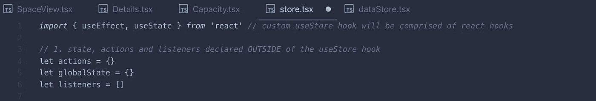
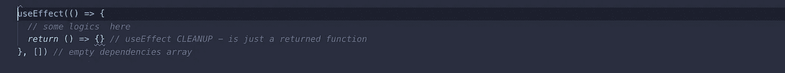
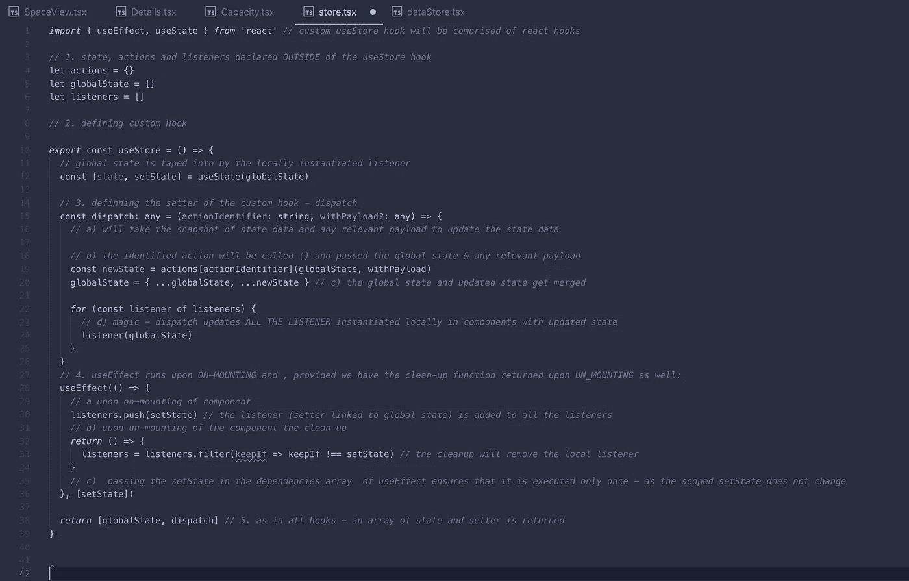
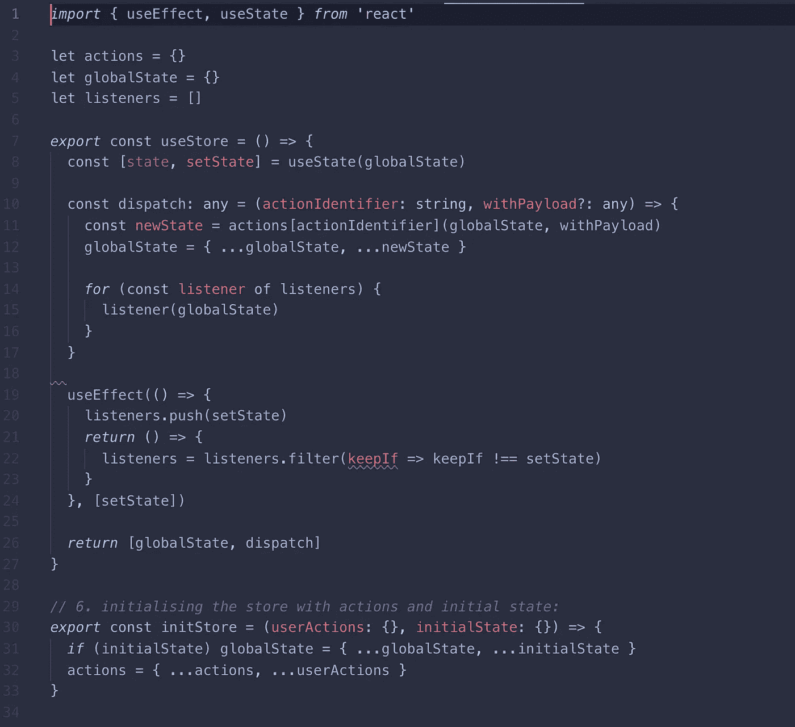
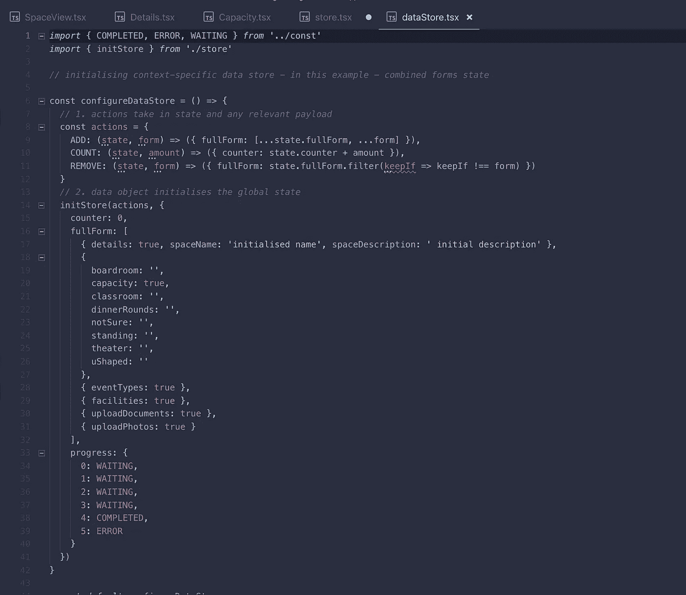
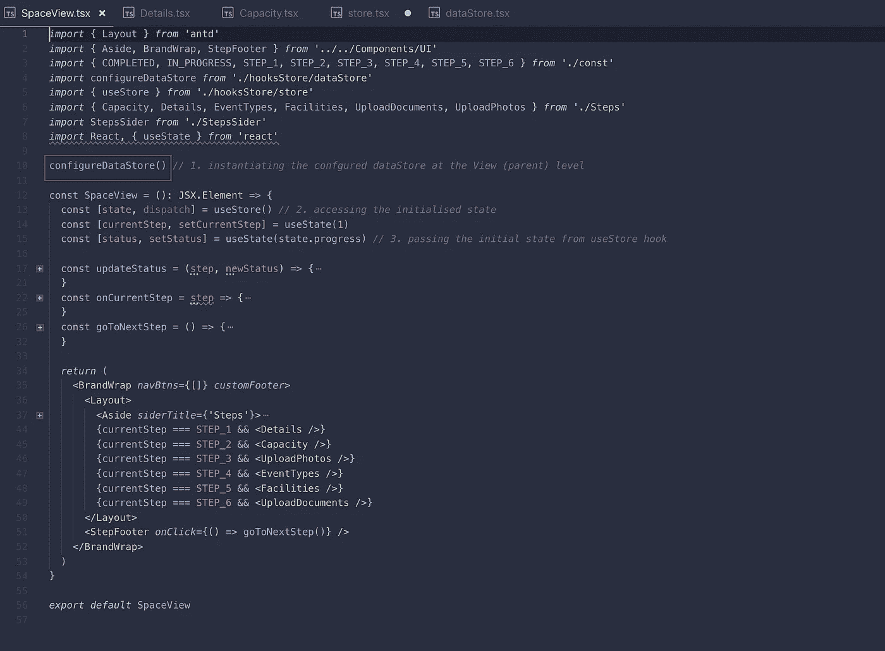
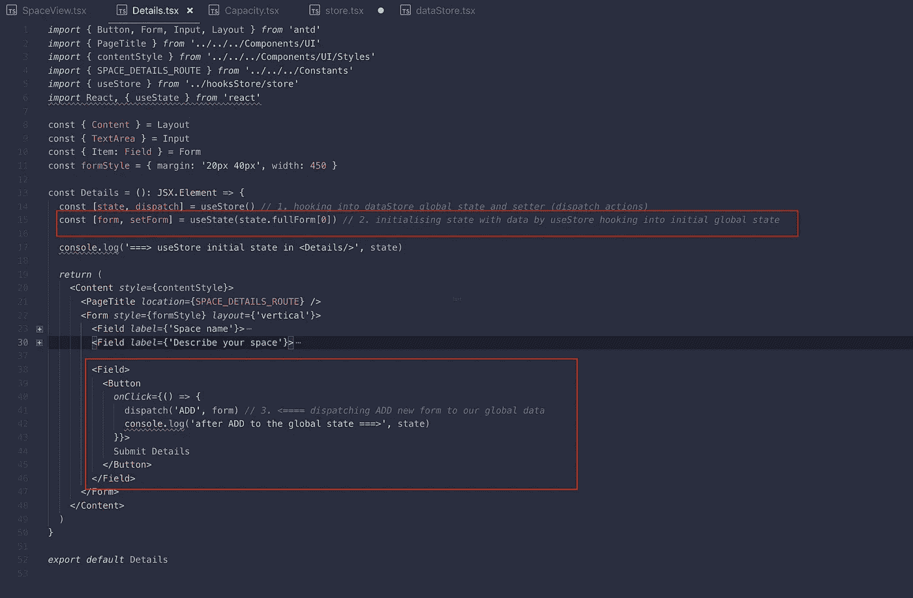

# 用定制的 React 钩子替换 Redux 进行全局状态管理

> 原文：<https://javascript.plainenglish.io/replacing-redux-with-custom-react-hooks-for-state-management-5d04592fd6d7?source=collection_archive---------3----------------------->

## 对于管理跨组件状态来说，定制的 React 钩子可能是 Redux 的一个不太臃肿的替代方法。

# 定制的 React 钩子可以被证明是 Redux 和管理跨组件状态的一个不太臃肿的替代方法，可以避免钻柱等等。

它还有助于通过使用已经可用的 react 挂钩来保持较小的应用程序大小，而不依赖于额外的依赖项，如 redux npm。

## 1.创造一个类似商店的选择:

在 store.tsx 文件中，使用在钩子外部实例化的全局状态、侦听器和操作创建自定义钩子 useStore。这样，每次在组件中导入和使用 useStore 钩子时，钩子都可以访问相同范围的侦听器、全局状态和操作。

useStore 钩子必须返回一个由两个成员组成的数组:有状态值和一个更新它的函数。在 useStore 的情况下，这些将是**【全局状态，分派】。—** dispatch —更新挂钩的函数将对标识符进行处理，以确定采取何种操作(添加、计数、删除等)。)应该执行并更新有状态值— globalState。dispatch 还将接收任何相关的有效负载，以便有效地更新全局状态。在成功调度和全局状态更新后，各种组件中的所有侦听器都会接入该组件。换句话说，我们需要设置监听器来接入全局状态，并接受应用程序中其他地方所做的更改。

useEffect with cleanup 应该有助于在组件挂载时添加侦听器，然后在卸载时删除它。

## *在进入 useStore 实现之前，所有 useEffect 挂钩组成部分的小图:*

*useEffect 是一个调用:——****1。带功能*** *—任何逻辑或其他挂钩都可以在这里使用。—* ***2。cleanup*** *—只是在卸载组件时执行的返回函数。——****3。and dependencies****—第二个参数，and 数组，其中传递的任何参数确保 useEffect 只在那些变量改变时执行。因此，如果数组为空，useEffect 会在每次发生变化时执行:*

## 回到我们的自定义 useStore 挂钩:

为了确保我们想要的行为，我们需要确保 useEffect dependancy 数组包含 setState——因为它不会在 useStore 的范围内改变——确保 useEffect 只执行一次。

接下来，清理功能将在卸载时删除侦听器。

最后，我们像任何钩子一样返回全局状态快照和分派。

现在没有评论了😆：

## 2.用操作和初始状态配置存储

接下来是设置基于上下文的数据存储区——configure dataStore——使用:

—任何将标识符作为键、将函数作为值的操作，这些操作将在调度时调用

—作为对象的初始状态数据

**3。实例化特定于上下文的存储:**

接下来，在足够高的(父)级别实例化 configureDataStore。在这种情况下，使用 Store globalState 来填充组件:

最后，有趣的部分是，我们选择任何我们想要的组件来进入全局状态，并分派动作来更新它！

任何组件都应该通过监听器接收状态更新，并且通过 useStore 自定义钩子调度操作创建有意义的数据更改！