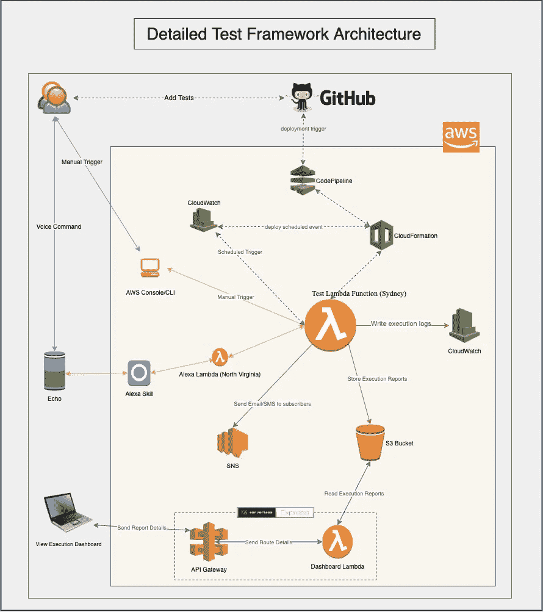
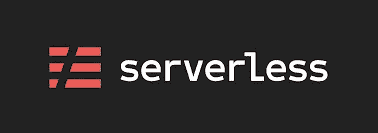
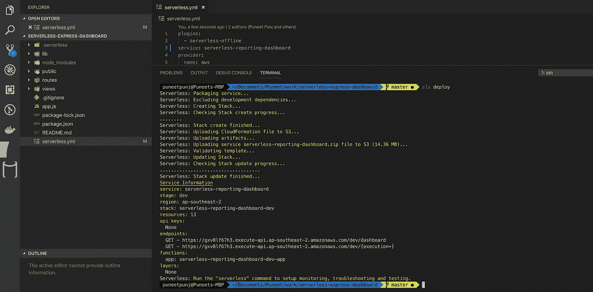
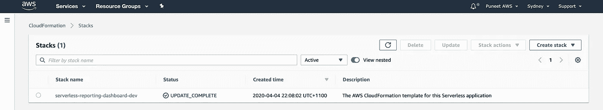
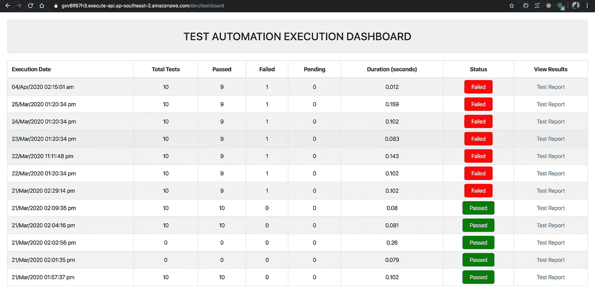

# 无服务器测试框架的报告仪表板

> 原文：<https://javascript.plainenglish.io/reporting-dashboard-for-serverless-test-framework-36dd46bf54da?source=collection_archive---------7----------------------->

## 了解无服务器快速框架…

**这是** [**无服务器框架测试 AWS 微服务**](https://medium.com/@punjpuneet/serverless-framework-to-test-aws-microservices-575cbbc0823) 的后续文章



**Detailed Serverless Test Framework Architecture**

在我们之前的故事中，我们已经看到了如何使用无服务器测试框架来测试 S3 的 AWS 微服务和存储的执行报告。到目前为止，如果你想查看执行报告，你必须下载本地的`assets`文件夹(包含相应的 css 和 js 的 mochawesome 报告)。没有直接的方法在一个地方显示多个执行结果。



[Serverless Framework](https://serverless.com/)

在本文中，我们将使用 [**无服务器构建一个报告仪表板( **API Gateway 和 Lambda**)——http**](https://www.npmjs.com/package/serverless-http)**，**[**express**](https://www.npmjs.com/package/express)**和**[**node . js**](https://nodejs.org/en/)**到**在一个地方呈现所有执行的合并视图。此外，我们将使用 [**无服务器**](https://serverless.com/) 框架来部署这个堆栈，而不会产生任何开销。更多细节可以在[这里](https://serverless.com/blog/serverless-express-rest-api/)找到。

*在开始之前，请确保记下在上一篇文章中创建的存储桶名称，以存储您的报告，因为我们将需要它来读取文件。*

## 第一步

如果您还没有 AWS credentails 已经设置了`aws_access_key_id`和`aws_secret_access_key`，请仔细阅读由 server less[https://server less . com/framework/docs/providers/AWS/guide/credentials/# create-an-iam-user-and-access-key](https://serverless.com/framework/docs/providers/aws/guide/credentials/#create-an-iam-user-and-access-key)提供的本指南。

***确保该用户拥有访问 S3 的权限！！***

## 第二步

设置好凭据后，克隆[无服务器快速仪表板](https://github.com/puneetpunj/serverless-express-dashboard)存储库。更新第 3 行`lib/core.js`中的桶名。

在你的终端中执行下面的命令来获得代码——

```
git clone [https://github.com/puneetpunj/serverless-express-dashboard](https://github.com/puneetpunj/serverless-express-dashboard)
cd serverless-express-dashboard
npm i -g serverless
npm i
```

需要考虑的几个要点:

*   `serverless.yml`包含地区名称，当前值为`ap-southeast-2`，需要更新。
*   我在之前的文章中用于存储报告的存储桶名称是`automate-tests-reports`。这需要在 14 和 15 行的`serverless.yml`中提供。如果需要，请使用存储桶名称进行更新。
*   如有需要，更新您的桶名(如果与上面不同)至`lib/core.js`中的第 3 行
*   使用`sls remove`完全移除堆栈
*   使用`sls offline start`在本地运行它—这实际上更倾向于在部署到 AWS 之前为用户确认代码和 S3 角色

执行`sls deploy`，您的堆栈将被部署到 AWS，终端响应中提供**端点**。(以下示例中的*—*[*https://gxv 8 lf 67 H3 . execute-API . AP-south-2 . Amazon AWS . com/dev/dashboard*](https://gxv8lf67h3.execute-api.ap-southeast-2.amazonaws.com/dev/dashboard))



Successful deployment of serverless stack

确认在 AWS 中创建堆栈，可以自由进入堆栈并检查资源。



AWS Cloudformation

## 步骤 3

打开从终端复制的网址。*在我上面的截图中—*[*https://gxv 8 lf 67 H3 . execute-API . AP-south-2 . Amazon AWS . com/dev/dashboard*](https://gxv8lf67h3.execute-api.ap-southeast-2.amazonaws.com/dev/dashboard)*。*

它将显示 Dashboard —行将根据 S3 可用的文件数而变化



**Execution Dashboard**

点击测试报告，查看具体执行的详细 Mochawesome 报告


**Open Mochawesome Report**

就这样……您已经成功部署了无服务器快速报告控制面板。**干得好👏👏👏**

代码可在[这里](https://github.com/puneetpunj/serverless-express-dashboard)获得。此外，如果你有兴趣建立 Alexa Skill 来执行这些自动化测试，请看看这篇文章。

如有任何问题，请随时与我联系。谢了。

【JavaScript 用简单的英语写的一句话:我们总是乐于帮助推广高质量的内容。如果你有一篇文章想用简单的英语提交给 JavaScript，用你的中级用户名发邮件到 submissions@javascriptinplainenglish.com[给我们，我们会把你添加为作者。](mailto:submissions@javascriptinplainenglish.com)