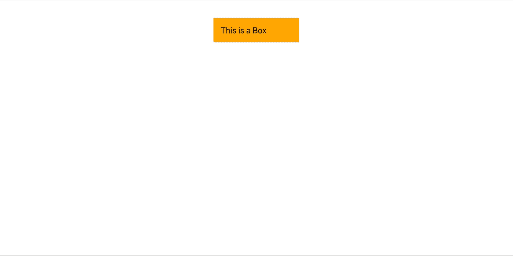
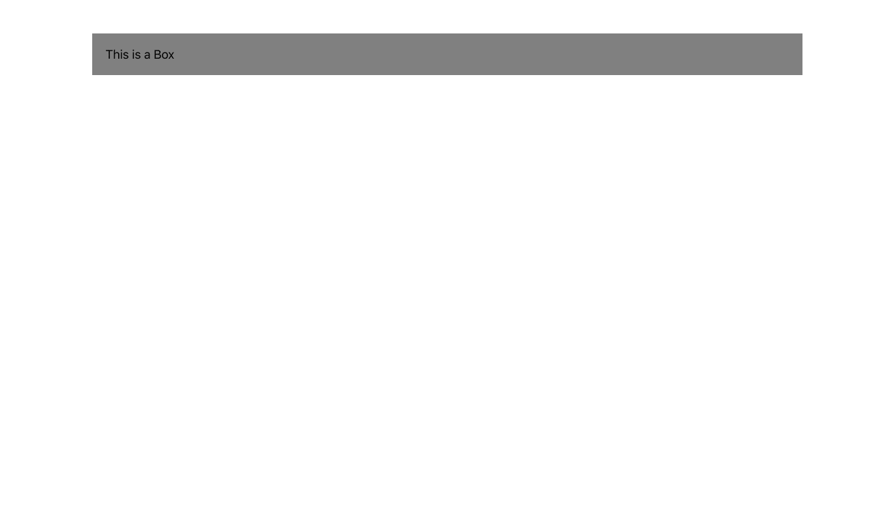

# 使用 React 和 Styled-System 创建干净的响应应用程序

> 原文：<https://javascript.plainenglish.io/responsive-react-app-with-styled-system-based-on-design-system-a82c6f9d5e2e?source=collection_archive---------0----------------------->

## 基于设计系统使用[风格系统](https://github.com/styled-system/styled-system)构建响应式反应应用的简单教程。


Styled System

## 回购示例

您可以在以下位置查看最终的工作示例:

[](https://github.com/manakuro/responsive-react-app-example) [## manakuro/responsive-react-app-example

### 这个项目是用 Create React App 引导的。在项目目录中，您可以运行:在…中运行应用程序

github.com](https://github.com/manakuro/responsive-react-app-example) 

组件设计系统允许团队协作，并为用户提供跨不同应用程序的一致的视觉和功能 UI。一致性有四种类型，视觉一致性、功能一致性、内部一致性和外部一致性在 [UX 设计原则](https://uxdesign.cc/design-principle-consistency-6b0cf7e7339f)中，我在本文中重点介绍**视觉一致性**。

## 前端开发问题

前端开发问题已经存在一段时间了，就像:

*   风格不一致
*   大量重复的 UI 组件
*   大量不必要的设计和开发时间

这是因为每个设计师都有自己的风格和基调。每个开发人员创建他们自己的组件，而没有注意到它已经被开发了。

为了解决这个问题，即使多个设计者和开发者参与同一个项目，保持组件的一致性也是最重要的。设计师需要知道如何设计，并与他人分享。开发人员需要根据风格指南在项目的每个部分制作可重用的组件。

最重要的是，在用户方面，一个成功的组件系统提供了更少的混乱，更好的产品导航和更好的整体满意度。用户将更快地学会如何使用你的产品。

# 设计系统


Design System

设计系统基本上包括资产和组件的集合，如设计模式、规则和 UX 准则的库，以构建产品，还提供品牌领域的演进图，并指导创建新产品。它应该是集中的，并且总是不断发展以保持一致。

在开发人员方面，要实现与设计系统的真正协作，通过代码库上的组件来弥合设计和开发之间的差距是关键。

# 风格系统

[Styled-System](https://styled-system.com/articles/) 是实现协作的选项之一。它设计了一套将道具映射到设计系统的工具，也有一堆带有 CSS 功能的 API。它支持 CSS-in-JS 库，如 styled-component、emotion，甚至支持 Vue.js。

让我们来看看它是如何工作的。

安装`styled-system`和`styled-component`:

```
$ yarn add styled-system styled-components
```

并在您的`App.js`中添加一些样式组件:

```
import React from "react"
import { space, width, fontSize, color } from 'styled-system';
import styled, { ThemeProvider } from 'styled-components';
import theme from './theme'; const App = () => {
  return (
    <ThemeProvider theme={theme}>
      <Box>
        This is a Box
      </Box>
    </ThemeProvider>
  )
}const Box = styled.div`
  ${space}
  ${width}
  ${fontSize}
  ${color}
`;export default App
```

是一个风格化组件的内置提供者，它完全支持主题化。该组件通过[上下文 API](https://ja.reactjs.org/docs/context.html) 向其下的所有 React 组件提供主题。通过这样做，`styled-system`将特性扩展为更多可重用的组件。`${space}`、`${width}`、`${fontSize}`、`${color}`是提供某种风格的功能。

让我们添加一些风格:

```
const App = () => {
  return (
    <ThemeProvider theme={theme}>
      <Box bg="orange" fontSize={24} width={200} p={20} m="50px auto">
        This is a Box
      </Box>
    </ThemeProvider>
  )
}
```

你会看到一个这样的盒子:



This is a Box

如你所见，一些道具被传递到`Box`并应用了样式。这就是风格系统的工作方式。您不需要在样式化组件的模板文本中编写 CSS。(如果你想知道样式化组件在模板文本中的魔力，请点击查看

除了上面的例子，还有一堆 [API](https://styled-system.com/guides) 。

现在你知道如何使用它了。接下来你可以通过定义`theme`将你的设计系统应用到组件上。

我们来编辑一下`theme.js`:

```
const ***theme*** = {
  space: [0, 4, 8, 16, 32, 64, 128, 256, 512],
  fontSizes: [12, 14, 16, 20, 24, 36, 48, 80, 96],
  fontWeights: [100, 200, 300, 400, 500, 600, 700, 800, 900],
  width: [16, 32, 64, 128, 256],
  heights: [16, 32, 64, 128, 256],
  colors: {
    black: '#000',
    gray: ' #777',
    'dark-gray': '#333',
    'light-gray': '#eee',
  },
  // .... and other styles
} export default ***theme***
```

这应该是你自己的设计系统，但是现在，我们像上面那样定义它。

`fontSizes`具有`12, 14, 16, 20...`尺寸，假设将`font-size: 12px`应用于`Box`组件:

```
<Box bg="orange" **fontSize={0}** width={200} p={20} m="50px auto">
  This is a Box
</Box>
```

`0`被传递而不是`12`，这意味着你需要传递`fontSizes`数组的索引号。在这种情况下，`0`表示`12`而`1`表示`14`等等。

但是您可以像这样在`theme.js`中使它更具声明性:

```
const theme= {
  space: [0, 4, 8, 16, 32, 64, 128, 256, 512],
 **fontSizes: {
    small: 14,
    medium: 16,
    large: 18
  },**
  ...
} export default theme
```

并编辑它`App.js`:

```
<Box bg="orange" **fontSize="small"** width={200} p={20} m="50px auto">
  This is a Box
</Box>
```

设计组件的方式是合理的和可维护的，因为作为一名开发人员，你实际上不需要考虑盒子的大小，只需要遵循样式指南并传递`small`给它。

# 风格化系统的响应设计

接下来，我想演示如何使组件具有响应性。在响应式设计中，你基本上在 CSS 中使用`Media Queries`。Styled-system 提供了自己的[响应式系统](https://styled-system.com/responsive-styles)，该系统提供了一种方便的简写语法，可以通过移动优先的方法添加响应式，也可以通过`breakpoints`定义自己的响应式值。

我们在`theme.js`补充一下吧:

```
const theme= {
  ...
  breakpoints: {
    xs: '0',
    sm: '600px',
    md: '960px',
    lg: '1280px',
    xl: '1920px',
  },
}
```

我遵循[材料设计](https://material.io/design/layout/responsive-layout-grid.html#breakpoints)断点值。这些值应该是这样的:

```
|0px     600px    960px    1280px   1920px
|xs      sm       md       lg       xl
|--------|--------|--------|--------|-------->
|   xs   |   sm   |   md   |   lg   |   xl
```

让我们让`Box`反应灵敏:

```
const App = () => {
  return (
    <ThemeProvider theme={***theme***}>
      <Box
        **bg={{xs: 'orange', sm: 'grey'}}
        fontSize={{xs: 'small', sm: 'medium', md: 'large'}}
        width={{ xs: 200, sm: 400, md: 600, lg: 1000 }}**
        p={20}
        m="50px auto">
        This is a Box
      </Box>
    </ThemeProvider>
  )
}
```



Responsive box

它可读性更强，有助于您了解每个设备中应该使用什么值。

## 排印


Material Design Typography

设计时字体大小很重要。作为一名设计师，组织一个可扩展的设计系统是很重要的，对于排版来说也是如此，需要设置标题级别，为清晰可见性创建层次结构。

作为一个开发者，把每种字体应用到每种设备上太麻烦了，即使只有手机。但是在 styled-system 中，您不需要为每个组件编写特定的字体大小。

让我们假设一些标题水平在`theme.js`:

```
const theme= {
  fontSizes: {
    small: 14,
    medium: 16,
    large: 18, **h5: 12,
    h4: 18,
    h3: 20,
    h2: 24,
    h1: 30,**
  },
}
```

或者，还有另一种方法:

```
const theme= {
  fontSizes: {
    small: 14,
    medium: 16,
    large: 18, **h5: {
      sm: 12,
      md: 14,
      lg: 16,
    },
    h4: {
      sm: 16,
      md: 18,
      lg: 22,
    },
    h3: {
      sm: 19,
      md: 22,
      lg: 28,
    },
    h2: {
      sm: 20,
      md: 22,
      lg: 24
    },
    h1: {
      sm: 24,
      md: 26,
      lg: 30
    }
  }**
}
```

系统可以具有更有限的标题级别集，并为每个设备指定大小。

你可以在设计系统中以[的尺寸挖掘更多的细节，这是一个非常棒的帖子。](https://medium.com/eightshapes-llc/size-in-design-systems-64f234aec519)

## 响应式布局

如上所述，`width`可以响应式，可以定义响应式布局。但是如果你喜欢基于网格系统的布局，那么 Material-UI 也有自己的[网格](https://material-ui.com/components/grid/#grid)布局。

让我们安装 Material-UI:

```
yarn add @material-ui/core
```

并添加到`App.js`:

```
const App = () => {
  return (
    <ThemeProvider theme={theme}>
      <Grid container spacing={2}>
        <Grid item xs={12} md={3}>
          <Box
            bg={{xs: 'orange', sm: 'grey'}}
            fontSize={{xs: 'small', sm: 'medium', md: 'large'}}
            p={20}
            m="50px auto">
            This is a Box
          </Box>
        </Grid>
        <Grid item xs={12} md={3}>
          <Box
            bg={{xs: 'orange', sm: 'grey'}}
            fontSize={{xs: 'small', sm: 'medium', md: 'large'}}
            p={20}
            m="50px auto">
            This is a Box
          </Box>
        </Grid>
        <Grid item xs={12} md={3}>
          <Box
            bg={{xs: 'orange', sm: 'grey'}}
            fontSize={{xs: 'small', sm: 'medium', md: 'large'}}
            p={20}
            m="50px auto">
            This is a Box
          </Box>
        </Grid>
      </Grid> </ThemeProvider>
  )
}
```


Responsive with Material-UI

网格组件可以带`xs`、`sm`、`md`、`lg`和`xl`这样的断点，应该和你的断点匹配。

## 将组件分为 PC 和移动设备

接下来，如果你想把 HTML 分成 pc 端和移动端呢？然后就可以用`[Hidden](https://material-ui.com/components/hidden/#hidden)`来存档了。

让我们创建一个切换可见性值的组件。我称之为`Media`组件，它需要两个道具，`pc`和`mobile`。

在安装`lodash`之前:

```
yarn add lodash
```

并补充`Media.js`:

```
// Media.jsimport React from 'react'
import HiddenCss from '@material-ui/core/Hidden/HiddenCss'
import omit from 'lodash/omit'const Media = (props) => {
  const hiddenProps = omit(props, 'mobile', 'pc') switch (true) {
    case Boolean(props.mobile):
      return (
        <HiddenCss {...hiddenProps} smUp>
          {props.children}
        </HiddenCss>
      )
    case Boolean(props.pc):
      return (
        <HiddenCss {...hiddenProps} xsDown>
          {props.children}
        </HiddenCss>
      )
    default:
      return <>{props.children}</>
  }
}export default Media
```

并应用于`App.js`:

```
const App = () => {
  return (
    <ThemeProvider theme={***theme***}>
      <Media pc>
        <p>Hi I'm from PC</p>
      </Media>
      <Media mobile>
        <p>Hi I'm from mobile</p>
      </Media>
    </ThemeProvider>
  )
}
```


Responsive with Media

现在它在组件层面上明确将 HTML 分为 pc 和移动。

## 作曲风格

styled-system 提供了许多样式函数。您可能会发现很难将它们添加到每个组件中。要解决这个问题，可以像这样使用具有样式函数的包装组件:

```
// utils/styledSystem.jsimport styled from 'styled-components'
import {
  compose,
  ***space***,
  ***color***,
  ***layout***,
  ***typography***,
  ***flexbox***,
  ***border***,
  ***background***,
  ***position***,
  ***grid***,
  ***shadow***,
  ***width***,
  ***minWidth***,
  ***height***,
  ***minHeight***,
} from 'styled-system' const styledSystem = (tag) => {
  return styled(tag)(
    compose(
      ***space***,
      ***color***,
      ***layout***,
      ***typography***,
      ***flexbox***,
      ***border***,
      ***background***,
      ***position***,
      ***grid***,
      ***shadow***,
      ***width***,
      ***minWidth***,
      ***height***,
      ***minHeight***,
    ),
  )
}export default styledSystem
```

并用它包装样式化组件:

```
import React from "react"
import styled, { ThemeProvider } from 'styled-components';
import theme from './theme';
import Grid  from '@material-ui/core/Grid';
import styledSystem from './utils/styledSystem'const App = () => {
  return (
    <ThemeProvider theme={theme}>
      <Heading fontSize={{ xs: 'h1' }}>Title here</Heading>
      <Grid container spacing={2}>
        <Grid item xs={12} md={3}>
          <Box
            bg={{xs: 'orange', sm: 'grey'}}
            fontSize={{xs: 'small', sm: 'medium', md: 'large'}}
            p={20}
            m="50px auto">
            This is a Box
          </Box>
        </Grid>
        <Grid item xs={12} md={3}>
          <Box2
            bg={{xs: 'orange', sm: 'grey'}}
            fontSize={{xs: 'small', sm: 'medium', md: 'large'}}
            p={20}
            m="50px auto">
            This is a Box
          </Box2>
        </Grid>
        <Grid item xs={12} md={3}>
          <Box3
            bg={{xs: 'orange', sm: 'grey'}}
            fontSize={{xs: 'small', sm: 'medium', md: 'large'}}
            p={20}
            m="50px auto">
            This is a Box
          </Box3>
        </Grid>
      </Grid>
    </ThemeProvider>
  )
}**const Box = styledSystem(styled.div``)
const Box2 = styledSystem(styled.div``)
const Box3 = styledSystem(styled.div``)
const Heading = styledSystem(styled.h1``)**export default App
```

所有样式功能都与组件一起应用。

另一个选择是使用 [Rebass](https://rebassjs.org/) ，这是一个用 styled-system 构建的 React UI 组件，与设计系统高度兼容。

# 结论

您可以准备构建响应式组件。每个组件都应该是可读的、可维护的和可扩展的。做出响应很难，但为了更好的用户体验，这是值得的。

希望对你有帮助。

您可以在以下位置查看最终的工作示例:

[](https://github.com/manakuro/responsive-react-app-example) [## manakuro/responsive-react-app-example

### 这个项目是用 Create React App 引导的。在项目目录中，您可以运行:在…中运行应用程序

github.com](https://github.com/manakuro/responsive-react-app-example)