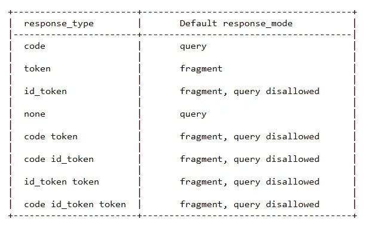

# 响应式网页设计| Bootstrap | Node.js | Auth0

> 原文：<https://javascript.plainenglish.io/responsive-web-design-bootstrap-node-js-auth0-11e75053d1e4?source=collection_archive---------9----------------------->

本文的目标是为一个假设的组织开发一个应用程序，该应用程序将对用户进行身份验证，然后允许用户对该组织的员工数据库执行 CRUD 操作。


Photo by [UX Store](https://unsplash.com/@uxstore?utm_source=medium&utm_medium=referral) on [Unsplash](https://unsplash.com?utm_source=medium&utm_medium=referral)

## 项目大纲

我们的项目基本上是基于**联合身份流**，下面将对其进行描述。


1.  用户试图访问我的资源服务器处理的资源。
2.  服务器将用户重定向到授权服务器，因为他没有访问资源的适当凭证。授权服务器配置为允许用户使用由身份提供者管理的凭据登录。
3.  授权服务器将用户重定向到身份提供商的登录页面。
4.  成功登录后，用户连同身份提供者提供的凭据一起被重定向到授权服务器。授权服务器使用这些凭证来访问资源服务器所需的凭证。
5.  授权服务器将用户以及访问资源所需的凭证重定向到资源服务器。
6.  用户成功访问资源。

在我们的项目中，身份提供者将是 **Google** ，授权服务器将是 **Auth0，**资源服务器将由我们在 Node.js 中编程，资源将是 **SQLite3 数据库**。

以下视频是我们项目的最终外观。

这个项目是我做的另一个项目的延伸，它的链接在下面提到。我们在这个版本中添加的新特性是使用 Auth0 的身份验证和授权，以及对路由的一些其他修改。

[](https://medium.com/javascript-in-plain-english/responsive-web-design-using-bootstrap-4-with-node-js-as-the-backend-b4b64a0f48e8) [## 使用 Bootstrap 和 Node.js 作为后端的响应式 web 设计

### 随着技术的发展，多年来许多事情都发生了变化。更具体地说，如果我们谈论大小…

medium.com](https://medium.com/javascript-in-plain-english/responsive-web-design-using-bootstrap-4-with-node-js-as-the-backend-b4b64a0f48e8) 

欲了解更多信息，请访问以下博客。

[](https://souvikpl.medium.com/json-web-token-ad5284fa302) [## JSON Web 令牌

### 了解 JWT、联合身份、访问和刷新令牌、OpenID connect。

souvikpl.medium.com](https://souvikpl.medium.com/json-web-token-ad5284fa302) [](https://souvikpl.medium.com/an-overview-of-oauth-2-0-7255e1b5eed3) [## OAuth 2.0 概述

### OAuth 2.0 是一个授权框架，应用程序使用它为客户端应用程序提供安全的委托…

souvikpl.medium.com](https://souvikpl.medium.com/an-overview-of-oauth-2-0-7255e1b5eed3) 

## 使用的工具

*   节点. js
*   Auth0
*   HTML，CSS，引导
*   JQuery
*   SQLite3

在开始编码部分之前，让我通知您，我们将要编写的所有代码也可以在我的 GitHub 库中找到。

[](https://github.com/souvik-pl/ResponsiveWebDev_Auth0) [## sou vik-pl/responsive web dev _ auth 0

### GitHub 是超过 5000 万开发人员的家园，他们一起工作来托管和审查代码、管理项目和构建…

github.com](https://github.com/souvik-pl/ResponsiveWebDev_Auth0) 

现在，是时候开始编码部分了。

## 初始设置

首先，我们将在系统中创建一个名为 **myproject** 的项目目录，该目录包含以下文件和文件夹。


我们将创建**数据库**目录和其中的文件，即 **employees.db** 将由我们的服务器应用程序( **app.js** )自动创建。

然后，我们将打开终端，导航到这个目录，运行命令`npm init`并输入所有默认选项。

之后，我们将运行以下命令来安装 dotenv、body-parser、express、express-openid-connect、socket.io 和 sqlite3。

```
npm install dotenv body-parser express express-openid-connect socket.io sqlite3 --save
```

[**Express**](https://www.google.com/url?sa=t&source=web&rct=j&url=https://www.npmjs.com/package/express&ved=2ahUKEwiA-cHVs4DtAhUST30KHYnBC3oQFjAAegQIERAB&usg=AOvVaw0QmeMdDUG_lpfBECY8aNVb) 是一个极简灵活的 Node.js web 应用框架，为 web 和移动应用提供了一组健壮的特性。在 express 的帮助下，API 可以非常容易和快速地构建。

[**Dotenv**](https://www.npmjs.com/package/dotenv) 是一个零依赖模块，将环境变量从`.env`文件加载到`process.env`中。将配置存储在独立于代码的环境中是基于十二因素应用程序方法的。

[**插座。IO**](https://socket.io/) —支持基于事件的实时双向通信。

[**Sqlite3**](https://www.npmjs.com/package/sqlite3/v/3.0.4) —它是 Node.js 的异步、非阻塞 Sqlite3 绑定。

[**Express-OpenID-Connect**](https://www.npmjs.com/package/express-openid-connect)**—Express JS 中间件使用 OpenID Connect 实现 Express web apps 的登录。**

**[**需要 Body-parser**](https://www.google.com/url?sa=t&source=web&rct=j&url=https://www.npmjs.com/package/body-parser&ved=2ahUKEwitjNr3s4DtAhUIOSsKHbeXDysQFjAAegQIGRAD&usg=AOvVaw25YQ9Y7zSE8ft8uHS1kYRG) 来处理 **Express.js** 中的`HTTP POST`请求。它提取传入请求流的整个主体部分，并在`req.body`上公开它。**

**现在，我们将转到 [Auth0 quickstart](https://auth0.com/docs/quickstarts/) ，选择常规 web 应用程序，并按照那里的说明向 Auth0 注册我们的应用程序。**

**需要注意的是，在**回调 URL** 字段中，我们必须输入[http://localhost:3000/callback](http://localhost:3000/callback)，在**注销 URL** 字段中，我们必须输入 [http://localhost:3000](http://localhost:3000/callback) 。**

**之后，我们将创建一个**。env** 文件放在我们的 **myproject** 目录的根目录下，我们将在这里输入以下信息。**

```
ISSUER_BASE_URL=https://example.us.auth0.com
CLIENT_ID=mYexampleC1i3ntId
BASE_URL=http://localhost:3000
SECRET=aNyRanDomStuFftHatYoUwaNtT0MenTiOn
```

**注意 Auth0 将给出发卡行基本 URL 和客户端 ID。**

****前端开发****

**现在，我们将开发应用程序的前端，它位于 **public** 目录中。**

**首先，我们将创建文件**login.html**，这将是当用户键入 [http://localhost:3000](http://localhost:3000) 时显示的第一个页面，该页面将要求用户登录。**

**成功登录后，用户将进入 I**ndex.html**页面，代码如下。**

**其他 html 文件的代码可以在我的 GitHub repo 中找到。**

## ****后端开发****

**现在我们将为我们的资源服务器编写代码。**

**了解**插座。IO，**请访问此链接—**

**[](https://medium.com/swlh/real-time-chat-application-using-socket-io-in-node-js-37806e98918c) [## Node.js 中使用 Socket.io 的实时聊天应用

### 任何领域的专家都曾是初学者。所以，要成为专家，有一个坚实的基础是非常重要的…

medium.com](https://medium.com/swlh/real-time-chat-application-using-socket-io-in-node-js-37806e98918c) 

## 测试应用程序

最后，我们的应用程序准备好了。我们可以使用`node app`命令启动服务器，并在浏览器中键入 [http://localhost:3000](http://localhost:3000) 。

# Auth0 的角色

现在，是了解 Auth0 如何管理事物的好时机。下面是整个过程的描述。

1.  浏览器访问资源服务器(在我们的例子中是 **app.js** ),并尝试使用下面的请求访问`/protected` route 中的资源。


2.我们已经安装的 OIDC 中间件( **express-openid-connect** 在我们的例子中)拦截这个调用，并向授权服务器发出一个授权请求，作为对上述 GET 请求的响应(在下面给出)。这是通过重定向浏览器来完成的。


在上面的响应中，所有参数的含义描述如下。

**位置**:授权服务器中的授权端点。

**client_id** :是我们的资源服务器在授权服务器上的标识。

**response_type** :是浏览器和中间件想要的神器。在这种情况下，用户想要登录。所以，他需要一个身份证。

**response_mode** :是浏览器和中间件希望工件返回的方式。这里，我们有 HTTP 允许的所有方法。我们可以在查询字符串中获得工件，但这不是一个好主意，因为这会被记录到浏览器的历史记录中。因此，我们将使用' form_post '，它将令牌作为 post 请求发送到资源服务器。

**redirect_uri** :它表示我们的资源服务器中的地址，我们希望令牌和工件返回到这个地址。我们在这个上下文中使用的令牌是不记名令牌。

**scope** :它表示授权服务器请求的工件。

**nonce**:nonce 参数用于防止令牌注入。在请求时，会生成一个唯一的标识符并保存在浏览器中。该标识符被发送到授权服务器，最终接收回的 ID 令牌具有包含相同标识符的声明。在这一点上，这可以与保存的标识符进行比较，我们将确信我们得到了我们所请求的令牌。

OAuth 和 OIDC 将响应类型及其默认响应模式定义如下



在我们的例子中，在中间件的响应中，它有`response_type=id_token`，而不是使用默认的`response_mode`，中间件已经覆盖了它并使用了`response_mode=form_post`。

3.当浏览器从我们的资源服务器中的中间件获得 302 状态时，它将向授权服务器中的授权端点(`/authorize`)发送一个 GET 请求(下面给出了该请求),其中包含中间件提供的所有参数。


现在，授权服务器将做任何它认为必要的事情来验证用户。OAuth 或 OIDC 没有规定这方面的程序。可以使用多种类型的身份认证，如单因素、多因素等。

4.当用户成功通过授权端点的身份验证时，通常授权服务器会设置一个 cookie，它代表用户与授权服务器的会话。因此，如果稍后用户再次点击授权端点，他将不必再次登录。

为了响应前面的 GET 请求，授权服务器将发送以下内容。


在这个响应中，所请求的 ID 令牌(JWT 格式)已经作为表单中的参数返回。在 HTML 的标签上，连接了一个`onload`事件，当这个页面被渲染时，它会自动提交表单，并将这个令牌发送到资源服务器。

5.当浏览器收到来自授权服务器的前一个响应时，带有令牌 ID 的表单会立即作为 POST 请求发送到资源服务器，如下所示。


6.中间件将截取 id_token，并对其进行比较，以检查该 id_token 是否是针对它的。如果验证成功，id_token 将被接受，代表资源服务器的 OIDC 中间件将给出 302 响应(重定向)。


有了这个响应，OIDC 中间件将在浏览器和资源服务器之间设置自己的 cookie。因此资源服务器不需要再次获取 ID 令牌。同时，这个响应会将用户重定向到他试图通过 cookie 访问的原始路由。

7.在重定向过程中，浏览器将发送一个与第一个请求相似的 GET 请求。这里唯一的区别是 cookie 将包含在每个请求中。


8.最后，用户将可以访问他试图访问的资源。


## 参考

自举 4:【https://getbootstrap.com/ 

快递模块:[T5【https://www.npmjs.com/package/express】T6](https://www.npmjs.com/package/express)

sqlite3 模块:[https://www.npmjs.com/package/sqlite3](https://www.npmjs.com/package/sqlite3)

正文解析器模块:[*https://www.npmjs.com/package/body-parser*](https://www.npmjs.com/package/body-parser)

socket . io:[https://socket.io/](https://socket.io/)

dotenv:[https://www.npmjs.com/package/dotenvT21](https://www.npmjs.com/package/dotenv)

express-OpenID-connect:[*https://www.npmjs.com/package/express-openid-connect*](https://www.npmjs.com/package/express-openid-connect)

auth 0 Docs:[*https://auth0.com/docs/quickstarts/*](https://auth0.com/docs/quickstarts/)

使用 OpenID Connect 对 web 应用程序进行身份验证的视频:[https://auth 0 . com/docs/videos/learn-identity-series/we B- sign-in](https://auth0.com/docs/videos/learn-identity-series/web-sign-in)**