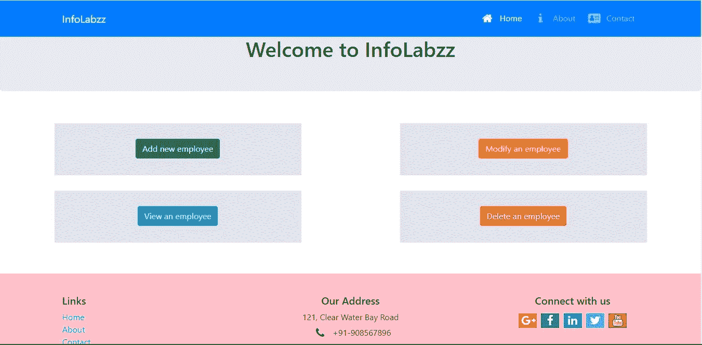
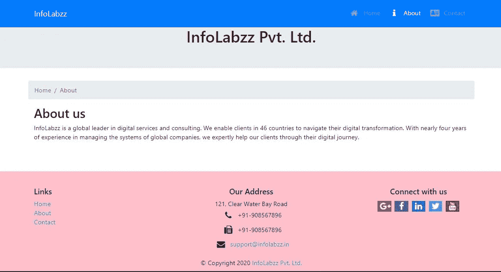
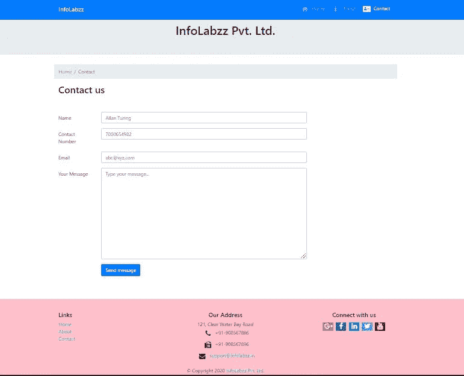
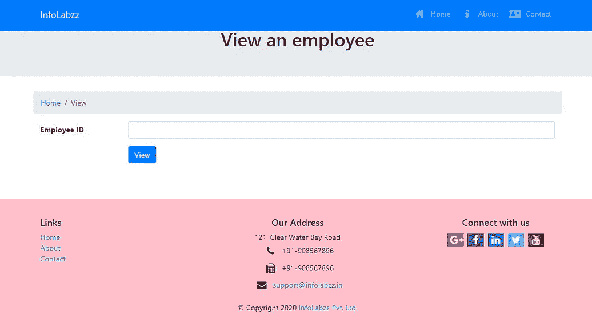
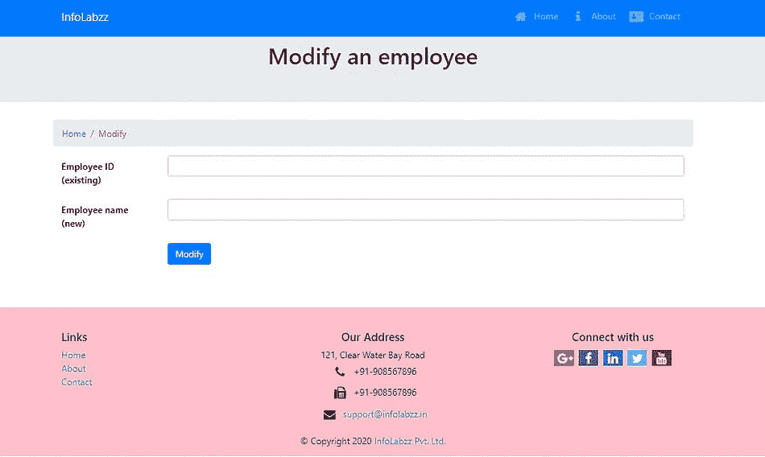
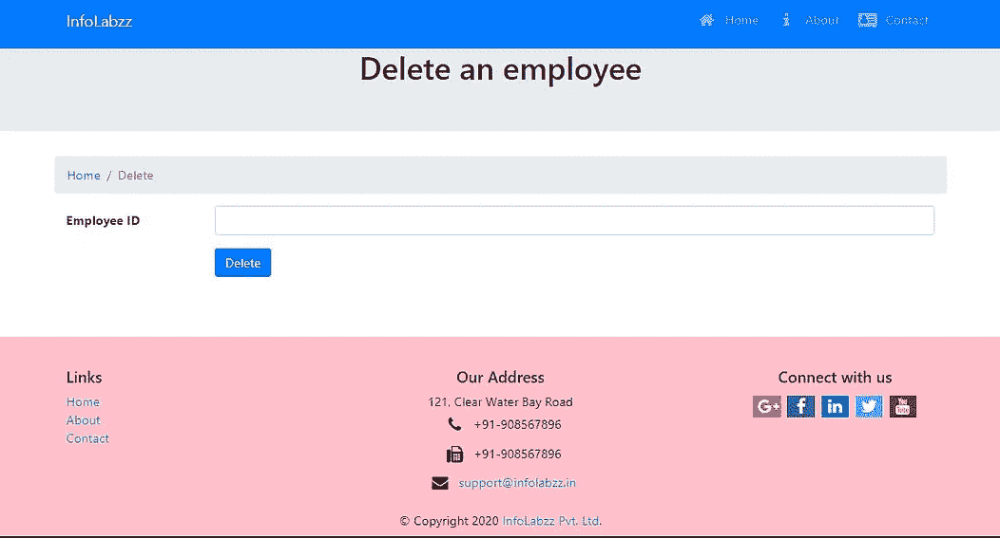

# 使用 Bootstrap 和 Node.js 作为后端的响应式 web 设计

> 原文：<https://javascript.plainenglish.io/responsive-web-design-using-bootstrap-4-with-node-js-as-the-backend-b4b64a0f48e8?source=collection_archive---------7----------------------->


Photo by [Edho Pratama](https://unsplash.com/@edhoradic?utm_source=medium&utm_medium=referral) on [Unsplash](https://unsplash.com?utm_source=medium&utm_medium=referral)

随着技术的发展，多年来许多事情都发生了变化。更具体地说，如果我们谈论计算机的大小，它已经急剧减少。如今，我们可以像手机、平板电脑、智能手表等一样携带电脑。与我们同在。此外，这些小工具需要互联网连接才能得到最佳使用。因此，为了让这些小工具的用户能够浏览不同的网站，网页设计师在设计网页时记住这一点变得非常重要。所以，这就是响应式网页设计概念出现的地方。

根据维基百科，**响应式网页设计**是一种网页设计方法，可以使网页在各种设备和窗口或屏幕尺寸上呈现良好。



Home page of the website

因此，在这篇博客中，我们将讨论为一个假设的组织制作响应性网页的过程，这将使它能够存储其员工的 ID 和姓名。这个前端网页将由一个构建在 Node.js 上的服务器提供服务，该服务器将链接到一个 SQLite3 数据库来存储数据。

这整个项目也可以在我的 GitHub 资源库中找到—

[](https://github.com/souvik-pl/Responsive-web-dev) [## souvik-pl/Responsive-web-dev

### 在这个项目中，响应式网页设计是为一个假设的组织，这将使它能够存储 ID…

github.com](https://github.com/souvik-pl/Responsive-web-dev) 

以下是我们项目最终外观的两个视频

## **先决条件**

1.  了解 HTML、CSS、JavaScript、JQuery、Bootstrap、Font-awesome、Node.js 和 SQLite3
2.  2.Node.js 和 SQLite3 应该安装在您的计算机上。

所以，是时候开始我们的项目了。

[**步骤**](http://twitter.com/Step) **1** :打开终端，为项目创建一个目录，导航进入。然后运行“npm init”命令，您将被要求输入关于您的应用程序的各种细节，这些细节将被存储为一个名为 **package.json** 的 json 文件。现在，我们将通过运行以下命令来安装项目的依赖项，如 body-parser、express、express-rate-limit、helmet、socket.io 和 sqlite3

```
npm install — save body-parser express express-rate-limit helmet socket.io sqlite3
```

然后，我们将使用以下命令安装开发依赖项，如 babel-cli、babel-preset-env 和 babel-preset-stage-0

```
npm install — save-dev babel-cli babel-preset-env babel-preset-stage-0
```

然后，我们将创建一个名为**的文件。babelrc** 在我们的项目目录中，这将在一个文本编辑器中打开，并将输入以下文本-

```
{
    "presets": [
                 "env",
                 "stage-0"
               ]
}
```

因此，我们已经创建了项目环境。现在，让我们讨论一下我们使用过的模块。

[**Express**](https://expressjs.com) —它是快速的、非个人化的、极简的 web 框架，用于节点。
[**Babel**](https://babeljs.io/docs/en/#:~:text=Babel%20is%20a%20toolchain%20that,and%20older%20browsers%20or%20environments.) — Babel 是一个工具链，主要用于将 ECMAScript 2015+代码转换为当前和旧版本浏览器或环境下的向后兼容版本的 JavaScript。
[**插座。IO**](https://socket.io/) —支持基于事件的实时双向通信。
[**Body-parser**](https://www.npmjs.com/package/body-parser)—它的一个 Node.js body 解析中间件。
[**Sqlite3**](https://www.npmjs.com/package/sqlite3/v/3.0.4)—它是 Node.js 的异步、非阻塞 Sqlite3 绑定。
[**Express-rate-limit**](https://www.npmjs.com/package/express-rate-limit)—它是 Express 的基本限速中间件，用于限制对公共 API 和/或端点的重复请求。通过限制对服务器的请求数量，我们可以防止[拒绝服务(DoS)攻击](https://en.wikipedia.org/wiki/Denial-of-service_attack)。这是一种攻击，其中服务器被重复的请求淹没，使其对目标用户不可用，并最终关闭它。
[**头盔**](https://www.npmjs.com/package/helmet) —头盔通过设置各种 HTTP 头帮助我们保护我们的快递应用。它有助于减轻跨站点脚本攻击、误发 SSL 证书等。

**步骤 2:** 现在我们将创建两个名为 **public** 和 **database** 的目录。在 **public** 目录中，我们将创建三个 html 文件，分别命名为**index.html、about.html**和**contact.html**。我们还将在同一个目录下创建另外四个 html 文件，分别命名为**addemp.html、viewemp.html、modifyemp.html**和**delemp.html**，以方便用户分别执行插入、读取、更新和删除操作。

在编写 html 代码时，我们的主要重点是使网页具有响应性。

那么，让我们从 index.html 的第一页开始。

在这个页面中，我们在

为了设计这个页面和所有其他页面，我们使用了 [**引导网格系统**](https://getbootstrap.com/docs/4.0/layout/grid/) 。页面布局将根据设备的屏幕大小而变化。

现在，第二页将是**about.html，**该公司的描述将在那里。这个页面的 HTML 代码可以在——

[](https://github.com/souvik-pl/Responsive-web-dev/blob/main/public/about.html) [## souvik-pl/Responsive-web-dev

### 此时您不能执行该操作。您已使用另一个标签页或窗口登录。您已在另一个选项卡中注销，或者…

github.com](https://github.com/souvik-pl/Responsive-web-dev/blob/main/public/about.html) 

about.html

名为**contact.html**的页面将使用户能够向组织发送消息。下面提到了它的 HTML 代码—

上面的代码几乎与**index.html**相似，除了两个我们在这里使用过但在**index.html**中没有的东西。首先是 HTML 表单，方便用户输入个人信息和消息。第二个是事件发射器，通知用户他们正在执行的操作的状态。



contact.html

现在，最后四个页面分别命名为**addemp.html、viewemp.html、modifyemp.html**和**delemp.html**，将允许用户存储、查看、修改和删除员工数据。所有这些页面的 HTML 代码都可以在——

1.  [https://github . com/sou vik-pl/Responsive-we b-dev/blob/main/public/add EMP . html](https://github.com/souvik-pl/Responsive-web-dev/blob/main/public/addemp.html)
2.  [https://github . com/sou vik-pl/Responsive-we b-dev/blob/main/public/view EMP . html](https://github.com/souvik-pl/Responsive-web-dev/blob/main/public/viewemp.html)
3.  [https://github . com/sou vik-pl/Responsive-we b-dev/blob/main/public/modify EMP . html](https://github.com/souvik-pl/Responsive-web-dev/blob/main/public/modifyemp.html)
4.  [https://github . com/sou vik-pl/Responsive-we b-dev/blob/main/public/delemp . html](https://github.com/souvik-pl/Responsive-web-dev/blob/main/public/delemp.html)



UI of all the four pages

现在，我们将为我们的后端编写代码。当用户想要一个静态页面时，浏览器将向服务器发送 GET 请求，当用户想要在 HTML 表单中输入数据时，浏览器将向服务器发送 POST 请求。

当服务器收到 POST 请求时，它会尝试执行代码中定义的操作。如果失败，服务器将发出一个事件，该事件将被浏览器接收。

```
io.emit(‘result’, ‘An error occurred’);
```

如果操作成功，服务器将再次发出一个事件，该事件将被浏览器接收，以向用户显示操作的状态。

```
io.emit('result', 'Message sent successfully');
```

因此，我们的服务器应用程序的代码如下—

要获得上述代码的解释，建议访问此链接—

[](https://medium.com/swlh/read-html-form-data-using-get-and-post-method-in-node-js-8d2c7880adbf) [## 使用 Node.js 中的 GET 和 POST 方法读取 HTML 表单数据

### 你好，世界，欢迎来到博客。在这篇博客中，我们将讨论如何使用 Node.js 创建一个服务器应用程序，它将…

medium.com](https://medium.com/swlh/read-html-form-data-using-get-and-post-method-in-node-js-8d2c7880adbf) 

了解**插座。IO，**请访问此链接—

[](https://medium.com/swlh/real-time-chat-application-using-socket-io-in-node-js-37806e98918c) [## Node.js 中使用 Socket.io 的实时聊天应用

### 任何领域的专家都曾是初学者。所以，要成为专家，有一个坚实的基础是非常重要的…

medium.com](https://medium.com/swlh/real-time-chat-application-using-socket-io-in-node-js-37806e98918c) 

**步骤 4:** 这样，我们的服务器应用程序就准备好了。我们将保存它，并返回到终端使用命令`node app.js`运行它。控制台中将显示以下消息-

```
Server listening on port: 3000
```

现在，我们的服务器已经启动并运行。我们将打开浏览器，在地址栏中输入`http://localhost:3000`来访问网站。

## **总结**

如果您已经达到了这一点，这意味着您在客户端已经有了响应 web 页面，在服务器端有了 Node.js 服务器。

恭喜你！

喜欢这篇文章吗？如果有，通过 [**订阅获取更多类似内容解码，我们的 YouTube 频道**](https://www.youtube.com/channel/UCtipWUghju290NWcn8jhyAw) **！**

## **参考文献**

自举 4:[https://getbootstrap.com/](https://getbootstrap.com/)

快递模块:[https://www.npmjs.com/package/express](https://www.npmjs.com/package/express)

sqlite3 模块:[https://www.npmjs.com/package/sqlite3](https://www.npmjs.com/package/sqlite3)

body-parser 模块:[*https://www.npmjs.com/package/body-parser*](https://www.npmjs.com/package/body-parser)

快速限速模块:[*https://www.npmjs.com/package/express-rate-limit*](https://www.npmjs.com/package/express-rate-limit)

头盔模块。:[*https://www.npmjs.com/package/helmet*](https://www.npmjs.com/package/helmet)

socket . io:[*https://socket.io/*](https://socket.io/)

通天塔:【https://babeljs.io/docs/en/】T5

响应式网页设计:[https://en.wikipedia.org/wiki/Responsive_web_design](https://en.wikipedia.org/wiki/Responsive_web_design)