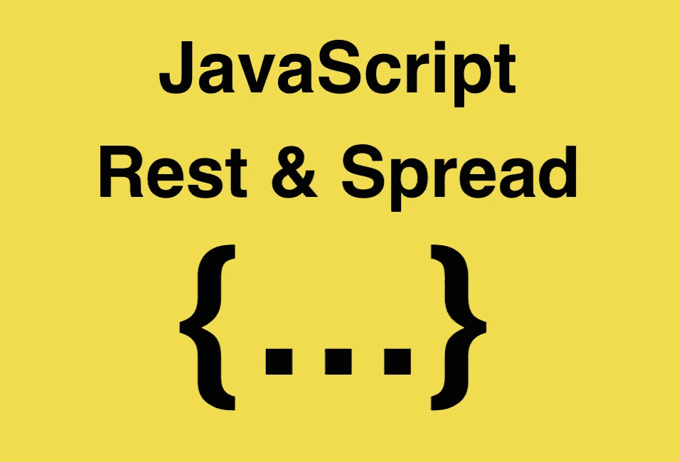

# ES6:JavaScript 中的 Rest/Spread 运算符

> 原文：<https://javascript.plainenglish.io/rest-spread-operator-in-javascript-2da13aa942fb?source=collection_archive---------2----------------------->



让我们回顾一下如何使用 ES6 特性 **rest** 和 **spread** 操作符使我们的代码更加灵活。

# 休息

rest 操作符的一个非常常见的用例是当我们处理传递给函数的不定数量的参数时。让我们举一个函数的例子，它接受一个参数并打印这个参数:

```
function printMe(a) {
  console.log(a)
}
```

如果我们想通过**两个**论点呢？

```
function printMe(a, b) {
  console.log(a)
  console.log(b)
}
```

如果我们想要传递 n 个参数怎么办？

我们开始看到这变成了一个非常烦人的过程，因为我们需要根据我们期望的参数数量来编辑函数。这就是可以使用 rest 运算符使我们的生活变得更加轻松的地方。

**Rest 操作符**用三个句点( **…** )表示，它将所有传入的参数组成一个数组。因此，让我们来看看使用 rest 操作符的函数是什么样子的:

```
function printMe(...args) {
  args.forEach(arg => console.log(arg))
}
```

因为 rest 操作符将参数分组为一个数组，所以我们可以遍历它，并使用该数组执行我们需要的任何操作。每当我们需要创建将不同数量参数作为参数的函数时，这是非常有用的。

rest 操作符的另一个很酷的地方是，我们可以在普通的参数传递中使用它。

```
function printMe(a, b, ...args) {
  console.log(a)
  console.log(b) 
  args.forEach(arg => console.log(arg))
}
```

****注意*** :您想要使用 rest 操作符**的参数必须位于参数列表的末尾**，就像我们在上面的代码块中一样。

# 传播

**展开**操作符与**静止**操作符相反。spread 操作符将从一个列表中创建一个元素列表，而不是将元素列表组合成一个数组。让我们以一个函数为例，它接受三个参数并返回三个参数的乘积:

```
function multiplyMe(a, b, c) {
  return a * b *c
}var list = [1, 2, 3]multiplyMe(list[0], list[1], list[2])
=> 6
```

上面的函数使用起来非常简单，因为我们只需要向函数传递两个值。

你们中的一些人会注意到这个代码块中的问题。

如果我们有一个长度很大的数组，像上面那样传递每个元素是一件非常繁琐的工作。此时，扩展操作员可以减少时间，并允许我们处理各种情况。让我们来看一下同一个函数，但是使用 spread 运算符传递参数:

```
function multiplyMe(a, b, c) {
  return a * b * c
}var list = [1, 2, 3]multiplyMe(...list) // same as multiplyMe(1, 2, 3)
=> 6
```

除了将参数传递给函数之外，spread 操作符还有几个用例:**数组文字**和**对象文字**。

## 数组文字

```
var list = [1, 2, 3]var newList = [...list, 4, 5, 6]
=> [1, 2, 3, 4, 5, 6]
```

## 对象文字

```
var object = {
  'a': 0,
  'b': 1,
  'c': 2
}var newObject = {...object, 'd': 3, 'e': 4}
=> {'a': 0, 'b': 1, 'c': 2, 'd': 3, 'e': 4}
```

那些是休息和传播运营商！

非常感谢大家的阅读！您也可以通过我的个人资料查看我的其他 JavaScript 帖子。


## JavaScript 基础知识:

> **变量**:[https://medium . com/@ timhancodes 0281/basics-of-JavaScript-Variable-3 EB 6 f 4 f 0 af 18](https://medium.com/@timhancodes0281/basics-of-javascript-variable-3eb6f4f0af18)
> 
> **数据类型**:[https://medium . com/@ timhancodes 0281/basics-of-JavaScript-Data-Types-385 Bab 24 b 51](https://medium.com/@timhancodes0281/basics-of-javascript-data-types-385bab24b51)

## JavaScript 基础知识

> **原型继承**:[https://medium . com/JavaScript-in-plain-English/JavaScript-fundamental-Prototypal-inheritage-9153 ab 434 aae](https://medium.com/javascript-in-plain-english/javascript-fundamental-prototypal-inheritance-9153ab434aae)

## 合并排序

> ***JavaScript 中的归并排序算法***:[https://medium . com/JavaScript-in-plain-English/JavaScript-Merge-Sort-3205891 AC 060](https://medium.com/javascript-in-plain-english/javascript-merge-sort-3205891ac060)