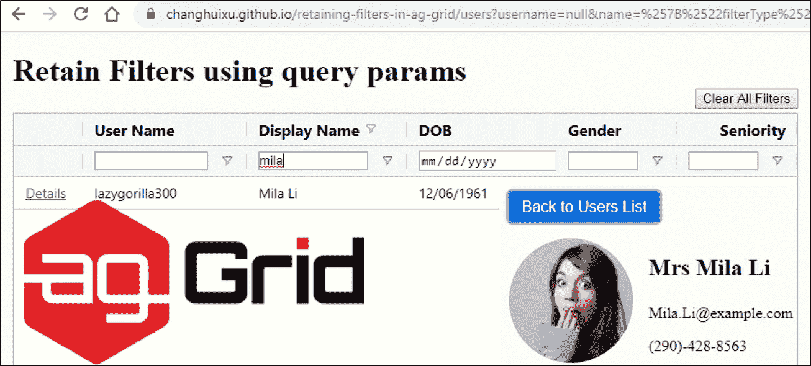
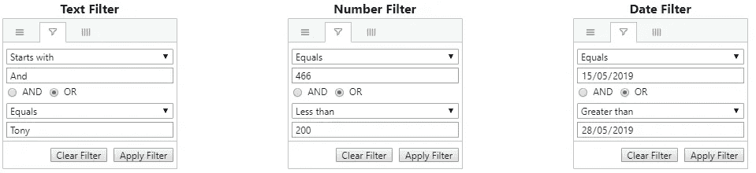
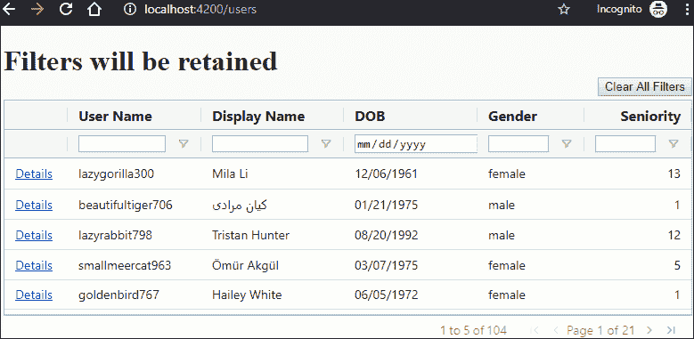

# 使用查询参数保留 ag-Grid 过滤器

> 原文：<https://javascript.plainenglish.io/retaining-ag-grid-filters-using-query-parameters-55167be07a20?source=collection_archive---------3----------------------->



ag-Grid([https://www.ag-grid.com/](https://www.ag-grid.com/))库提供了世界上最好的网格功能。它的一个有用特性是[列过滤](https://www.ag-grid.com/javascript-grid-filtering/)，它允许用户在列级别设置过滤器，这样网格将根据一列或多列的过滤器选项和值显示过滤后的数据行。

ag-Grid 有几个内置滤波器([简单滤波器](https://www.ag-grid.com/javascript-grid-filter-provided-simple/))，包括`TextFilter`、`NumberFilter`和`DateFilter`。对于每个列过滤器，我们可以选择组合两个条件来过滤行结果。一个组合过滤器由两个简单的过滤器组成，由一个布尔运算符连接(或者是`AND`或者是`OR`)。



一个常见的用户故事如下。用户根据某些条件过滤数据网格，并选择一行来打开详细信息页面。在查看详细信息页面后，用户导航回网格页面，希望保留之前的过滤器，以便他/她可以从过滤的结果中选择另一行。如果没有过滤器，那么用户必须再次过滤数据网格，以获得之前过滤的数据行。问题:*如何保留之前的滤镜？*

在这篇博文中，我们将使用 Angular 中的路径查询参数实现一种简单的方法来保留 ag-Grid 过滤器。你可以从[这个网站](https://changhuixu.github.io/retaining-filters-in-ag-grid/)查看演示，完整的源代码在[这个 GitHub 库](https://github.com/changhuixu/retaining-filters-in-ag-grid)里。

# 实施计划

目标是保持 ag-Grid 中的过滤器模型和 URL 中的查询参数同步。因此，我们制定了如下总体实施计划:

1.  设置一个事件处理程序(`filterChanged(event: FilterChangedEvent)`)来监听 ag-Grid 中任何过滤器更新时的`onFilterChanged`事件。`filterChanged`事件处理程序将更新路由查询参数，以反映当前的过滤器。
2.  设置`onGridReady()`事件处理程序来解析过滤器模型对象的查询参数，并使用网格 API `setFilterModel()`来设置过滤器，这样每当网格初始化时，过滤器选项和值都会根据 URL 中的查询参数正确设置。

当用户从网格页面导航到另一个页面时，过滤器模型和查询参数将被丢弃，除非它们被保存在存储中并在改变时被更新。通过跟踪过滤器模型或存储中的查询参数，我们能够将网格过滤器设置为其以前的状态。我们的计划是将过滤器模型保存在一个存储中，这样，当用户离开网格页面，然后又回到网格页面时，网格页面组件将查询保存的过滤器模型，并将其应用到网格中，这样，网格就会显示以前过滤过的数据行。

下面的屏幕录制图像显示了所需的效果。请注意，您可以在网格中过滤任意多的列，URL 参数将存储网格的状态。



# 履行

这个演示使用一个网格来显示一系列虚假的员工或应用程序用户数据。网格中显示的 app 用户信息包括以下几列:`username`(字符串)`name`(字符串)`dob`(日期)`gender`(字符串)`seniority`(数字)。我们可以用不同的条件过滤这五列。

在每个数据行的前面，有一个用户详细信息页面的链接，它显示了每个用户的更多数据。在用户详细信息页面中，有一个按钮样式的链接可以重定向回网格页面。

在这篇博文中，我将省略网格显示、路由到细节页面等的基本实现。让我们假设所有的基础工作都准备好了。

## 用户-网格-过滤器.服务. ts

首先，我们将实现一个用于跟踪过滤器模型的存储。有许多方法可以在组件之间共享数据，例如，使用状态管理存储，或将数据保存到浏览器中的本地存储。在这个演示中，为了简单起见，我将使用一个“属性包”服务来保存过滤器模型对象。下面的代码片段展示了一个示例服务`UsersGridFilterService`，它有一个名为`filters`的属性来保存值。

grid-filter service: Property Bag ([gist link](https://gist.github.com/changhuixu/441a19b73bdff9a825bc2a7562ca6f37))

在`users-grid-filter.service.ts`文件中，为了打字稿[类型检查](https://www.typescriptlang.org/docs/handbook/type-checking-javascript-files.html)，我定义了两个接口(`UsersGridFilters`和`UsersGridFiltersParams`)。`UsersGridFilters`接口代表网格过滤器模型的对象类型；`UsersGridFiltersParams`接口代表 URL 查询参数的对象类型。这两个接口中的属性和数据类型由它们的网格列决定。

**注意:**界面中每个属性的名称必须与其[网格列 ID](https://www.ag-grid.com/javascript-grid-column-definitions/#column-ids) `colId`匹配(如果没有定义`colId`，则`field`为默认值)。需要一对一的关系来生成正确的过滤器模型对象供 ag-Grid 使用。出于演示的目的，我用`colId: 'name'`和它的值`first + ' ' + last`配置了一个列`Display Name`。那么在这种情况下，ag-Grid 使用`'name'`作为对该列应用过滤器的键，我们需要使用`'name'`作为`UsersGridFilters`接口中的属性名。

`UsersGridFilterService`类有一个公共属性`filters`和一个方法`persistFilters(filters: UsersGridFilters)`来保存该类中`filters`对象的副本。现在，这个`UsersGridFilterService`类充当了一个“属性包”，它的属性`filters`保存了网格过滤器模型的值。

之后，在同一个服务类中，我们将添加两个与过滤器模型和查询参数之间的转换相关的方法。下面的代码片段显示了一个示例实现。

conversions between filter model and URL query params ([gist link](https://gist.github.com/changhuixu/1f38e65da83da66c71ceaafd33887813))

两个方法`getFiltersFromQueryParams`和`getQueryParamsFromFilters`几乎是对称的，它们的实现是不言自明的。这两种方法利用了两套实用程序，`JSON.parse` / `JSON.stringify`和`decodeURIComponent` / `encodeURIComponent`，在字符串和 JavaScript 对象之间进行转换。值得一提的是，第 20 到 26 行需要列出所有可能的字段，并将其设置为`null`，以便返回一个空的查询参数对象，这样当网格过滤器被清除时，Angular 将所有查询参数与原始查询参数合并时，这些参数将被删除。

## 用户-列表.组件. ts

现在，我们准备连接使用 ag-Grid 的组件中的点。以下代码片段是一个示例实现，只是我省略了不相关的代码行。

users list component using ag-Grid ([gist link](https://gist.github.com/changhuixu/68137a9878f39f7e1a907e38bfa6c71c))

在上面的代码中，第 8 到 13 行定义了`UsersListComponent`的构造函数。我们传入一个`UsersGridFilterService`的实例，它已经在上一节中介绍过了。我们还需要将`ActivatedRoute`和`Router`注入到组件构造函数中，以便读取和更新 URL 查询参数。

第 4 行注册了`filterChanged`事件处理程序，第 19 到 28 行是实现。事件处理器从 ag-Grid 获取过滤器模型，并将其值保存在`UsersGridFilterService`中。然后`filterChanged`事件处理程序更新 URL 查询参数以保持状态同步。另一方面，第 34 到 40 行将 URL 查询参数与过滤器模型同步。

第 30 到 32 行设置了一个单击清除所有列过滤器的方法。在本演示中，它是可选的。

现在，如果我们设置 ag-Grid 列过滤器，那么 URL 将相应地更新。同样，如果我们修改 URL 查询参数并刷新页面，那么过滤条件也会更新。

## 用户详细信息.组件. ts

现在让我们假设一个最终用户离开用户网格页面，查看用户详细信息页面。最好有一个链接，引用回主网格页面。在这个场景中，我们需要将`queryParams`传递给链接，以便过滤器查询参数可以合并到路由中。一个链接元素的例子如下。

```
<a class="button" routerLink=".." [queryParams]="filtersParams">
  Back to Users List
</a>
```

唯一的技巧是获取过滤器查询参数。幸运的是，这很容易，因为我们已经在`UsersGridFilterService`中实现了这个方法。下面的代码片段显示了一个带有过滤器参数的示例组件。

([gist link](https://gist.github.com/changhuixu/c7a0f7c710fbb1775ae9f47a014ee018))

全部完成！我们实现了一种使用 URL 查询参数来保留过滤器的方法。我们可以用我们想要的过滤器复制一个 URL，并将链接发送给另一个人。那么使用我们 URL 的人将会看到我们看到的相同的过滤行。这样，URL 可以唯一地标识网格的状态。

这篇博文中描述的方法也可以用来存储 URL 查询参数中的其他状态。

今天到此为止。你可以从[这个网站](https://changhuixu.github.io/retaining-filters-in-ag-grid/)查看演示，完整的源代码在[这个 GitHub 库](https://github.com/changhuixu/retaining-filters-in-ag-grid)里。请在下面留下评论并与他人分享。谢谢你。