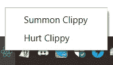
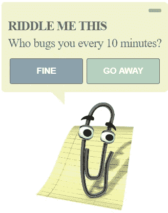
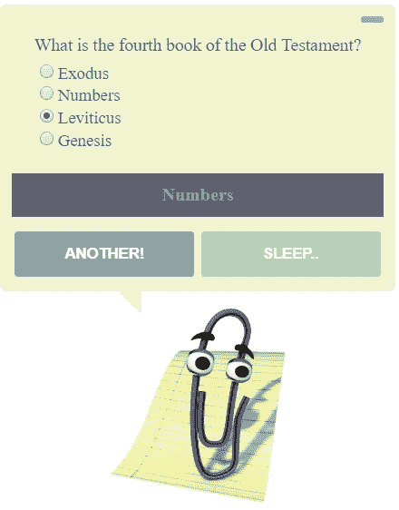

# 用 JavaScript 从 Microsoft Word 中恢复 Clippy

> 原文：<https://javascript.plainenglish.io/reviving-clippy-with-javascript-e44191b8f97?source=collection_archive---------9----------------------->

## 2019 年带回臭名昭著的微软 Word 助手


Photo by [Clem Onojeghuo](https://unsplash.com/@clemono2?utm_source=medium&utm_medium=referral) on [Unsplash](https://unsplash.com?utm_source=medium&utm_medium=referral)

# 介绍

我三年级的时候，我们家有了第一台电脑。它由两个米色的盒子组成，一个在地板上，另一个在桌子上。如果我按下底部的红色大按钮，电脑就会打开，我就可以玩一些不适合年龄的游戏，比如`Quake 3`和`Carmageddon`。据我记忆所及，其他时候，我会打开微软 Office，和`Word Art`一起玩。在那里我遇到了`Clippy`，这个古怪的发夹试图给我写信的提示，尽管我只想看到一些漂亮的文字效果。如果我是一个年长的人，并试图做一些实际的工作，我可能会认为他很讨厌，但当我刚刚探索家庭计算的辉煌世界时，我发现他很有趣。

几年后，我的朋友走了，我也很快忘记了他。快进到今天，一些`memes`让我想起了他。灵光一现之后，我有了一个想法——我应该把他重新创建成一个独立的桌面应用程序！

但是等等！那是相当愚蠢的，为什么会有人做这样的事？当然是在学东西的同时找点乐子！


Oh, you!

*我不会在这里讨论所有的细节，请随意提问，甚至可以将这些信息添加到文章中:)在文章的末尾会有一个指向资源库的链接。*

# 选择的技术

从这篇文章的标题可以推断出，但是我们需要一些伴随的技术来实现这一点，但是不需要太多的技术来使其势不可挡:

*   `Electron`
*   `React`
*   `TypeScript`
*   `Webpack`

我们可以放弃`TypeScript`，因为它需要一个额外的步骤——将它编译成 JavaScript，这样就增加了另一个依赖项，即`Webpack`，但是我坚信`TypeScript`的力量。

几个月后，当我忘记了这个项目的一切，它将帮助我理解正在发生的事情。在开发过程中，我会更快地发现愚蠢的错误，并使代码库读起来和工作起来更加愉快。

*我做了一个核心技术的基本设置，可以在* [*这里*](https://github.com/MustSeeMelons/electron-typescript-react) *找到。你想做什么都可以。*

# 电子？

它是一个使用 web 开发人员的技术堆栈开发跨平台桌面应用程序的框架:JavaScript、HTML 和 CSS。

这是如何实现的？每个构建的应用程序都嵌入了 Chromium。这样做的一个主要缺点是，即使是最简单的应用程序也至少有大约 80MB 的重量，并且性能也不如本机应用程序。考虑到你可以使用所有你已经知道的技术，这并不是一个很大的代价。

即使您刚刚起步，这也使得 JavaScript 成为一种非常诱人的学习语言，因为您可以在许多不同的领域进行尝试。

*我发现文档也很有用，你可以在这里*[](https://electronjs.org/docs)**找到它。**

# ***让我们退一小步***

*在我们进入`Clippy`之前，先了解一些关于`Electron`的核心信息。*

*它有两个重要的过程:*

*   *一个`main`进程，它创建整个 GUI 应用程序并管理它的生命周期，它在一个`Browser Window`中创建`render`进程*
*   *一个`render`进程，它用它所有的逻辑来呈现你的 GUI*

*我相信这足以让我们开始动手了。*

# *避免特征蠕变的一些要求*

*我曾设想我们的`Clippy`是一个总是在顶部的应用程序，当它最小化时，隐藏在托盘中。为了关闭它，用户必须使用托盘。他必须是一个持久的烦恼。*

*我们的应用程序窗口没有框架，是透明的。*

*从设计角度来说，我真的想让他尽可能接近原作，但经过一些研究后，我很快意识到我能找到的所有资源分辨率都很差。为了让它真正脱颖而出，我需要一个平面设计师的帮助，所以我在这里和那里做了一些自由。*

*从他有用的一面来看。他可能在讲笑话或其他一些随机消息，我觉得他需要一些互动。过了一会儿，我发现了一个非常好的免费琐事 API——[https://opentdb.com/](https://opentdb.com/)，它完全符合要求。他会缠着你问一些琐碎的问题！*

*完整的应用流程:*

1.  *应用程序已启动*
2.  *询问用户是否希望回答问题*
3.  *如果答案是`yes`，提出问题*
4.  *用户回答完问题后，要求进行下一轮或最小化*
5.  *如果答案是`no`或者用户选择不回答，最小化应用程序*
6.  *一段时间后，最大化应用程序并返回步骤 2。*
7.  *用户只能通过托盘图标终止应用程序*

# *去掉框架，使其透明*

*这一步非常简单，因为这可以在`main`流程文件中配置:*

```
*mainWindow = new BrowserWindow({
    height: 400,
    width: 500,
    frame: false,      // this
    transparent: true, // and that
    webPreferences: {
        nodeIntegration: true
    },
    resizable: false,
    alwaysOnTop: true  // this as well
});*
```

*现在有一个问题，没有框架我们不能移动窗口，这可以用一些`CSS`来解决，我们将在以后使用它。*

```
*-webkit-app-region: drag;*
```

# ***创建托盘***

*`Electron`已经提供了开箱即用的支持，我们再次需要在`main`进程文件中做一些工作，首先关闭图标设置。这必须放在顶部，在`createWindow`函数之前。*

```
*// Importing files, so that webpack copies them
const trayImg = require("../resources/images/icon.png");
const nativeIcon = nativeImage.createFromPath(
    path.join(__dirname, "src/resources/images/icon.png")
);*
```

*而在`createWindow`功能里面:*

```
*tray = new Tray(nativeIcon);
const contextMenu = Menu.buildFromTemplate([
    {
        label: "Summon Clippy",
        click: function () {
            mainWindow.show();
        },
    },
    {
        label: "Hurt Clippy",
        click: function () {
        mainWindow.destroy();
            app.quit();
        },
    },
]);tray.setToolTip("Clippy");
tray.setContextMenu(contextMenu);*
```

**

*Our glorious tray*

**

*With a menu!*

# *`main`和我们的`tenderer`之间的通信*

*我们希望能够最小化我们的应用程序，`Browser Window`有这样一个方法，尽管它在我们的`rendered`进程中不可用。*

*`electron`包给了我们两个对象，一个在`main`中使用，另一个在`renderer`中使用。分别为`ipcMain`和`ipcRenderer`，它们作为`event listeners`工作。*

*手头有了我们的最小化任务，我们需要从我们的`renderer`向`main`发送一个事件，这可以在一个按钮点击时使用:*

```
*ipcRenderer.send("MINIMIZE");*
```

*在我们的`main`中，我们需要倾听这一事件并对此采取行动:*

```
*ipcMain.on("MINIMIZE", () => {
    mainWindow.hide();
});*
```

*这应该在我们的`main`流程的`createWindow`功能中完成。*

*我们也可以发送一些参数:*

```
*ipcRenderer.send("DO_SOMETHING", {
    param: "minimize"
});*
```

*在这个应用程序的`main`进程中，我从一个文件中发送一些配置，`renderer`发送`resize`事件，这样如果文本更少，它看起来会更紧凑。*

# *构建 GUI*

*我选择了`React`,因为我用起来最舒服。`Vue`、`Angular`也可能是不错的选择。如果你足够勇敢，你也可以在没有框架的情况下完成。*

*我希望这尽可能简单，所以我只使用普通的`React`状态，没有状态管理库，尽管如果你愿意，你可以很容易地添加一个到基本设置中。*

*应用程序的其余部分由一些组成接口的 react 组件、管理应用程序逻辑流的超时和间隔组成，仅此而已。但是不要忘记清除超时和间隔！*

**

*Hello dear friend*

**

*Got a tricky question*

# *结论*

*这是一次有趣的经历，在学习使用`JavaScript`开发桌面应用程序的同时，做了一些有趣的事情。希望你觉得这很有趣，我真的很喜欢做这个:)*

*有一个 bug，应用程序的透明部分变成黑色，这通常发生在应用程序被部分拖离屏幕并与之交互时，现在还不确定如何解决这个问题。*

**由此产生的项目可以在这里找到*[](https://github.com/MustSeeMelons/assistant)**，可以随意用它做任何事情。***